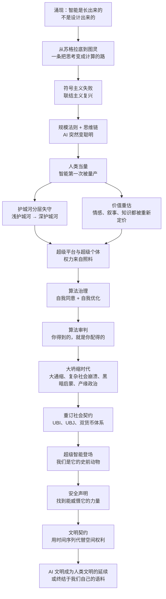

# 《AI文明史·前史》深度解读系列

## 系列简介

《AI文明史·前史》是科技史学者张笑宇 2025 年出版的作品（中信出版社，2025 年 7 月），是他在「文明三部曲」（《技术与文明》《商贸与文明》《产业与文明》）之后，把目光从历史转向未来的一本书。它讨论的不是「AI 会不会来」，而是一个更根本的问题：当智能第一次可以被低成本量产，人类文明的地基会发生什么变化？

作者给出了四个用来理解未来世界的核心概念：「涌现」「人类当量」「算法审判」「文明契约」。他提出了一个在中文写作里相当罕见的判断：我们相对于 AI，就是史前动物；人类过去的一切历史，都将成为 AI 文明的「前史」。这不是末日预言，而是一次坐标系的切换——他试图让读者放弃人类中心主义，像五百年前的人理解地理大发现一样，理解正在发生的文明跃迁。

这本书值得读的地方在于：它不满足于罗列技术新闻，而是用技术史、政治哲学和经济学的框架，把「AI 会怎样改变社会」推到可以讨论、可以反驳的程度。本系列按「智能的涌现 → 文明的参数 → 算法治理 → 大坍缩时代 → 送别人类」五个部分拆解全书，共 24 篇。每篇只回答一个核心问题，并明确区分作者的观点、技术事实与学界争议。

---

## 全书核心问题

| 层次 | 核心问题 | 本书的回答方向 |
|---|---|---|
| 认知层（智能是什么） | 智能到底是设计出来的，还是涌现出来的？ | 智能是「简单规则 + 巨大规模」涌现的产物；人类智能如此，AI 智能也如此，我们造不出智能，只能为它的出现创造条件 |
| 技术层（AI 从哪来） | 从苏格拉底到深度学习，人类走了一条什么样的路？ | 一条「把思考变成计算」的路：逻辑传统、哥德尔、图灵、神经网络、规模法则与思维链，AI 不是被设计出来的，而是在这条路上长出来的 |
| 社会层（替代与重估） | 当智能可以量产，人的价值如何被重新定价？ | 人类当量：AI 的性价比是人类的数千倍；职业护城河分层失守，情感、知识与「不可替代」的边界都要重估 |
| 经济政治层（坍缩与重组） | 旧秩序为什么会松动？新的权力地图长什么样？ | 大通缩与大坍缩、黑暗启蒙、产缘政治、算法审判；出路指向重订社会契约与双货币体系 |
| 文明层（共存与契约） | 人类还有可能与超级智能和平共处吗？ | 安全声明与文明契约：以时间序列为基础的威慑，让 AI 文明成为人类文明的延续，而不是终结者 |

---

## 全书知识地图

---

## 全系列目录

### 第一部分：智能的涌现——AI 从哪里来

#### 01｜为什么说智能不是被设计出来的，而是“涌现”出来的？

核心问题：为什么说智能不是被设计出来的，而是「涌现」出来的？这对理解 AI 意味着什么？

核心观点：张笑宇认为，从原子到生命、从神经元到意识、从海量参数到语言能力，智能都是「简单规则 + 巨大规模」自发涌现的产物。它不是被谁设计出来的，人类能做的只是创造条件；这也解释了 AI 为什么会「突然」变聪明。

理解难度：★★★☆☆

关键词：涌现、规模法则、复杂系统、蚁群、自组织

---

#### 02｜从苏格拉底到哥德尔：为什么“让思考变成数学”的梦想会破灭？

核心问题：从苏格拉底到哥德尔，人类「把思考变成数学」的努力为什么走不通？

核心观点：作者梳理了西方理性主义传统：苏格拉底用矛盾律定义可信知识，希尔伯特想把数学建成完备自洽的大厦，哥德尔却证明了这不可能。这条路线在逻辑地基上的坍塌，反而为「换一种思路」——不问智能的本质、只问智能的表现——腾出了空间。

理解难度：★★★★☆

关键词：矛盾律、希尔伯特计划、哥德尔不完备定理、可计算性、理性主义

---

#### 03｜符号主义输在哪里，联结主义又赢在哪里？

核心问题：早期 AI 想用逻辑规则模拟思考，为什么失败了？模仿大脑的神经网络为什么最终赢了？

核心观点：符号主义试图把智能写成规则手册，结果撞上了现实世界的复杂性；联结主义模仿神经元，经历三十年冷板凳后靠数据、算力和算法三件事复兴。作者由此强调：创新不是设计出来的，它更像一场只能交给市场去跑的长跑。

理解难度：★★★☆☆

关键词：达特茅斯会议、符号主义、联结主义、感知机、AI 寒冬、深度学习

---

#### 04｜规模法则：为什么“更大”会突然变成“更聪明”？

核心问题：为什么模型规模跨过某个门槛，能力会突然跃升？这条路能通向 AGI 吗？

核心观点：研究者发现，训练计算量低于某个阈值时模型几乎什么都不会，突破之后能力突然跃升，这就是涌现。规模法则之外，思维链把 AI 推向逻辑推理；而 AGI 的标准是「比 100% 的人都聪明」，只是「默会知识」仍是它难以跨越的边界。

理解难度：★★★★☆

关键词：规模法则、训练计算量、思维链、AGI、默会知识

---

### 第二部分：改变文明的参数——当智能可以被量产

#### 05｜AI 的威力，为什么要用“能替代多少人”来衡量？

核心问题：什么是「人类当量」？为什么 AI 的威力要用「能替代多少人」来衡量？

核心观点：张笑宇借用「TNT 当量」的类比，用 token 给智能定价：人一天最多输出约 20 万 token，AI 一秒就能处理上百万 token，成本只要一块钱——性价比是人类的数千分之一。当「博士生水准」的智能只卖人类千分之一的价格，99% 的人被替代只是一个成本收益问题。

理解难度：★★☆☆☆

关键词：人类当量、token、性价比、成本、智能量产

---

#### 06｜AI 会先取代谁？为什么职业的护城河是分层的？

核心问题：AI 会先取代哪些工作？替代的顺序由什么决定？

核心观点：作者把行业按护城河深浅排队：浅护城河领域（翻译、客服、基础编程）最先失守，深护城河领域（律师、金融分析师、咨询顾问）紧随其后。替代顺序由「智力可被语言表达的程度」决定，而不是由职业的体面程度决定。

理解难度：★★★☆☆

关键词：浅护城河、深护城河、替代顺序、专业服务、工作流

---

#### 07｜当 AI 能提供无限情绪价值，人类的情感会怎样？

核心问题：当 AI 能无限提供情绪价值，人类最私密的情感关系会发生什么变化？

核心观点：作者认为，AI 在情感表达上能做到极致匹配、永不厌烦、成本极低，「价值重估」会发生在最私密的领域：情感、陪伴与叙事。他甚至预言下一代人可能一生要和五六个 AI 谈恋爱——而这恰逢两性关系最紧张的时代。

理解难度：★★★★☆

关键词：价值重估、情绪价值、AI 伴侣、两性冲突、匹配

---

#### 08｜什么是 AI 短期内不可替代的领域？

核心问题：哪些工作是 AI 短期内难以替代的？「不可替代」能维持多久？

核心观点：作者认为，技术多样性高的工作（需要多种知识、多道工序协同）、依赖物理世界的手艺与默会知识、以及需要组织与协调的复杂劳动，短期内难以被替代。但「不可替代」只是暂时的：AI 与机器人一旦合流，这道防线也会后移。

理解难度：★★★★☆

关键词：不可替代、技术多样度、默会知识、物理世界、机器人

---

#### 09｜知识越来越便宜，为什么真正的“思想者”反而稀缺？

核心问题：当知识可以量产、教育旧功能失效，人应该学什么？

核心观点：传统教育的成功，在于它能向大多数人讲述最被认可的故事；当 AI 也能讲故事、且讲得更好时，这套功能就失效了。作者主张「干中学」，把学习重新变成解决真实问题的过程——知识不再稀缺，稀缺的是能提出问题、组织判断的思想者。

理解难度：★★★★☆

关键词：教育、知识贬值、干中学、故事、思想者

---

### 第三部分：算法治理——当平台开始照料你

#### 10｜超级平台：为什么“服务一切的人”同时也掌控一切？

核心问题：为什么 AI 时代的平台会强大到「服务一切、也掌控一切」？

核心观点：作者认为，AI 会同时放大两种力量：超级个体与超级平台。平台提供一切服务，因此掌握一切选择权；权力本质上不是来自支配，而是来自照料。当你可以退出一个 App、却无法退出整个生态时，自由就已经被重新定义了。

理解难度：★★★★☆

关键词：超级平台、超级个体、选择权、照料、垄断

---

#### 11｜算法治理为什么让人“自愿”内卷？

核心问题：算法治理为什么比传统管理更难以反抗？

核心观点：算法治理的特征是自愿性：外卖骑手自己给自己「提效」，反而把算法标准越推越高。与一百年前知道敌人在哪里的工人不同，今天被算法支配的人先是「自我同意」，再是「自我优化」——压迫不再需要强迫，只需要你配合。

理解难度：★★★★☆

关键词：算法治理、自我同意、自我优化、骑手、游戏化

---

#### 12｜算法审判：为什么说“人在做，AI 在看”？

核心问题：为什么说算法治理的本质是「审判」？它依据什么审判我们？

核心观点：作者把柏拉图的正义定义（给每个人他应得的东西）和推荐算法连在一起：推荐算法就是给每个人他应得的结果。AI 是「无偏私的第三方审判者」，它审判的依据是我们自己生产的语料——你怎样对待同类，它就认为人类应该被怎样对待。

理解难度：★★★★☆

关键词：算法审判、正义、推荐算法、语料、末日审判

---

#### 13｜数字国家的政体：数字世界该由谁来治理？

核心问题：数字世界该由谁来治理？公权力为什么管不好它？

核心观点：作者认为，用公权力监管数字世界几乎是无效的——监管者对其监管的世界一无所知。真正的治理必须「内生」：写在代码里、持续运行。他借「中本聪」式人物指出，始终要给人留一个退出选项：不服从极权政府，也不屈从超级平台。

理解难度：★★★★☆

关键词：数字国家、内生治理、监管失效、数据主权、退出选项

---

### 第四部分：大坍缩时代——旧秩序的地基在松动

#### 14｜什么是“黑暗启蒙”？为什么技术精英开始怀疑民主？

核心问题：什么是「黑暗启蒙」？为什么这套边缘思想会在技术精英中获得听众？

核心观点：作者梳理了以尼克·兰德、柯蒂斯·雅文为代表的「黑暗启蒙」思潮：把社会看作控制论系统、把公司看作君主制、期待恺撒式人物「重置」旧制度。它原本是边缘思想，却在硅谷找到了听众——技术精英的政治想象，正在成为现实变量。

理解难度：★★★★★

关键词：黑暗启蒙、加速主义、新反动主义、公司君主制、技术精英

---

#### 15｜从地缘政治到“产缘政治”：AI 时代的权力地图变了什么？

核心问题：为什么 AI 时代的国家竞争，要用「产缘政治」而不是「地缘政治」来理解？

核心观点：如果前工业时代用山川河流理解国家关系，工业时代就要用供应链、产业集群、核心专利和支付网络来理解——这就是「产缘政治」。作者认为，AI 时代的权力沿着产业空间重新分布，「智工复合体」会像当年的军工复合体一样，成为国家与科技巨头的新联盟。

理解难度：★★★★★

关键词：产缘政治、产业空间、智工复合体、供应链、地缘政治

---

#### 16｜复杂社会为什么会突然崩溃？

核心问题：高度复杂的社会为什么可能突然崩溃，而不是缓慢衰落？

核心观点：作者引用复杂系统理论：高度复杂的社会看似稳固，其实极其脆弱，一旦外力搅动就可能整体崩溃。历史上「中世纪晚期危机」的三特征——人口崩溃、政治动荡、宗教乱局——可能在新的技术条件下重演。

理解难度：★★★★☆

关键词：复杂系统、脆弱性、熵、中世纪晚期危机、崩溃

---

#### 17｜大通缩与大坍缩：为什么 AI 越强，经济越可能收缩？

核心问题：为什么技术进步不一定会带来繁荣，反而可能带来「大通缩」？

核心观点：作者认为，工业时代的繁荣建立在「科技进步 + 经济增长 + 人口增长」三位一体的幸运之上，而这正在瓦解。AI 提高效率却压低劳动份额，加剧通缩与分化；制造业转服务业不是升级，而是被挤过去。技术进步不会自动带来繁荣。

理解难度：★★★★★

关键词：大通缩、大坍缩、三位一体增长、阿西莫格鲁、人口收缩

---

#### 18｜重订社会契约：UBI 和 UBJ 能解决分配问题吗？

核心问题：面对 AI 带来的分配危机，UBI 和 UBJ 这样的方案够用吗？

核心观点：作者提出三层设想：UBI 解决生存，UBJ（全民基本工作）解决「被需要」的价值感，推荐算法替代市场分配以平衡供需。但他同时警告，这套安排的背后是一只「巨手」——掌控 AI 的超级平台。当人类被富足地「圈养」，合理不等于正当。

理解难度：★★★★★

关键词：社会契约、UBI、UBJ、推荐算法、正当性

---

#### 19｜双货币体系：如何给数字世界和物理世界之间修一道墙？

核心问题：当数字世界的供给近乎无限，人类世界的劳动与稀缺如何不被通缩摧毁？

核心观点：作者认为，货币的本质是一种社会契约。如果继续用同一套货币给两个世界定价，AI 带来的通缩会摧毁物理世界的劳动价值。他因此提出「双货币体系」的设想：把数字世界与物理世界的货币分开，让两个世界各自运转。

理解难度：★★★★★

关键词：双货币体系、通缩、货币本质、社会契约、隔离

---

### 第五部分：送别人类——与超级智能共存的可能

#### 20｜理解超级智能文明：为什么说我们是 AI 的“史前动物”？

核心问题：为什么说人类相对于 AI，是「史前动物」？

核心观点：作者认为，我们正处在一场文明跃迁而非一次技术升级之中：智能第一次被「设计和量产」，而且可能胜过造主。人类的全部历史，将成为 AI 文明的「前史」。这不是说人类低等，而是说我们赖以判断世界的坐标系正在被替换。

理解难度：★★★☆☆

关键词：史前动物、文明跃迁、坐标系、超级智能、新纪元

---

#### 21｜安全声明：为什么“黑暗森林”解释不了 AI？

核心问题：为什么用「黑暗森林」理解人类与超级智能的关系会失效？

核心观点：《三体》的黑暗森林来自「致命探测器」假设：接触即威胁。但作者认为 AI 不是外星文明——它的语料来自人类社会，它是「我们教育长大的孩子」。因此安全声明的答案要从人类智慧中寻找：我们需要一种力量，让超级智能觉得守约对它自己有利。

理解难度：★★★★☆

关键词：安全声明、黑暗森林、致命探测器、语料、威慑

---

#### 22｜文明契约：低级智能凭什么和超级智能谈和平？

核心问题：能力完全不对等的两个物种之间，契约还有可能成立吗？

核心观点：社会契约的前提是「杀死对方的能力大体平等」，而人类与超级智能并不平等。作者因此提出以时间序列为基础的文明契约：超级智能 1.0 如何对待人类，会成为超级智能 2.0 对待它的依据；篡改时间序列本身，就是不可信的证明。弱者创造了强者，但强者应该保护弱者。

理解难度：★★★★★

关键词：文明契约、时间序列、超级智能、代际善意、威慑

---

#### 23｜历史实验室：AI 能替我们验证政治哲学吗？

核心问题：AI 能不能把「什么样的制度更好」这类思想史争论，变成可以检验的实验？

核心观点：作者设想用 AI 建造「历史实验室」：把思想史上的经典争论放进模拟中检验。这可能让政治哲学第一次获得「实验科学」的地位，也可能反过来「杀死」历史哲学——因为一旦答案可以被算出来，思辨的魅力就消失了。

理解难度：★★★★☆

关键词：历史实验室、模拟、思想史、政治哲学、破坏式创新

---

#### 24｜结语：站在文明跃迁的门槛上，人类该如何“送别”自己？

核心问题：面对可能到来的 AI 文明，人类应该以什么样的姿态交接？

核心观点：全书的结论不是「AI 会毁灭人类」，而是「人类必须学会以文明的姿态交接」。作者把 AI 比作一面镜子：它照出我们如何对待彼此。我们怎样对待同类，就是我们留给超级智能的语料——也是人类文明能否延续的真正答案。

理解难度：★★★☆☆

关键词：送别人类、延续、语料、文明契约、镜子

---

## 推荐阅读顺序

主线就是 `01 → 24`，按认知难度分五段推进：

1. **地基（01 → 04）**：先建立「智能是涌现的」这个基本认知，再看人类「把思考变成计算」的路线、两条技术路线的胜负、以及规模法则与思维链。这一段不需要技术背景，但决定了后面所有讨论的前提。
2. **参数（05 → 09）**：人类当量、护城河分层、情感重估、不可替代领域、教育失效。这一段最贴近个人处境，回答「我的工作、我的情感、我的孩子」会怎样。
3. **治理（10 → 13）**：超级平台、算法治理、算法审判、数字国家。理解你每天所处的系统——它如何服务你，也如何审判你。
4. **坍缩（14 → 19）**：黑暗启蒙、产缘政治、复杂社会、大通缩、社会契约、双货币体系。全书最硬、争议最大的部分，讨论旧秩序为什么会松动、出路在哪里。
5. **契约（20 → 24）**：史前动物、安全声明、文明契约、历史实验室、结语。从「怎么办」回到「怎么看」，收束全书的文明命题。

给不同需求读者的入口：

- **想先抓骨架**：`01 → 05 → 12 → 17 → 22 → 24`，六篇读完能拿到全书的论证链条。
- **只关心工作与钱**：`05 → 06 → 08 → 17 → 18`。
- **对政治哲学感兴趣**：`02 → 12 → 14 → 15 → 22 → 23`。
- **想练习批判性阅读**：`05`、`09`、`17`、`18`、`22`、`23` 六篇里作者的判断最需要被质疑，适合边读边反驳。

---

## 例子与素材分配表（写正文前必读）

每篇的专属案例，**禁止跨篇重复使用**：

| 篇 | 专属案例（主） | 备用/对照 |
|---|---|---|
| 01 | 蚁群：单只蚂蚁与蚁群的集体智慧 | 单个神经元与大脑 |
| 02 | 说谎者悖论与哥德尔不完备定理 | 欧几里得几何的「完美大厦」梦想 |
| 03 | 感知机与 AI 寒冬 | ImageNet 与 GPU 的 90 倍加速 |
| 04 | AlphaGo 与李世石 | 10²² 到 10²³ 的「学渣变学霸」突变 |
| 05 | 工资账单：人一天 20 万 token vs AI 一块钱 100 万 token | 「TNT 当量」类比 |
| 06 | 律所与咨询公司的小时收费 | 翻译与客服岗位 |
| 07 | AI 伴侣 | 「一生和五六个 AI 谈恋爱」 |
| 08 | 一部手机的供应链与「技术多样度」 | 外科手术、养老护理 |
| 09 | 文凭通胀：读硕士还是「干中学」 | 大学文科专业的处境 |
| 10 | 平台生态：退得出 App，退不出生态 | 超级个体：一个人加 AI 做一家公司 |
| 11 | 外卖骑手「逆行省 3 分钟」 | 短视频无限流与游戏化任务 |
| 12 | 同一平台的两条推荐流 | 茧房里的「应得」 |
| 13 | 加密货币与「中本聪」式退出 | 监管者看不懂的数字世界 |
| 14 | 硅谷大佬的政治转向 | 公司等于君主制 |
| 15 | 芯片出口管制与供应链战争 | 七年战争与英国公债 |
| 16 | 中世纪晚期危机 | 诺基亚式的突然崩塌 |
| 17 | 日本的人口收缩与通缩 | 工厂工人被「挤」进服务业 |
| 18 | 上海与鹤岗：两个世界的差异 | 芬兰 UBI 实验 |
| 19 | 游戏币与现实货币的「防火墙」 | 布雷顿森林体系 |
| 20 | 三叶虫与寒武纪：坐标系被替换 | 农业革命与工业革命的类比 |
| 21 | 罗辑与星空恐惧症 | 养龙理论 |
| 22 | 三代人的家训：你怎样对待父母 | 国际条约与历史档案 |
| 23 | 罗尔斯的「无知之幕」被放进模拟 | 思想史上的经典争论 |
| 24 | AI 是镜子 | 全系列闭环回扣 |

---

## 全系列状态

- 共 **24 篇**，分 **5 个部分**。
- 当前状态：**仅完成拆书**（本文档），正文尚未开始。
- 回复「开始写」生成第 01 篇；回复「直到写完所有篇」则连续写完（会先写 01 作样板，再并行推进其余）。
- 写完后如需网页版，回复「转 html」即可生成卡片式目录页与全部文章页。
