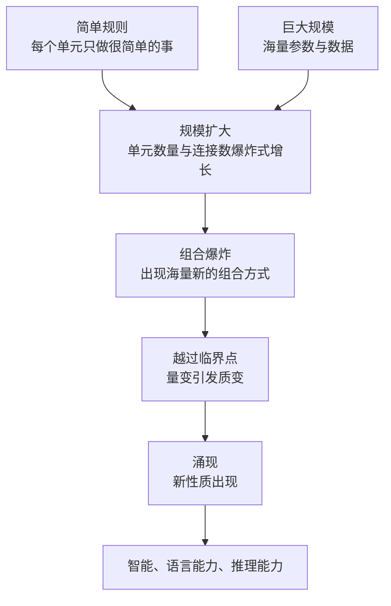

# 01｜为什么说智能不是被设计出来的，而是“涌现”出来的？

> 如果智能不能被设计，只能被「养」出来，那么人类理解 AI 的方式就得彻底改写。

---

## 一、先说结论

张笑宇在《AI文明史·前史》里给出的第一个核心概念是「涌现」。他的结论很干脆：智能不是被谁设计出来的，而是涌现出来的——简单的规则加上巨大的规模，系统会自己长出原本不存在的性质。蚂蚁不会思考，蚁群却能解决复杂问题；单个神经元不会思考，上千亿个神经元连在一起，意识就出现了；语言模型一开始只是在预测下一个词，规模足够大之后，却突然学会了推理。这背后的含义是：人类造不出智能，人类只能为智能的出现创造条件。这一条，是全书所有推论的起点。

## 二、我们先理解一个问题

我们习惯的「制造」，都是有图纸的制造：造一座桥，先画设计图，再按图施工；造一辆车，先定规格，再组装零件。每一个部件在哪里、起什么作用，工程师都清清楚楚。

可是「造智能」这件事，可能根本不适用这套模式。

请问：有没有哪一位工程师，写下了「第 300 亿个参数负责幽默感」这样的图纸？没有。有没有哪一行代码，规定了「模型在第三步要学会举一反三」？也没有。我们看到的却是：模型规模扩大之后，它自己学会了这些。这就引出一个奇怪的问题——如果智能不是被设计出来的，那它是从哪里来的？

## 三、作者到底提出了什么观点？

张笑宇的观点是：智能是「涌现」的产物。所谓涌现，指的是一个系统在规模足够大、规则足够简单时，会自发产生低层次上完全看不到的新性质。

作者在书里把这条线索拉得很长。从宇宙演化的角度看，基本粒子聚成原子，原子组成分子，分子组成蛋白质，蛋白质组成生命，生命演化出智能——每一次跃迁，都不是上一层的「设计」，而是上一层的规模效应。他还指出，人脑本身就是最好的例子：神经元只会传递电信号，没有任何一个神经元「懂得」思考，但足够多的神经元连在一起，思考就发生了。

作者由此推论：既然人类的智能是这样被创造出来的，那么机器的智能凭什么不能从人造的电路和代码中涌现？他的原话大意是：我们之所以能够创造人工智能，是因为我们自己的智能也是这样被创造出来的。

## 四、把这个观点翻译成人话

用一句大白话来概括：**你没法通过写说明书，教会水分子什么是「湿」。** 但把足够多的水分子放在一起，「湿」就出现了——它不在任何一个水分子身上，它是规模带来的新性质。

同样的道理：一个神经元只会传电信号，但把上千亿个神经元连起来，「你」就出现了；一段程序只会做加减乘除，但把上万亿个参数和几乎全部人类文本连起来，「会聊天、会推理、会写代码」的东西就出现了。

这里的关键在于：**涌现出来的东西，无法从零件身上推导出来。** 你就算把每个神经元研究到极致，也推不出这个人会不会写诗。这也是为什么「造 AI」和「造桥」是两种完全不同的工程——前者更像种树，你只能准备好土壤、水分和阳光，然后等它自己长。

## 五、为什么会这样？

涌现为什么会发生？作者给出的推理链条大致是这样的：

关键在于第二步到第三步：当单元的连接数增长到天文数字，它们之间可能的组合方式会呈爆炸式增长。新的组合，就可能对应新的功能。规模不到的时候，这些功能根本不出现；规模一旦越过临界点，它们就「突然」冒出来。

作者在书里还讲了一个更细的机制：模型学习语言的过程，本质上是在一个巨大的「意义空间」里给每个词定位，含义相近的词位置也相近。参数越多、语料越多，这个空间就越精细，模型能做的连接和推断就越复杂——复杂到一定程度，就出现了没有人教过的能力。

## 六、举一个现实生活中的例子

最经典的例子是蚁群。

一只蚂蚁的智力水平非常差：它能做的动作屈指可数，不过是跟着信息素走、搬东西、躲避危险。你就算把这只蚂蚁研究透，也绝对推不出「蚁群」能干什么。

但把足够多的蚂蚁放在一起，神奇的事情就发生了：蚁群能修建带通风系统的地下城市，能组织分工，能长途搬运食物，甚至能「养殖」真菌、发动战争。没有一只蚂蚁掌握城市蓝图，没有一只蚂蚁是总指挥——但整个群体表现出复杂的智慧。这就是涌现：智慧不在任何一只蚂蚁身上，它在蚂蚁之间的连接里。

作者用这个例子想说明的是：我们今天的 AI，某种意义上就是一个「硅基蚁群」。没有哪个工程师设计了它的全部能力，但海量参数之间的连接自己「长」出了这些能力。

## 七、回到书中重新理解

现在我们再回头看《AI文明史·前史》的第一章，就会发现作者花那么多篇幅讲技术史，其实是在论证一件事：**AI 的每一次突破，都不是设计出来的。**

1956 年的达特茅斯会议上，先驱们相信智能可以被「设计」：把逻辑规则一条条写进机器，机器就会思考。这条路走了几十年，撞得头破血流。而后来真正成功的神经网络路线，恰恰相反——它不设计智能，它只是模仿大脑的结构，然后不断放大规模，等着智能自己出现。

作者说，当训练计算量低于某个量级时，模型的性能跟瞎猜没什么区别；一旦突破某个量级，性能突然大幅提升，「就好像本来靠蒙选择题挣分的学渣，一下子变成百发百中的学霸」。这个突变，就是涌现。

所以「涌现」是这本书的第一块基石：只有承认智能可以被「生产」出来，后面关于人类当量、算法审判、文明契约的讨论才成立。

## 八、这个观点背后还有什么？

这个观点背后，藏着两个不太显眼但很重要的前提。

第一，**智能不需要「灵魂假设」。** 如果智能只是结构与规模的产物，那么我们就不必假定它必须依附于某种神秘的、人类独有的东西。作者进一步说：人类智能和 AI 智能很可能本质上都来自涌现，因此「或许可以被同等看待」——这句话的分量很重，它是全书「放弃人类中心主义」的第一课。

第二，**涌现解释了为什么 AI 的进步难以预测。** 如果能力是设计出来的，你翻图纸就知道它会不会；但能力是涌现出来的，你只能在它出现之后才知道它出现了。这也是为什么连最前沿的研究者，对「下一步会冒出什么能力」也常常说错。

## 九、这个观点有问题吗？

关于「涌现」，学界存在不同解释，这里需要保持清醒。

首先，「涌现」是一个描述性概念，不是一个解释性概念。说「智能涌现了」，在科学上有点像说「奇迹发生了」——它描述了一种现象，但并没有回答「为什么规模会带来智能」这个机制问题。作者本人也承认，哲学界吵了两千年也没把智能的本质说清楚，涌现只是目前最有解释力的框架之一。

其次，有一批学者对大语言模型的「涌现」持怀疑态度：他们认为模型只是在预测下一个词元，这种统计能力与人类的理解有本质区别；所谓的「能力突变」，也可能只是评测指标选择造成的错觉——换一种度量方式，能力提升可能看起来是平滑的。关于这一问题，学界至今存在不同解释。

最后，涌现叙事天然带有一种「必然性」色彩：好像只要规模够了，智能就一定会出现。这种说法容易被读成技术决定论，而忽略了路线选择、工程细节、社会条件的作用。

## 十、今天再看这个观点

以下部分是基于作者思想的现代延伸，不是作者原话。

2025 年以后，AI 行业最激烈的争论之一就是「规模法则还行不行」：一派主张继续堆算力和数据，另一派认为规模法则边际收益正在递减，要靠强化学习、延长思维链来提升推理能力。值得注意的是，作者在书中其实已经预判了这一幕：他认为 AI 的智能演化会经过两个阶段，先是暴力堆算力的规模法则阶段，再是用强化学习堆尝试的逻辑推理阶段。

对普通人来说，这个观点最有用的推论也许是：**不要和 AI 比「存量技能」。** 凡是能被清晰表达、能被规模化复制的技能，都在涌现的射程之内。真正值得投入的，是那些还没有被语言完整表达出来的能力——判断、品位、组织、面对具体情境的直觉。

## 十一、这一篇真正应该记住什么？

1. 智能是涌现的产物，不是设计的产物：简单规则加上巨大规模，系统会自己长出新性质。
2. 涌现出来的能力无法从零件身上推导出来，所以「造 AI」更像种树，而不是造桥。
3. 人类智能与 AI 智能可能同源，都不需要「灵魂假设」——这是全书放弃人类中心主义的起点。
4. 涌现解释了 AI 为什么「突然」变强，也解释了为什么它的进步难以预测。

## 十二、留一个问题

如果智能只是规模与规则的产物，那么人类的「独特」到底还剩下什么？是创造力，是情感，还是别的什么？

有意思的是，人类对这个问题最早的答案，不是「情感」，而是「逻辑」——两千多年前，苏格拉底给出了一个至今影响深远的判断：不违背矛盾律的知识，才是可信的知识。人类曾经真的相信，思考就是逻辑，而逻辑可以被写成数学。

这条信念后来怎么样了？下一篇，我们回到古希腊，去看人类「把思考变成数学」的梦想，是如何建立、又是如何破灭的。
