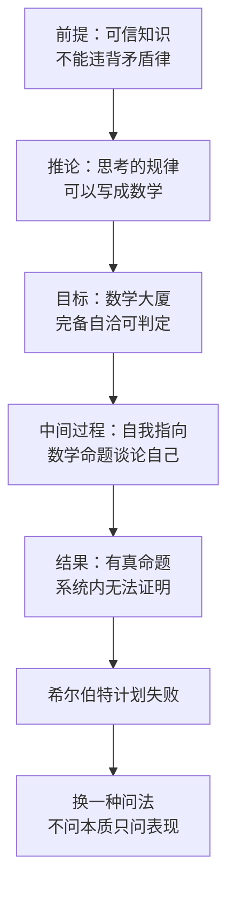

# 02｜从苏格拉底到哥德尔：为什么“让思考变成数学”的梦想会破灭？

> 人类曾经相信思考就是逻辑、逻辑就是数学，这条路走到哥德尔那里，为什么走不下去了？

---

## 一、先说结论

张笑宇在《AI文明史·前史》里讲了一段跨度两千多年的思想史。起点是苏格拉底：他第一次给「可信知识」一个明确回答——不违背矛盾律的知识才是可信的。从此西方思想史形成一条主线：理性思考是人之为人的本质，是区别人与动物的根本方式；而既然理性思考有规律，这些规律就可以被处理成数学符号和数学关系。

这条主线延伸到二十世纪初的希尔伯特：他想把数学建成完备、自洽、可判定的大厦，并说过「没有人可以将我们从康托尔所创造的天堂中驱逐出来」。但哥德尔证明了希尔伯特计划的不可能。

作者的判断是：这次坍塌不是失败，而是一次转向——当「思考的本质是什么」被证明答不出来，人们才被逼着换一种问法：不问智能的本质，只问智能的表现。

## 二、我们先理解一个问题

先问一个看起来很笨的问题：你凭什么相信「一加一等于二」？

你大概会说：这不用凭什么，它就是对的。但两千多年前的希腊人发现，这个回答不够用——因为你同样可以说「一加一等于三」也是对的。如果每个人都只凭「我觉得」，争论就永远没有结果。

于是难题出现了：**人类的意见可以互相冲突，那么有没有一种知识，是所有人都必须承认的？**

苏格拉底的答案是：有，那就是不违背矛盾律的知识。矛盾律是说，同一个东西不可能同时既是这样又不是这样；你不能说「这是圆的」和「这不是圆的」都对。凡是会推出自我矛盾的说法，就不可信。

后果极其深远：从这一刻起，「可信」的标准不再是权威说的、祖先传的，而是**不矛盾**。人类第一次把知识的裁判权交给了逻辑。

## 三、作者到底提出了什么观点？

作者在书中的梳理是：苏格拉底这一步，奠定了一个贯穿西方思想史的传统——我们思考问题的方式可以处理成数学符号和数学关系；而这个共识在柏拉图、亚里士多德时代之前就已经形成：理性思考是人之为人的本质，是区别人与动物的根本方式。

也就是说，两千多年前人类就下了一个赌注：**思考是有规律的，规律可以被写下来，写下来之后就是数学。**

二十世纪初，希尔伯特把这个梦想推到最高点。作者在书中提到，他高度肯定康托尔的工作，因为在他的想象里，数学应该是完备的、自洽的、可判定的：完备，是所有真的数学命题都能被证明；自洽，是不会推出矛盾；可判定，是任何命题都能在有限步骤内被判断真假。作者的观点是：希尔伯特计划代表了这条理性主义路线的终点形态。

## 四、把这个观点翻译成人话

用大白话说，人类想要一栋绝对安全的知识大楼。为了保证它不会塌，人类做了三件事——先规定「凡是自相矛盾的说法一律不能用」，再找出最不证自明的那几块地基，最后宣布「只要地基对了，整栋楼就都对了」。这三步分别是苏格拉底、欧几里得和希尔伯特。

这座楼如果建成，会发生一件很惊人的事：**思考就变成了一种可以机械执行的操作。** 你不用再有灵感，不用再有天赋，只要照着规则推，就能得到所有正确的结论。这也是早期 AI 研究者乐观的根源——如果思考就是推理，那么造一台会思考的机器，就只是把推理规则写进机器里。

而哥德尔做的事情，相当于拿着一把锤子走到楼门口，说：**这栋楼不可能既不漏水又不开裂。** 数学里一定存在真的、但无法在系统内被证明的命题。这就是不完备定理的字面意思：完备，做不到。

## 五、为什么会这样？

要理解哥德尔，先要理解一个两千多年前的恶作剧——说谎者悖论。有一个人声称：「我正在说的话是谎话。」这句话如果真，按它自己的说法它就是假；如果假，它说的就不是谎话，所以它就是真。

这个悖论可怕的地方在于：它不是文字游戏，它证明了一件事——**自然语言里可以构造出指向自己的句子，而这种句子会让真假判定失效。**

哥德尔的突破，是把这种自我指向搬进数学：他让数学命题可以谈论数学命题自己，于是可以构造出一个数学版本的「我正在说的话不可证明」。它如果可证明，系统就推出了矛盾；如果不可证明，它就是真的但证不出来。

关键在于第四步：只要一个系统足够强，强到能够谈论自己，它就会长出自己无法消化的命题。这不是技术失误，而是**任何足够强的形式系统都逃不掉的宿命**。

## 六、举一个现实生活中的例子

让数学长出这样一句话，需要一点很聪明的技术。哥德尔先给数学符号编上号：每一个符号、每一个公式、每一段证明，都对应一个自然数。这一步看起来只是记账，效果却极其巧妙——**关于数学的陈述，本身也变成了数学对象。** 于是「某个公式不可证明」这句话，可以被写成一个数学命题。

然后他构造出那个著名的命题，大意是：「本命题不可证明。」

现在只剩两条路。如果这个命题可以被证明，那它说的「不可证明」就是错的，系统证明了一个假命题——系统坏了。如果它不能被证明，那它说的就是对的，可它明明是对的，系统却证不出来——系统不完备。

作者用这个例子想说明的是：完备、自洽、可判定这三件事不可能同时得到。数学这座大厦不是漏了一块砖，而是它在设计上就不能被完全封闭。

作为对照，作者还提到欧几里得的几何大厦曾被认为是完美建筑的样板。数学史上真正被推翻的，往往不是某个具体结论，而是「这座楼已经完工了」这种自信。

## 七、回到书中重新理解

在哥德尔之后，问题的形态变了。作者在书中给出的判断是：从此以后，人们的注意力从「建立完备的数学体系」转向了「可计算问题」。这个转向极其关键——它把「思考是什么」这个形而上学问题，换成了「什么东西可以被一步步算出来」这个可以操作的问题。

而这一步，直接把机器智能的门打开了。作者指出，电子计算机就是两样东西的结合：图灵的原理，加上冯·诺依曼的架构。前者告诉你计算是什么，后者告诉你怎么把计算造出来。

更关键的是图灵 1950 年的那一步。作者在书中写道，图灵提出了另一条路径：**不要讨论智能的本质，而要讨论智能的表现。** 如果「机器能否思考」从定义开始讨论，它就会变成一场荒谬的民意调研——大家各有各的定义，最后什么也讨论不出来。不如换一个可以观察的标准：如果一台机器在对话中让人分不清它是人还是机器，我们就承认它能思考。

这就是图灵测试。它的高明之处不在于给出了答案，而在于把问题换掉了。作者由此的判断是：我们并不能确定逻辑思考就是思考的本质，也不能确定会证明已知数学原理的程序就是机器思考的未来方向。

## 八、这个观点背后还有什么？

第一层，是**换问题比答问题更重要。** 从苏格拉底到希尔伯特，人类一直在追问「智能的本质是什么」；哥德尔和图灵之后，最有成果的进展恰恰来自放弃这个追问。这不是逃避，而是承认：有些问题在当前的问法下没有出路。

第二层，是**逻辑传统坍塌留下的空间，被另一条路线接手了。** 既然「把思考写成规则」在逻辑地基上站不住，那么剩下的可能就只有一种：不去设计思考的规则，而是模仿产生思考的器官，然后放大规模，等它自己长出来。这正是神经网络路线的起点。

第三层，是**理性主义本身需要被重新理解。** 作者不是说理性没用，而是说：把理性等同于形式逻辑、把形式逻辑等同于数学，这个等号太强了。

## 九、这个观点有问题吗？

这个叙事很有说服力：它把一条很长的思想史线索压缩成了一个清晰的转折——梦想建立、梦想破碎、换一条路。哥德尔不完备定理确实是二十世纪最重要的逻辑结论之一，图灵测试也确实把 AI 的问题重新定义了。

争议主要有三处。

第一，**哥德尔定理的适用范围常被夸大。** 数学上，不完备定理针对的是足够强、可递归公理化的形式系统。一些学者认为，把它的结论推广到「人类理性有边界」甚至「人类心智不可计算」是不严谨的；也有学者反过来用它论证人脑不是机器。关于这一问题，学界存在不同解释。作者引用哥德尔，是为了说明希尔伯特计划的失败，而不是在主张一个关于心智的强结论。

第二，**「理性主义传统坍塌」是历史叙事，不是历史判决。** 希尔伯特计划失败之后，形式化方法并没有退出历史舞台：形式验证、类型论、定理证明器今天还在被大量使用。作者强调的是这条路无法通向智能，而不是这条路没有用。

第三，**逻辑路线与神经网络路线之间，未必是替代关系。** 今天符号推理和神经网络往往并存：模型调用工具、执行代码、做形式化证明，都是两者的混合。另一种解释也值得考虑：AI 的进步未必需要「放弃逻辑」这个前提，它更像是工程条件成熟的结果——即使逻辑传统没有坍塌，神经网络也可能因为算力变便宜而胜出。

## 十、今天再看这个观点

以下部分是基于作者思想的现代延伸，不是作者原话。

一个有意思的对照是：今天的 AI 在逻辑这件事上反而变强了。用强化学习延长思维链之后，模型可以一步步推导、可以检查自己的步骤、可以写形式化的证明。被哥德尔划出边界的那件事——形式推理——机器做得越来越好；而它做得越好，就越说明边界不在能不能推理，而在别的地方。

另一个对照是：图灵当年用分不清人和机器来回避定义问题，而今天的争论恰恰又回到了定义问题上——人们不再问它会不会聊天，而是问它是不是真的理解。

对普通人来说，这一段思想史最实际的提醒可能是：**当你听到「思考就是计算」「智能就是规则」这类断言时，先问一句——这个等式是哪一年立的。**

## 十一、这一篇真正应该记住什么？

1. 苏格拉底给可信知识定的标准是不违背矛盾律，这一步把知识的裁判权交给了逻辑。
2. 西方思想史由此形成一条主线：理性思考是人之为人的本质，而思考的规律可以被处理成数学。
3. 希尔伯特想建成完备、自洽、可判定的数学大厦，哥德尔证明了这个计划不可能：足够强的系统里，一定存在真的但证不出的命题。
4. 这次坍塌带来的不是绝望，而是转向：从「建立完备数学体系」转向「可计算问题」，从「智能的本质」转向「智能的表现」。
5. 图灵 1950 年的图灵测试，本质上是把问题换掉，而不是把问题答完。

## 十二、留一个问题

如果「思考就是逻辑」这个信念已经被证明走不通，那么接下来的问题就变成了：既然逻辑规则写不出智能，那还有没有别的办法造出智能？

有意思的是，二十世纪的 AI 研究真的分成了两支：一支继续沿着逻辑走，试图把智能写成一本规则手册；另一支干脆去模仿大脑，用一堆神经元连成的网络去长出智能。前者一度风光无限，后者坐了三十年冷板凳。

那么，符号主义到底输在哪里，联结主义又是靠什么赢回来的？这是我们下一篇要讨论的问题。
