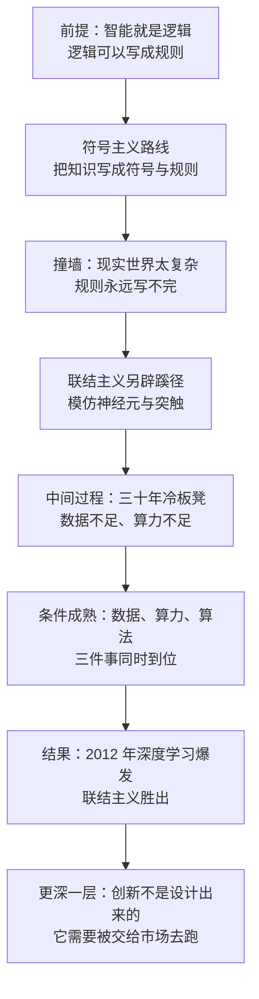

# 03｜符号主义输在哪里，联结主义又赢在哪里？

> 同样是想造出会思考的机器，为什么把智能写成规则手册的那条路失败了，而模仿大脑的那条路最后赢了？

---

## 一、先说结论

张笑宇在《AI文明史·前史》里把二十世纪的 AI 研究史，看成两条路线的竞争。

第一条叫符号主义：既然思考是逻辑，那就把逻辑规则一条条写进机器，机器就会思考。这条路从 1956 年的达特茅斯会议开始，曾经是主流。

第二条叫联结主义：它不写规则，而是模仿大脑的结构——神经元通过突触互相连接，信息在里面传递、被反复调整。这条路被嘲笑、被冷落，坐了三十年冷板凳。

作者的判断是：符号主义输，不是因为它不够聪明，而是因为它面对的世界太复杂，规则永远写不完；联结主义赢，也不是因为它一开始更先进，而是因为它等到了三件事——数据、算力、算法。2012 年，辛顿点燃了 AI 时代的火花。

但作者真正想说的不只是技术史。他由此提出一个更硬的判断：**创新不是设计出来的。**

## 二、我们先理解一个问题

先想一个问题：如果你要教一个从没见过猫的人认识猫，你会怎么做？

第一种办法是写一本手册：「猫有四条腿，有胡须，耳朵是三角形，体长约五十厘米……」听起来很靠谱。但麻烦马上来了：三脚猫怎么办？折耳猫怎么办？毛色和背景混在一起、只看得到半张脸的猫怎么办？你会发现，规则要不断地补，补到几千条还是会有例外。

第二种办法是：给他看十万张猫的照片，让他自己总结。他说不出猫的定义，但他能一眼认出猫。

**这就是符号主义与联结主义的分野。** 前者相信智能可以被写下来，后者相信智能可以被练出来。

而在二十世纪中期，几乎所有聪明人都押在了第一种办法上。这不是因为他们笨，而是因为当时的条件只能支持第一种办法。

## 三、作者到底提出了什么观点？

作者在书中写道，1956 年的达特茅斯会议开启了 AI 研究。早期研究者的目标是：让机器像人一样学会逻辑思考，而其中最重要的标志，是学会证明数学定理。

为什么是证明定理？因为在那个年代的人看来，数学证明是人类理性最纯粹的形态：有明确的规则，有确定的真假，有可以一步步检查的过程。如果机器能证明定理，那它就抓住了理性的骨架——这是一个从苏格拉底一路继承下来的信念：思考就是逻辑，逻辑就是数学。

于是符号主义成了第一代 AI 的主流方法：把知识写成符号，把推理写成规则，把问题写成搜索。作者在书中的判断是，这条路线走了几十年之后撞了墙。

墙在哪里？作者的说法是：现实世界太复杂了。你可以写出「所有人都会死，苏格拉底是人，所以苏格拉底会死」这样的规则，但你写不出「这句话是什么意思」「这个人为什么生气」。规则手册越写越厚，能覆盖的场景却始终有限。

而联结主义提供的是另一种答案：它不去定义智能，它去模仿产生智能的器官。作者在书中解释了它的灵感来源：神经元之间通过突触连接，信息以化学信号转电信号的方式传递；一个神经元很笨，但大量神经元连成的网络可以处理极其复杂的信息。

## 四、把这个观点翻译成人话

用大白话总结这两条路线的差别：

**符号主义是「先懂再做」**：先把知识整理清楚，写成规则，再让机器照着规则走。它的前提是——我们必须先知道智能是怎么回事。
**联结主义是「先做再懂」**：先搭一个粗糙的网络，喂数据，让它自己调参数；它变强了，我们再去研究它为什么变强。它的前提是——我们不必先知道智能是怎么回事。

第一条路听着更让人安心，因为它可控、可解释。但它有一个致命的负担：**世界上的知识不是可以写完的。** 你写下的每一条规则，都需要有人先把它想清楚；而人类大量的能力，恰恰存在于说不清楚的地方。

第二条路听着很不靠谱，但它有一个巨大的优势——**它不需要有人先把规则想清楚。** 网络自己会从数据里把规律找出来。

两条路线的胜负，其实不取决于哪条路更聪明，取决于哪条路等得起。

## 五、为什么会这样？

把符号主义的困境和联结主义的复兴串起来，推理链条是这样的：

这条链条里最容易被忽略的是第五步。**联结主义不是突然变聪明了，而是它需要的东西终于凑齐了。** 神经网络的基本原理在几十年前就已经写出来了，它之所以没成功，是因为当时没有足够多的数据喂它、没有足够快的芯片算它、也没有足够好的技巧训练它。

这也是作者那句话的意思：创新不是设计出来的。如果创新可以设计，那么几十年前那些最聪明的头脑，早就应该把神经网络设计出来了——条件只能靠无数人在市场里试错、失败、再来，慢慢攒出来。

## 六、举一个现实生活中的例子

最典型的例子是感知机和它引发的 AI 寒冬。

感知机是联结主义最早的具体形态之一：一个很简单的模型，模仿神经元的结构，输入信号，加权求和，超过阈值就输出。它在五十年代末出现时引起了巨大的兴奋。

然后它被泼了冷水。批评者论证：感知机的能力有严格限制，连一些很简单的逻辑关系都学不会；它被承诺的那些宏大能力，在数学上是不可能实现的。这个批评极有杀伤力，因为它不是观点之争，而是证明。

后果是漫长的沉寂。资金撤了，研究者散了，这段时期后来被称为 AI 寒冬，前后持续了二十年左右。

这里面最值得琢磨的，不是谁对谁错，而是**「被证明有局限」和「这条路走不通」是两回事**。感知机确实有局限，但网络加深、层数增加之后，那些局限就不存在了。批评者证明了单层感知机不行，却被读成了神经网络不行。一个正确的结论被过度推广，代价是二十年的停滞。

而转折点来得很晚。作者在书中写道，2012 年，辛顿点燃了 AI 时代的火花。这背后正是数据、算力和算法三件事的合力：李飞飞推动的 ImageNet 提供了海量标注数据，GPU 提供了廉价算力，算法上的改进让深层网络可以被训练起来。作者还提到吴恩达 2009 年的一篇论文，发现用 GPU 实现的检测器比传统软件版本快了 90 倍，而且能轻松处理数以百万计的实例。

同一个想法，几十年后重新拿出来，结果完全不同——变的不是想法，是条件。顺带说一句后续：辛顿、杨立昆、本吉奥因为在深度学习上的贡献，2018 年获得了图灵奖，被称为「人工智能教父」。而辛顿本人后来对 AI 的风险感到害怕，用「盗火的普罗米修斯」来形容自己。

## 七、回到书中重新理解

作者写这段技术史，其实是在为一件事做铺垫。

如果智能可以被设计，那么谁的设计能力强，谁就能造出智能——这听起来像一个可以规划、可以集中投入的任务。但历史给出的答案不是这样：神经网络的基本原理早就有了，真正决定胜负的是数据、算力和算法这三件看起来不那么高级的东西。**它们没有一件是靠某个天才的设计完成的，都是整个产业和市场长期积累的结果。**

作者由此得出的推论超出了技术史。他说创新最好交给市场，理由是市场上的企业数量远远超过任何一个中心机构能调动的资源——「政府虽然比单个企业有钱，但绝不可能比市场上千千万万的企业加起来还有钱」。这句话的重点不在钱，而在**试错的并行度**：一千家企业同时试一千条路，失败九百九十九条，剩下一条可能就是通往未来的路。

这也和全书的第一块基石接上了：智能不是被设计出来的，而是涌现出来的；创新也是一样。

## 八、这个观点背后还有什么？

第一，**「输在哪里」的答案，往往在技术之外。** 符号主义的失败，表面上是方法问题，实质上是知识获取的成本问题；联结主义的胜利，表面上是算法问题，实质上是产业条件问题。

第二，**冷板凳是一种基础设施。** 这三十年里神经网络并没有消失，而是一直有人在做、在改进、在被嘲笑中坚持。等到条件成熟，需要有人接得住这个机会。作者的叙事里有一种很冷静的提醒：任何一项真正的创新，在它成功之前，看起来都像是一个错误。

第三，**这两条路线未必是终局。** 作者讲的是一个历史胜负，但符号与联结的边界今天其实在重新模糊：模型可以调用工具、执行代码、做形式化推理，符号主义的很多想法以新的形态回来了。

## 九、这个观点有问题吗？

这个叙事的说服力在于：它用一段真实的、有明确时间节点的技术史，支撑了一个关于创新的判断，而且这个判断和产业事实是对得上的。

争议主要有三处。

第一，**「创新不是设计出来的」有被过度推广的风险。** 作者自己承认追赶阶段集中力量是有效的，但在叙述里，市场与计划的对比容易被读成非黑即白。一些学者认为，很多关键技术的早期突破恰恰来自政府资助的实验室和长期基础研究——互联网、GPS、早期的神经网络研究本身，背后都有公共资金的影子。关于这一问题，学界存在不同解释。

第二，**符号主义的失败被讲得过于彻底。** 事实上符号方法从未消失，它在专家系统、数据库、程序语言、形式验证里一直活着；今天的推理模型在解数学题时，往往也借助形式化的步骤。

第三，**「三十年冷板凳」的叙事容易滑向英雄史观。** 深度学习的复兴是大量研究者、工程师、标注工人、硬件厂商共同作用的结果。另外还有一种解释认为，神经网络之所以胜出，不只是因为条件成熟，也因为它恰好匹配了语言和图像这类任务的统计结构——它可能是在对的问题上赢了，而不是在所有问题上赢了。

## 十、今天再看这个观点

以下部分是基于作者思想的现代延伸，不是作者原话。

今天最有意思的现象是：两条路线正在合流。用强化学习延长思维链的推理模型，会把推理过程一步步写出来，这看起来非常像符号主义；但它的底层依然是神经网络。可以说，联结主义提供了能力，符号主义提供了形式。

另一件事是，作者那句「创新最好交给市场」在今天遇到了新的问法。当算力和数据的门槛高到只有少数几家公司能跨过时，「市场」这个词的含义本身就在收缩——它从千千万万家企业，变成了几家巨头。这不必然推翻作者的判断，但确实让分散试错这个前提变得不那么自动成立。

对普通人来说，这一段历史最实际的提醒也许是：**不要用现在看起来有没有用来判断一件事的价值。**

## 十一、这一篇真正应该记住什么？

1. 符号主义想把智能写成规则手册，它撞墙的原因不是规则写错了，而是现实世界复杂到规则永远写不完。
2. 联结主义不去定义智能，而是模仿神经元与突触，让网络自己从数据里找规律。
3. 神经网络坐了三十年冷板凳，复兴靠的是数据、算力、算法三件事同时到位，而不是某个天才的灵光一现。
4. 「被证明有局限」不等于「这条路走不通」——一个正确的结论被过度推广，代价可能是二十年的停滞。
5. 作者由此得出的判断是：创新不是设计出来的，它更适合交给市场去并行试错。

## 十二、留一个问题

如果联结主义的胜利靠的是数据、算力和算法，那么接下来的问题就很自然了：**如果继续把这三样东西往上堆，会发生什么？**

神经网络坐冷板凳的那些年，它连简单的任务都做不好；而到了 2012 年之后，它开始在很多任务上超过人类。有意思的是，这种进步并不是平滑的——它更像是在某个规模上突然跳了一下：之前几乎什么都不会，之后就什么都会了一点。

这种「突然变聪明」到底是怎么发生的？它会不会一直持续下去，直到机器比所有人都聪明？这是我们下一篇要讨论的问题。
