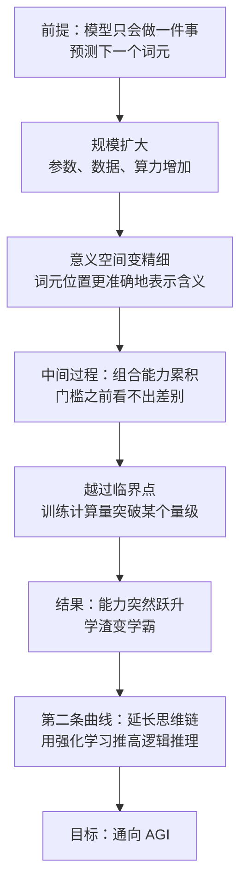

# 04｜规模法则：为什么“更大”会突然变成“更聪明”？

> 为什么模型规模跨过某个门槛，能力会突然跃升？这条路真的能通向 AGI 吗？

---

## 一、先说结论

张笑宇在《AI文明史·前史》里给出的判断是：大语言模型的能力和它的规模之间不是线性关系，而是一条会突然抬头的曲线。

谷歌的研究团队用 LaMDA、GPT-3、Gopher、Chinchilla、PaLM 等一批模型做过实验：当训练计算量不足 10²² 的时候，模型的性能基本为零，跟瞎猜没有区别；而一旦突破 10²³，性能就大幅提升。作者在书里用一句话形容这个变化：「就好像本来靠蒙选择题挣分的学渣，一下子变成百发百中的学霸。」

这就是规模法则。而在它的边际收益开始递减之后，第二条曲线出现了：用强化学习延长模型的思维链，把它推向逻辑推理。作者认为，这很可能是通往 AGI 的靠谱道路。

但他也给了冷水式的提醒：AGI 的标准是比 100% 的人都聪明，而今天 AI 的本质仍然是语言模型——人没说出来的东西，它拿不到语料。

## 二、我们先理解一个问题

先想一个不太直观的事实：**有些事情不是慢慢变好的，而是突然就会了。**

一个孩子学说话，不是先学会一成的说话、再学会两成，而是很长一段时间里几乎什么都不会说，然后某一天突然开始整句整句地讲。学游泳也是这样：在某个瞬间之前你一直在呛水，之后你就会了。

这种现象在复杂系统里很常见：**能力的增长不是一条平滑的直线，而是一条先趴在地上、然后突然抬头的曲线。**

那么问题来了：如果造 AI 也是这样，会发生什么？

你会看到一个很反直觉的现象——在很长一段时间里，投入大量的钱、算力和数据，得到的几乎全是没用的东西；而就在所有人都觉得这条路是不是不行的时候，它突然就行了。**这意味着，判断该不该继续投入，几乎是一件做不到的事。**

## 三、作者到底提出了什么观点？

作者在书中写道，谷歌的研究团队用 LaMDA、GPT-3、Gopher、Chinchilla、PaLM 等模型做了对比实验，结果呈现出一种门槛式的规律：训练计算量低于某个量级时，模型的表现和随机猜测没有区别；越过某个量级之后，性能大幅跃升。他把这个现象总结为规模法则：**在一定的范围内，模型越大、喂的数据越多、投入的算力越多，它就越聪明。**

OpenAI 那边还发现：把模型规模放大，反而可以用更少的数据取得更好的效果。规模不只带来同样的能力做得更好，还带来用更少的材料学到同样的东西——这就是大语言模型越大越聪明的原因。

作者还引用了 2023 年 8 月伊利亚·苏茨克韦尔的一次演讲，揭示 ChatGPT 的科学本质：它做的其实是所罗门诺夫归纳法，说白了就是「预测下一个词元」。模型用词元在一个巨大的意义空间里的位置来表示含义，而 Transformer 的注意力头会在已生成的序列里回头去看、加权组合，从而影响下一个词元出现的概率。

作者由此给出一个很直接的判断：**如果我们说任何能够运用语言的能力就是智能，那么大语言模型就是有智能的。**

但他没有停在规模法则上。他指出，规模法则的边际收益会递减，于是第二条曲线出现了：用强化学习延长模型的思维链，让它在给出答案之前先一步一步推理。他注意到，2024 年 9 月之后的进步几乎都围绕思维链的延长展开，并认为这很可能是通往 AGI 的靠谱道路。

## 四、把这个观点翻译成人话

用大白话说，规模法则讲的是这么一件事：**智能这种东西，是被泡出来的。**

就像泡茶：水温不够、时间不够，茶叶再多也出不来味道；但只要水温和时间过了某个点，味道就出来了。模型的规模、数据量、算力就是水温、时间和茶叶，能力就是茶味。水没开的时候，你尝不到任何东西。

这里最反直觉的地方在于：**在门槛之前，投入和产出几乎无关。** 你花十倍的钱，得到的可能是完全一样的「不会」。努力的回报，要等越过门槛之后才一次性兑付。

而思维链这件事更简单：**让模型先把过程写出来，再给答案。** 一个人做数学题，如果要求他脱口而出答案，他很可能答错；如果允许他在纸上一步步算，正确率就高得多。思维链做的就是给模型一张草稿纸。

## 五、为什么会这样？

把规模法则和思维链串起来，推理链条是这样的：

关键在于第三步到第五步。**模型在门槛之前不是学得慢，而是学的那些东西还串不起来。** 当参数和语料少的时候，它对每个词的理解都很粗糙，词与词之间的关系也没有被准确把握，所以它做出的判断接近随机。而当规模上去之后，意义空间变得足够精细，之前积累的那些零碎能力就突然连成一片。

这也解释了为什么更大会变成更聪明：它终于能把自己会的东西组合起来用了。

而思维链为什么重要？因为**推理是一种可以被写出来的能力**：模型先预测出一串推理步骤，这串步骤本身就会成为后续预测的条件。用强化学习奖励那些能得到正确答案的推理路径，就等于在教它写草稿纸。

## 六、举一个现实生活中的例子

最能让普通人感受到这种突变的是 AlphaGo 和李世石的那五盘棋。

在围棋这件事上，机器的处境一度非常尴尬。棋盘只有十九乘十九，规则几行就能写完，但它的可能性多到恐怖——每一手棋的分支数量远远超过国际象棋。这意味着，靠传统的搜索和人工写定的规则，机器根本走不到高手的层次。在很长时间里，围棋被认为是人类智力最后的高地之一。

然后 AlphaGo 出现了。它下棋的方式不是被人教会的，而是自己练出来的：通过大量对局，它逐渐形成了对人类棋手来说很陌生的判断——某些看起来平庸的下法其实价值极高，某些看起来漂亮的下法其实是在自损。这些判断不是人类写进程序里的，而是网络自己在无数次试错中形成的。

2016 年它和李世石的对局成了公开证明。李世石赢下了其中一盘，那一盘被看作人类在这个项目上的最后一次胜利。真正让人震动的不是输赢，是**那些棋的走法开始让人看不懂，随后又被证明是对的**。

作者用这件事想说明的，正是规模这个词的深层含义：AlphaGo 的成功不是因为工程师找到了围棋的正确规则，而是因为他们给了一个足够大的网络足够多的对局，让它在规模之中自己长出判断力。人类教给它的只是规则和胜负，剩下的是它自己长出来的。

## 七、回到书中重新理解

如果智能是涌现出来的，那么接下来最实际的问题就是：**涌现在什么条件下发生？** 规模法则给的就是这个条件——参数、数据、算力。它把「智能从哪里来」这个哲学问题，变成了一个可以被测量、可以被投入的工程问题。这也是为什么这几年整个行业的资源都压在更大上。

但作者的判断不止于此。他提出了一个很硬的坐标系：**AGI 的定义是比 100% 的人都聪明**，能完成爱因斯坦或贝多芬能做的事；再往上的 ASI 即超级智能，还能自我迭代、加速进化。注意这个标准有多苛刻：不是比大多数人聪明，也不是在某些任务上超过专家，而是**比所有人都聪明**。

他还给出了判断 AI 文明的三条标准：第一，AI 能否超越所有人；第二，AI 能否自我进化——他引用萨顿的说法，指出今天 AI 的学习能力连动物都不如；第三，AI 有无自我意识。用这三条标准去量，我们今天仍然处在前史。

而其中最硬的一道坎，是**默会知识**。作者的定义很朴素：我们知道却说不出来的知识——品位、待人接物的感觉、面对具体事情的直觉。它的麻烦在于，今天 AI 的本质仍然是语言模型，而**人没说出来的东西，它拿不到语料**。一个老师傅手上那点手感，很难被写成文字，也就很难进入模型的训练集。

## 八、这个观点背后还有什么？

第一，**更大就更聪明是一种非常特殊的进步方式。** 人类历史上的技术进步，多数靠的是理解得更深；这一次靠的却是做得更大——也就是说，我们知道它有效，但说不清它为什么有效。

第二，**规模法则把投入变成了一种赌注。** 因为门槛之前的投入看不出回报，所以这条路只能由那些亏得起的玩家走下去。这直接决定了 AI 的产业格局：它不是一项可以被小团队慢慢打磨的技术，而是一场需要巨额资本持续下注的长跑。

第三，**思维链的转向，可能比规模法则更根本。** 规模是量的堆积，而思维链触碰的是推理本身：它让模型的行为从直觉反应变成了先想再说。真正的智能，可能不在于知道得多，而在于能不能把知道的东西一步步组织起来。

## 九、这个观点有问题吗？

这个叙事最有力的地方在于：它把一批看起来很技术的实验数据，翻译成了一个能被普通人理解的规律，并且解释了为什么会突然变聪明这个大家最困惑的现象。

争议主要有四处。

第一，**规模法则本身正在被质疑。** 关于规模法则边际收益是否递减，学界和产业界存在不同解释：一派认为数据快用完了，继续堆规模的收益会明显下降；另一派认为，新的训练方法和推理阶段的计算投入还会打开新的空间。作者本人的态度是折中的——他承认规模法则会遇到递减，但把希望放到了思维链上。

第二，**「突破某个量级就突然变聪明」有被过度简化的风险。** 一些学者认为，所谓的能力突变可能部分是评测指标造成的错觉：换一种度量方式，能力的提升可能看起来是平滑的。突变可能既在模型里，也在我们的尺子上。

第三，**「能运用语言就是有智能」是作者自己的定义选择，不是共识。** 这个定义相当宽松；而另一批学者坚持认为，统计意义上的语言生成与理解之间有一条本质的界线。作者在同一段里强调的恰恰是「如果我们说……那么……」，也就是把结论挂在了定义上。关于这一问题，学界至今存在不同解释。

第四，**AGI 的定义本身可能过于单一。** 比 100% 的人都聪明听起来很干脆，但人的聪明是分领域的：一个能在数学上超越所有人的系统，未必能处理人际判断。至于默会知识这道坎，也有另一种解释认为它未必是永久边界：如果 AI 能通过视频、机器人交互等方式直接观察世界，那些说不出来的知识，也许可以通过别的方式被学到。

## 十、今天再看这个观点

以下部分是基于作者思想的现代延伸，不是作者原话。

2024 年之后最值得注意的变化，正好印证了作者的预判方向：行业讨论的重心从模型有多大转向了模型想了多久。推理阶段的计算量、思维链的长度、自我检查的机制，成了新的竞争焦点。这也带来一个有趣的后果——能力不再只由训练时一次性决定，而可以在回答问题时被现算出来。

另一个变化是，评估方式本身变成了争议中心：既然突然变聪明可能和尺子有关，那么一个能力到底是真出现了、还是被指标放大了，就需要更细致的方法去分辨。

对普通人来说，这个观点最实际的提醒也许是：**不要指望自己能在技术曲线的门槛前做出准确判断。** 能做的，是承认这条曲线的形状，然后把自己放在门槛之后仍然有用的位置上——那些需要品位、需要判断、需要面对具体情境的事。

## 十一、这一篇真正应该记住什么？

1. 规模法则说的是：在门槛之前，模型几乎什么都不会；越过门槛之后，能力突然跃升，这就是学渣变学霸式的突变。
2. 大语言模型的本质是预测下一个词元，它用词元在意义空间中的位置来表示含义；注意力头在已生成的序列里回顾和加权，影响下一个词元。
3. 规模法则的边际收益会递减，第二条曲线是用强化学习延长思维链，把模型推向逻辑推理。
4. AGI 的标准是比 100% 的人都聪明，而今天 AI 仍是语言模型——人没说出来的默会知识，它拿不到语料。
5. 判断 AI 文明的三条标准：能否超越所有人、能否自我进化、有无自我意识。按这三条量，我们仍处在前史。

## 十二、留一个问题

作者的态度在这个问题上是诚实的：我们没有办法知道 AGI 会不会来，只能拼尽一切去尝试——这是人类的悲哀，也是人类的浪漫。

但假如它真的来了，第一个被改变的东西会是什么？

可能不是某个具体职业，而是一个更基础的问题：**我们该怎么衡量它的威力？** 说它很聪明是没用的，说它比人强也不够用——我们需要一个可以量化的尺子，把智能这件事从形容词变成数字。

而这把尺子，作者已经给出了一半。下一篇，我们要讨论的是一个听起来有点怪的概念：AI 的威力，为什么要用能替代多少人来衡量？
