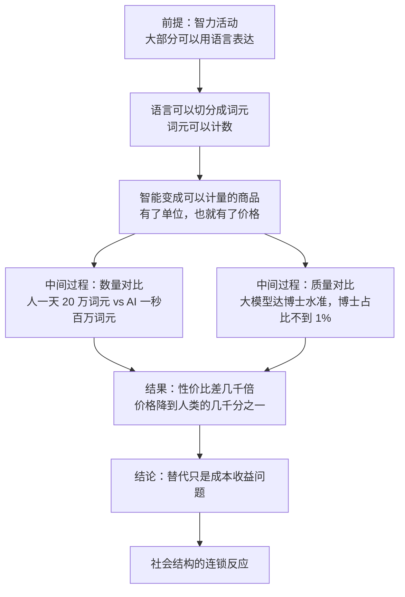

# 05｜AI 的威力，为什么要用“能替代多少人”来衡量？

> 什么是「人类当量」？为什么说当智能可以被量产，99% 的人被替代只是一个成本收益问题？

---

## 一、先说结论

张笑宇在《AI文明史·前史》里借用了「人类当量」这个词——它来自前 OpenAI 研究员利奥波德·阿申布伦纳，指的是 AI 生产智力的效率与人类之间的数学关系。

作者给出的算法很简单：智能既然可以用语言表达，就可以用词元来计量。人聊天每分钟大约 200 个词元，一天撑死 20 万个；而 AI 一秒就能处理百万词元级别的量，成本只要大约一块钱。也就是说，在数量上，AI 的效率是人类的几千倍。

而在质量上，2025 年的大模型测试水平已经达到博士水准，人类里博士占比不到 1%。两者叠加，作者给出的结论是：生成式 AI 在质量上能替代 99% 的人，在数量上效率高上千倍——**99% 的人被替代，只是一个简单的成本收益问题。**

## 二、我们先理解一个问题

先问一个问题：如果一个东西比另一个东西便宜几千倍，会发生什么？

大多数人的第一反应是：便宜的那个会赢，但可能只是替代一部分场景。比如速溶咖啡比手冲便宜很多，但手冲并没有消失；方便面比做饭便宜，但餐馆照样开着。

这个直觉在很多时候是对的。但它有一个前提：**两样东西的质量差距要足够明显，或者两者的用途不完全重合。** 速溶咖啡和手冲咖啡，喝的人在意的不只是咖啡因；方便面和餐厅，吃的人在意的不只是热量。

那如果两样东西的质量差不多，价格却差几千倍呢？这时候问题就完全变了——它不再是选择哪一种的问题，而是为什么还要用贵的那种的问题。

这就是人类当量这个概念真正要问的：**当智能变成一种可以按单位定价的商品，人类劳动的价格还剩下多少谈判空间？**

## 三、作者到底提出了什么观点？

作者在书中的论证分两步：先解决怎么量，再解决量出来是多少。

第一步，怎么量。作者认为，智能是可以被计量的，理由是这样的：人类的智力活动，很大一部分可以用语言表达出来；而只要能变成语言，就能被切分成词元。既然可以切分成词元，就可以计数。于是智能这个听起来很玄的东西，第一次有了一个可以被定价的单位。

第二步，量出来是多少。作者给了一组很具体的数字：人聊天的时候，每分钟大约输出 200 个词元；一天不停地说话，也就 20 万个词元封顶。而 AI 一秒就能处理百万词元级别的量，成本只要大约一块钱。

作者在书中写道，在他写作这本书的时候，AI 量产智能的价格已经降到人类的六百分之一到五百分之一，而且还在继续下降。他用了一句很生活化的对照：你一天给我一块钱，我会饿死；但 AI 完成五倍于一个人的工作量，只要一块钱。

然后是质量这一维。作者引用奥特曼的说法，认为 2025 年的大模型测试水平已经达到博士水准，并且用「没问题」来回应这个判断。而人类中拥有博士学位的人占比不到 1%。这一下就把范围打开了：如果 AI 在质量上达到了前 1% 的水准，那么它在质量上就能替代 99% 的人；再加上数量上高几千倍的效率，两件事合起来，构成的是一个非常尖锐的结论。

作者的结论说得很直白：AI 注定会在所有需要智能活动的领域，以比人类高几千倍的效率工作；而 99% 的人被替代，「只是一个简单的成本收益问题」。

他还特意强调，这是**数学原理**：当数学公式成立之后，其他东西都没那么重要了。他用蒸汽机做类比——当我们知道蒸汽机的效率比马高几百上千倍之后，我们就能预判它会全方位改变社会结构，不需要等到第一台火车开动。作者的意思是：我们不是在和科幻打交道，而是已经进入了现实状态。

## 四、把这个观点翻译成人话

把这件事翻译成一张账单，会清楚很多。

假设你是一家公司的老板，你要买一份智力工作。你面前有两个供应商。

第一个供应商是人。他的报价是：一天 20 万个词元的输出量，价格是一个人的日薪，外加社保、工位、管理成本，还有他每天八小时里真正高效的那几个小时。
第二个供应商是 AI。它的报价是：一秒钟百万词元级别的处理量，价格大约一块钱，全年无休，不需要管理，不会闹情绪。

在这张账单面前，哪个更划算不是一个需要讨论的问题。真正需要讨论的只剩下两件事：**第一，AI 做出来的东西够不够好；第二，有没有什么工作，是人能做而它做不了的。**

作者的回答是：第一件事已经基本解决了——质量上达到了博士水准，覆盖了人类中的绝大多数；第二件事就是后面要讨论的问题，也就是护城河、默会知识、情感和物理世界。

这里要特别注意一个词：**当量。** 当量这个词来自武器领域，我们用 TNT 当量衡量爆炸的威力，是因为一次爆炸的威力很难用语言描述，但它可以换算成多少吨 TNT。人类当量做的是同一件事：把 AI 有多强这个模糊的问题，换算成它相当于多少个人。这是一个非常聪明的问法，因为它把一个关于智能的哲学问题，变成了一个关于成本的会计问题。

## 五、为什么会这样？

把这条推理链完整画出来，是这样的：

这条链条里最关键的一步，是第一步：**智力可以被语言表达这个前提。** 整座计算大厦都建在它上面。如果有一部分智力活动根本不能被语言表达——比如手感、直觉、面对具体情境的判断——那么这部分智力就落在词元计量之外，也就暂时落在这张账单之外。作者后来讲默会知识的时候，讲的正是这部分。

第二步到第四步，是数量和质量的叠加。数量上的差距是几千倍，质量上的覆盖是 99%，这两个数字不是相加，而是相乘。它意味着：**在能被语言表达的智力活动里，人类劳动的价格已经没有谈判空间了。**

最后一步是后果。作者用蒸汽机类比想说明的是：这种变化不是某一个行业的局部变化，而是整个社会结构的重排——因为用多少人曾经是社会组织的核心变量，而它的价格被改写了。

## 六、举一个现实生活中的例子

我们把那张账单真的摊开来看。

一边是人的产出。作者给的数字是：人聊天每分钟大约 200 个词元。按一天有效工作时间算，一个人不停地说话、写字、思考并输出，一天的上限大概是 20 万个词元。这不是一个刻薄的估计——它其实相当宽松，因为人不可能一整天都在高强度输出，还要开会、走神、吃饭、回消息。

另一边是 AI 的产出。同样是一块钱，AI 能在很短的时间里处理百万词元级别的量，并且可以同时服务无数个用户。作者的说法是：AI 完成五倍于人的工作量，只要一块钱。

把这两个数字放在一起，你就得到了一张很残酷的对照表：

- 同样的预算，雇一个人一天，还是让 AI 干五天份的活？
- 同样的时间，等一个人慢慢产出，还是让 AI 立刻给出初稿？
- 同样的质量标准，忍受人的波动和情绪，还是接受一个稳定但需要人审核的输出？

作者在书中想强调的是：**这不是一个未来场景，它是一张今天已经存在的账单。** 很多公司已经在按这张账单做决策了，只是没有把它写成公式。而一旦写成公式，剩下的问题就变得非常简单：哪些工作还值得雇人？

当然，作者也没有说这张账单立刻在所有地方生效。他承认有些领域 AI 短期替代不了，但那不是成本问题，而是能力问题——只要能力问题被解决，成本问题早就有答案了。这也是为什么他说 99% 的人被替代只是一个简单的成本收益问题：它不需要新的技术奇迹，只需要现有的性价比继续发挥作用。

## 七、回到书中重新理解

现在回头看人类当量这个概念在全书的哪个位置，就会明白它为什么被放在讨论职业替代之前。

因为它是一个**换算器**。前面讲的是智能是怎么涌现出来的、AI 是怎么变强的，这些讨论回答的是它是什么；而人类当量回答的是它值多少。有了这个换算器，后面所有关于谁会先被替代、情感怎么被重估、教育还有没有用的讨论，才有共同的度量单位。

作者的论证方式也很值得注意：他不从技术能力出发，而从价格出发。因为技术能力可以被争辩——有人说它行，有人说它不行；但价格是硬的。当两样东西的质量接近、价格差几千倍的时候，市场不需要说服任何人，它自己会做选择。

他还强调这是数学原理，这句话的分量在于：**数学原理不谈判。** 蒸汽机效率比马高几百上千倍，这个事实不会因为马夫们的反对而改变，也不会因为人们更喜欢马而改变；它只会让整个社会的组织方式跟着重新排列。作者说我们不是在和科幻打交道，而是在面对已经进入的现实状态，说的就是这个意思。

而这也给后面的讨论埋了一个很重的伏笔：如果 99% 的人在成本意义上都可以被替代，那么剩下的 1% 是谁？他们为什么没有被替代？以及被替代的人靠什么活着？这些问题作者在后面会一一展开，这里只点到为止。

## 八、这个观点背后还有什么？

第一，**人类当量真正的力量在于它把问题从道德领域搬到了会计领域。** 关于 AI 会不会抢走工作，人们可以争论价值观、争论公平、争论人的尊严；但关于一块钱能买多少工作量，没有什么可争论的。作者选择用后者作为论证的支点，是一种很有效率的策略，也是一种很冷的策略。

第二，**这个概念的隐含前提是智能是一种同质商品。** 只有当一份智力工作可以被拆成词元、按量计价，人类当量才算得出来。这意味着一部分工作天然落在计算之外——而这部分工作，恰恰可能是人最后的价值所在。

第三，**当量这个词本身带着一种历史感。** 蒸汽机的当量单位是马力——它用马作为尺子，来衡量取代马的东西。人类当量用的是同一套思路：用一个即将被取代的东西，作为衡量取代者的单位。这本身就是一句很含蓄的判词。

## 九、这个观点有问题吗？

这个观点的说服力在于：它用一个极其简单的算式，把一件很模糊的事情说清楚了；而且它不依赖对未来的假设——那些数字在当下就已经成立。

争议主要有四处。

第一，**一块钱 100 万词元和人一天 20 万词元这两个数字能不能直接比？** 一些学者认为，词元数量不等于有效工作量：AI 输出的百万词元里可能大量是重复、无用、需要人审核的内容；而人的 20 万词元里可能包含判断、取舍和承担责任的部分。把两者都折成词元，可能低估了人类工作中知道该做什么这一层的价值。关于这一问题，学界存在不同解释。

第二，**质量维度的博士水准是一个有争议的表述。** 用考试分数来衡量模型能力，是目前最常见也最容易的做法，但考试本身是封闭的、有标准答案的任务；而真实工作中的难题往往没有标准答案，还需要有人对结果负责。作者引用奥特曼的说法时也用了「没问题」这样的转述，本身说明这个判断来自产业界而非学术共识。

第三，**99% 的人被替代这个结论，把能力可替代和实际被替代画了等号。** 从经济学上看，技术可行性和社会采纳之间隔着制度、法律、工会、习惯、监管和消费者的偏好。历史上很多效率高得多的技术，用了数十年才完成替代。作者自己也承认时间尺度上的不确定，但他的表述在读者那里很容易被读成马上发生。

第四，**还有一种解释值得考虑：AI 与人不是替代关系，而是组合关系。** 如果一个人加上 AI 的产出远高于一个人或一个 AI 单独工作，那么最优解可能不是换掉人，而是改变人的工作内容。这也正是作者在书中提示的另一面：1% 没有被替代的人，恰恰是更好地利用了 AI 的人。至于是替代多还是组合多，目前还远没有定论。

## 十、今天再看这个观点

以下部分是基于作者思想的现代延伸，不是作者原话。

一个值得注意的动向是：词元的价格还在下降，但有效词元的价格未必同步下降。当推理模型开始用思维链思考时，它消耗的词元数会成倍增加，所以便宜的单位价格背后，是更高的单位任务成本。也就是说，人类当量这个算式里的分子，可能比看起来更复杂。

另一个动向是评价方式的转变。行业正在从跑分多少转向能不能完成一整个工作流，因为前者容易刷，后者才对应真实的价值。这实际上是在修正词元等价于智力这个简化。

而作者提到的后续影响，也已经出现在公共讨论里：一边是掌握 AI、产出被放大的人，一边是产出被 AI 替代的人。作者用新阶级斗争来形容这两群人的关系，甚至认为社会鸿沟可能拉大到物种级。这个判断很重，它的成立与否，取决于后面几个问题怎么回答：谁拥有算力和模型、分配机制怎么设计、以及人在被替代之后靠什么获得价值感。

对普通人来说，这个观点最实际的提醒也许是：**不要只问 AI 会不会取代我，要问我的工作里有多少部分是可以被写成词元的。** 这个比例，比职业的名字更能说明问题。

## 十一、这一篇真正应该记住什么？

1. 人类当量不是作者发明的概念，它来自前 OpenAI 研究员阿申布伦纳，指 AI 生产智力的效率与人类之间的数学关系。
2. 量化的前提是智力可以被语言表达，因此可以被切成词元、按量计价。
3. 数量上：人一天撑死 20 万词元，AI 一秒百万词元级别、成本约一块钱，性价比差几千倍，而且还在下降。
4. 质量上：大模型测试水平已达博士水准，而博士在人类中占比不到 1%，所以它在质量上覆盖了 99% 的人。
5. 作者的结论是：99% 的人被替代只是一个成本收益问题；这不是科幻，而是已经成立的数学关系。

## 十二、留一个问题

如果替代只是一个成本收益问题，那么下一个问题就变得非常具体：**它会先从谁开始？**

一个自然的猜测是：先从体力活、流水线、简单重复的岗位开始。但作者的答案恰恰相反——最先失守的，可能是那些看起来最体面、最需要聪明的行业：翻译、客服、基础编程，然后是律师、金融分析师、咨询顾问。

为什么？因为决定替代顺序的，不是职业的体面程度，而是另一样东西。下一篇，我们要讨论的是：职业的护城河到底是怎么分层的。
