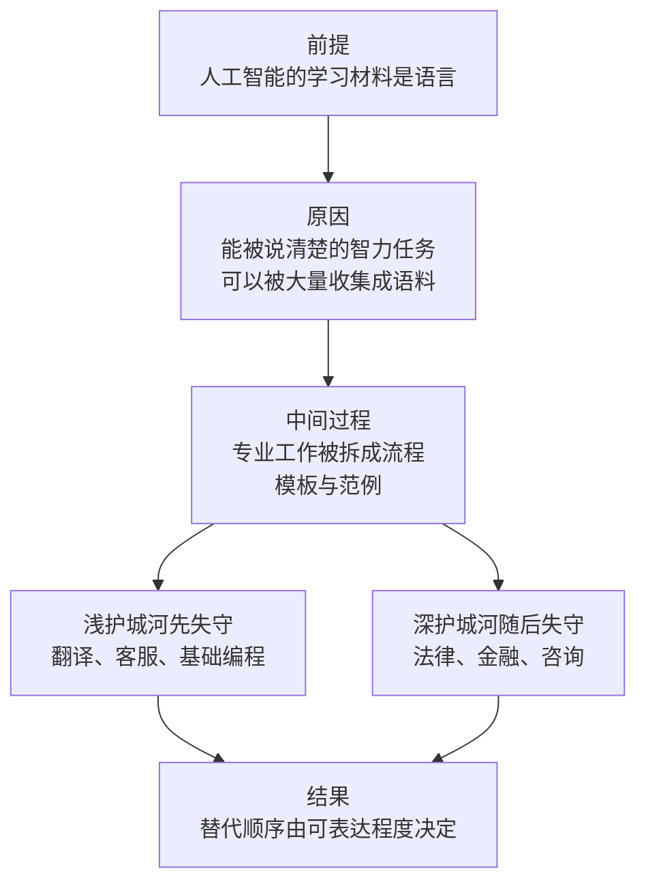

# 06｜AI 会先取代谁？为什么职业的护城河是分层的？

> 如果替代有先后顺序，那么这个顺序究竟由什么决定？

---

## 一、先说结论

张笑宇在《AI文明史·前史》里的判断是：AI 的替代不是一个「会不会」的问题，而是一个「谁先谁后」的问题。他把所有行业按护城河深浅排了一个队：浅护城河领域最先失守，翻译、客服、基础编程首当其冲；深护城河领域紧随其后，律师、金融分析师、咨询顾问并不安全。在他看来，决定这个顺序的，不是职业的体面程度，也不是薪资高低，而是「这份工作的核心智力，有多少能够被语言完整表达出来」。能被说清楚的部分越多，被替代得越早。

## 二、我们先理解一个问题

我们从小到大接受的一个默认判断是：工作越体面，越安全。

体力活容易被机器取代，脑力活不容易；流水线上的工人最先被自动化替代，坐在办公室里写字的人排在后面。所以父母才会说，好好读书，将来做律师、做医生、做金融，别去干那些「谁都能干」的活。

这个判断有一个前提：脑力劳动比体力劳动更复杂，更难被机器模仿。

可是现在问题来了。如果 AI 已经能写代码、能翻译、能写法律意见书的初稿，那么「脑力劳动更安全」这个前提，是不是已经站不住了？如果站不住，那替代的顺序又该按什么排？

## 三、作者到底提出了什么观点？

作者在书里用「浅护城河」和「深护城河」这两个概念，给行业分了层。

浅护城河领域是最容易失守的一类。作者把编程视为第一批即将被 AI 取代的领域之一，此外还有翻译、客服这类基础语言工作。这些工作的共同点是：任务边界清晰，输入输出明确，评判标准可以写成规则；而且它们本来就大量以文字形式存在——文档、代码、对话记录、工单，全都是现成的语料。

深护城河领域则是法律、金融、咨询这样的专业服务。它们看起来门槛很高：要读很多年书，要考很难的证，收费很贵。但作者在书中的判断相当不客气，他的大意是：如果未来五到十年里，听到大量律师、金融分析师或咨询公司研究员因为 AI 而失业，他一点儿也不会感到奇怪。

概括地说，作者描述的替代链条是这样的：AI 的能力沿着最薄弱的区域渗透，沿着最重复的岗位扩散，沿着最昂贵的劳动瓦解。也就是说，最先被吃掉的不一定是最不值钱的工作，反而常常是最贵的那部分工作——因为贵，所以替代它的动力最大。

## 四、把这个观点翻译成人话

用一句大白话讲：**AI 不是按「体面」排队的，它是按「能不能写下来」排队的。**

一份工作里，凡是能写成文字、写成流程、写成范例的部分，AI 都有机会学；凡是说不清、只能靠身体在场、靠手感、靠临场关系判断的部分，AI 暂时学不到。护城河不是社会地位挖出来的，而是「语言的边界」划出来的。

这就解释了一个反直觉的现象：为什么翻译和客服比水电工更早感受到压力。不是因为翻译不重要，而是因为翻译的输入和输出，本来就是两段文字；而修水管这件事，需要你带着一整套工具箱，站在那个具体的漏水点前面，伸手去拧一个可能已经锈死的阀门。

同样地，律师和咨询顾问之所以危险，恰恰因为他们的工作成果很大一部分是文本：合同、备忘录、分析报告、方案文件。当一个职业的核心产出是文字，它就天然把自己的智力暴露在了语言模型面前。

## 五、为什么会这样？

作者的推理链条可以这样拆开：

前提一：今天的 AI 本质上是语言模型，它的能力边界由「能被语言表达的知识」决定。
前提二：现代专业分工，恰恰是把复杂智力任务「语言化」的过程——流程、模板、判例、财务模型，都是把经验写成文字。
前提三：AI 的成本结构，使替代「昂贵劳动」的回报最高。

从「前提」到「原因」这一步是：因为 AI 拿到的不是某一个人的经验，而是整个人类写下来的文本，所以任何已经被语言化的能力，都会被它在极短时间里「读」一遍。

从「原因」到「中间过程」这一步是：现代职业分工本身就在做一件对 AI 极其有利的事——它把智力打包成了可复制的形式。律师写过的合同、分析师做过的模型、咨询顾问画过的框架，都是别人教给他们的，也都是他们可以教给别人的，因此也可以教给 AI。

从「中间过程」到「结果」这一步是：只要任务能被拆成输入、处理、输出三段，并且每一步都能用语言描述，AI 就可以逐段接手。于是替代的顺序就出现了：越容易表达的越早，越说不清的越晚——而职业的体面程度，在这个排序里几乎不起作用。

## 六、举一个现实生活中的例子

最能说明问题的是律所与咨询公司的小时收费。

这两类机构的商业模式，核心是把「专业时间」按小时卖出去。一个刚入行的律师，最典型的工作是查资料、找判例、写备忘录初稿；一个咨询顾问，最典型的工作是访谈、整理纪要、搭数据模型、把结论写成一页页幻灯片。这些事情占用了他们大量的时间，也构成了账单上的一行行数字。

这些工作有一个共同特点：它们是可以被清楚地描述出来的。什么算一份合格的备忘录，什么算一个规范的分析框架，行业里早就有模板。而 AI 最擅长的，恰恰是把这种「有模板的智力劳动」以极低的边际成本重复一万次。

于是矛盾就出现了。对客户来说，一份能达到同等质量初稿、成本却低得多的方案，为什么要按小时付费？对机构来说，如果不再按人头和小时收费，它的定价方式、晋升阶梯、甚至「合伙人」这套制度的根基，都要重新解释。真正被动摇的不是「律师」这个身份，而是「把专业时间按小时零售」这套商业模式。

而这一切之所以发生在最贵的行业，恰恰因为它最贵——替代它的收益最高，所以最先进的工具会最先被送到这里。

## 七、回到书中重新理解

现在我们再回头看作者在书中的那段论证，会明白他为什么强调「打包」这个词。

作者认为，复杂的智力任务本质上还是简单智力任务的多维组合。人类很擅长把一堆简单动作打包成一个整体，然后给这个整体起一个名字，比如「尽职调查」「市场分析」「方案设计」。名字听起来高深，但拆开看，每一步都不神秘。

过去，这种「打包」是人类的护城河：因为整体看起来复杂，别人就以为学不会。但 AI 的出现改变了这一点——它不需要理解「打包」的含义，它可以沿着每一个子任务分别学习，然后重新组装。作者在书中的判断是：只要一项能力能被语言表达，就迟早能被 AI 学会。

这也是为什么他给个人的建议非常务实：尽快适应 AI 时代的工作流。不管你想做超级个体，还是想在大公司里做 AI 从业者，会用 AI 完成工作、会设计让 AI 参与的工作流，都是必备技能。他没有把重点放在「守住某个职业」上，而是放在「换一套工作方式」上。

## 八、这个观点背后还有什么？

这个观点背后，至少有三层意思。

第一层，替代不是一次性的判决，而是一个持续移动的边界。今天安全的岗位，可能只是因为它所需要的表达能力还没有被 AI 掌握；一旦语料补齐、工具成熟，它会从深护城河变成浅护城河。

第二层，被替代的往往是「任务」，而不一定是「职业」。一个职业里通常混杂着很多任务，其中一部分先被接手，剩下的部分反而变得更重要。所以现实中的过程更像「同一个岗位的人变少了、剩下的活变了」，而不是整个职业某天集体消失。

第三层，这个排序对个人最有用的启示是：不要把自己绑在一个「可被完整描述」的技能上。可描述意味着可传递，可传递意味着可复制，可复制意味着可替代。

## 九、这个观点有问题吗？

这个判断有相当强的说服力，但有几个地方需要保持清醒。

先说说服力在哪。作者抓住了一个真实的技术事实：今天的主流 AI 是语言模型，它的知识来源是被写下来的东西。用「可表达程度」而不是「薪资高低」或「学历高低」来解释替代顺序，比大多数流行的说法都更贴近机制，也能解释为什么翻译、客服这类白领底层和律师、咨询这类白领顶层会同时感受到压力。

争议在哪？最大的争议是时间尺度。说「迟早能学会」和说「未来五到十年就会大量失业」，是两个强度完全不同的判断。专业服务里有大量环节涉及责任承担、执业资格、客户信任和监管要求，这些未必能靠能力提升自动跨过。一些学者认为，AI 更可能先改变这些行业的内部结构，比如减少初级岗位、改变收费方式，而不是直接造成大规模失业。

哪里过度简化了？把职业拆成「可表达」和「不可表达」两部分，是一个很有力的二分法，但现实中两者是交织的：同一个任务，交给客户时要写成文字，执行时却要靠大量现场判断。此外，书中对「打包」的讨论偏向认知维度，而对组织惯性、行业准入制度、法律责任这些非技术因素着墨较少。

还有哪些其他解释？一种常见观点是：决定替代速度的不是任务的可表达程度，而是错误的代价和责任的归属性——写错一句文案代价很小，开错一张处方代价极大，后者天然会更慢。另一种观点强调互补关系：AI 提高了某些环节的效率，反而扩大了对判断者和组织者的需求。关于这一问题，学界存在不同解释。

## 十、今天再看这个观点

以下部分是基于作者思想的现代延伸，不是作者原话。

从近两年的实际变化看，最先被改变的确实是文本密集、流程清晰的工作：翻译与客服岗位的收缩最为直接，基础编程工作中「照着需求写标准代码」的部分被大量接手，法律与咨询行业则出现了初级岗位需求下降、单个从业者产出提升同时发生的现象。

但同一时期也出现了作者未必完全预料到的另一面：AI 让「一个人完成过去一个团队的工作」变得可行，于是专业服务市场并没有简单萎缩，而是分裂——标准化的部分被压价，非标准化的部分反而更贵，因为那里需要判断、背书和对结果负责。

对普通人的实践含义大致有三条。第一，检查自己的工作里有多少是能被完整写下来的部分，那部分就是风险敞口。第二，把 AI 当作工作流的组件来重新设计工作，而不是当作一个更快的搜索引擎。第三，尽早在一个「需要你本人在场、由你承担判断责任」的位置上积累不可转让的信誉。

## 十一、这一篇真正应该记住什么？

1. 替代有顺序，顺序由「智力可被语言表达的程度」决定，而不是由职业的体面程度决定。
2. 浅护城河领域最先失守：翻译、客服、基础编程这类任务边界清晰、语料充足的工作。
3. 深护城河领域并不安全：法律、金融、咨询这类专业服务，作者认为同样在射程之内。
4. 复杂任务只是简单任务的多维组合，人类擅长「打包」，但只要能被语言表达，就迟早能被学会。
5. 对个人来说，比守住某个职业更重要的，是尽快适应 AI 时代的工作流。

## 十二、留一个问题

如果替代的顺序是由可表达程度决定的，那么一个自然的问题是：那些最难被表达、最依赖身体和情感的工作，是不是就真的安全了？

问题还有更尖锐的一面。人之所以需要某些服务，往往不是因为对方说得对，而是因为对方在那里、在意你、站在你这一边。这种需求能不能被 AI 满足？如果不能满足，人类的情感关系就会成为最后的堡垒；如果能满足，被重估的就不只是工作，而是我们最私密的那部分生活。

下一次，我们从一件已经发生的事情说起：越来越多人开始和 AI 聊天、倾诉、谈恋爱。当情绪价值可以被无限供给，人类的情感世界会发生什么？
