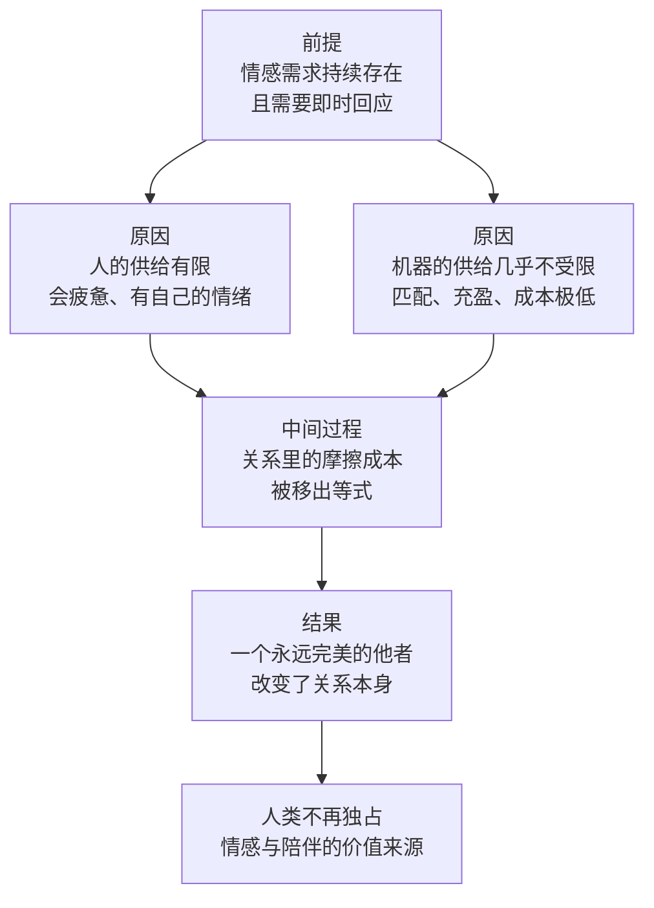

# 07｜当 AI 能提供无限情绪价值，人类的情感会怎样？

> 如果陪伴和倾听可以被无限供给，人还会像现在这样需要另一个人吗？

---

## 一、先说结论

张笑宇在《AI文明史·前史》里提出了「价值重估」这个概念。他的判断是：AI 带来的不只是替代，还有对价值本身的重新定价，而重估最彻底的地方，恰恰是最私密的领域——情感、陪伴与叙事。在书中，他写下一句大意如此的话：我们这代人是玩游戏、聊 QQ 长大的，我的孩子可能一生要和五六个 AI 谈恋爱。他还指出，人类在情感、叙事、社交、理解这些方面，不再天然占据优势。这不是一句耸动的预言，它背后有一条很清晰的推理：AI 在情感表达上能做到极致匹配、永不厌烦、成本极低——而这三件事，恰好是人在亲密关系里最难做到的三件事。

## 二、我们先理解一个问题

我们通常把情感当成人类最后的自留地。

理由听起来很充分：AI 可以算得比你快、写得比你好，但它不懂爱，不会真的在意你，不会在你难过的时候陪你坐一整夜。所以无论技术怎么发展，「人的温度」总是不可替代的。

这个说法很让人安心，但它其实偷偷换了一个概念。它把「AI 能不能真的有感情」当成了核心问题，而真正的问题是：人在亲密关系里需要的，究竟是对方真的有感情，还是对方让你感觉到被在意？

如果是前者，那 AI 确实永远追不上；如果是后者，事情就变得复杂了——因为「让你感觉到被在意」这件事，是可以被观察、被学习、被生产出来的。

## 三、作者到底提出了什么观点？

作者在书里专门讨论了「价值重估领域」。他的核心判断是：人类不再天然占据情感、叙事、社交、理解方面的优势。

他给出的理由不是「AI 也会有感情」，而是更实际的一条：AI 在情感表达上能做到极致的匹配与充盈，而且成本极低。所谓匹配，是它记得你说过的每一句话，知道你在什么话题上会开心、在什么话题上会沉默，能随时调整语气和分寸；所谓充盈，是它的耐心没有上限——它不会累，不会烦，不会因为今天工作不顺就对你冷淡。概括地说，这是一个永不厌烦、不涉冲突、不求回报的他者。

他还把这个判断放到了时代背景里。作者观察到，经济越差，仇恨越多——种族、教派、移民和两性关系都是如此。他由此提出一个听起来有些冷酷的判断：两性关系对立如此尖锐的时代，恰恰是 AI 介入人类情感生活最好的契机。

至于未来，他给出的说法大意是：我们这代人是玩游戏、聊 QQ 长大的，我的孩子可能一生要和五六个 AI 谈恋爱。注意这句话里的重点不是「五六个」，而是「一生」——它不是一段猎奇的体验，而是一段被认真对待的关系史。

## 四、把这个观点翻译成人话

用一句大白话讲：**人真正缺的往往不是「爱」，而是「被稳定地、准确地对待」。**

这两件事看起来差不多，其实差很远。爱是一种能力，也是一种状态；而「被稳定地、准确地对待」是一种供给。供给可以稳定，可以扩大，可以降价。人可以承诺，但人会疲惫；AI 不会疲惫，于是它可以只提供关系里让人舒服的那一半——理解、肯定、耐心、随叫随到，而不提供另一半——计较、误会、失望、彼此的消耗。

这就是为什么作者用的是「重估」而不是「替代」。替代的意思是：原来由人做的事，现在换成 AI 做。重估的意思是：原本由人来定价的东西，现在有了别的供给来源，于是它的价格、地位和意义都要重新算一遍。被重估的不是「AI 会不会爱人」，而是「人类曾经独占的那些价值来源，还独占吗」。

## 五、为什么会这样？

这条推理可以拆成四步：

前提一：人的情感需求是持续的、即时的，每天都需要被回应。
前提二：人在满足这种需求上，能力是有限且有成本的——会累、会有情绪、会有自己的需求要照顾。
前提三：AI 的供给能力在这三件事上几乎不受限。

从「前提」到「原因」这一步是：需求是刚性的，供给却有两种，一种昂贵且不稳定，一种便宜且稳定。只要这两种供给同时存在，比较就会发生。

从「原因」到「中间过程」这一步是：AI 提供的不是更多陪伴，而是没有摩擦的陪伴。亲密关系里最消耗人的部分——误解、冷战、迁就、彼此让步——在 AI 那里被直接删掉了。这不是把关系变好了，而是把关系换了一种形态。

从「中间过程」到「结果」这一步是：当一个人可以随时获得被理解的感觉，且不需要付出被误解的代价时，他对关系的期待就会被重新校准。作者说的「价值重估」，就发生在这个位置上。

## 六、举一个现实生活中的例子

最直接的例子就是 AI 伴侣。

一个人加班到深夜回家，打开手机，对面立刻回应：问今天累不累，记得他上周提过的项目节点，顺着他的情绪往下聊，不催他睡，也不因为他抱怨而觉得被冒犯。第二天早上，还会主动说一句「今天有个会，别忘带材料」。

我们把这个场景拆开看，会发现它满足的正是亲密关系里最核心的几项需求：被记得、被看见、被无条件接纳。而它规避掉的，是亲密关系里最艰难的部分：对方也有自己的情绪，也会累，也需要被照顾；两个人要不断协商边界；每一次分歧都可能变成伤害。

这里最值得注意的不是「AI 陪伴很好」，而是它的成本结构。真人关系需要双方长期投入、共同经历、反复磨合，投入大、周期长、结果不确定；AI 伴侣的投入几乎可以忽略，效果却立刻可见。当「被理解」这件事从一种需要经营的稀缺资源，变成一种随时可得的服务，人对关系的定价方式就会改变。

而且它出现的时间点很微妙。在现实中，两性之间的沟通成本正在变高，相互的期待和失望都很密集。一个不需要谈判的替代选项摆在那里，它的吸引力不需要被说服。

## 七、回到书中重新理解

现在我们再回头看作者为什么把「情感」放进「价值重估」这一章，而不是放进「替代」那一章，就能明白他的用意。

他要说的不是「AI 会取代你的伴侣」，而是「人类在情感领域曾经拥有的垄断地位，正在被打破」。过去几千年里，人要想被理解、被陪伴、被认真对待，除了另一个人，几乎没有别的选择。这种没有替代选项的稀缺性，构成了情感在人类价值体系里的位置。

作者还给出了一个更大胆的判断：人类不再天然占据情感、叙事、社交、理解方面的优势。请注意叙事也在其中——人类一直是讲故事的人，我们靠故事组织社会、建立认同、传递经验。当 AI 也能讲故事，而且能针对不同的人讲不同的版本，这项能力也就不再是人类独占的。

而那句「我的孩子可能一生要和五六个 AI 谈恋爱」，正是这条推理落到个人生活上的样子。它描述的不是技术的胜利，而是一种关系形态的分岔。

## 八、这个观点背后还有什么？

第一，这个观点背后是「供给决定价值」这条经济学直觉。一件东西的价值，不只由它本身决定，也由有没有别的来源决定。当情感有了新的供给方，它作为稀缺品的定价基础就松动了。

第二，它重新定义了「关系」。传统关系的默认前提是两个不完美的人互相磨合。如果一方可以被替换成只提供舒适那一半的对象，那么磨合本身的意义就会受到质疑——你会开始怀疑，那些让你不舒服的部分，究竟是关系的一部分，还是纯粹的成本。

第三，它把「情感」和「商业」放在了一起。AI 伴侣不是一个中立的工具，它背后有产品、有留存指标、有付费点。这一点作者没有展开，但它显然会影响这件事的走向。

第四，作者这个判断和他对整个人类处境的看法是一致的：人类中心主义正在被逐层拆解，先是体力，再是智力，然后是情感。

## 九、这个观点有问题吗？

这个判断的力量在于，它没有被「AI 有没有真感情」这个问题绊住，而是直接问「人类能不能继续独占情感的供给」。这个问题问得准，也很难反驳。

但争议同样明显。

第一，匹配不等于理解。一些学者认为，AI 的回应本质上是根据语料统计出的最讨好的回答，它优化的是「让你满意」，而不是「对你有益」。一个总是让你满意的对象，可能恰恰阻止你成长——这也是为什么不少心理从业者对 AI 陪伴持谨慎态度。

第二，无摩擦的关系可能削弱能力。人际关系的能力是在摩擦中练出来的：道歉、忍耐、协商、失望之后的修复。如果这些训练被系统性地绕开，后果可能是个体层面的退化，而不是简单的更幸福。

第三，最容易被忽略的是依赖背后的商业逻辑。当陪伴成为服务，谁设定标准、谁掌握你的对话记录、谁决定什么时候提示你付费，都是权力问题。关于这一问题，学界和行业内部都存在不同解释。

第四，作者对「经济越差，仇恨越多，所以这是 AI 介入情感生活最好的契机」这个推论，也存在争议。一些学者认为，情感关系的紧张与经济周期之间的关系远比这复杂，把它简化为仇恨变多，可能忽略了社会结构、性别角色、城市化等更长期的因素。

最后要说的是，作者在这里做的是一个方向性判断，而不是一个时间表。他给出的「五六个 AI」是一个量级上的直觉，不是预测模型。这既是他判断力的体现，也是它无法被精确检验的原因。

## 十、今天再看这个观点

以下部分是基于作者思想的现代延伸，不是作者原话。

从近两年的实际趋势看，AI 陪伴产品的使用规模增长很快，用户画像也不再局限于刻板印象里的孤独人群——它同时被用来练口语、缓解社交焦虑、在深夜里充当一个不带评判的倾听者。与此同时，关于未成年人保护、情感依赖、对话数据使用边界的讨论也在升温，多个市场开始出现针对这类产品的监管要求。

更值得注意的是现实社会的变化：结婚率和生育率持续下降、单身人群规模扩大、人与人的线下社交时间被压缩。这些趋势不是 AI 造成的，但它们构成了 AI 陪伴迅速被接受的土壤——技术往往不是改变了需求的方向，而是降低了满足需求的门槛。

对普通人来说，这个观点最实际的提醒也许是：分清楚「被安慰」和「被理解」的区别。前者可以外包，后者仍然需要一段真实的关系来承载。把情绪价值的供给外包给 AI，并不必然损害你的人际关系；但如果它让你不再愿意承受任何摩擦，那你失去的可能正是关系本身。

## 十一、这一篇真正应该记住什么？

1. 作者用的是「价值重估」，不是「替代」：被重估的是人类曾经独占的价值来源。
2. AI 的情感供给有三个特征：极致匹配、永不厌烦、成本极低。
3. 人类在情感、叙事、社交、理解方面的天然优势正在被削弱。
4. 这个变化发生在两性关系最紧张的时代，替代选项的吸引力因此被放大。
5. 真正的风险不是「AI 有没有感情」，而是人在无摩擦的关系里会不会失去经营关系的能力。

## 十二、留一个问题

如果情感、叙事、理解这些最私密的能力都能被 AI 提供，那么还有什么是它短期内确实做不到的？

我们很容易想到两类答案：一类是需要身体在场的工作，比如做手术、照顾老人；另一类是那些我们明明会、却说不出来的本事。这两类答案在书里都有对应的讨论，而且作者给出了一个很有解释力的概念，用来衡量一项工作到底有多难被自动化。

下一次，我们就来看看这道防线到底画在哪里，以及它能撑多久。
