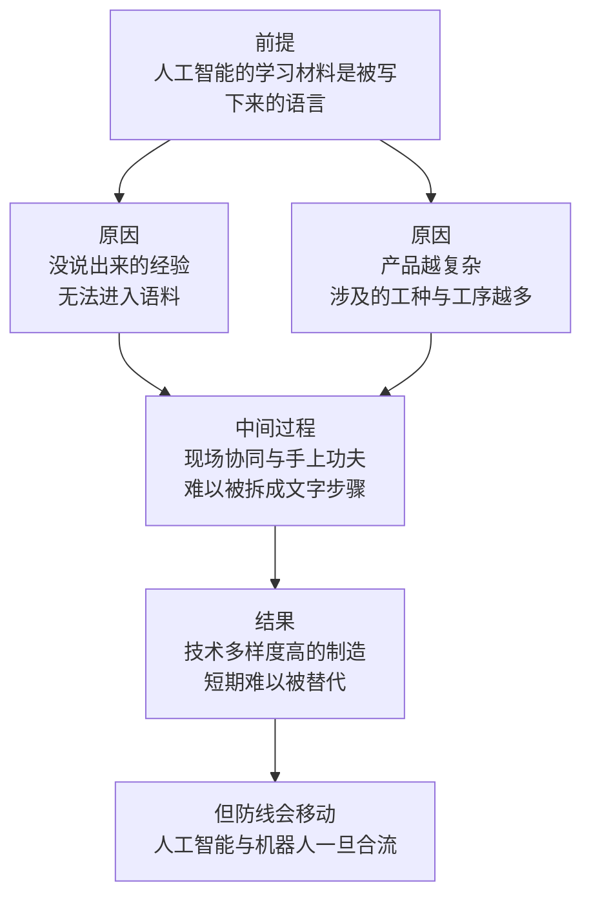

# 08｜什么是 AI 短期内不可替代的领域？

> 如果替代迟早会发生，那么「短期内不可替代」的边界究竟画在哪里？

---

## 一、先说结论

张笑宇在《AI文明史·前史》里并没有把话说成「AI 什么都能干」。他专门讨论了「不可替代的领域」，并给出了一个相对具体的判断：短期内难以被替代的，是技术多样性高的工作、依赖物理世界的手艺与默会知识、以及需要组织与协调的复杂劳动。其中他提出的「技术多样度」概念最有解释力——一件产品及其零部件需要依赖何种知识水平的技术工人，技术多样性越高，被 AI 替代制造的可能性就越低。基于这一点，他甚至判断：AI 本身不会在短期内改变中国「世界工厂」的地位。但作者的态度是清醒的：不可替代只是暂时的，不是永久的护城河。一旦 AI 与机器人合流，这道防线也会后移。

## 二、我们先理解一个问题

先问一个看起来矛盾的问题。

如果 AI 能写代码、能画图、能做数据分析，为什么它短期内还造不出一部手机？手机的设计、工艺、供应链管理，明明都是脑力活，为什么最先进的人工智能反而在这里被卡住了？

更奇怪的是，反过来看也成立：为什么最先感受到压力的，是坐在办公室里敲键盘的人，而不是在车间里动手的人？

这两个问题指向同一件事：替代的难易程度，可能并不取决于一项工作听起来有多高级，而取决于它和物理世界、和说不出来的经验、和多人协同之间的关系有多深。

## 三、作者到底提出了什么观点？

作者在书里提出的关键概念是「技术多样度」。他给出的定义大致是：生产某类产品及其零部件，需要依赖何种知识水平的技术工人。换句话说，一件东西越复杂，它牵扯到的工种、知识门类、工序环节就越多，而这些环节彼此之间还必须协同。技术多样性越高，产品被 AI 替代制造的可能性就越低。

顺着这个概念，作者给出了一个判断：AI 本身不会在短期内改变中国「世界工厂」的地位。原因不是中国的工厂不够智能，恰恰相反——制造一件现代工业品需要的能力太杂、太碎、太多现场配合，短期内没有哪种技术能整体接手。

第二个概念是「默会知识」。作者把它解释为：我们知道、却说不出来的知识。比如品位，比如待人接物的感觉，比如面对一件具体事情时的直觉。这些能力在人类智力中非常重要，但它们从来没有被完整地表达成语言。而今天的 AI 本质上仍然是语言模型——人没有说出来，AI 就拿不到语料。

第三，作者延续了「打包」的思路：复杂的智力任务本质上还是简单智力任务的多维组合，人类很善于把它打包。但打包并不意味着安全，因为打包后的任务依然可能被逐步拆解。

作者的整体态度可以概括为：这些领域短期内不可替代，但不可替代是暂时的，不是永久的护城河。

## 四、把这个观点翻译成人话

用一句大白话讲：**AI 现在学的是「写下来的东西」，而不是「做出来的东西」。**

所以它的短板出现在三个地方。第一个地方是手上：装配、焊接、调试、产线上那一千次微调，这些知识很大一部分在手指上，不在文字里。第二个地方是嘴上说不清的地方：什么样的方案算得体，什么话该在什么场合说，这种判断人们天天在用，却很难写成教材。第三个地方是人与人之间：一件复杂产品背后是几十上百家供应商、上千道工序的协同，这种协同能力存在于组织里，而不存在于任何一个人的大脑中。

反过来说，凡是已经变成文档、代码、报告、模板的知识，都已经是被写下来的东西，因此也就在 AI 的射程之内。

## 五、为什么会这样？

作者的推理链条可以这样展开：

前提一：今天的 AI 本质上是语言模型，它的学习材料是被表达出来的语言。
前提二：技术多样性高的产品，需要多种知识水平的工人与多道工序在现场协同。
前提三：默会知识和身体经验，很大一部分从未被完整表达。

从「前提」到「原因」这一步是：语言模型的能力边界，本质上就是已经被说出来的东西的边界。这不是因为它不够聪明，而是因为它的输入里就没有那些沉默的部分。

从「原因」到「中间过程」这一步是：在真实的制造现场，知识是分散在很多人身上的——老师傅的手感、质检员的经验、调度员的临场安排。要把它们全部写下来，先要有人知道它们是什么，而很多时候连当事人自己也说不清。

从「中间过程」到「结果」这一步是：AI 可以替代其中的文字环节，比如图纸、排产、报表、质检标准；但它难以替代那个需要几十个人同时在现场、用眼睛和手去确认的整体过程。于是这道防线就画在了「技术多样度」这条线上。

而最后一步也是最关键的一步：这道防线之所以成立，前提是 AI 的身体还不够好。一旦机器人的灵巧度、成本、稳定性跨过某个门槛，AI 就从屏幕里走进了车间，这条防线也会随之向后移动。

## 六、举一个现实生活中的例子

最好的例子是一部手机的供应链。

一部手机看起来只是一块玻璃和金属，但它的背后是一个极其庞大的协作网络：芯片、屏幕、摄像头模组、电池、结构件、声学器件、各种传感器，每一项都对应着不同的技术门类；每个零部件又涉及材料、模具、精密加工、测试、良率管理等一系列工序；而这些零部件最终要在一个高度协同的组装体系里，以极高的良率和极快的节奏被组合起来。

这套体系需要的不是一种知识，而是很多种知识：材料工程师懂配方，工艺工程师懂设备，模具师傅懂公差，产线管理者懂排产和人力，质检人员懂什么程度的瑕疵可以放行。这些人之间还要彼此配合——一个尺寸公差的调整，可能要牵动模具、产线、供应商三方重新对齐。这就是作者说的「技术多样度」：产品本身越复杂，依赖的知识门类越多，替代它就越难。

而这件事难的地方，恰恰在于它无法被集中写成一份文档。你可以把图纸和数据交给 AI，但你没法把「这批材料手感不太对」这种判断完整地交给它，因为它从未被说出口。

所以作者才会判断：AI 不会在短期内改变中国「世界工厂」的地位。这不是在说制造业永远不会被自动化，而是在说，制造一件现代工业品所需要的知识多样性，构成了短期内最难跨过的门槛。

## 七、回到书中重新理解

现在我们再回头看作者关于「打包」的那段论证，会发现他其实一直在给读者打预防针。

他的意思是：人类之所以觉得自己安全，是因为我们习惯把复杂任务看成一个整体。当有人问「AI 能不能替代工程师」，我们脑子里浮现的是整个工程师，而不是他一天里做的二十件具体的事。整体看起来很复杂，所以看起来安全。

但只要把它拆开，情况就变了。一份工作里那些能被清楚描述的子任务，会先被接手；剩下的部分看起来更难，可它也在被逐步逼近。作者并不认为不可替代是一个可以长期持有的资产，他更倾向于把它看成一个时间窗口。

同时也要注意他讨论默会知识时的分寸。他没有说默会知识永远学不会，而是说：今天的 AI 本质仍是语言模型，人没有说出来，AI 就拿不到语料。这句话里有两个限定——今天，以及说出来的。这两处限定，就是他留给未来的空间。

## 八、这个观点背后还有什么？

第一，这个观点把「智力」和「身体」重新接上了。真实的劳动从来不是纯头脑的：它总要落到某个东西上，被某双手完成。只要 AI 还没有一双手，世界上就存在一整类它无法进入的工作。

第二，它把「组织」当成一种能力。技术多样度高的工作难替代，不只是一道工序难，而是很多人必须同时在场、彼此配合。这种协同能力不在任何一个人的脑子里，也不在任何一份文档里——它是一种组织形态。

第三，作者反复强调「暂时」这两个字，其实是在提醒读者：护城河的位置是动态的。今天在物理世界里的工作之所以安全，是因为机器人的手还不够好、还不够便宜；这是一个工程问题，不是一个原理问题。

## 九、这个观点有问题吗？

这个判断的价值在于，它把一个被忽略的维度——技术多样性——放进了讨论。它解释了为什么最聪明的人做的工作不一定最安全，也解释了为什么制造业的自动化比很多人想象得慢。

但它的争议和模糊之处也很明显。

第一，「技术多样度」这个概念的度量并不清晰。什么算高？是涉及的知识门类数量，还是工序数量，还是供应商数量？如果这三个指标指向不同的结论，判断就会变得困难。一些学者认为，制造业岗位的自动化其实一直在稳步推进，只是它以单道工序自动化的方式发生，而不是以整个产品被替代的方式发生——用产品的复杂度来衡量替代难度，可能会低估已经发生的替代。

第二，用「中国世界工厂地位短期不变」来检验这个观点，把技术判断和产业判断混在了一起。产业地位还受成本、政策、物流、市场、贸易环境等许多因素影响，技术多样性只是其中之一。关于这一问题，学界存在不同解释。

第三，默会知识这个论据被用得很稳，但也有反例。历史上很多被认为只能靠经验的技能，后来都被拆解成了可传授的流程，比如焊接、检验、甚至部分外科操作。说不出来，有时只是暂时还没有人去做那件把它说出来的工作。

第四，这个观点倾向于把人的工作和 AI 的工作看成替代关系，而现实中更多是重新分工：人负责现场判断和异常处理，AI 负责标准环节。这样一来，不可替代的边界就不只由技术决定，也由成本比较和风险承担方式决定。

## 十、今天再看这个观点

以下部分是基于作者思想的现代延伸，不是作者原话。

近两年的变化，恰好给这个判断加了一条注脚。一边是语言模型继续在屏幕里扩张，把文档、代码、报表、客服对话这些已经写下来的工作大面积接手；另一边是机器人在物理世界里的推进明显加快——人形机器人开始进入试点产线，灵巧手、视觉抓取、多机协同这些方向的投入快速增加。两条线正在靠近，而作者所说的「合流」，正是指这种靠近。

同时，制造业本身也在变。企业正在把大量工艺经验数字化：老师傅的手感被传感器记录，质检判断被拆成可量化的指标，排产经验被写进调度系统。这个过程一方面提升了效率，另一方面也在无意中把默会知识一点点变成语料——它既是让工作变得更可替代的过程，也是让知识本身得以保存的过程。

对个人的启示大概是这样：如果你现在的工作依赖手上功夫、现场判断或组织协同，你有时间窗口，但没有豁免权。真正值得做的，是把那些说不出来的经验尽可能说出来、记下来——这既让你更难被绕过，也让你有机会成为那个把经验变成工具的人。

## 十一、这一篇真正应该记住什么？

1. 作者提出的「技术多样度」是衡量替代难度的一把尺子：产品越复杂、牵扯的知识门类越多，越难被整体替代。
2. 默会知识，也就是我们知道却说不出来的知识，是当前 AI 的主要盲区，因为它没有进入语料。
3. 依赖物理世界的手艺和需要组织协调的复杂劳动，短期内相对安全。
4. 不可替代是暂时的，不是永久的护城河；AI 与机器人一旦合流，防线会整体后移。
5. 判断风险的正确问法不是职业体面不体面，而是多少知识说不出来、多少环节需要人在现场。

## 十二、留一个问题

如果连说不出来的知识也只是暂时安全，那么留给人的真正优势，就只剩下更抽象的东西：能不能提出一个好问题，能不能在信息过载时做出判断，能不能把一群人组织起来。

这恰好把问题推到了教育身上。过去我们相信，读书是为了获得知识，学历是知识的凭证；可现在知识几乎免费，学历却越来越贵。当知识的定价崩了，教育还在卖什么？我们又该学什么？

下一次，我们从一件很多人正在经历的事说起：读硕士，还是直接去「干中学」。
