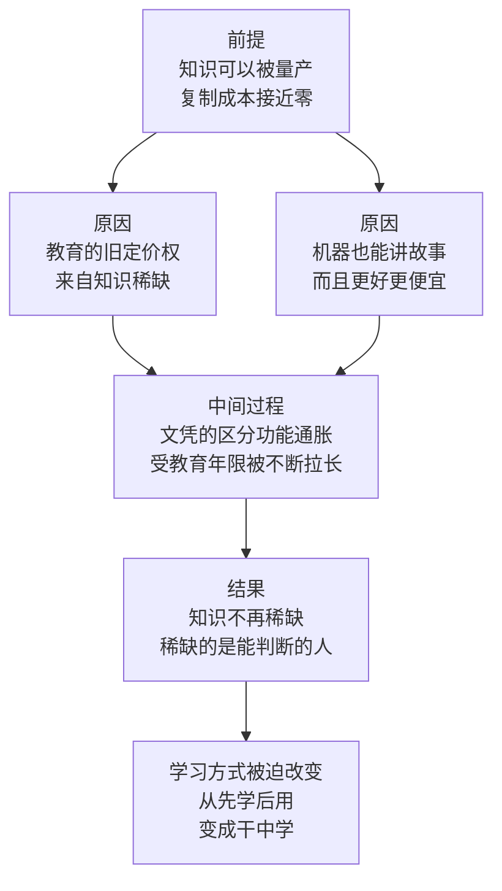

# 09｜知识越来越便宜，为什么真正的“思想者”反而稀缺？

> 当知识几乎免费、学历越来越贵，人到底应该学什么？

---

## 一、先说结论

张笑宇在《AI文明史·前史》里用「匮乏的思想者」作为一节标题，把问题摆得很直接：智能量产的时代，教育怎么办。他的判断是：传统教育最大的成功之处，在于它能集中地向社会中的大多数人讲述最被认可的故事——学习是好的、付出是有回报的、我们同属于一个国家、货币是一种一般等价物。这套故事曾经非常有效，也支撑了整个现代教育体系。但在今天，传统教育代表主流群体讲故事的能力，相对于新技术完全不够用。因此他主张：数字时代真正的学习方式，必须是紧跟潮流的「干中学」，学习要重新变成解决真实问题的过程。知识不再稀缺，稀缺的是能提出问题、做出判断、组织协作的思想者。

## 二、我们先理解一个问题

先看一个很多人正在面对的选择。

本科毕业，是去读个硕士，还是直接工作？父母多半会说：读吧，学历高一点总没坏处。可是算一下账：两三年的学费和时间，加上推迟进入职场的收入，换来一纸文凭——而这纸文凭在就业市场上的溢价，正在变得越来越薄。同样的岗位，五年前招本科生，现在要求硕士，而薪资并没有涨。

于是问题出现了：如果读书的主要回报是文凭，而文凭在贬值，那这些年到底买到了什么？

再往下问一层。当知识可以随时从 AI 那里免费取用，甚至比老师讲得更清楚、更有耐心时，知识改变命运这句话还成立吗？如果不成立，教育应该卖什么？

## 三、作者到底提出了什么观点？

作者对教育的判断相当锋利。他的大意是：如果我们以为学习是为了文凭，或者为了思辨的快乐，或者为了人际交往，那就背离了学习的本质。他主张，数字时代真正的学习方式必须是紧跟潮流的「干中学」——边做边学，在解决真实问题的过程中获得能力，而不是先囤积知识、再等未来某天用上。

他随后解释了传统教育为什么曾经那么成功。在他看来，传统教育最大的成功之处，是它集中地向社会中的大多数人讲述最被认可的故事。这些故事包括：学习是好的；付出是有回报的；我们同属于一个国家；货币是一种一般等价物。请注意这些例子的性质——它们不只是知识，更是让人愿意协作、愿意投入、愿意接受某种秩序的共识。教育是这套共识最主要的传播渠道，所以它才获得了那么高的社会地位。

但在今天，作者认为，传统教育代表主流群体讲故事的能力，相对于新技术完全不够用。当 AI 也能讲故事，而且能针对不同的人讲不同的版本、讲得更好、更便宜、更及时，教育过去在叙事供给上的垄断就被打破了。

他也提到一个很具体的趋势：过去读个中专或大专就能进厂打工、养活家人，现在要读到硕士、博士。受教育的年限被不断拉长，而拉长的部分，并没有对应到能力的同步增长。关于人文学者和一部分社科学者的处境，作者也给出了一个判断：他们的价值要被重估，角色会被淘汰。这个判断是作为趋势判断给出的，需要放在他整体的「价值重估」框架里理解。

而所谓「思想者稀缺」，指的是另一件事：知识或者说信息本身不再稀缺，稀缺的是能提出问题、做出判断、组织协作的人。

## 四、把这个观点翻译成人话

用一句大白话讲：**过去教育的核心竞争力是「我知道」，现在它的核心竞争力必须变成「我能做什么」。**

过去的知识是稀缺的：一套教材、一位老师、一座图书馆，就是全部的信息来源，教育的商业模式因此非常简单——把稀缺的知识打包成课程，按年收费，最后发一张凭证。

但今天知识不稀缺了。任何一个问题，问 AI 都能在几秒钟内得到一个像样的答案。当供给变得无限，稀缺的就不再是答案，而是问题——知道该问什么，知道哪个答案值得信，知道拿到答案之后该怎么办。这三件事，恰好都是传统课堂最不擅长教的，因为它们没有标准答案，也没有办法用一张试卷来打分。

所以作者才会说，学习要回到「干中学」。因为只有在真实的问题里，你才会被迫做判断；只有在判断出错、承担后果之后，你才会真正知道哪个答案是对的。

## 五、为什么会这样？

这条推理可以拆成四步：

前提一：AI 把知识的复制成本压到接近于零。
前提二：传统教育的定价权建立在知识稀缺和故事垄断之上。
前提三：当这两样都被削弱，教育的旧功能就失效了。

从「前提」到「原因」这一步是：教育卖的是稀缺性。它之所以能收那么高的费用、能决定一个人的职业起点，是因为除了它，普通人拿不到知识，也拿不到进入主流社会的通行证。

从「原因」到「中间过程」这一步是：当稀缺性消失，教育就只能靠凭证来维持价值——学历成为筛选工具，于是所有人都去追更高的学历。结果是文凭通胀：要求不断抬高，而对应的能力没有同步增长，读的时间越来越长，回报却越来越薄。

从「中间过程」到「结果」这一步是：市场最终会重新寻找能证明能力的东西。当学历不再是可靠的信号，人们就会转向作品、项目、可验证的产出。这时候，能提出问题、能组织资源、能把事情做成的人，就变得稀缺——不是因为他们掌握的知识更多，而是因为他们能处理那些没有标准答案的处境。学习方式也随之改变：不是先学四年、再去解决真实问题，而是从一个真实问题出发，缺什么补什么。这就是「干中学」。

## 六、举一个现实生活中的例子

最能说明这个问题的是文凭通胀。

四十年前，一个中专或大专文凭就足够进厂、拿到体面的工资、养活一家人；二十年前，本科是很多好工作的门槛；现在，同样的岗位开始要求硕士，甚至开始要求名校硕士。学历的要求一级一级往上抬，而岗位做的事情，并没有变得那么不同。

这就是文凭通胀的机制：当所有人都持有更高的学历，学历就不再能区分人，于是筛选标准被迫继续抬高。对个人来说，理性选择是继续读；对所有人来说，这个选择的总和就是所有人都多读几年，谁也没有变得更突出，只是把入场时间整体往后推了两三年。

把两种路径放在一起对比就很清楚。读硕士的主要收益是信号和缓冲期：一张更硬的凭证，加上两三年延迟进入市场的机会，但边际收益正在下降，因为凭证在通胀，课堂里教的内容又常常落后于行业。「干中学」的主要收益是复利：你从第一天起就在真实的问题里积累判断力，两年后手里有可验证的成果、有对行业的真实理解、有一批合作过的人。它没有凭证，前期更难被认可，但收益不会因为别人也去读而贬值。

真正的问题不是读不读，而是为什么读。如果读研是为了逃避一个暂时不想面对的选择，那么两三年后你要面对的还是同一个选择，只是更贵了。

## 七、回到书中重新理解

现在我们再回头看作者那个「匮乏的思想者」的标题，就会明白它到底在说什么。

他说的不是没有聪明人了，而是思想者这种角色变得稀缺了。在一个知识随手可得的世界里，人们更容易变成信息的接收者和整理者——问一句、答一句、复制粘贴。这种能力曾经很值钱，现在几乎不值钱。而真正稀缺的，是那个能站在一堆材料面前说「我们要解决的是另一个问题」的人。

## 八、这个观点背后还有什么？

第一，这个观点背后是一个更根本的判断：知识本身不是能力。知识可以被存储、被检索、被复制，但判断力不行——判断力只能在使用中被训练出来。这也解释了为什么学了很多道理仍然过不好这一生：道理是知识，过好这一生是判断。

第二，「干中学」其实对个人提出了更高的要求。在课堂里，你只要跟着大纲走；在真实问题里，你要自己决定学什么、学到什么程度、什么时候停。这需要主动性和方向感，而这两样恰恰是传统教育最不训练的能力。

第三，作者把叙事看成一种基础设施。学习是好的、付出是有回报的、货币是一般等价物——这些共识支撑着社会的运转。谁掌握讲故事的能力，谁就掌握塑造共识的能力。教育让出了这个位置，AI 和平台就会接手。

## 九、这个观点有问题吗？

这个判断的力量在于，它抓住了一个真实现象：知识的价格正在下跌，而学历的价格正在上涨。这两条线交叉的地方，就是今天很多人感到困惑的地方——读得越来越多，回报却越来越薄。

但有几个地方需要谨慎。

第一，学历仍然有信号价值。经济学上有一个常见解释：教育的一部分作用本来就不是传授知识，而是筛选——它证明你能坚持、能通过考核、能在规定时间内完成任务。一些学者认为，文凭通胀更可能是筛选标准水涨船高，而不是教育彻底失效。

第二，系统教育有不可替代的部分，作者的论述对这部分着墨较少。四年大学提供的不只是课程：它提供一个可以安全试错的环境、一群水平相当的同伴、一段系统训练思维方式的时间。这些很难靠「干中学」补回来，因为一旦进入职场，试错成本会高得多。

第三，「干中学」这件事本身是有门槛的。它需要有人给你真实的问题、需要有人在你犯错时兜住后果、需要你有一定的安全垫。对于一个必须马上赚钱养家的人，这条路的可行性远低于一个家境宽裕的人。

第四，关于人文学者和一部分社科学者的价值要被重估这个判断，需要格外小心。它在描述一种市场趋势，而不是在评价这些学科的意义。一些学者认为，AI 时代恰恰更需要人文训练——因为在信息过载的环境里，判断什么值得关注、什么值得相信，本身就是人文教育的核心内容。

第五，AI 时代的教育实验还在早期，目前还没有任何一套可以被大规模复制的方案。作者给出的是方向，不是答案。

## 十、今天再看这个观点

以下部分是基于作者思想的现代延伸，不是作者原话。

近两年可以看到几种正在同时发生的变化。一种是证书的重新定价：越来越多企业开始用作品集、项目经历、实操测试来替代学历作为筛选依据，部分岗位甚至公开取消学历门槛。另一种是短周期、面向具体技能的微认证的兴起，开始和学位竞争。第三种变化发生在学习本身——人们越来越多地是在做一件事的过程中，顺手把需要的知识学掉，而不是先系统地学完再动手。也有反向的迹象：在就业市场不确定性上升的时期，学历的避风港属性反而会增强。

对个人的实践含义大致有三条。第一，把学习的目标从掌握一门知识改成解决一类问题。第二，无论读不读书，都要尽早积累可以被外部检验的产出。第三，刻意训练提出问题的能力。

## 十一、这一篇真正应该记住什么？

1. 传统教育的成功，在于它能集中地向大多数人讲述最被认可的故事；当 AI 也能讲故事、且讲得更好，这套功能就失效了。
2. 数字时代真正的学习方式，作者认为是紧跟潮流的「干中学」——在解决真实问题的过程中获得能力。
3. 如果以为学习只是为了文凭、思辨的快乐或人际交往，就背离了学习的本质。
4. 受教育的年限被不断拉长，而知识的价格在下跌，这是同一件事的两面。
5. 知识不再稀缺，稀缺的是能提出问题、做出判断、组织协作的思想者。

## 十二、留一个问题

教育给出的答案是成为思想者。可是思想者要行动，就需要资源、需要工具、需要别人配合——而在一个 AI 可以量产代码与服务的世界里，谁掌握这些工具，谁就掌握了让别人配合的能力。

这就把问题从个人层面推到了组织层面。当一个人加上 AI 就能做出过去一家公司才能做的事，平台为什么反而会变得更强？为什么服务一切的能力，最后会变成掌控一切的权力？

下一次，我们来看这个新的权力结构：超级平台与超级个体，究竟是谁在利用谁。
