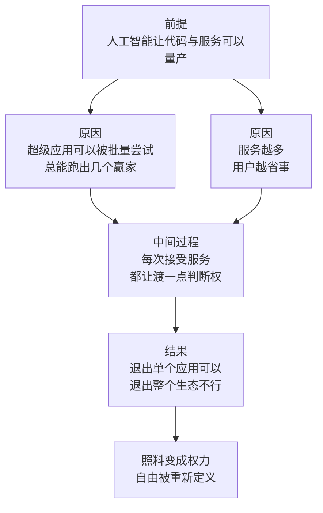

# 10｜超级平台：为什么“服务一切的人”同时也掌控一切？

> 如果平台包办了你生活中的一切服务，你到底是它的用户，还是它的客人？

---

## 一、先说结论

张笑宇在《AI文明史·前史》里用「超级平台」作为一节标题，讨论的是 AI 时代权力结构的变化。他的判断是：AI 会同时放大两种力量——超级平台与超级个体，而且这两种力量会互相加强。他在书中写道：权力本质上不是来自支配，而是来自照料。他也写道：自由从根本上来自选择权，而服务一切的人同时也掌控一切，享受服务的你我，没有选择权。还有一句更彻底的：凡是数学和物理规律允许发生的事，在我们这个宇宙中就一定会发生。把这三句话放在一起，作者想说的是一件不太舒服的事：平台不需要强迫你，它只需要把所有事都替你做好；而当你可以退出一个 App、却无法退出整个生态时，自由就已经被重新定义了。

## 二、我们先理解一个问题

先做一个思想实验。

假设有一个 App，它知道你几点起床，帮你安排通勤，替你订餐、订票、选礼物，帮你处理报销、续费、缴费，帮你筛选信息，帮你在需要的时候找到合适的人。它几乎从不出错，而且免费。

现在问一个问题：你会卸载它吗？

大多数人不会。因为它确实让生活变好了。可是再问第二个问题：如果你要卸载它，你要付出什么代价？你要重新记起十几个密码，重新建立一套自己的安排方式，重新面对那些它替你处理掉的琐事。更现实的是，你身边的人都在用它——你的同事、你的客户、你孩子的学校。

于是第一个问题变得不那么重要了。真正的约束不在「我要不要用它」，而在「我能不能不用它」。

## 三、作者到底提出了什么观点？

作者认为，AI 会创造出超级平台与超级个体互相放大的结构。这个结构有两个方向。

一个方向是超级平台。作者对超级 App 的看法相当平实：所谓超级 App，无非是在正确的时间、正确的地点流行起来的由一堆代码组成的产品。顺着这个逻辑，他给出一个推论——如果你能量产代码，理论上就能量产 App，其中肯定有一批可以成为超级 App。这句话的分量在于量产两个字：过去做一个超级 App 靠的是运气和时机，现在它可以被批量尝试。

另一个方向是超级个体。作者认为，当超级平台与算法治理大行其道时，有勇气跳出藩篱、知道如何用 AI 实现自己想法的那 5% 的人，才能成为自己的主人。他提到的另一类 5% 的人，是能塑造共识、驾驭流量的人。

而这本书里被引用最多的两句判断，恰好解释了平台权力为什么这么难对付。

第一句是：权力本质上不是来自支配，而是来自照料。传统的权力靠强制：你不服从，我惩罚你。平台的权力靠照料：我替你安排好一切，你离不开我。前者让人反抗，后者让人依赖。

第二句是：自由从根本上来自选择权，而服务一切的人同时也掌控一切，享受服务的你我，没有选择权。

作者还把这件事放到了一个更冷酷的尺度上：凡是数学和物理规律允许发生的事，在我们这个宇宙中就一定会发生。这句话不是在谈道德，而是在谈必然性——如果一件事在物理上、数学上可行，只要有人有动机去做，它迟早会发生。

## 四、把这个观点翻译成人话

用一句大白话讲：**能替你做所有决定的人，就是那个真正做决定的人。**

我们习惯把权力想象成一种粗暴的东西：命令、禁止、惩罚。所以当我们看到平台对我们百般讨好、不断优化体验、送券送补贴时，我们会觉得它是仆人，不是主人。

但把关系翻转过来看：一个人如果替你安排了吃穿住行、替你筛选了信息、替你决定什么值得看、什么值得买、什么值得关注，那么他事实上掌握了你的生活结构。你每一次接受它的推荐，都是一次自愿的授权。区别只在于，这种授权是一次一点、不知不觉完成的，而不是一次签下的契约。

这就是照料和支配的差别。支配需要你意识到自己在被支配，因此会引发反抗；照料不需要你意识到任何事，你只会觉得生活变方便了。这就是为什么作者说，权力本质上不是来自支配，而是来自照料。

而「自由来自选择权」这句话，正好把问题落到了实处。你当然可以退出这个 App，但你能退出整个生态吗？你的工作、社交、支付、出行、孩子的学校、客户的沟通方式，全都建立在这套生态之上。当退出的成本高到你无法承受时，「你可以选择」这句话就失去了意义。

## 五、为什么会这样？

这条推理可以这样拆开：

前提一：AI 让代码和服务可以被量产，于是做出一款超级 App 从偶然变成可重复。
前提二：一个入口包办的服务越多，用户迁移到别处的成本就越高。
前提三：每一次接受服务，都是一次把判断权交出去的动作。

从「前提」到「原因」这一步是：量产带来的是概率上的必然。如果做一款 App 的成本足够低、尝试的次数足够多，那么出现超级 App 几乎是必然的——这就是作者说的，凡是规律允许的就会发生。

从「原因」到「中间过程」这一步是：服务是逐项接入的。每接入一项，你都获得一点便利，同时交出去一点判断权。单项看都很划算，累积起来却是结构的转移。

从「中间过程」到「结果」这一步是：当一个人生活中的大多数环节都依赖同一个入口，退出就不再是一个可选项。你可以卸载一个 App，但你无法卸载自己的生活方式。这时候，平台的权力就不再需要靠强制来维持——它靠的是你的日常。

## 六、举一个现实生活中的例子

最能说明问题的是「退得出 App，退不出生态」这种处境。

今天很多人的生活是围绕一两个超级应用组织起来的：用同一个账号聊天、付款、打车、订票、买东西、看视频、交水电费，甚至管理孩子的作业。这些功能单独拿出来，每一项都只是方便的工具；但把它们放在一起，它就不再是工具，而是生活的基础设施。

于是出现了一种新的困境。假设你对某个平台的做法不满，想换一个。你可以装一个新 App，但接下来要面对的是：你的联系人不在那边，你的支付记录不在那边，你常用的服务在那边根本没有，你身边的人也不想为了你换。你并没有被禁止离开，你只是离开了就活不下去。

更微妙的是，很多人甚至不会产生离开这个念头。因为平台确实在照料他：提醒他该缴费了，帮他找到更便宜的车，在他犹豫的时候给出一个看起来最优的选择。照料让人满意，满意让人不设防。

这里最值得注意的不是某一家公司的规模，而是照料和权力之间的关系。一个能安排你生活的系统，即使从不强迫你，它也已经在你生活的关键节点上拥有了决定权：决定什么被看见、什么被推荐、什么被优先、什么被忽略。

## 七、回到书中重新理解

现在我们再回头看作者那句「凡是数学和物理规律允许发生的事，在我们这个宇宙中就一定会发生」，就能理解他为什么把超级平台放在「算法治理」这一部分的最前面。

他要说的不是某家公司很坏，而是这件事的结构决定了它会这样发生。当技术允许、资本有动机、用户又乐意接受时，平台的扩张不需要任何额外的推动力——它自己就会发生。

而他给出的另一个方向是超级个体。这个判断和超级平台并不矛盾，反而是一体两面。同一个技术，既可以用来让平台把服务做到极致，也可以用来让一个人独立完成过去需要一个团队才能完成的事。作者认为，真正的分水岭不在于你有没有用 AI，而在于你是否知道如何用 AI 实现自己的想法。

他提到的那 5% 的人，一类是有勇气跳出藩篱、知道如何用 AI 实现自己想法的人；另一类是能塑造共识、驾驭流量的人。这两类人的共同点是：他们不是服务的接收端，而是服务的定义者。

## 八、这个观点背后还有什么？

第一，这个观点重新定义了自由这个概念。过去我们理解自由，是不被禁止；作者提醒我们，自由更实际的形态是有别的选择。一个包办一切、让人无法离开的系统，可以同时做到从不禁止你和你无处可去。

第二，它把方便和权力连在了一起。方便不是中性的，它总会带来依赖，而依赖总会带来权力。

第三，它解释了为什么平台垄断那么难被传统反垄断工具处理。传统垄断的伤害表现为涨价或减少供给，用户可以直接感受到；而平台的伤害表现为一切都更方便了——它让你更满意，同时更依赖。用价格工具去衡量这种权力，往往会得出没有伤害的结论。

## 九、这个观点有问题吗？

这个判断最有力的地方，是它用一个词替换了我们熟悉的那一个：把垄断换成照料。垄断听起来是压迫，照料听起来是关心。当一件权力行为可以被体验为服务时，反抗的动机就消失了。这个视角比大公司很坏这类批评要有力得多。

但争议也不少。

第一，照料确实带来了真实的福利。很多过去需要跑腿、托关系、花大价钱才能办的事，现在几分钟就能完成。把这些便利一概说成权力的扩张，可能会低估它对社会效率的贡献。一些学者认为，平台权力的关键问题不在于照料，而在于可竞争性——如果用户能低成本地在平台之间迁移、数据能携带、接口能互操作，那么照料就只是一种商业模式，而不是一种统治。

第二，用「数学和物理规律允许就一定会发生」来解释平台扩张，带有较强的技术必然论色彩。现实中，平台的边界受法律、监管、竞争格局、用户偏好和文化差异的深刻影响，不同市场里的结果差别很大。关于这一问题，学界存在不同解释。

第三，作者对超级个体的判断，可能低估了结构性的不对称。超级个体可以在平台上做出很好的成绩，但规则、流量分配和收益分成仍然由平台设定；跳出藩篱的前提，往往是你先得在藩篱里活得足够好。

第四，作品里对退出这件事的讨论相对乐观。理论上始终存在退出选项，但退出的成本对不同群体差异极大：一个拥有多种资源和技能的人，退出是选项；一个把全部社交和工作都放在同一个生态里的人，退出接近于自毁。

## 十、今天再看这个观点

以下部分是基于作者思想的现代延伸，不是作者原话。

近两年，几件事让这个判断显得更有先见。一是 AI 助手正在从工具变成入口：当你开始让助手替你安排日程、筛选邮件、下单、比较方案时，它就站到了过去由你自己站的位置上。二是围绕互操作、数据携带、应用商店规则、默认服务设置的政策讨论明显增多——这些讨论的核心，恰恰就是作者所说的选择权。

对个人来说，这个观点最实用的部分是一个自查清单：你生活中有多少件事是只能通过一个入口完成的？你的通讯录、照片、工作记录、支付关系，有多少是可以带走的？如果明天你要换一套服务，你要付出多少代价？这些问题值得定期问一遍，因为照料和支配的分界线，就藏在这些问题的答案里。

## 十一、这一篇真正应该记住什么？

1. AI 会同时放大两种力量：超级平台与超级个体，它们是同一个技术的一体两面。
2. 作者的核心判断是：权力本质上不是来自支配，而是来自照料。
3. 自由从根本上来自选择权；服务一切的人同时也掌控一切，享受服务的你我，没有选择权。
4. 平台垄断的机制不是强制，而是让人顺从地优化自己、麻醉自己、娱乐自己。
5. 出路在个人这一侧：要么用 AI 放大自己的想法，要么参与塑造共识——前提是先意识到，默认接受照料本身就是一种选择。

## 十二、留一个问题

到这里为止，平台还只是一个提供服务的系统。但它手里有一样东西，是过去任何组织都没有过的：它能持续观察每个人的行为，并据此调整对每个人的安排。

这意味着治理方式本身变了。过去的管理靠命令和考核，你能看见管你的人，也能抱怨他、反抗他、绕过他；而算法不命令你，它只是给你看一个数字、一个排名、一句「你还有 3 分钟」的提示，然后你自己就开始加速。

为什么这种治理比传统的管理更难以反抗？下一次，我们从一群每天在路上跑的人说起。
