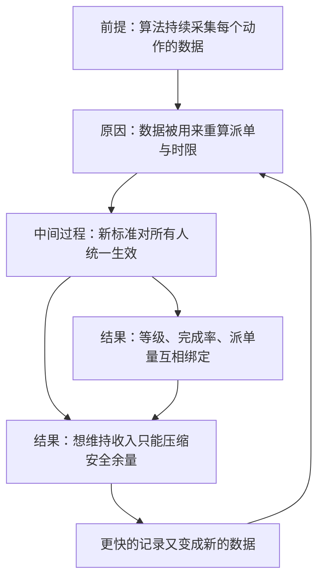

# 11｜算法治理为什么让人“自愿”内卷？

> 为什么今天的压迫不需要一个拿着鞭子的监工，只需要你主动配合？

---

## 一、先说结论

张笑宇在《AI文明史·前史》里的判断很干脆：算法治理与传统管理最根本的区别，在于它的自愿性。一百多年前的工人知道压迫自己的是谁、斗争应该针对谁；今天被算法支配的人，第一步是「自我同意」，第二步是「自我优化」——他自己给自己提高效率，而这些效率反过来成了压榨自己的新标准。压迫不再需要强迫，只需要你配合。

作者还补了一句更冷的话：算法治理是智能的，却是非人化的。

## 二、我们先理解一个问题

先看一个很普通的场景。

午高峰，一个骑手接到三个单子，导航显示每单需要十五分钟。他想省三分钟，于是在一段路上逆行了。当天他跑得比平时多，收入也多一点。

一周以后，同一段路，同样的单子，导航显示的时间变成了十二分钟。

是谁改的？没有人给他打电话，没有监工站在路口，也没有人开会讨论过。改变发生在系统内部，而原因正是他自己跑得更快了。

这就引出了问题：一百年前的工人很清楚自己的对手在哪里，而今天的骑手面对的是一串不断自我更新的数字。当压迫没有一个可以指认的执行者时，反抗该对着谁？

## 三、作者到底提出了什么观点？

张笑宇的观点是：算法治理的核心特征是「自愿性」。

在书中写道，算法法规训劳动者「自我同意」，也规训劳动者「自我优化」。他把这一代劳动者和一百多年前的工人做了对比：一百多年前的工人知道压迫自己的是谁，知道斗争应该针对谁，然而今天的算法治理的特征是自愿性。

关于后果，书中有一句很扎心的原话：骑手自己给自己提升的效率，反过来倒成了压榨自己的工具。

作者还把这件事放到更大的框架里：算法治理是智能的，却是非人化的，正在创造（过渡）劳动者的非人化。所谓「过渡」，指的是这些人处在一个中间状态——既没有被完全替代，也不再享有传统雇佣关系的保障，而正是这种状态，让他们格外容易被算法安排。

作者还提到一个前提：像开滴滴这样的「无差别服务业就业」并不具备不可替代性，正因为如此，它才可以被推荐算法分配。可替代，才可计算；可计算，才可以被自动安排。

## 四、把这个观点翻译成人话

用一句大白话说：**过去的规则写在墙上，现在的规则写在你的表现里。**

工厂时代的规矩是静态的：一天做多少件、几点上下班，白纸黑字写在那里，要改它得开会、得谈判、得有人站出来反对。算法的规矩是动态的：它不预先规定你必须做多少，它记录你能做多少，然后把这个数字当成新的下限。你越快，标准越高；标准越高，你越不敢慢下来。

这就是「自愿」两个字的真正含义。没有人逼你接这一单，系统只是把单子摆在那里，然后提醒你：完成率在下降，等级在往下掉。于是你「选择」了多跑几单，你「选择」了不休息。

选择的自由还在，但选项已经被设计过了。

## 五、为什么会这样？

作者的推理链条是这样的：前提是算法持续采集每一个劳动者的动作数据；原因是这些数据会被用来重新计算派单、时限和分配标准；中间过程是新的标准对所有人统一生效，并且不断被刷新；结果是劳动者必须用更危险、更疲劳的方式，才能维持原来的收入。

关键在于第三步到第四步：标准一旦被刷新，就变成了所有人的共同起点。原来跑得快是在「赚」多余的时间，现在跑得快只是「不超时」。这不是一次性的压榨，而是一个不断收紧的螺旋——每一次收紧，都是劳动者自己提供的理由。

书评里对书中的这个循环有一个很形象的概括：你逆行省了三分钟，算法就把这一段路的正常耗时认定为十二分钟；最后的结果是，你不得不逆行，而且挣得并不比原来多。

## 六、举一个现实生活中的例子

把骑手的那一周看得再细一点。

第一天，他跑十五分钟的单子用了十二分钟，多出的三分钟让他多接了一单。第三天，他习惯了逆行，也习惯了不看后视镜。第七天，同样的路线，系统给出的时限变成了十二分钟——他必须继续逆行，才能勉强准时。

一个关键变化发生了：逆行从「技巧」变成了「常态」，从「可以不做」变成了「不做就完不成」。风险一点没减少，收入却没有增加。他甚至没有意识到自己失去了什么，因为他从未收到过任何一条「我们提高了标准」的通知。

作者用这个例子想说明的是：算法不是按照「这条路本来该走多久」来定标准的，它是按照「你们最快能走多久」来定标准的。它不关心你用什么方法达到了这个速度，只关心数字。而当违章换来的速度被记录成常态，你就再也没有退回去的余地——退回去意味着超时，超时意味着差评、降级、更少的派单。

## 七、回到书中重新理解

现在再回头看这本书关于治理的讨论，会发现作者真正关心的不是「算法是不是太苛刻」，而是「为什么没有人能站出来说不」。

传统管理的反抗是有形状的：罢工、谈判、集体申诉、组织起来。这些动作都需要一个可以指认的对象。算法治理把这个对象溶解掉了——你面对的不是某个老板，而是一个不断更新、对所有人一视同仁、还时不时给你发奖励的系统。你想说它不公平，可它每一步引用的都是你自己的数据。

作者还有一层意思：这套秩序不是外来的压迫，而是被写进系统内部的秩序。它不需要监工，不需要动员，不需要惩罚，它只需要你继续使用它。

## 八、这个观点背后还有什么？

第一，游戏化是这套治理最精巧的包装。任务分解、等级、勋章、进度条、连续打卡、排行榜，把「被安排」翻译成了「我想完成」；短视频的无限流是同一套逻辑用在注意力上的版本，它不强迫你看，它只让你停不下来。书评把这些现象概括为同一种东西：新型治理方式的原型——让人主动把自己变成「可计算的人」。

第二，「自我同意」比「自我优化」更深一层。自我优化是行为层面的：你主动加班、主动提效。自我同意是认知层面的：你认为这是你自己的选择，因此你不会去质疑规则本身，只会质疑自己不够努力。

## 九、这个观点有问题吗？

说服力在哪：它解释了一个真实而普遍的困惑——为什么今天的劳动者明明很不满，却很难组织起有效的反抗。当压迫没有面孔时，愤怒就没有出口；当标准由你自己创造时，抱怨就变成了自我批评。

争议在哪：第一，「自愿」这个词可能太轻。骑手面对的是房租、账单和平台准入的门槛，经济压力本身就是一种强制，只不过以选择的形式出现。一些学者会认为，这仍然是强迫劳动，把它称为「自愿」，有把结构性问题心理化的风险。第二，算法标准并不只由劳动者的数据决定，也受平台竞争、监管要求和城市政策影响，把它说成纯粹自我循环的技术过程，可能简化了真实的权力结构。第三，平台上的劳动者并非完全没有能动性：拒单、跨平台接单、集体给差评、线下聚集都真实存在，只是形态不传统，容易被忽略。

哪里过度简化：把一百年前和今天的工人做对比，本身有点粗糙。当年的工人面对的也不只是监工，还有机器的节奏、计件工资和城市化的生存压力；「知道敌人在哪里」并不意味着斗争就容易。

还有哪些其他解释：关于这一问题，学界存在不同解释。劳动过程理论会把重点放在「控制与同意的生产」上，认为资本一直在寻找让工人主动配合的方法，算法只是最新的工具；技术社会学的解释会强调算法也被组织、指标和商业目标塑造，它不是自动运行的自然物；还有一种解释认为，关键变量不是算法，而是劳动者议价能力的整体下降——同样的算法，放在劳动力紧张的市场里，就不会有这么大的力量。

## 十、今天再看这个观点

以下部分是基于作者思想的现代延伸，不是作者原话。

作者在一次访谈中提过一个规模：两亿人的工作时长、福利、薪酬分布标准，可以直接写在程序里、被算法算好。这句话放在今天，已经不只是外卖行业的事。绩效考核、排班系统、销售指标、客服的响应时长，都在经历同样的过程：规则从会议纪要搬进了系统。

而随着 AI 进入工作流，这个循环会再收紧一圈。过去的标准是你自己创造的最快记录，未来的标准可能是 AI 的产出速度——而那个速度，你是无论如何也追不上的。到那时，「自愿」会显得更加荒诞：你依然可以选择努力，只是努力已经不再是变量。

## 十一、这一篇真正应该记住什么？

1. 算法治理的核心特征是自愿性：先是自我同意，再是自我优化。
2. 你提效，标准就上调；标准上调，你就必须再提效——这是一个自我收紧的螺旋。
3. 当压迫没有具体面孔时，反抗首先失去的是对象，其次是理由。
4. 算法治理是智能的，却可能是非人化的：它精细地分辨每一个人，却不为任何人留余地。

## 十二、留一个问题

如果算法不只安排你做什么，还决定你得到什么，那会发生什么？

作者在书里把这个问题推到了一个更让人不安的地方：他认为，算法治理本质上是一种审判——它给每个人他应得的结果。这究竟只是一个比喻，还是说，它真的在扮演某种类似法官的角色？

而这一次站在审判席上的不是某个人，是我们所有人。下一篇，我们来看作者为什么把推荐算法和柏拉图的正义论放在一起，以及为什么他会说，人在做，AI 在看。
