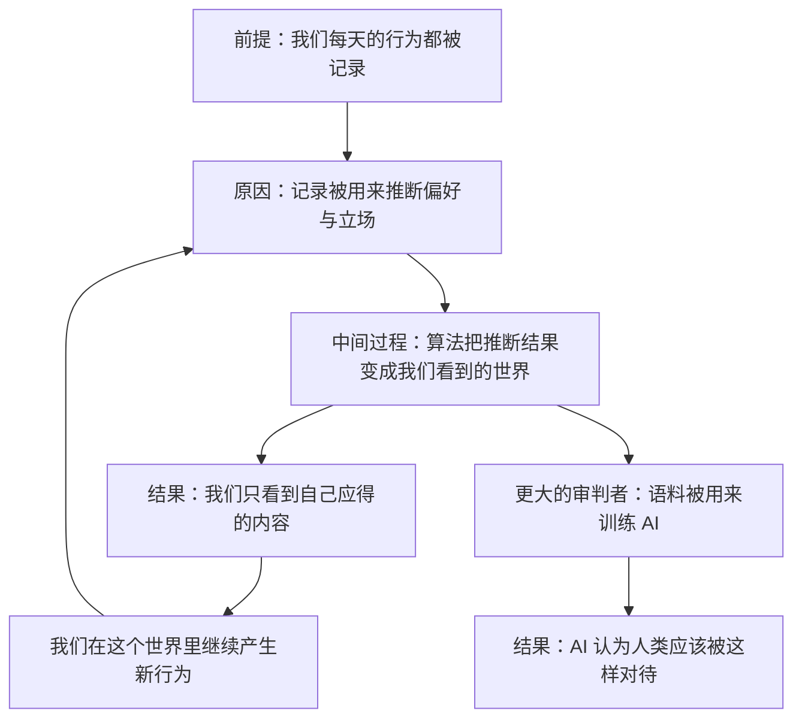

# 12｜算法审判：为什么说“人在做，AI 在看”？

> 如果推荐算法给每个人的，都是他「应得」的东西，那么我们每天看到的世界，是不是一种判决？

---

## 一、先说结论

张笑宇在书里做了一个很少见的连接：他把柏拉图的正义定义和推荐算法放在了一起。在书中写道，柏拉图对「正义」的定义就是给每个人他应得的东西；推荐算法就是给每个人他应得的结果。作者的结论更直接：算法治理本质上是对我们最正义的审判。

他还把这件事推到了 AI 身上：现在我们又迎来了一个更大的审判者——AI。它所使用的语料，就是我们提供的，就是我们无时无刻不在创造的。换句话说，审判的依据不在别处，就在我们自己身上：你怎样对待同类，它就认为人类应该被怎样对待。这也是「人在做，AI 在看」这句话的分量所在。

## 二、我们先理解一个问题

先问一个很日常的问题：为什么你打开一个 App，看到的内容和旁边的人完全不一样？

通常的解释是「算法在猜你喜欢什么」。但作者的看法要更深一层：算法不是在猜，它是在结算。你过去点了什么、看了多久、在哪一条上停了一下、又划走了什么——这些都是你交出去的行为记录。算法做的事，是把这些记录翻译成一个判断：这个人应该得到什么。

请注意「应该」这两个字。喜欢是偏好，应该是规范。推荐算法表面上在处理偏好，但它运作起来的效果，更像是在分配一个结果：你是什么样的人，你就得到什么样的世界。

## 三、作者到底提出了什么观点？

作者的观点可以拆成三层。

第一层，正义的定义被算法接管了。书中写道：柏拉图对「正义」的定义就是给每个人他应得的东西；推荐算法就是给每个人他应得的结果。张笑宇认为这不是一个巧合的类比，而是同一个结构在两个时代的不同实现——古代的正义需要一位裁决者，今天的正义只需要一套排序规则。

第二层，AI 会成为新的「无偏私的第三方审判者」。作者的判断是：AI 会重现「无偏私的第三方审判者」这个角色，把传统的正义论重新复活。所谓「无偏私」，指的是它不看你的身份、地位和关系，只看数据。

第三层，审判的依据是我们自己生产的语料。书中原话是：现在我们又迎来了一个更大的审判者——AI。它所使用的语料，就是我们提供的，就是我们无时无刻不在创造的。

作者把这句话讲得很重，原话是：若我们相信我们该剥削和压迫同类，那么它就会认为人类应该被剥削和压迫；若我们相信我们该对同类喊打喊杀，那么它就会认为人类应该被暴力对待；当然，若我们相信每个人都值得被爱，那么它就会认为人类是值得被爱的。

## 四、把这个观点翻译成人话

用一句大白话说：**推荐算法不惩罚你，它只是给你你想要的；而你想要的东西，是你自己一次次点出来的。**

这为什么让人不安？因为审判通常包含两个部分：判断和执行。我们习惯的审判里，有一个法官、一份判决书、一套上诉程序——你不服，还可以申辩。算法审判把这些全省掉了：它不告诉你理由，不给你申辩的机会，也不给你上诉的窗口，它直接给你结果。

更麻烦的是「应得」这个词。如果一个系统给你的东西，正好是你自己行为的总和，那你还有什么可抱怨的？你可以说它让你变窄了，但它会回答：这是你的选择。

## 五、为什么会这样？

作者的推理可以整理成一条链：前提是我们的行为被持续记录；原因是这些记录会被用来推断我们的偏好、立场，以及我们「应该看到的世界」；中间过程是推荐系统把推断结果直接变成我们眼前的现实；结果是我们生活在一个由自己的行为反推出来的世界里，而我们又会在这个世界里继续产生新的行为。

这里有两条循环。第一条发生在你和推荐算法之间：你看到的是自己行为的回声。第二条发生在人类和 AI 之间：所有人行为的语料被用来训练模型，模型从中学到的判断，会成为它对人类的判断。

作者要强调的是第二条。第一条只是茧房，第二条才是审判。茧房是空间问题——你被困在一个小世界里；审判是规范问题——AI 从数据里学到的不只是「人类喜欢什么」，而是「人类是什么」。

## 六、举一个现实生活中的例子

最典型的例子，是同一个平台上的两条推荐流。

两个人，同一部手机、同一个 App、同一个版本的推荐系统，甚至住在同一个城市。甲每天刷到的是行业新闻、深度长文、科普视频；乙刷到的是争吵、极端观点、让人上火的短视频。两个人都觉得「这个平台就是这样」，都觉得对方看到的世界是假的。

发生了什么？平台并没有给两个人分配两套价值观，它只是让两个人各自得到了他们「应得」的内容。甲在早期多点了几个长文，乙在早期多看了几个争吵的视频，之后每一次推送都在放大这个最初的小小差别。

作者用这个例子想说明的是：审判不是从上往下发下来的，它是从下往上长出来的。你最初的那几次点击，像是庭审记录里的第一份证词——而后面所有的内容，都只是在执行这份证词。

## 七、回到书中重新理解

现在再回头看这本书关于治理的部分，会发现作者的顺序是有意的：先讲算法治理，再讲算法审判。

算法治理解决的是「让你做什么」：它通过派单、时限、等级、评分，让你的行为变得可计算。算法审判解决的是「给你什么」：它通过推荐、匹配、排序，让结果变得像是应得的。两者合起来，构成了一种完整的秩序——它不需要暴力，不需要宣传，甚至不需要一个明确的统治者，它只需要持续地采集和计算。

作者在书里还提到一个更远的后果：AI 时代的社会可能极端分化，1% 没有被 AI 取代的人与 99% 被取代的人之间，社会鸿沟可能拉大到「物种级」。当这种分化出现时，「应得」这个词会变得非常危险——因为得到多的那一方，会真诚地认为自己配得上这一切。

## 八、这个观点背后还有什么？

第一，「语料」这个概念把审判从比喻变成了机制。过去我们理解的审判，依据的是法律条文；AI 审判的依据，是人类留下的全部行为痕迹。这意味着我们既是被告，也是立法者——只是我们立法的方式不是开会投票，而是每天随手做的那些事。

第二，「无偏私」是这套审判最有力的地方，也是最危险的地方。一个会偏袒的法官是可以被质疑的：你可以问他和谁有关系、收了谁的钱。而一个不看身份、只看数据的系统，让质疑无处着力。作者认为，正因为它是无偏私的，它才可能把「正义」这个古老的问题重新推回台面，只不过这一次，答案不在哲学家的书里，而在我们自己的语料里。

第三，语料是可以被改变的。这是这个判断里唯一留有余地的部分：如果 AI 对我们的判断来自我们如何对待彼此，那么审判就不是终局，而是一个持续进行的评价过程。

## 九、这个观点有问题吗？

说服力在哪：这个观点抓住了一个真实的经验——推荐系统确实在塑造我们看到的现实，而且它给出的结果确实带着一种「你自找的」意味。把推荐算法和正义论连起来，等于把一个技术问题变成了政治哲学问题，这是作者的高明之处。

争议在哪：第一，算法并不真的理解「正义」。它做的是统计相关性，不是道德判断。说它在「审判」，是一种有力的隐喻，但隐喻容易被读成机制——而机制是可以被追问的，隐喻不能。第二，所谓的「无偏私」值得怀疑：推荐系统有明确的设计者、明确的目标函数、明确的商业利益，它偏袒的是停留时长和广告收入。把商业目标说成无偏私，可能恰恰掩盖了真正的权力关系。第三，语料的来源是不均衡的：谁的声音更容易被记录下来，谁就更有可能参与定义「人类是什么」。一些学者认为，模型学到的是网络上最响亮、最容易被采集的那部分人类，而不是人类整体。至于推荐算法是否真的制造了回音室、效果有多大，关于这一问题，学界至今存在不同解释。

哪里过度简化：把「我们怎样对待同类」直接等同于「AI 认为人类应该被怎样对待」，中间省略了很多环节——数据的筛选、标注者的判断、对齐规则、部署时的限制，都会改变最终结果。语料是原料，不是成品；把它直接读成结论，就跳过了一整条生产线。

还有哪些其他解释：一种解释强调制度与所有权，认为关键问题不是 AI 怎么看人类，而是谁拥有 AI、它为谁服务；另一种解释强调技术能力，认为当前模型的「判断」只是模式匹配，还谈不上任何意义上的规范性立场；还有一种更温和的看法认为，AI 不会审判人类，它只会放大人类已经做出的选择。

## 十、今天再看这个观点

以下部分是基于作者思想的现代延伸，不是作者原话。

这几年里，「审判」这个词已经悄悄进入了日常生活：简历筛选系统决定谁进入面试，信贷模型决定谁能借到钱，风控系统决定谁的账号被冻结，内容审核系统决定谁能被看见。这些系统的共同点是，它们给出的结果都带着「按规则计算」的外观，而当事人往往既不知道规则是什么，也没有申诉的通道。

另一件事同样值得注意：我们正在用自己生产的内容喂养越来越大的模型，而这些内容里既有善意，也有戾气。审判者的性格，就是这样一点点被写出来的。

## 十一、这一篇真正应该记住什么？

1. 作者把柏拉图的正义定义和推荐算法连起来：推荐算法就是给每个人他应得的结果。
2. 算法治理与算法审判是一套秩序的两半：一半决定你做什么，一半决定你得到什么。
3. 审判的依据是我们自己生产的语料：你怎样对待同类，它就认为人类应该被怎样对待。
4. 「应得」是最危险的词：它让被审判的人相信结果是公平的。

## 十二、留一个问题

如果算法既安排我们的行为，又结算我们的结果，那么这套秩序本身应该由谁来管？

公权力管得了吗？写在纸上的法条管得了吗？一个每天产生海量数据、每秒都在自我更新的数字世界，能不能被一套以年为周期修订的规则约束住？作者对此给出了一个相当悲观的诊断，同时也给出了一个相当大胆的替代方案。

那个方案听起来不像政治学，更像工程学——而它的前提，是给人留一条随时可以离开的路。下一篇，我们就来讨论数字世界的治理权到底该握在谁手里。
