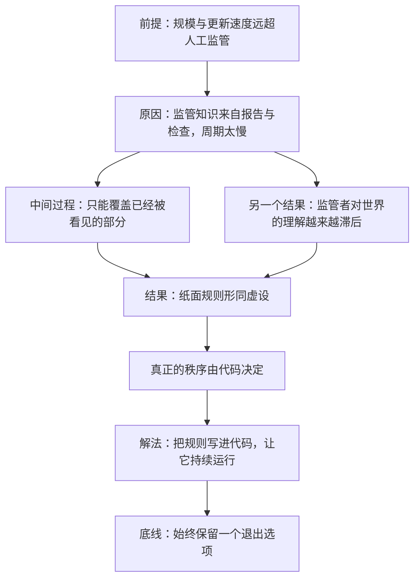

# 13｜数字国家的政体：数字世界该由谁来治理？

> 如果监管者对自己要监管的那个世界一无所知，那么「监管」这件事还剩下什么？

---

## 一、先说结论

张笑宇的判断很直接：依赖今天的公权力去管理数字世界，几乎是无效的。原因不是官员不努力，而是知识上的不对称——当监管者对其监管的世界一无所知时，监控注定是无效的。

那该怎么办？作者给出的答案是一个「内生」的方案：治理规则天然是数字的，天然可以被写进代码里执行，天然能改变算法治理并持续运作，而不是靠每页几十个比特的法条，去监管每天产生上万太字节数据的世界。

与此同时，他借「中本聪」式的人物提出了一条底线：始终要给人留一个退出选项——既不服从极权政府，也不屈从超级平台。

## 二、我们先理解一个问题

先看两个数字的对比。

一页法律文本的信息量，大约是几十个比特；而一个大型平台一天产生的数据量，是上万太字节。这两者之间隔了十几个数量级。

法律是社会用几百年的经验写成的规则，它的修订周期以年为单位；数字世界的规则更新以天、甚至以小时为单位。一个以年为周期修订的文本，怎么去约束一个每小时都在变化的系统？

更麻烦的是知识的来源。监管者要了解平台在做什么，通常只能依赖平台自己提供的报告和说明——被监管者同时扮演着监管所需知识的提供者。

于是问题变成了：如果监管者手里唯一可靠的工具是事后的「禁止」和「处罚」，那么他实际能管的，只是那些已经出问题、并且已经被看见的部分。

## 三、作者到底提出了什么观点？

作者的观点有两层。

第一层是诊断。他判断，依赖今天的公权力管理数字世界，几乎是无效的；当监管者对其监管的世界一无所知时，监控注定是无效的。这不是能力问题，而是结构问题：监管者面对的是一个他不生活于其中、也不理解其运作方式的世界。

第二层是方案，也就是所谓「内生」的治理。作者的表述是：这种方案天然是数字的，天然可以被写进代码里执行，天然能改变算法治理并持续运作，而不是靠每页几十个比特的法条，去监管每天产生上万太字节数据的世界。换句话说，如果规则要在这个世界里生效，它必须成为这个世界的一部分——像代码一样被运行，而不是像文件一样被存档。

在这个方案里，作者借「中本聪」式的人物给出了政治底线。他描述的这类人不愿受极权政府统治，也不愿屈从于超级平台的垄断精英；他们希望对自己的财富、对自己看到的信息拥有绝对的控制权。作者认为，到了 AI 时代，这种要求理应延伸到数据和相关的推荐算法上。

书里有一句很动人的原话：我们应该始终拥有一种可能性：当极权政府和超级平台运用 AI 的力量豢养人类之时，热爱自由的人始终还有另外一种选择。

作者还提醒我们，权利从来不是被赐予的。书中写道：弱者不是因为弱而获得了投票权，而是因为他们有用而获得了投票权。

## 四、把这个观点翻译成人话

用一句大白话说：**你没法用一张纸，去管一个每秒都在跑的系统。**

法律管人靠的是事后追责：你违规了，我罚你。但数字世界的规则是在事前和过程中生效的：排序、限流、封禁、推荐，这些动作在你还没意识到的时候就已经完成了一百万次。等你去找监管者，事情早就发生了。

所以作者说，规则得「内生」：把它写进系统，让它跟系统一起跑。这样它才是活的、自动的、持续的，而不是等着人来执行的。

而「退出选项」是这套设计里最重要的一条。它的意思不是让你随时能赢，而是让你随时能走：如果一个系统可以决定你看到什么、能得到什么，那么唯一能限制它的力量，就是你随时可以不玩——而且走了之后还活得下去。

## 五、为什么会这样？

作者的推理可以整理成一条链：前提是数字世界的规模与更新速度远远超出人工监管的能力；原因是监管者的知识来自报告、检查和统计，而这些手段的周期太慢；中间过程是监管只能覆盖已经被看见的部分，系统内部的规则继续自行演化；结果是纸面规则逐渐形同虚设，真正的秩序由代码决定。

前四步是作者诊断的部分：规模与速度的落差是前提，知识来源的迟缓是原因，覆盖不全的监管是中间过程，规则失效是结果。后两步是作者开出的方向：既然秩序由代码决定，那就让规则也进入代码；而既然进入代码的规则会持续生效，就必须保留一条退出的通道作为制衡。

这两步的分量不一样。前一步是效率方案，后一步是政治底线。

## 六、举一个现实生活中的例子

最典型的例子是加密货币，以及它背后那个「中本聪」式的设想。

2008 年，一个署名中本聪的人发布了一份篇幅很短的白皮书，提出一种不需要中央银行、不需要清算机构、也不需要任何国家背书的货币系统。它用公开的算法和密码学规则来记账：规则写在代码里，谁运行都一样，任何人随时可以加入，也随时可以离开。

这套系统的意义不在于它是否好用，而在于它证明了一种可能：规则可以不依赖任何机构的许可而持续运行。现实中，监管确实可以关掉交易所、冻结地址、切断支付通道，但很难让这个网络本身停下来，因为离开的人只是离开了，网络还在运行。

作者借这一类人物想说明的，不是「人人都该去买加密货币」，而是一种政治想象：在一个可以被算法支配的世界里，人应该保有一个可以离开的位置。这个位置不必完美，它只需要存在。

## 七、回到书中重新理解

现在再回头看这本书关于算法治理的讨论，就会发现作者的态度是双面的。

一方面，他认为算法治理是「智能的」：它比任何官僚系统都更了解每个人的处境，能做出更精细、更及时的判断。另一方面，他警告说，同样的能力既可能服务于人，也可能成为一种新的统治形式——它不需要强迫你，它只需要让你离不开它。

书里还有一段关于「AI 造神」的警告，值得把大意讲出来：未来我们不仅会看到人为自己造的神，还会看到 AI 为人造的神——算法根据偏好推送「机器为人造的神」，人们生活在被量产的亿万间神祠中，膜拜自己茧房内的某个神；幸运的话被隔绝在茧房里动弹不得，不幸的话被无数神明挑唆得彼此搏杀。

这段话解释了作者为什么把「退出」看得那么重。当算法可以为每一个人定制一个神的时候，唯一能让人从神祠里走出来的，就是那扇还开着的门。

## 八、这个观点背后还有什么？

第一，治理的正当性问题被重新提了出来。法律之所以能被接受，除了强制力，还因为它有程序：公开、可辩论、可上诉、可修改。代码没有这些程序。把规则「内生」进代码，效率极高，可正当性从哪里来，作者并没有给出完整的答案。

第二，数据主权是这个方案的核心资源。如果规则要内生，那么谁掌握数据、谁掌握算力、谁掌握模型，谁就占据了立法的位置。这也是为什么作者会强调，在 AI 时代，对数据和推荐算法的控制权，应当被理解为一种基本的政治权利。

## 九、这个观点有问题吗？

说服力在哪：这个判断准确地点出了一个真实困境——监管的知识赤字。过去十几年，各国在数据保护、内容治理、平台责任上立了大量规则，但平台的行为方式、算法的内部逻辑、数据的真实流向，监管者往往只能通过平台自己的报告来了解。这种「被监管者提供监管所需知识」的结构，是实实在在的问题。

争议在哪：第一，「公权力监管几乎无效」这个判断过于绝对。现实中监管确实改变过平台的行为——罚款、强制整改、下架应用、数据本地化，都产生过实际效果，只是效率低、代价高、容易被规避。第二，「内生治理」的正当性是个大问题：如果规则写进代码，那么写代码的人就是立法者，而他们既不是选举产生的，也未必受任何程序约束。第三，加密货币的经验是一体两面的：它证明了退出是可能的，也证明了没有公共规则的体系会长出新的集中和新的不公平。

哪里过度简化：作者把「公权力」和「超级平台」当成两个主要角色，但现实里还有大量中间形态——行业协会、标准组织、开源社区、跨国监管合作、司法判例。治理并不总是「谁管谁」，也可能是一套多方参与的规则生产过程。

还有哪些其他解释：关于这一问题，学界存在不同解释。一种解释认为，关键变量不是规则写在哪里，而是权力是否可问责——代码和法条都可能不透明，也都可能被监督；另一种解释强调国际协调，认为数字世界的治理最终要靠国家之间的协议。

## 十、今天再看这个观点

以下部分是基于作者思想的现代延伸，不是作者原话。

这几年，「内生」的思路正在以各种形式出现：算法备案与算法审计，是试图把监管的手伸进系统内部；数据可携带权，是试图给用户一条搬家的通道；开源模型与本地部署，是试图让「退出」从口号变成工程。

对普通人来说，这个观点最有用的部分也许是那个朴素的提醒：**看清楚自己还有没有退出的余地。** 你能换一个 App，但你能换一个生态吗？退出的成本有多高，你被对待的方式就会有多差。

## 十一、这一篇真正应该记住什么？

1. 用公权力监管数字世界，最大的障碍不是决心，而是知识：监管者不了解自己监管的世界。
2. 有效的治理必须内生：规则要被写进代码、持续运行，而不是躺在纸面上。
3. 「中本聪」式人物的意义，是证明一种可能：始终留一个退出选项。
4. 算法治理既可能服务于人，也可能成为新的统治形式——区别就在于人还能不能走。

## 十二、留一个问题

如果公权力管不好数字世界，而平台又强大到可以自己制定规则，那么接下来会发生什么？

一个可能的后果是：一部分技术精英不再相信民主制度能处理这些问题。他们会觉得，既然旧制度的运行逻辑已经跟不上时代，那不如换一套更「高效」的制度。这套想法听起来很边缘，但它已经有了自己的名字、代表人物和理论文本，甚至已经有了听众。

下一篇，我们来看这套被称作「黑暗启蒙」的思潮，以及它为什么会在硅谷找到共鸣。
