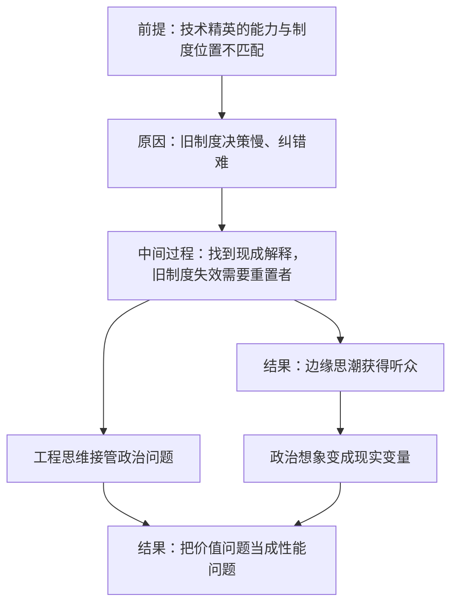

# 14｜什么是“黑暗启蒙”？为什么技术精英开始怀疑民主？

> 一套原本只在网络角落流传的政治想象，为什么会出现在硅谷的会议室里？

---

## 一、先说结论

张笑宇在书里梳理了一股叫「黑暗启蒙」的思潮，代表人物是尼克·兰德和柯蒂斯·雅文。这套思想的共同点，是把社会看作一个可以被工程化改造的系统：兰德从控制论出发主张加速，雅文则主张把公司当成君主制，两人都在期待一个恺撒式的人物来「重置」旧制度。2012 年，两条思路完成合流，黑暗启蒙作为一股思潮正式兴起。

作者的判断是：这原本是一套边缘思想，却在硅谷找到了听众。换句话说，技术精英的政治想象，正在从个人趣味变成现实变量。

有一句话需要先说清楚：下面介绍的是作者在书中梳理和转述的对象，不等于作者本人的立场。

## 二、我们先理解一个问题

先问一个看起来有点奇怪的问题：为什么一群写代码、做产品、算收益的人，会开始认真讨论「要不要民主」？

因为他们习惯的思维方式是工程思维：一个系统如果表现不好，就去找瓶颈、改参数、换架构。在这套思维里，制度不是神圣的，制度也是一种设计；如果一种设计长期表现不佳，那它就该被替换。

问题在于，政治制度不是软件。软件的更新可以灰度发布、可以回滚、可以在小范围内试错；而制度的更替，代价由真实的人承担，而且往往无法回滚。当工程思维遇到政治问题，就会产生一种很有诱惑力的想法：既然旧系统改不动，那就整机重装。

## 三、作者到底提出了什么观点？

作者梳理了这套思潮的两条主线，以及它们合流之后的形态。

第一条主线是尼克·兰德的加速主义。作者转述说，兰德立场的前提是把社会系统看作一个控制论系统——如果一个控制论系统中的一部分加速了，其余部分也必须随之加速，这是由通信工程原理决定的。这句话的政治含义是：你无法选择「慢下来」，因为系统的各个部分彼此耦合，一部分加速，压力就会传导到全部。所以与其试图刹车，不如踩油门。

第二条主线是柯蒂斯·雅文的新反动主义。作者转述说，雅文认为现代公司的实质就是君主制：董事长或者 CEO 的决策实际上没有、也不应该受民主机制的限制；考核这个「君主」的唯一指标是盈利。雅文十分钦佩新加坡的李光耀及其继任者李显龙，认为这才是美国未来理想君主的样子。

两条线在 2012 年合流。书中的原话是：旧制度的内核是进步主义，我们应该召唤一个恺撒式的人物来粉碎旧制度。2012 年，尼克·兰德和柯蒂斯·雅文完成合流，这就是黑暗启蒙思潮的正式兴起。

作者本人对这套思潮背后的「技术进步主义」提出了批评。他认为，我们今天之所以被进步派「欺骗」，是因为默认了技术进步等同于文明进步——他有一句很刻薄的概括：我们比斯图亚特王朝时代优越的原因是我们有 iPhone。作者提醒，这个默认前提值得警惕。

他还提到两个「线性序列」：一个跟踪技术在历史时间中的进步，一个跟踪从抽象观念到具体实现的过程。这两个序列勾勒出人类历史的某种「超验统治」——这是作者对相关思潮的概括。

## 四、把这个观点翻译成人话

用一句大白话说：**这套思想在说，政治不是价值问题，而是性能问题。**

在它的视角里，国家像一个运行了很久的老系统：代码陈旧、迭代缓慢、还绑着一大堆历史包袱。民主的麻烦在于它慢，而且要照顾太多人的意见。既然如此，为什么不把它当成一家公司来管？公司有明确的指标、有决断的负责人、有清晰的奖惩，跑得快，也改得快。

这套逻辑的诱人之处在于它简单。它的危险之处也在于它简单：它把「谁被照顾、谁被牺牲」这个问题，替换成了「整体效率如何」这个问题。而在一个控制论系统里，被牺牲的部分从来不是一个抽象的百分比，而是具体的人。

## 五、为什么会这样？

这套思潮之所以会出现并获得听众，可以整理成一条链：前提是技术精英掌握的能力与他们所处的制度位置越来越不匹配；原因是他们看到旧制度的决策周期长、纠错慢、容易被短期政治绑架；中间过程是一套现成的解释被找到并被加工成理论——旧制度失效，所以需要一个重置者；结果是这套边缘思想走出网络角落，成为一部分有资源的人的政治想象，并开始影响现实。

前四步是作者梳理的逻辑：能力与位置的不匹配是前提，制度运转的迟滞是原因，理论的现成化是中间过程，找到听众是结果。后面两步是这套思潮的思想后果：工程思维把政治问题变成了技术问题，于是「谁被牺牲」这个价值问题，被「整体效率」这个性能指标替换掉了。作者对这套思潮的批评，正落在这一步上。

## 六、举一个现实生活中的例子

最直观的例子，是这些年硅谷一部分大佬的政治转向。

过去很长一段时间，科技公司与政治的关系是「保持距离」：专注产品、少谈政治、两边都不得罪。但这些年情况明显变了：有人开始公开支持特定的政治人物，有人大手笔投入政治捐款，有人收购影响力巨大的社交媒体平台，有人进入政府机构参与政策制定，也有人公开讨论「谁应该统治」这种以前只在学术圈出现的问题。

把这些动作放在一起看，它们并不构成一套统一的政治纲领，更像是一种共同的情绪：对现行制度的不耐烦。他们习惯了在自己公司里说一不二，习惯了用数据判断对错，习惯了「不行就改」，于是很难理解为什么公共事务要花那么长时间去争论、去妥协、去照顾少数人的意见。

而雅文提供的类比正好顺手：在他的描述里，公司本来就是君主制，如果把国家也这样理解，那么政治的全部难题就变成了「谁来当 CEO」和「指标定什么」。

作者用这个现象想说明的是：黑暗启蒙的听众之所以会出现，不是因为这套理论多有说服力，而是因为它恰好说出了这部分人的心里话——制度太慢了。

## 七、回到书中重新理解

现在再回头看这本书的整体结构，会发现这一篇的位置很关键：前面几篇讲的是技术如何改变经济与治理，这一篇讲的是技术如何改变政治想象。

回到作者提到的两个「线性序列」：一个跟踪技术在历史时间中的进步，一个跟踪从抽象观念到具体实现的过程。作者的提醒是：这种叙事里藏着一个未经检验的前提，即技术进步等于文明进步。他并不是否认技术的价值，而是指出一个危险：一个社会如果只用「跑得多快」来衡量自己，那么它迟早会把「跑向哪里」这个问题忘掉。

## 八、这个观点背后还有什么？

第一，它反映的是合法性的焦虑。当治理越来越依赖算法、越来越依赖技术系统，而技术系统又由少数人掌控时，民主的程序就显得越来越像一层装饰。这种焦虑不只属于技术精英，也属于普通人——当一个人发现自己投的票改变不了什么，他也会开始怀疑制度。

第二，「重置」是一个没有答案的词。谁来重置？重置之后由谁保证不再需要重置？作者梳理的这套思潮里，这些问题都没有答案——它提供的是情绪，不是制度设计。

## 九、这个观点有问题吗？

说服力在哪：作者指出的现象是真实存在的——一部分科技精英确实对民主制度表现出越来越多的怀疑，而这种怀疑确实正在通过资金、媒体和政治参与变成现实影响。

争议在哪：第一，把网络博客上的边缘言论当成现实的政治纲领，可能有夸大的风险。这类思潮的文本晦涩、内部矛盾、追随者众说纷纭，它到底在多大程度上影响了实际决策，很难量化。第二，硅谷本身并不是铁板一块：大多数工程师和创业者并不认同这类主张。第三，「公司等于君主制」这个类比忽略了公司受到的法律约束、市场竞争和劳动关系的现实——CEO 并不是不受限制的君主，他要面对董事会、股东、员工和监管机构。第四，把科技精英的政治转向解释成思想影响，也可能是倒果为因：监管压力、税收政策、移民政策、文化冲突，都是更直接的动因。

哪里过度简化：作者对「技术进步主义」的批评是锋利的，但「我们比斯图亚特王朝时代优越的原因是我们有 iPhone」这句话本身也把复杂的历史压缩成了一句话。文明进步与技术进步当然不能等同，可两者也不是彼此无关的两条平行线。

还有哪些其他解释：关于这一问题，学界存在不同解释。一种解释认为，这是资本在技术变革期的自然反应——当技术改变了财富的创造方式，掌握技术的人自然会要求与之匹配的政治权力；另一种解释认为，这类思潮更像一种网络亚文化，它的影响力被媒体放大了。

## 十、今天再看这个观点

以下部分是基于作者思想的现代延伸，不是作者原话。

近几年最值得注意的变化，是权力正在从政治精英向技术精英转移。这本书的推荐语里，刘擎也提到过类似判断，即「权力从政治精英转向技术精英」。这不是一场政变，而是一种缓慢的置换：预算、人才、舆论基础设施和关键基础设施，越来越多地掌握在技术公司手里；而公共政策的很多细节，实际上需要依赖这些公司的配合才能落地。

对普通人来说，这一篇最有用的提醒也许是：当有人开始用「效率」来论证某种制度安排时，值得多问一句——效率是为谁计算的，代价由谁承担。

## 十一、这一篇真正应该记住什么？

1. 黑暗启蒙的核心想象，是把社会当成一个可以被工程化重置的系统。
2. 兰德提供加速的机制论证，雅文提供君主制的制度类比，两者在 2012 年完成合流。
3. 这套思想原本边缘，却在硅谷找到了听众：技术精英的政治想象正在成为现实变量。
4. 作者提醒：把技术进步等同于文明进步，是一个需要警惕的默认前提。
5. 作者梳理这些观点，是思想史的观察，不等于他认同这些主张。

## 十二、留一个问题

如果一部分技术精英真的开始怀疑民主，他们会用什么来替代它？

作者给出的回答不是某种政治纲领，而是一张新的地图。在他的判断里，未来的国家竞争不再只沿着山川河流展开，而是沿着供应链、专利、支付网络和算力展开——权力的地形本身变了，谁站在关键的环节上，谁就有筹码。

下一篇，我们来看作者提出的「产缘政治」，以及他为什么说，AI 时代的权力会沿着产业空间重新分布。
