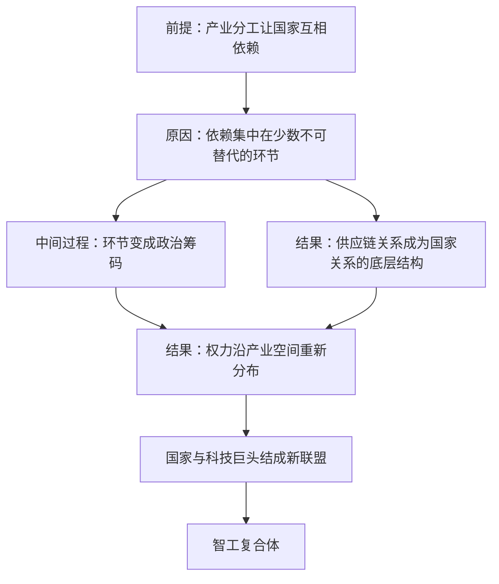

# 15｜从地缘政治到“产缘政治”：AI 时代的权力地图变了什么？

> 如果国家的实力不再由山川决定，而由供应链决定，那么我们该用什么来理解世界？

---

## 一、先说结论

张笑宇提出的概念是「产缘政治」。它的意思是：如果在前工业时代，我们用山脉、河流、半岛、海洋、沙漠和草原等地理空间来理解国家间关系，那么到了工业时代，供应链、产业集群、核心专利、跨国公司、商品运输路径和支付方式等产业空间，对政治和国家间关系的意义，不下于自然地理条件。

作者的判断是：AI 时代的权力会沿着产业空间重新分布。他还提出了「智工复合体」这个概念——智能与工业的复合体，会像当年的军工复合体一样，成为国家与科技巨头之间的新联盟。

地理是天然给定的地形，产业是人为建造的地形；当权力长在后者身上时，理解世界的方式就必须换一套。

## 二、我们先理解一个问题

先问一个简单的问题：在地图上，你能画出一条供应链吗？

不能。地图上画得出山脉、海峡、港口，画不出光刻机、设计软件、稀土分离产线、海底光缆的结算节点。但这些看不见的东西，才是今天真正的「地形」：它们决定了谁能让谁的日子难过，谁能让谁的生产线停摆。

地缘政治的核心假设是：国家的行为受地理条件约束，位置决定命运。但当财富和权力越来越多地存在于产业空间里时，位置的重要性就让位给了位置之外的东西：你在产业链的哪个环节上，你能不能替代别人，别人能不能替代你。

这就带来一个奇怪的局面：两个国家在地图上并不接壤、也没有领土争端，却成了最主要的战略对手——因为战场根本不在图上。

## 三、作者到底提出了什么观点？

第一，产缘政治的定义。作者的说法是：到了工业时代，供应链、产业集群、核心专利、跨国公司、商品运输路径和支付方式等产业空间，对政治和国家间关系的意义不下于自然地理条件。

第二，一个历史案例。作者引用 18 世纪历史学家品托的说法：英国在七年战争中的胜利就是公债政策的结果。皮特政府曾在下议院宣布，这个民族的生机乃至独立都建立在公债的基础之上。这个例子的意思很清楚：决定战争胜负的，不只是军队和地形，还有金融与产业的组织能力。

第三，一个关于权力的古老判断。书中原话是：恺撒能够终结罗马共和制，不在于他想要成为一个君主，而在于他能够带领军队从胜利走向胜利。这句话放在产缘政治的框架里说的是同一件事：权力来自能够持续提供成果的能力，而不是来自头衔。

第四，当代结构。作者判断，中美两国因为供应链合作，无意中形成了一种互相以对方为锚的扩张机制，像「左脚踩右脚」；而美国想摆脱中国制造，几乎是不可能完成的任务。

第五，作者提出的「智工复合体」概念：智能与工业的复合体，会像当年的军工复合体一样，成为国家与科技巨头的新联盟。

## 四、把这个观点翻译成人话

用一句大白话说：**过去的边界是天然形成的，现在的边界是被人造出来的——所以它可以被造出来，也可以被切断。**

和地理空间不同，产业空间是人造的、分工的、彼此嵌套的。芯片的设计在一处，制造在另一处，封装测试在第三处，设备在第四处，材料在第五处——每一个环节都不可替代，每一个环节都握在别人手里。这种结构带来两种相反的效果：一方面，谁都离不开谁，合作成了默认状态；另一方面，任何一处被卡住，整条链都会震动，因此它天然是政治筹码。

这就是作者为什么说权力会沿着产业空间重新分布：在一个高度分工的世界里，权力不在于你拥有多少土地，而在于你占据了多少别人绕不开的环节。

## 五、为什么会这样？

作者的推理可以整理成一条链：前提是产业分工让国家之间形成了结构性的相互依赖；原因是这种依赖并不均匀，而是集中在少数不可替代的环节上；中间过程是掌握环节的一方可以把依赖转化为政治筹码，而另一方会不惜代价去重建替代路径；结果是国家间关系被产业空间重新定义——谁在链条上，比谁在地图上更重要。

第三步值得多说一句。作者用「左脚踩右脚」来形容中美之间的一种奇怪机制：两国因为供应链合作，无意中形成了一种互相以对方为锚的扩张——你需要我的产能，我需要你的市场，彼此的规模又都因为对方而变大。这种结构让全面脱钩的代价高到难以承受，所以它稳定；但它稳定的方式不是善意，而是互相牵扯，一旦有人愿意承担代价，它就会迅速失效。

最后两步是作者对未来的判断：产业空间里的关键节点不会只由企业掌握，国家会越来越多地介入，于是形成「智工复合体」——国家与科技巨头之间的新联盟。

## 六、举一个现实生活中的例子

最好的例子是芯片出口管制。

一台 AI 服务器里的高端芯片，是人类工业最复杂的产物之一。它的设计依赖少数几家公司的软件工具，制造依赖极紫外光刻设备，而光刻设备又依赖全球数千家供应商提供的零部件和材料。也就是说，芯片不是某一个国家「做出来」的，而是许多国家「一起做出来」的。

正因为如此，它成了最典型的产缘政治武器。管制一方限制先进设备、软件和高端芯片的出口，被管制一方则被迫投入巨额资金，去重建自己的产业链。这场较量的关键不是谁的技术更强，而是谁能让谁的进度慢几年。地理上，双方没有领土争端；产业空间里，它们正在打一场真正意义上的战争。

作者用这类现象想说明的是：当产业空间成为权力的主要来源，国家竞争的形式就会从「争夺土地」变成「争夺环节」。而这场竞争的胜负，不由军队决定，而由产能、工艺、专利和交付时间决定。

## 七、回到书中重新理解

现在再回头看这本书关于「大坍缩时代」的安排，会发现作者把产缘政治放在这个位置是有道理的。

前面几篇讲的是内部秩序的松动：技术进步不一定带来繁荣，分配可能恶化，社会可能分化。产缘政治讲的是外部秩序的重组：当内部出问题时，国家会更容易把矛盾向外转移，而产业空间恰好提供了现成的抓手。

作者提出的「智工复合体」，是这个框架里最值得注意的一个概念。军工复合体曾经塑造了冷战时期的美国，国防预算、大学研究、工业企业与政治游说形成闭环。作者认为，智能与工业的复合体可能形成类似的结构——算力、模型、数据与制造能力彼此绑定，成为国家与科技巨头之间的新联盟。

## 八、这个观点背后还有什么？

第一，金融也是产业空间的一部分。作者在定义里特意提到了「支付方式」，这不是随口一提：结算网络、货币互换、跨境支付系统都不生产任何实物，却能让交易停下来。七年战争与英国公债的例子说明，融资能力本身就是战争能力。

第二，它改变了「安全」的含义。传统安全关心的是边境和军力，产缘政治的安全关心的是断供和替代：如果一种材料、一台设备、一个软件授权就能让你的产业停摆，那么安全就不再只是军事问题，而是产业问题。这也是近些年各国产业政策集体转向的深层原因。

## 九、这个观点有问题吗？

说服力在哪：这个框架解释了很多用传统地缘政治解释不了的现象。为什么两个没有领土争端的国家会成为最主要的战略竞争者？为什么「去风险」这个词会取代「脱钩」？答案都指向产业空间。

争议在哪：第一，「产缘政治取代地缘政治」这个说法可能过头了。地理并没有消失——能源运输要过海峡，海上通道需要海军护航，领土、人口和资源仍然决定战争的规模与韧性。更准确的说法也许是：产业空间是在地理条件之上叠加的一层新地形，而不是替代品。第二，「智工复合体」目前更像一个类比，而不是一个可验证的机制：它由谁组成、如何决策，书中并没有展开细节，更适合当成一个有待观察的假设。第三，供应链武器化会自我削弱：当依赖被反复用作筹码，被卡的一方就会不惜代价建立冗余产能。

哪里过度简化：作者强调供应链合作带来的稳定，但现实中产业空间的政治化往往由国内政治驱动——选票、就业、产业游说，都可能让经济上不划算的政策变得必要。

还有哪些其他解释：关于这一问题，学界存在不同解释。一种解释强调安全化，认为关键变化不是产业本身，而是各国开始把经济问题重新定义为安全问题；另一种解释强调技术周期的窗口期，认为当下的紧张源于某项关键技术正处在代际交替。

## 十、今天再看这个观点

以下部分是基于作者思想的现代延伸，不是作者原话。

这几年，产缘政治几乎成了国际新闻的日常语言：芯片出口管制一轮接一轮地加码，稀土和关键矿产被反复提起，数据跨境流动成为谈判条款，算力出口限制被写进政策文件。这些动作的共同点是，它们瞄准的都不是领土，而是环节。

与此同时，一个新的变化正在发生：过去被争夺的主要是硬件环节，现在越来越多被争夺的是模型、数据和算力。如果作者关于「智工复合体」的判断成立，那么未来的权力地图上，最重要的坐标可能不是港口和海峡，而是数据中心、晶圆厂和电力供应——这些东西都是可以被建造的，因此也都是可以被重新布局的。

## 十一、这一篇真正应该记住什么？

1. 产缘政治：工业时代理解国家关系的坐标系，是供应链、产业集群、核心专利和支付网络，而不只是山川河流。
2. 权力的来源从「占据土地」变成「占据环节」：不可替代的位置就是筹码。
3. 作者提出「智工复合体」：智能与工业的复合体，可能像军工复合体一样成为国家与科技巨头的新联盟。
4. 产业空间的稳定来自相互依赖，而相互依赖同时意味着脆弱。

## 十二、留一个问题

如果一个国家的权力建立在供应链的某个环节上，那么这个环节出问题的时候，会发生什么？

历史的经验是：高度复杂的社会往往不是慢慢衰落，而是在某个时刻突然整体失灵。而在产业空间里，这种失灵可能只需要一条产线、一种材料，或者一次延误。那么，一个越精密、越高效、越互相依赖的系统，是不是也越经不起意外？

下一篇，我们就来看这个问题：复杂社会为什么会突然崩溃。
