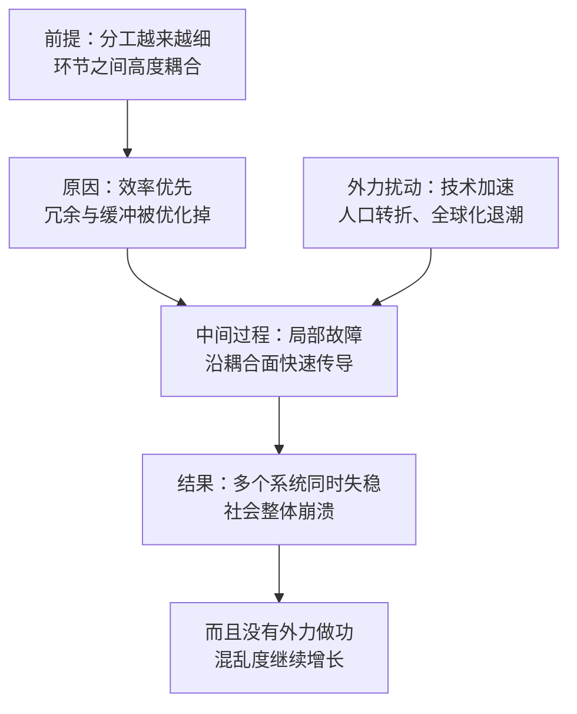

# 16｜复杂社会为什么会突然崩溃？

> 一个越精密、越高效的社会，为什么反而可能在一场扰动中整体崩塌？

---

## 一、先说结论

张笑宇在《AI文明史·前史》里引用复杂系统理论，给出了一个让人不安的判断：复杂系统的稳定性是相当脆弱的；一旦有外力干涉其中，搅动大局，复杂系统就很容易崩溃。他的原话大意是——不幸的是，我们现在就生活在这样一个时代的边缘。

这里的「崩溃」不是慢慢变穷，而是整体失稳。作者借历史学界对「中世纪晚期危机」的概括来提醒读者：人口崩溃、政治动荡、宗教乱局这三件事，曾经在同一个时代一起发生，并且互相放大。他认为，在技术加速、人口转折、全球化退潮叠加的今天，我们可能处在结构相似的位置上。

## 二、我们先理解一个问题

我们脑子里有一个默认的图景：一个东西坏掉，是慢慢坏掉的。桥先出现裂缝，再变形，最后塌；人先衰老，再生病，最后离世。所以我们习惯把「衰落」想象成一条平缓的下坡路，也就习惯认为：只要没看到明显的裂缝，就还安全。

可历史不太配合这个图景。有些社会不是缓慢下坡，而是先看起来一切正常，然后在一个很短的时间里同时失去很多东西：财政崩、粮食缺、秩序乱、权威塌。

请问：为什么一个组织得越精密、分工越细、效率越高的社会，反而可能在很短时间里整体崩溃？它不该更结实吗？

## 三、作者到底提出了什么观点？

张笑宇的观点是：高度复杂的社会看似稳固，其实极其脆弱。

理由就在「复杂」这个词本身。复杂社会的效率，来自无数环节的紧密咬合：每个人只做一小段，然后把结果交给下一个人。咬合越紧，整体效率越高；但咬合越紧，也意味着任何一个环节出问题，都会沿着咬合面传导出去。

作者还给了一个物理层面的类比：人类社会的有序或失序，本身可以看成一个物理问题——在一个孤立的封闭系统内，如果没有外力做功，系统内的总混乱度（熵）会不断增长。换句话说，秩序不是默认状态，混乱才是。社会要维持有序，必须持续投入能量和努力。

## 四、把这个观点翻译成人话

用一句话说：**复杂社会像一座靠无数只手互相扶着才站得住的塔。** 站着的时候，它比谁都高、比谁都灵活；但只要有人抽走一只手，整座塔的受力结构就变了。

再换一个更日常的画面：一栋大楼的水电系统。平时你打开水龙头就有水，插上插头就有电，你甚至不知道这些系统长什么样。正因为它们被优化得太好——没有多余的管线、没有备用的人员、库存压到最低——一次主干管道的爆裂，就能让整栋楼同时停摆。

所以「脆弱」不是「不强」，而是「强得没有余量」。作者想说的正是这一点：复杂系统把冗余当作浪费优化掉了，于是效率本身变成了风险。

## 五、为什么会这样？

作者和他引用的复杂系统理论，推理链条可以拆成四步：前提是分工与耦合，原因是冗余被效率淘汰，中间过程是扰动同时到达，结果是整体失稳。

关键在于第二步和第三步。第一步说明「为什么高效」，第二步说明「为什么没有缓冲」，第三步说明「为什么是突然的」——缓冲一旦消失，故障就不再被吸收，而是被传导；而粮食、财政、就业、信仰这些子系统如果同时进入紧张状态，它们之间的耦合就会把彼此推得更快。

作者的判断是：技术加速、人口转折、全球化退潮这三件事，正在同时给这套系统施加外力。单看每一件都不致命，叠在一起就不一样了。

## 六、举一个现实生活中的例子

最典型的历史样本，是历史学界所说的「中世纪晚期危机」。

十四世纪的欧洲，本来是一套相当精密的秩序：庄园经济、教会权威、封建契约、长途贸易，各自运转了几百年。然后三件事接连发生。

第一件是人口崩溃。1315 年前后的大饥荒，接着是 1347 年之后席卷欧洲的黑死病，据估计让欧洲人口在几十年里减少了三分之一甚至更多。劳动力突然变少，地租、庄园、教会税基全部被打乱。

第二件是政治动荡。英法之间的百年战争从 1337 年打到 1453 年，把大量资源消耗在战场上；各国为了筹钱不断加税、借债、与贵族博弈，统治的稳定性被反复动摇。

第三件是宗教乱局。教会大分裂（1378—1417 年）让同时出现两三位「教皇」成为事实，信仰的权威中心本身裂开了，各种异端与改革的声音开始获得听众。

这三件事的危险，不在于各自有多严重，而在于它们互相放大：瘟疫让人口减少，人口减少让税基缩小，税基缩小让战争更贵，战争更贵让统治更依赖强制，强制又削弱了教会与君主的道德权威。这是同一个系统的几个受力点同时断裂。

作为对照，诺基亚的崩塌是同一个机制在企业层面的版本。它不是慢慢死掉的：在功能机时代的最后几年，它的供应链、组织、渠道、研发节奏全部为旧范式高度咬合，看上去无懈可击；智能手机的转向一到，这套咬合就变成了传导故障的高速公路，几年之内整家公司就被拆掉了。

## 七、回到书中重新理解

现在我们再回头看《AI文明史·前史》，就明白作者为什么要花篇幅讲复杂系统。

他不是在做历史科普，而是在提供一个诊断工具。他引用「中世纪晚期危机」的三特征——人口崩溃、政治动荡、宗教乱局——不是为了说历史会重演，而是为了指出一种结构的相似性：当多个高度耦合的子系统同时承压时，崩溃可能不是线性的。

作者在书中的判断是：我们可能正处在类似的结构中。技术加速让产业与社会分工的变化速度超出制度调整的速度；人口转折让许多国家第一次面对长期的人口收缩；全球化退潮让原本依赖跨境协作的供应链与金融网络重新变成政治问题。这三件事叠加起来，会让原本高度耦合的复杂社会变得脆弱。

这句话的分量在于：他把「崩溃」从一个道德或政治问题，改成了一个结构问题。

## 八、这个观点背后还有什么？

这个观点背后，藏着三个不太显眼的前提。

第一，**效率与韧性是一对权衡。** 任何组织都可以选择更快更省，或者更抗打击，而现代社会的默认选择是前者：及时制库存、零冗余编制、外包到成本最优的地方。这不是愚蠢，而是竞争压力下的必然。

第二，**秩序需要持续做功。** 熵增的类比告诉我们：和平、繁荣、信任都不是自然状态，而是持续投入资源维护的结果。一旦维护停止，混乱会自己回来。

第三，**崩溃不是终点，而是重组。** 中世纪晚期危机之后，出现的是文艺复兴、大航海、宗教改革与民族国家的兴起。作者没有把崩溃写成末日，他真正担心的是重组的代价由谁来承担。

此外，这个判断与书中另外两条线索是接通的：产缘政治说明今天的扰动会沿着产业空间传导；而对旧制度的「重置」想象，则说明结构性的危机已经进入了精英的政治想象。

## 九、这个观点有问题吗？

这个观点有说服力，但需要保持清醒。

说服力在哪里？复杂系统的脆弱性在科学上确有对应研究：网络科学中的级联失效、工程上的单点故障、金融中的传染效应，都说明高度耦合会放大扰动。历史上也确实存在快速崩溃的案例，比如青铜时代晚期的东地中海体系、罗马西部帝国、玛雅古典期的一些城邦，以及 1991 年的苏联解体。

争议在哪里？「越复杂越脆弱」是一个偏强的论断。复杂系统并不总是更脆弱：模块化设计、冗余备份、分散决策都能提高韧性；一些学者认为，复杂社会因为拥有更多资源、更多知识与更多应对手段，长期看反而更抗风险。复杂究竟增加还是降低生存概率，取决于耦合的方式，而不取决于复杂度本身。

哪里过度简化？把社会当成热力学系统来谈熵，是一个有力的类比，但社会不是封闭系统，它可以从外部吸收能量，也可以从内部产生创新。「熵」在这里更像一种修辞工具，而不是一个可以计算的量。

还有哪些其他解释？历史上的崩溃往往比叙事看起来更慢、更局部：有的地方人口减半，有的地方照常繁荣；有的制度垮了，有的制度只是换了名字。关于中世纪晚期危机是否可以被理解为一个统一的危机，以及它究竟由气候、瘟疫、战争还是制度内在矛盾主导，学界存在不同解释。

最后需要强调：作者说我们处在时代的边缘，这是一个前瞻判断，不是已经发生的事实。

## 十、今天再看这个观点

以下部分是基于作者思想的现代延伸，不是作者原话。

2008 年金融危机是一个很好的样本：一套被设计得极其精密的金融系统，因为次级贷款这一个环节的问题，在几周内让全球信用同时收紧。2021 年苏伊士运河被一艘货轮堵住，全球供应链在几天内就出现了可见的延迟。云服务也是一样——一次配置错误，就能让半个互联网的应用同时打不开。

这些事件都在重复同一个规律：**系统越是被优化到极致，它对扰动的容忍度就越低。**

对普通人来说，这个观点最有用的一条推论也许是：不要把稳定当作默认状态。现金流上的冗余、技能上的冗余、关系上的冗余，在平时看起来是浪费，在系统出问题的时候就是救命的缓冲。

## 十一、这一篇真正应该记住什么？

1. 复杂社会的效率来自高度耦合，而高度耦合同时是故障传导的高速公路。
2. 有序不是默认状态：没有持续做功，混乱会自己回来。
3. 崩溃常常不是缓慢下坡，而是多个子系统同时失稳之后的突然重排。
4. 中世纪晚期危机的三特征——人口崩溃、政治动荡、宗教乱局——提供的是一个结构类比，不是历史预言。
5. 效率与韧性是一对权衡：所有的优化，都在悄悄消耗缓冲。

## 十二、留一个问题

如果这套复杂系统真的进入承压状态，最先发出信号的会是哪一个部分？政治，粮食，还是钱？

历史给出的答案常常是钱。中世纪晚期危机中，最先撑不住的往往不是军队，而是财政。而在今天，最值得追问的是：如果 AI 让生产效率越来越高，为什么价格、收入和需求可能一起往下走？

这正是作者所说的「大通缩」——一个技术进步与经济增长不再同步的时代。
