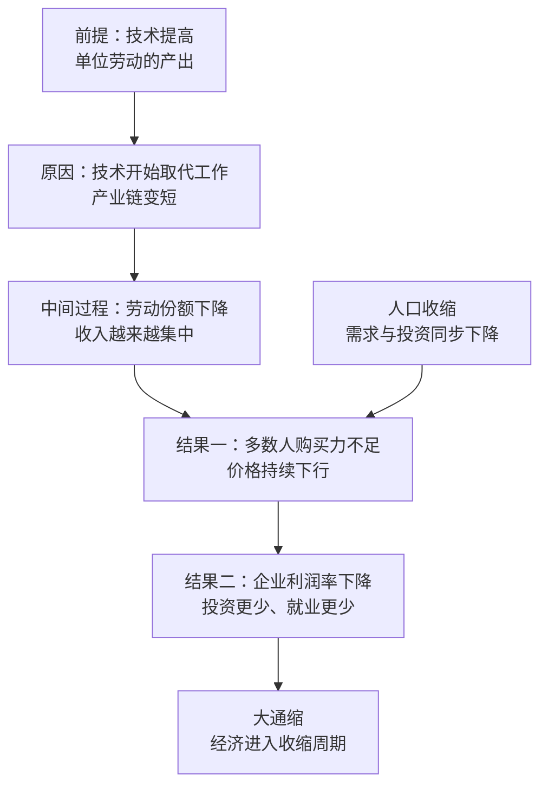

# 17｜大通缩与大坍缩：为什么 AI 越强，经济越可能收缩？

> 如果技术越来越强，为什么普通人的日子可能越来越紧？

---

## 一、先说结论

张笑宇在书里给了一个反直觉的判断：科技的进步、经济的增长、人口的增长，这三位一体的增长，与其说是工业时代的必然，不如说是人类社会特定时期的一种幸运；一旦过了这个阶段，三位一体本身就会瓦解，社会进步会越来越步履蹒跚。

也就是说，工业时代那种「技术变强、经济变大、人口变多，三者互相喂养」的顺风局，可能只是一个历史窗口，而不是常态。他进一步判断：AI 提高效率，却会压低劳动在收入中的份额，让通缩与分化同时加剧；制造业转向服务业也未必是升级。技术进步不会自动带来繁荣。

## 二、我们先理解一个问题

我们从小被教的那条链条是这样的：技术越进步，生产力越高；生产力越高，商品越便宜；商品越便宜，大家生活越好。

这条链条在过去两百年大体成立，所以我们把它当成了规律。可是请注意，它中间藏着一个很容易被跳过的环节：**生产出来的东西，得有人买得起。**

如果技术进步只提高了产量，却同时让大多数人失去收入，那么产量越高，东西越卖不出去；价格越往下走，企业越不敢投资；投资越少，就业越少——一个越转越冷的循环。

请问：为什么技术进步不一定会带来繁荣，反而可能带来一个「大通缩」的时代？

## 三、作者到底提出了什么观点？

作者的观点可以拆成三层。

第一层，三位一体的增长是幸运，而不是必然。农业时代技术进步缓慢，人口与产出大致同步；到了工业时代，蒸汽机、电力、流水线让单位劳动的产出大幅提升，同时人口也在增长，需求与供给一起扩大，经济于是看起来永远向上。作者认为，这是特定历史阶段的巧合。

第二层，技术革命的性质变了。作者引用经济学家阿西莫格鲁的解释：工业化时代的技术革命更多是创造新工作，信息化时代的技术革命则更多是取代旧工作。

第三层，人口这个变量掉头了。生育率下降难以挽回；人口收缩会让金融进入收缩周期；人口不足意味着企业平均利润率下降、产业红利消散、规模优势丧失。作者特别强调：这是依靠自动化和 AI 无法解决的问题。

## 四、把这个观点翻译成人话

想象一张桌子，靠三根柱子撑着：技术进步、经济增长、人口增长。过去两百年，三根柱子一起长高，桌子稳如磐石，我们就以为桌子本来就是这样。

现在其中一根柱子——人口——开始缩短；另一根柱子——技术——还在长，但它生长的方向变了：它不再需要那么多条腿站在桌子底下。

书里有一组数据很能说明问题。1850 年，美国农业附加价值贡献中劳工占比 32.9%，到 1909 至 1910 年降到了 16.7%；同时制造业就业比例从 1850 年的 14.5% 上升到 1910 年的 22%，制造业与服务业附加价值从 46% 上升到 53%。也就是说，人从农业被搬进了工厂。

那今天呢？书里的原话大意是：过去的标准说法是，一个国家产业升级的表现是制造业占比下降、服务业占比上升，其实工人们转去服务业哪里是什么升级？他们是被逼过去、被挤过去的。

这句话很重。因为「升级」意味着主动选择，「被挤过去」意味着被动承受。作者在书中的判断是：许多过去的中产阶级劳工被推向低薪职位——建筑工人、清洁人员、服务员，实际收入下降。

## 五、为什么会这样？

把作者的推理拆开，是一条从供给侧走到需求侧的链条：技术提高单位劳动的产出，但分配没有跟上，于是效率变成了通缩的压力。

这里的关键是第三步到第四步。效率提升本身不是坏事，问题在于效率提升的收益如果集中在少数人手里，多数人的购买力就不增长；而生产出来的商品和服务，终究要靠多数人来买。价格于是被迫下行。

与此同时，人口收缩从另一头施加压力：人少了，住房、汽车、教育、消费的需求都下降，投资回报率下降，企业自然减少扩张。两条线合起来，就是作者所说的「大通缩」。

他还提到一个更宏观的可能原因：技术手段尚不足以突破地球的物理空间限制。也就是说，当增长找不到新的空间，剩下的就只是存量之间的争夺。

## 六、举一个现实生活中的例子

最好的现实样本是日本。

日本在 1990 年代初泡沫经济破裂之后，进入了长期的低通胀、甚至通缩状态。与此同时，日本的人口在 2008 年前后见顶，劳动年龄人口更早就在下降；为了对抗通缩，日本长期维持超低利率，并多轮实施量化宽松，政府债务对 GDP 的比重长期位居发达国家最高之列。

值得注意的是：日本并没有停下技术进步。它在工业机器人、精密制造、材料科学、汽车工业上依然是强国，工厂里的自动化程度在全球领先。可是即便如此，通缩、低增长、消费低迷的状态依然持续了几十年。

这就是作者想说的：**技术强，不等于需求旺；效率高，不等于繁荣。** 当人口与需求这一侧持续收缩时，技术进步会被用来「用更少的人做同样的事」，而不是用来创造新的繁荣。

同一机制在美国的版本，是工厂工人被「挤」进服务业：制造业岗位流失之后，大量工人转去做建筑、清洁、餐饮、护理等低薪岗位，职业换了，收入却没有回来。

## 七、回到书中重新理解

现在我们再回头看《AI文明史·前史》，就能理解作者为什么把「大通缩」放在「大坍缩时代」这一部分。

他的逻辑是递进的：技术让智能可以量产，智能量产让劳动被替代，劳动被替代让分配失衡，分配失衡让需求不足，需求不足让经济收缩——而经济收缩又会反过来冲击财政、政治与社会契约。

书里还给出了一组分配侧的证据：皮尤研究中心的调查发现，68% 的美国人认为自己的下一代经济状况将不如上一代；1980 到 2020 年，德国最富有的 1% 的财富占国民所得比例从 10% 升到 13%，英国从 7% 升到近 13%，瑞典从 7% 升到 11%，丹麦从 7% 升到 13%。

这些数字说明的不是谁变坏了，而是一个结构事实：增长还在发生，但增长的果实越来越集中。

## 八、这个观点背后还有什么？

第一，**这是一个分配问题，不是总量问题。** AI 时代的总产出很可能继续增长，但如果劳动份额下降，多数人的处境仍会变差。总量指标会掩盖分配事实。

第二，**人口是最慢也最硬的变量。** 技术可以一年换代，制度可以几年调整，人口结构要几十年才能改变。作者认为生育率下降难以挽回，这意味着政策腾挪的空间比想象中小。

第三，**债务是通缩的放大器。** 价格下行时，债务的实际负担上升，还债压力挤压消费，消费减少又让价格继续下行。作者提到，二十世纪以来人类最大的财务负担基本来自主权国家——这意味着大通缩不只是市场问题，也是财政问题。

第四，**这不是一次衰退，而是一种新的常态。** 作者用的是「时代」这个词，而不是「危机」这个词。

## 九、这个观点有问题吗？

这个观点有说服力，也有明显的争议空间。

说服力在哪里？劳动份额与制造业就业的结构性变化是真实的历史数据；日本提供了长达三十年的长期通缩样本；「技术开始取代工作」这一判断也有阿西莫格鲁等经济学家的研究支撑。

争议在哪里？第一，技术进步在历史上确实也创造过全新的需求与职业：铁路、电力、汽车、互联网都曾被认为会消灭工作，结果都催生了新的行业。第二，通缩对消费者并不全是坏事——同样的钱能买到更多东西，购买力是上升的。第三，AI 也可能带来新的增长范式：零边际成本的数字产品、全新的服务形态，都可能创造我们今天还没有名字的市场。

哪里过度简化？把通缩主要归因于 AI 与人口，可能低估了全球化、金融化、产业政策、企业治理等其他变量的作用。日本的长期通缩也有其特殊原因，比如资产负债表衰退与内需结构问题，未必可以简单外推。

还需要强调：作者所说的「大通缩」是一个前瞻判断，而不是已经完成的既成事实。关于技术进步与就业、通缩与增长之间的关系，学界存在不同解释。

## 十、今天再看这个观点

以下部分是基于作者思想的现代延伸，不是作者原话。

2023 年以后，生成式 AI 进入客服、编程、设计、文案、翻译等岗位，很多公司开始用更少的人完成同样的产出。一些行业出现了「无就业增长的复苏」：营收恢复了，招聘却没有恢复。与此同时，低价零售与消费降级的讨论变多，年轻人对「努力就能上升」的信念在减弱。

从宏观上看，如果低增长与高债务长期并存，财政会变得非常脆弱：利率稍有波动，利息支出就会挤压其他开支。从个人角度看，这个观点给出的提醒是：**收入的位置比努力的程度更重要。** 站在正在被技术替代的环节上，努力只能延缓下行；站在需求仍然旺盛、又不容易被语言化的环节上，努力才有复利。

## 十一、这一篇真正应该记住什么？

1. 「技术进步 + 经济增长 + 人口增长」的三位一体，是特定历史窗口的幸运，不是永恒规律。
2. 工业化时代的技术革命创造工作，信息化时代的技术革命更多取代工作——这是技术性质的变化。
3. 制造业转服务业往往不是升级，而是工人被挤过去的结果。
4. 效率提升如果收益集中在少数人手里，就会变成通缩压力，而不是普遍繁荣。
5. 人口收缩带来的利润率下降与规模优势丧失，是自动化和 AI 无法解决的问题。

## 十二、留一个问题

如果增长的引擎开始熄火，分配又越来越不均，那么社会靠什么维持下去？

过去两百年的答案是：一份工作换一份生活。工作、工资、尊严、保障，被打包在同一份社会契约里。现在这份契约的甲方——需要大量人力的经济——正在变小。

那么，如果社会决定重新订约，用全民基本收入、甚至全民基本工作来兜底，这套新契约真的能成立吗？它要花多少钱，又要用什么代价来换？
