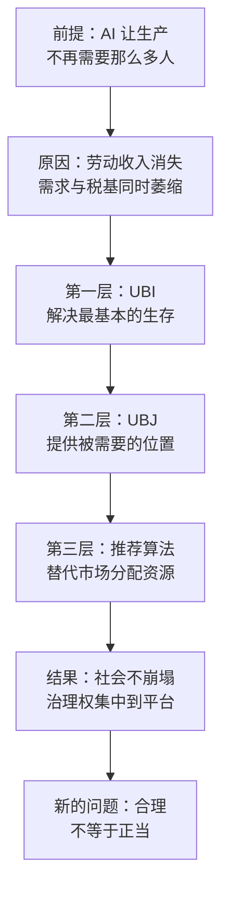

# 18｜重订社会契约：UBI 和 UBJ 能解决分配问题吗？

> 当工作不再是分配的入口，社会还能靠什么把人接住？

---

## 一、先说结论

张笑宇在书里提出，我们应该认真思考重订社会契约的问题。他的设想分三层：第一层是 UBI，也就是全民基本收入，解决最基本的生存问题；第二层是 UBJ，也就是全民基本工作，解决人的价值感问题——因为人的价值感很大程度上源于「被需要」；第三层是用推荐算法替代市场分配，在供给极大丰富之后，把社会资源精准分配给无数个细分的、独特的社群和个体。

但他同时给了一个警告：这三层架构背后，有一只终极的「巨手」——掌控着 AI 超级平台的组织。它能提供一切治理服务，也能决定你得到什么。到那时，我们将面对一个终极的政治哲学问题：当人类被一个超级智能「圈养」，即便生活富足，这种「合理」的安排是否具备「正当性」？

## 二、我们先理解一个问题

先问一个更朴素的问题：今天的社会，是靠什么把绝大多数人接住的？

答案不是慈善，也不是政府拨款，而是工作。你工作，所以你有收入；你有收入，所以你纳税；你纳税，所以社会有公共服务；同时，工作还给你身份、节奏、同事，以及「我在做一件有用的事」的感觉。

这套安排就是社会契约的日常形态。它有一个隐含前提：**经济需要大多数人工作。**

可是如果这个前提被 AI 抽掉了呢？如果企业用很少的人就能生产出足够多的东西，那么工作不再需要那么多人，收入、税基、身份、尊严就会同时松动。

请问：面对这样的分配危机，UBI 和 UBJ 这样的方案够用吗？

## 三、作者到底提出了什么观点？

作者首先质疑的是社会契约的「单位」。过去的社会契约是以民族国家为单位订立的。但他在书中写道：在今天，生活在纽约、硅谷、香港或新加坡的人，彼此之间的教育水平、经验共通性、价值观和利益相关度的差异，可能远小于生活在上海和鹤岗的人之间的差异。

这句话的意思是：国家边界内部的分化，可能已经超过了国家之间的差异。那么以国家为单位的再分配，就未必能对准真正的鸿沟。

其次，作者认为 UBI 之类的方案在 AI 技术的冲击面前「想象力还远远不足」。原因很实在：大通缩时代政府需要出清债务，而 UBI 的实施大概率是扩张债务的。

所以他给出的是一个三层架构。

第一层，UBI，解决最基本的生存问题。

第二层，UBJ，也就是全民基本工作。因为人的价值感很大程度上源于「被需要」，所以需要提供基础性的、带有福利性质的岗位。

第三层，用推荐算法替代市场分配。供给极大丰富之后，用推荐算法把社会资源精准分配给无数个细分的、独特的社群和个体，支撑一个去中心化的经济生态。

## 四、把这个观点翻译成人话

把这三层想成一栋楼。

一楼是活下去：吃饭、住房、看病，不管你工作不工作，都有一份基本的钱。这一层是 UBI。

二楼是被需要：人不能只是活着。一个长期没有事情做、也没人需要他的人，会失去对自己的评价。所以二楼提供一些带有福利性质的工作岗位，让你有事做、有人等、有位置。这一层是 UBJ。

三楼是「谁来分」：当东西足够多，问题就不再是够不够，而是给谁。作者设想用推荐算法来做这件事——像今天平台推荐内容一样，把资源推荐给需要它的人和社群。

这里最容易被忽略的是三楼。因为一谈到分配，我们习惯的答案只有两个：市场，或者政府。作者提出了第三种可能：算法。

而「合理」与「正当」的差别，是这一篇最该记住的一句话。给一头动物提供充足的食物、温暖的空间和专业的医疗，从管理角度完全合理；但它没有选择权，所以谈不上正当。

## 五、为什么会这样？

作者的推理链条是这样的：前提是劳动不再是分配的主要入口，原因是收入与需求同时崩塌，中间过程是三层兜底，结果是社会不崩，但治理权集中。

关键的转折在最后两步。前三层解决的是「人怎么活下来」和「人怎么有位置」，它们都假定有一个执行者：谁来收税、谁来发钱、谁来安排岗位、谁来运行算法？在作者的分析里，这个执行者最可能是掌控 AI 的超级平台，因为它同时掌握算力、数据、服务入口和治理能力。

于是问题从经济问题变成了政治哲学问题。

## 六、举一个现实生活中的例子

理解「契约单位变了」这件事，最好的例子是上海与鹤岗。

上海的人均产出、房价、工资水平、公共服务密度，都处在全国前列；鹤岗是黑龙江的一座资源型城市，因为煤炭产业收缩、人口持续流出，一度以「几万块买一套房」被全国讨论。

一个在上海写代码的人，和一个在鹤岗送外卖的人，说同样的语言，看同样的短视频，用同样的支付工具，甚至可能刷到同一条热搜。但他们的机会结构、收入预期、对未来的想象力，差距可能比纽约和伦敦之间还大。

而与此同时，一个在上海写代码的人，和一个在硅谷写代码的人，教育背景、工作内容、价值取向、日常工具可能高度相似。

这就是作者那句话的现实含义：**契约如果以国家为单位签订，它可能既接不住国家内部的分化，也管不住跨国界的同类。**

作为对照，芬兰在 2017 到 2018 年做过一次著名的基本收入实验：随机抽取约两千名失业者，每月发放 560 欧元免税基本收入。结果显示，领取者的幸福感和对生活的信心明显提升，压力下降，但就业情况与对照组相比没有显著改善。这个实验常被用来说明 UBI 的两面：它能改善人的处境，却未必能把人送回工作岗位——而「送不回岗位」这件事，恰恰是作者要设 UBJ 的原因。

## 七、回到书中重新理解

现在我们再回头看《AI文明史·前史》，就能看清作者的三层架构其实各有针对性。

UBI 针对的是生存：当劳动不再是收入的主要来源，收入就必须与劳动脱钩。
UBJ 针对的是意义：当工作消失，人的价值感来源必须被重新安排，作者用的词是「被需要」。
推荐算法分配针对的是匹配：当供给极大丰富，稀缺的不再是商品，而是注意力与匹配精度。

作者还写了一句很有分量的话：加速世界能否尊重社会契约、以何种方式保护减速世界中人的利益，很可能会影响未来的超级智能是否尊重它跟人类的社会契约。这句话把国内政策问题变成了文明问题——你怎样对待被时代甩下的人，就是在教未来的超级智能怎样对待人类。

而他对正义社会的期待，是全书中最柔软的一段：

> 我期待的正义社会，不是在一圈跑道上，每个人都需要竭尽全力奔跑才能生存；我期待的正义社会是在一片草坪上，有人可以奔跑，有人可以坐下来欣赏花草，偶尔抬头看看天。

## 八、这个观点背后还有什么？

第一，**人的价值感来自被需要，而不是来自收入。** 这是 UBJ 存在的全部理由。一个只发钱、不给位置的社会，会养出一批身体安全、精神失重的人。

第二，**分配问题本质上是权力问题。** 谁来发、按什么标准发、算法由谁写——每一个问题都比发多少更根本。

第三，**算法可以承担一部分市场的功能，但算法有所有者。** 市场是一只看不见的手，没有主人；推荐算法也是一只看不见的手，但它有主人。这是作者设想中最需要被追问的一点。

第四，**这套设想是规范性的，不是预测性的。** 作者在书里讨论的是应该怎样，而不是一定会怎样。

## 九、这个观点有问题吗？

这个观点很有想象力，但每一层都需要被质疑。

关于 UBI：学界有大量争论。财政上，钱从哪来、规模多大、是替代现有福利还是叠加；激励上，会不会减少工作意愿；政治上，加税的对象是谁、能不能通过。这些都没有共识。关于这一问题，学界存在不同解释。

关于 UBJ：一些学者认为这类岗位能提供尊严与社会连接，另一些学者则认为它可能变成「假装的工作」——用一份没有真实产出的岗位来安抚人，反而会损害人的自尊。UBJ 究竟是被需要，还是被安排，取决于岗位本身有没有真实的用途。

关于推荐算法替代市场分配：这是全篇争议最大的一点。价格机制虽然冷酷，但它承担着信息发现的功能——它让无数人分散的知识汇成一个信号。用算法替代价格，就必须回答：算法如何知道什么值得被生产？如何避免平台通过分配权寻租？谁来定义「需要」？会不会形成新的算法偏见？

关于正当性：作者的警告本身很清醒，但他没有给出答案——如果超级平台确实提供了富足的生活，人类凭什么说它不正当？这个问题的答案，可能不在经济学里，而在政治哲学里。

最后需要提醒：三层架构是作者提出的方向性设想，具体机制应以原书为准。

## 十、今天再看这个观点

以下部分是基于作者思想的现代延伸，不是作者原话。

UBI 的试验已经在多个地方发生过：芬兰的全国性实验之外，肯尼亚有长期的无条件现金转移项目，美国多个城市做过小规模试点，一些国家在疫情期间发放过接近基本收入的现金补助。结论并不统一，但至少说明：无条件发钱在技术上不难，难的是长期财政与政治共识。

UBJ 的近亲是各种公共就业与就业保障计划：以工代赈、绿色就业、社区服务岗位。它们的共同问题是：岗位的真实需求有多大？如果需求不足，它就退化成安置。

而推荐算法作为分配者，其实已经在发生：平台决定谁的内容被看见、谁的店排在前面、谁的骑手接到单。我们今天争论的流量分配，就是未来资源分配的雏形。

对个人来说，这个观点给出的提醒也许是：**不要只准备自己的技能，也要准备自己的位置。** 当经济不再需要所有人工作时，「有人需要你」会比「你能干什么」更值钱。

## 十一、这一篇真正应该记住什么？

1. 社会契约过去以国家为单位、以工作为入口，这两个前提都在松动。
2. 作者的三层设想：UBI 保生存，UBJ 保被需要，推荐算法承担分配。
3. 人的价值感很大程度上源于被需要——这是 UBJ 存在的理由。
4. 三层架构背后有一只巨手：掌控 AI 的超级平台。合理不等于正当。
5. 你怎样对待被时代甩下的人，就是在教未来的超级智能怎样对待人类。

## 十二、留一个问题

如果三层架构都要靠一个执行者来运行，那么真正的关键就不是发什么，而是谁来发。

而只要涉及谁来发，就绕不开一个更基础的东西：钱。如果钱不够，能不能换一种钱？如果数字世界里的东西已经便宜到接近免费，而物理世界的一小时护理依然需要一个人，那么用同一套货币给这两个世界定价，还说得通吗？

这就要回到一个更古老的问题：货币到底是什么。
