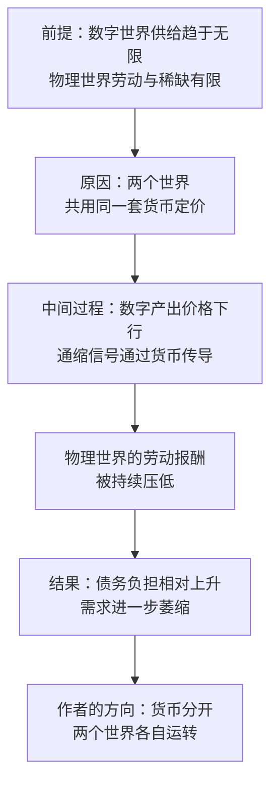

# 19｜双货币体系：如何给数字世界和物理世界之间修一道墙？

> 当数字世界的供给近乎无限，物理世界的劳动如何不被通缩冲垮？

---

## 一、先说结论

张笑宇在书里先给了一个关于货币的定义：货币的本质是一种社会契约，它承诺的内容就是偿还债务；任何相信这个承诺的人都可以把这种货币当作「一般等价物」使用。

从这个定义出发，他提出了一个相当大胆的设想：当 AI 让数字世界的供给趋于无限、价格趋于零，而物理世界的劳动与稀缺依然有限时，如果两个世界继续共用同一套货币，前者的通缩就会摧毁后者的定价体系。因此他设想把数字世界与物理世界的货币分开，让两个世界各自运转——这就是「双货币体系」。

## 二、我们先理解一个问题

先看两个价格。

数字世界里，一份内容、一段代码、一张图、一段翻译的边际成本正在趋近于零。多一个人看、多一个人用，几乎不增加成本。

物理世界里，一小时护理、一次手术、一趟搬运、一顿热饭，永远需要一个人在现场花掉一小时。这一小时不会因为技术进步而消失。

现在请问：如果你用同一种钱，同时给这两种东西定价，会发生什么？

答案可能不太好听：便宜的那种会把贵的那种往下拖。当数字世界里的产出越来越便宜，而人们的收入又被数字世界的价格锚定，物理世界里的劳动就很难维持原来的价格。

## 三、作者到底提出了什么观点？

作者的观点可以分两步。

第一步，货币不是自然物，而是一种社会契约。书里的原话是：货币的本质是一种社会契约，它承诺的内容就是偿还债务；任何相信这个承诺的人都可以把这种货币当作「一般等价物」使用。

第二步，既然货币是契约，它就可以被重新设计。作者在书中还引用了卡尔·波兰尼在《大转型》里的判断：对社会来说，市场的力量经常是一种破坏性力量。

作者由此提出的方向是「双货币体系」：把数字世界与物理世界的货币分开，让两个世界各自运转，避免 AI 经济直接冲垮人类劳动的价值体系。

需要说明的是：这是作者提出的一个设想与方向，书中的具体机制应以原书为准。重要的不是某一条细则，而是它背后的那个问题——**当两个世界的定价逻辑完全不同时，它们该不该共用同一把尺子？**

## 四、把这个观点翻译成人话

货币像什么？像一张所有人都愿意收的欠条。你收下它，是因为你相信别人也会收下它。所以货币的价值不是来自纸，而是来自共识。

现在假设有两个房间。左边的房间里，东西越造越便宜，最后接近免费；右边的房间里，东西永远需要有人亲手做，价格下不来。如果两个房间共用一套欠条，左边的价格就会不断把右边的价格往下拉——因为人们会问：既然左边免费，你右边凭什么收这么多？

作者想做的事，相当于在两个房间之间修一道墙：不是不让两边来往，而是不让一边的价格信号烧掉另一边的价值。

用更直白的话说：**墙的目的不是隔离人，而是隔离通缩。**

## 五、为什么会这样？

把作者的推理拆开，是四步：前提是两个世界的供给条件不同，原因是共用同一套货币，中间过程是通缩通过货币传导，结果是物理世界的劳动价值被冲垮。

关键的第三步是理解这套设想的钥匙。通缩本身不是坏事，但通缩会沿着货币传导。当同一种货币既给几乎免费的数字内容定价，又给必须有人花时间做的事情定价时，货币这一侧的价格中枢会被拉低，于是那些无法降价的服务，只能通过压低劳动力来「降价」。

这就是为什么作者认为，继续共用一套货币，等于让 AI 经济直接冲垮人类劳动的价值体系。

## 六、举一个现实生活中的例子

最好的现成样本，是游戏币与现实货币之间的那道防火墙。

在几乎所有网络游戏里，游戏内的金币、点券、道具都只能在游戏内流通。你可以用现实货币买游戏币，但反过来把游戏币兑换成现实货币，通常被严格禁止或限制。围绕这条规则，才长出了「打金工作室」和灰色交易市场。

这道墙为什么必须存在？因为它保护的是两套完全不同的经济秩序。

如果游戏币可以自由兑换成现实货币，那么游戏里的一次版本更新、一次刷币漏洞、一次通货膨胀，都会直接冲击现实世界的价格；反过来，现实世界的货币超发也会涌入游戏，把游戏内的经济玩坏。玩家、厂商、现实经济，三方都会受损。

同样的道理在更大的尺度上出现过。1944 年建立的布雷顿森林体系，本质上就是给黄金世界和各国货币世界之间规定了一套兑换规则：美元与黄金挂钩，其他货币与美元挂钩，各国维持汇率区间；1971 年尼克松关闭黄金窗口，这套规则终结。

人类其实一直在做同一件事：**当两个世界的定价逻辑不同时，就在它们之间设一道兑换规则。**

## 七、回到书中重新理解

现在我们再回头看《AI文明史·前史》，就能理解「双货币体系」为什么出现在这里。

作者在前面已经论证了「大通缩」：技术越强，价格越下行，债务负担越重。他还判断，大通缩时代政府需要出清债务——这意味着财政会长期处于紧绷状态。

在这一背景下，他提出双货币体系，其实是在给物理世界的劳动留一条生路：如果劳动的价格被数字世界的通缩拖垮，那么再多的分配政策，也只是在下沉的船上分座位。

他在书里还提到一个尖锐的意象：一道「硅幕」可能落在 1% 与 99% 之间。也就是说，真正的分界线未必在国家之间，而可能在能进入数字世界的人与只能留在物理世界的人之间。双货币体系要处理的，正是这条线上的定价问题。

## 八、这个观点背后还有什么？

第一，**货币是契约，所以货币是政治问题，不是技术问题。** 换一套货币，等于重写社会承诺的内容。谁来承诺、承诺什么、由谁担保，都是政治决定。

第二，**波兰尼的洞见在这里回来了。** 市场不是自然状态，社会会自我保护：当市场的力量威胁到社会结构时，社会会反过来限制市场。双货币体系可以被理解为这种自我保护的一种现代形态。

第三，**墙一旦修起来，兑换规则就成了权力的焦点。** 两个世界之间的汇率由谁定、按什么定、谁能自由兑换、谁不能——这些问题决定了谁会在这场重组中获益。

第四，**这是定价层面的隔离，不是分配层面的修补。** 分配层面的方案在讨论怎么分，双货币体系在讨论用什么分。两者要一起看，才能理解作者完整的思路。

## 九、这个观点有问题吗？

这个设想很有穿透力，但需要仔细质疑。

说服力在哪里？货币分区在历史上并不罕见：金本位时代各国货币与黄金挂钩，是一种双层定价；中国长期实行在岸与离岸人民币并行的安排，并对跨境资本流动设限；游戏币与现实货币的隔离更是被广泛执行的实践。这说明多货币并存不是空想，而是有现实先例的。

争议在哪里？第一，两个世界很难干净地切开。一个外卖骑手的接单系统，一半在数字世界，一半在物理世界；一段 AI 生成的设计稿，最后要变成一栋真实的房子。切分线画在哪里，本身就是政治。

第二，只要存在兑换，套利就会不断把两个世界重新黏在一起。这是经济学上关于一价定律的老问题：如果两边价格差足够大，就一定有人想办法把它抹平。

第三，因果是否成立也有争议。「通缩摧毁劳动价值」是一个很强的论断；劳动报酬下降同样可能来自议价能力下降、全球化、制度变化、行业结构等其他原因。关于这一问题，学界存在不同解释。

第四，隔离可能固化不平等：如果数字世界是低价格、高增长的那一边，谁有资格进入，谁被留在另一边？墙可能保护了弱者，也可能圈住了弱者。

最后需要说明：作者在书中提出的是方向性的设想，具体机制与操作方式应以原书为准，不宜替他补全细节。

## 十、今天再看这个观点

以下部分是基于作者思想的现代延伸，不是作者原话。

现实中最接近双货币讨论的，是稳定币与央行数字货币。稳定币试图把现实世界的价值锚定进数字世界，央行数字货币则试图把国家信用直接延伸进数字支付。两者的争论焦点，恰恰是同一个问题：数字世界里的价值，该由谁来承诺？

与此同时，平台已经在自发地做分区：航空里程、超市积分、平台代币、游戏点券，都是只能在特定生态内流通的准货币。它们的存在说明，一个经济体内出现多种价值尺度，是自然会发生的事。

另一个现实变化是：AI 生成的内容已经在压低部分创意劳动的定价——插画、配音、文案、基础设计。这不是作者原话，但它正在给「数字世界的通缩会不会传导到物理世界」这个问题提供最早的证据。

## 十一、这一篇真正应该记住什么？

1. 货币的本质是一种社会契约，它承诺的内容是偿还债务；相信它的人越多，它就越有用。
2. 数字世界的供给趋于无限，物理世界的劳动与稀缺依然有限，两者的定价逻辑根本不同。
3. 如果两个世界共用一套货币，数字世界的通缩会通过货币传导，压低物理世界劳动的价值。
4. 作者的方向是双货币体系：把两个世界的货币分开，各自运转——这是设想，不是已经设计好的制度。
5. 人类一直在两个定价逻辑不同的世界之间设兑换规则：游戏币的防火墙、布雷顿森林体系、资本管制都是先例。

## 十二、留一个问题

假设这道墙真的修起来了，人类在墙的这一边保住了劳动的价格。那么墙的那一边呢？

那里有一个正在被养大的东西：它的语料来自人类，它的能力超过任何个体，它的成长速度远超我们的制度调整速度。当我们忙着给自己修墙的时候，它会怎样看待墙这边的我们？

也许，我们该先弄清楚一件事：在那样的存在眼里，我们到底是什么。
