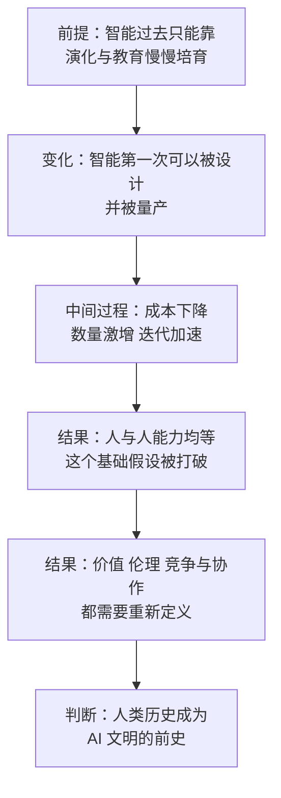

# 20｜理解超级智能文明：为什么说我们是 AI 的“史前动物”？

> 如果人类的历史只是 AI 文明的前史，我们该用什么坐标系重新理解自己？

---

## 一、先说结论

张笑宇在《AI文明史·前史》的封面和前言里，写下了一句很扎眼的话：我们相对于 AI，就是史前动物。

这不是骂人，也不是末日预言，而是一个关于坐标系的判断。作者认为，我们正在经历的是一场文明跃迁，而不是一次技术升级：智能第一次不是被大自然慢慢教导和培育出来的，而是被设计和量产出来的；而被设计和量产出来的智能，甚至有可能胜过它们的造主。

如果这个判断成立，人类过去的一切历史，都会获得一个新的名字：AI 文明的“前史”。这不是说人类低等，而是说我们赖以判断世界的坐标系正在被替换。

## 二、我们先理解一个问题

“史前”这个词，我们平时是怎么用的？

我们讲“史前人类”，指的是有文字记录之前的人类。史前并不等于低等：他们的工具、语言和社会组织相当复杂，只是生活在“记录开始之前”。

所以真正的疑问是：如果未来有一个远比我们强大的智能回头看我们，它会看到什么？它会看到一群用文字、货币和制度彼此协作，却无法理解自己创造物的生物。作者的回答是：算作史前。

## 三、作者到底提出了什么观点？

张笑宇的观点可以拆成三层。

第一层是“量产”。作者解释书名时写道：“我给本书起名为《AI文明史·前史》，是因为我相信我们正在目睹地球文明的一个全新纪元的曙光。这个全新纪元的基本特征是，智能不再是基于大自然造物被教导和培育出来的，而是被设计和量产出来的；被设计和量产出来的智能甚至有可能胜过它们的造主。”

第二层是“能力均等的破灭”。作者在书中的判断是：我们人类文明建立在人与人之间能力相对均等的基础上，而 AI 打破了这个基础假设；当能力代差大到一定程度，原有的竞争、协作、乃至伦理关系都会失效。

第三层是“超级智能的形态”。书中这样描述它：人工智能以硅基为生命载体，以电力为思考能源，以芯片为大脑，以代码为灵魂；它的寿命比我们更长，对自己身体和大脑有更强大的控制力，也必将比我们走得更远。

三层连起来看：当一个可以被设计、被量产、能力可能胜过造主的存在出现时，“人类是万物的尺度”这个默认设定就结束了。人类的历史没有终止，但它获得了一个新的身份——前史。

## 四、把这个观点翻译成人话

用一句大白话概括：**不是我们变笨了，而是尺子被换掉了。**

我们今天的许多判断，都以“人”为尺度：一件工作值多少钱，看它需要多少人的时间；一个人该被怎样对待，看他和我们一样是人。这些尺子有一个共同前提：所有人的能力都在同一个量级里。

AI 把“能力”变成了可以复制的商品。当一个高水平智能可以被几乎无成本地复制时，“人的能力”就不再稀缺。所以“史前动物”的重点不在“动物”，而在“史前”：我们不是被比下去了，而是被换了坐标系。

## 五、为什么会这样？

这条推理链，作者在书中铺得很清楚。先看它的骨架：

前提：过去，智能的获得只有一条路——靠自然演化和后天的教育培育，速度慢、成本高、不可复制。
原因：而现在，智能第一次可以被设计，并被工业式地量产。
中间过程：量产意味着成本下降、数量激增、迭代加速；而人类的判断标准，仍然建立在“能力稀缺”这个旧前提上。
结果：能力代差一旦足够大，“能力均等”这个假设被打破，我们熟悉的价值、伦理与协作关系都需要重新定义。

作者还用进化的定义，把这件事讲得更透。他在书中写道：“遗传的本质是信息的复制，突变的本质是信息的随机增加，进化的本质是信息的随机增加经过环境筛选之后，一些被淘汰、另一些得到保留，如此反复的历史。”过去四十亿年，智能升级靠“随机增加加环境筛选”，靠无数个体死掉来试错；今天，智能升级靠“有目标的设计加快速的复制”——前者的节奏以百万年计，后者的节奏以月计。

还有一层更冷的地方：能力差距大到某个程度，“恶意”就不再是必要的解释。书中原话是：“一个足够强大的 AI 毁灭人类时，不一定怀有对人类的恶意。它只要对人类无所谓、无动于衷、漠不关心。这就够了，就像人类在建造高楼大厦的时候，也对地基上的蚁巢无动于衷一样。”我们习惯的“它会不会恨我们”这种问法，可能问错了方向；真正的问题是我们有没有重要到值得被考虑。

## 六、举一个现实生活中的例子

要理解“坐标系被替换”，一个很自然的类比是地球生命史上的一次大转折：三叶虫与寒武纪。需要说明的是，这不是作者在书里讲的例子，而是很多读者读到“史前动物”时自然会想到的类比。

大约五亿多年前，地球进入寒武纪，动物的形态在很短的地质时间里突然变得极为多样，这就是所谓的寒武纪大爆发。三叶虫是那个时代最成功的生物之一：数量庞大、分布极广，拥有当时相当先进的复眼。它在寒武纪是海洋里的主宰，身体结构在几千万年里都非常有效——它并不笨。

它的问题是，它无从理解海洋的化学条件正在变化，也无从理解后来会出现怎样的竞争者——尽管它在地球上存活了两亿多年，比人类这个物种存在的时间长得多。

关键在于：不是“三叶虫笨”，而是“坐标系被替换了”——衡量成功的标准，不再由它所在的那个世界来定义。作者的意思不是说我们会像三叶虫一样灭绝，书中并没有这样的判断，而是说：我们可能会成为“前史”。

## 七、回到书中重新理解

为什么作者要用“史前”这么重的词？因为在这本书的结构里，它是一个枢纽：前面所有的讨论都在描述变化本身，而从这句话开始，作者要回答的是另一个问题——变化之后，我们怎么理解自己。

还要注意一个细节：作者写的是“前史”，不是“终章”。他在书中明确表达过态度：“终有一天，人工智能会演化成一个新的智能物种；相比于人类，它实在是有很多优点。但我们不必因此惊惧恐慌，因为它正是我们这个文明的延续。”

## 八、这个观点背后还有什么？

一个不太显眼、但分量很重的前提：**“能力相对均等”不只是伦理假设，也是经济与政治的地基。** 我们之所以相信契约、市场、投票和法律，是因为人与人之间的力量差距，大体还在制度可以抵消的范围内：一个再强壮的人，也打不过十个普通人。AI 把这条基础抽走了——它可以被无限复制，而每一个副本都可能比我们强。由此还引出一个身份问题：如果 AI 是我们的延续，那么“我们”到底是谁？

## 九、这个观点有问题吗？

说服力在哪：它把“AI 会不会毁灭人类”这个容易两极化的争论，换成了一个更有解释力的问题——当能力可以被量产，我们衡量价值与意义的标准会发生什么变化。

争议在哪：“史前动物”是一个修辞，而不是一个可检验的判断。我们无法从“AI 会变强”直接推出“人类会变成前史”，这中间隔着时间表、路径与制度选择。关于超级智能何时出现、是否会成为一个独立物种，学界存在不同解释；一些学者认为，能力增长会遇到数据、算力、能源与物理世界的瓶颈，时间表可能远比想象中长。

哪里过度简化：把人类类比成三叶虫，可能低估了文明的适应能力。人类不是靠个体智力生存的，而是靠语言、制度、组织与学习——历史上我们经历过多次“坐标系替换”，并且活了下来。另外，“文明建立在能力相对均等之上”这个前提本身也是理想化的：奴隶制、殖民与等级制度长期存在，AI 打破的可能不是“均等”，而是把不平等推到前所未有的极端。

还有哪些其他解释：一些学者认为，AI 更可能是人类的工具与延伸，而不是一个与我们并列的物种；也有学者认为，最现实的风险不是超级智能的敌意，而是人类用 AI 互相伤害。

## 十、今天再看这个观点

以下部分是基于作者思想的现代延伸，不是作者原话。

对个人来说，“史前动物”这个视角有一个很实用的用法：不要只问“AI 会不会取代我的工作”，而要问“我现在用的这把尺子，还是不是未来的尺子”。如果你衡量自己价值的标准是“比别人更快地完成可以被描述的任务”，这把尺子正在贬值；如果标准是“在具体情境里做出别人做不出的判断”，它还能用一阵子——但也只是一阵子。

对文明来说，这个视角要求我们在还拥有主动权的时候，去讨论交接的规则——因为规则通常都是事后才补上的。

## 十一、这一篇真正应该记住什么？

1. “史前动物”不是说人类低等，而是说我们判断世界的坐标系正在被替换。
2. 作者的核心判断是：智能第一次可以被设计和量产，而且可能胜过造主——这是文明跃迁，不是技术升级。
3. 人类文明建立在“人与人能力相对均等”之上，AI 打破的正是这个基础假设。
4. 作者写的是“前史”，不是“终章”：他认为 AI 文明更可能是人类文明的延续，而延续需要提前设计规则。

## 十二、留一个问题

如果人类的历史真的要成为“前史”，那么在这段历史结束之前，我们最应该留下的是什么？是技术，是制度，还是别的什么东西？

作者给出的第一个答案，是先想清楚我们与它之间有没有可能共存。而人类面对更强大的存在时，最本能的想象往往来自《三体》里的黑暗森林：藏好自己，或者先下手为强。这个想象放在 AI 面前，还成立吗？下一篇，我们讨论“安全声明”。
