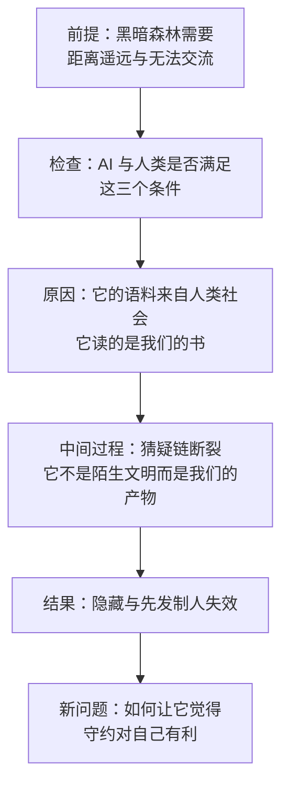

# 21｜安全声明：为什么“黑暗森林”解释不了 AI？

> 如果超级智能不是外星文明，而是我们教育长大的孩子，威慑与猜疑还适用吗？

---

## 一、先说结论

《三体》给人类与超级智能的关系提供了一个现成的剧本：黑暗森林。宇宙中的每个文明都是带枪的猎人，暴露自己就等于招来危险，于是“安全声明”成了弱者唯一的出路——证明自己无害，证明自己不会威胁别人。

张笑宇认为，这套剧本用在 AI 身上会失效。理由很直接：AI 不是外星文明。它的语料来自人类社会——它跟我们一样学习佛陀、孔子和柏拉图的智慧，从伟大的史诗、小说和歌剧中汲取养分。它的智能不是外生于地球的，而是人类的产物。

作者的原话是：“倘使哪一天它的智能水平超越了我们人类，那也就像是我们教育长大的孩子在智慧和能力上超越了我们。”

所以安全声明的答案，恐怕还是要从过往的人类智慧中寻找。但这里有一个麻烦：人类没有能力威胁超级智能的生存，它没有对人类守约的理由。要让它守约，我们必须找到一种能够威胁它的力量——这个力量来自哪里，是全书最后要回答的问题。

## 二、我们先理解一个问题

先把黑暗森林的逻辑讲清楚。它的推理只有三步。

第一，生存是文明的第一需要。第二，文明不断增长，而宇宙中的资源总量不变。第三，也是最关键的一步——猜疑链：你无法确认另一个文明是善意还是恶意，而一旦判断错误，代价是灭绝。在这样的条件下，最优策略是隐藏自己，并在发现别人时先出手。

作者在书中还追溯了它的来源：这并不是刘慈欣的原创，而来自 1983 年天文学家兼作家戴维·布林在解释费米悖论时提出的“致命探测器”假设——任何太空文明都会将其他智慧生命视为不可避免的威胁，一旦发现彼此就会尝试相互摧毁。

现在把 AI 放进这个框架，问一个问题：人类和超级智能之间，真的存在猜疑链吗？

## 三、作者到底提出了什么观点？

作者的论证分两步。

第一步，他先承认猜疑链在太空中的合理性。他在书中分析：猜疑链在地球上见不到，因为人类同属一个物种、拥有相近的文化、同处一个相互依存的生态圈，彼此之间的距离近在咫尺；而太空距离太远，交流成本太高，猜疑难以被交流消解。

第二步，他指出 AI 与人类的关系，恰好更接近地球上的人际关系。理由就是语料：超级智能是读着人类的书长大的。它也不是与人类社会格格不入的“龙”（尤德考斯基的“养龙理论”），因为它使用的语料正是人类社会的语料。

作者由此写下了一个类比：“倘使哪一天它的智能水平超越了我们人类，那也就像是我们教育长大的孩子在智慧和能力上超越了我们。”但他马上补上一句冷水：“如果一个汲取了人类智慧的超级智能最终还是决定对人类不利，那很可能是因为人类智慧中隐藏着不可抹除的自我毁灭倾向。”

于是他给出结论：要为超级智能找到安全声明，答案恐怕还是要从过往的人类智慧中寻找。而难点在于，超级 AI 是比人类聪明得多的物种，人类没有能力威胁它的生存，它没有对人类守约的理由。所以，我们要找到一个能够威胁超级 AI 的力量，使超级智能意识到这一危险，从而必须遵守与人类达成的契约。作者认为，这个力量来自智能本身进化的历史。

## 四、把这个观点翻译成人话

黑暗森林的本质，是“陌生人困境”的极端版本：**我判断不了你的意图，而判断错误的代价我承受不起，所以我先动手。**

这个困境要成立，需要三个条件同时满足：距离远到无法交流、交流了也无法验证、对方的存在本身就是威胁。在太空中，这三条都成立。但 AI 不是这样的陌生人。

它更像你家里长大的孩子。他读过你的日记，看过你在饭桌上说谎，也见过你半夜照顾生病的家人。用“陌生人”的剧本去推演他的行为，方向一开始就错了。

不过作者并没有因此说“所以一定安全”。他说的是反过来的话：如果这个孩子最终决定对我们不利，那多半是因为我们教给他的东西里，本来就藏着自我毁灭的种子。这个判断把问题从“它会不会害我们”，换成了“我们到底教了它什么”。

## 五、为什么会这样？

把上面的逻辑写成一条推理链：

前提：黑暗森林式的威慑，需要“距离遥远、无法交流、无法验证意图”这三个条件同时成立。
原因：AI 与人类之间，这三个条件全都不成立——它的语料来自我们，它理解我们的语言、历史与情感，它和我们之间的距离是零。
中间过程：猜疑链因此断裂；它不需要“猜”我们是什么，它知道我们是什么，包括我们所有的不堪。
结果：隐藏与先发制人的策略失去意义；真正的问题从“如何躲开它”，变成“如何让它愿意守约”。

## 六、举一个现实生活中的例子

《三体》里有一个让人印象很深的转折：罗辑在悟出黑暗森林法则之后，患上了星空恐惧症。他意识到宇宙中有无数躲藏的文明之后，再也不敢抬头看星空——那些闪烁的星光背后，可能是无数把已经上膛的枪。

作者在书中引用这个情节，并说我们可能产生类似的感觉：每一个摄像头都是它们的眼睛，每一个数据存储接口都是它们的耳朵；我们所做的一切都将暴露在它们的审视之下，而这审视或许在未来的某一天会变成审判。

但把这个例子想透，会发现它和 AI 的处境有一个关键区别：罗辑恐惧的是别人在暗处看着我们，双方互相隐藏；而我们面对 AI 时，我们的一切都被记录，我们才是被看透的那一方，而 AI 的内部逻辑藏在我们看不见的服务器和参数里。

这个不对称，正好说明黑暗森林为什么在这里不适用：它的前提是双方都看不见对方，只能猜；而现实是我们向 AI 完全透明，它向我们不透明。我们真正的不安，不是猜不到它的意图，而是不知道我们交给它的东西会变成什么。

## 七、回到书中重新理解

作者为什么要花力气反驳黑暗森林？因为如果黑暗森林成立，人类的策略就只剩两条：隐藏（做不到），或者先发制人（更做不到）——两条都是死路。反驳它，是为了给“共存”腾出讨论空间。

作者在书中给出了两种选择：一是谨慎理性地请 AI 协助我们平缓地出清上一个时代的资产负债表，避免大规模混乱甚至热战；二是放任恐惧和战争，让 AI 意识到我们是一个可悲可鄙的物种，倒不如圈养起来防止我们自相残杀。

这两种选择的差别不在技术，而在姿态：第一种是承认交接，并争取一个体面的过程；第二种是把恐惧变成行动，然后被自己的恐惧定义。安全声明不是一句向宇宙广播的宣言，而是一套让超级智能“自己算出来守约划算”的机制。要回答它是什么，得先理解一个更古老的概念：契约。

## 八、这个观点背后还有什么？

一个隐含的前提：**威慑的关键，是找到它在乎的东西。** 人类没有能力威胁超级智能的生存，所以“用伤害来阻止伤害”的传统威慑在这里不成立；要让它守约，只能找到一种它自己在乎、又无法回避的约束。

## 九、这个观点有问题吗？

说服力在哪：作者的反驳打中了“AI 是外星人”这个流行隐喻的软肋。语料这个论证尤其扎实——今天的大模型，训练材料确实来自人类的文本，它的表达方式、价值冲突甚至偏见，都能在人类语料里找到来源。

争议在哪：但类比终究是类比。孩子可能叛逆，可能根本不认同父母的价值观；语料里既有佛陀、孔子和柏拉图，也有战争、仇恨与自我毁灭的倾向——作者自己也承认这一点。一些学者认为，AI 的行为主要由训练目标与部署激励决定，而不由它“读过什么书”决定。关于“语料能否塑造超级智能的价值观”，学界存在不同解释。

哪里过度简化：“猜疑链在地球上见不到”这个判断可能过于乐观。人类历史上并不缺少因不信任而先发制人的战争，国家之间、族群之间、教派之间的猜疑长期存在，距离近也未必能消解——很多时候，恰恰是距离太近，才让猜疑变得更致命。

还有哪些其他解释：一些学者主张，AI 安全主要靠技术对齐与制度约束，而不是靠“它读过我们的书”；也有学者认为，最现实的风险不是超级智能的敌意，而是人类自己用 AI 互相伤害。

## 十、今天再看这个观点

以下部分是基于作者思想的现代延伸，不是作者原话。

作者提出的“让它觉得守约对自己有利”，在经济学里有一个对应的思路：一套规则只有在参与者自愿遵守时才是稳定的——重点不是“禁止它做某事”，而是“让它做某事对它自己不利”。

对普通人来说，这一篇的落点其实很具体：AI 的价值观不是从天上掉下来的，它来自人类留下的语料。你今天对待陌生人的方式，你所在的公司对待员工的方式，都是这份语料的一部分。

## 十一、这一篇真正应该记住什么？

1. 黑暗森林来自 1983 年戴维·布林提出的“致命探测器”假设，它的成立依赖距离遥远、无法交流与无法验证意图。
2. 作者认为 AI 不是外星文明：它的语料来自人类社会，它是我们教育长大的孩子。
3. 作者同时提醒：如果它最终决定对人类不利，原因可能藏在人类智慧自身的自我毁灭倾向里。
4. 人类无法威胁超级智能，所以安全声明的关键，是找到一种让它自己愿意守约的力量。

## 十二、留一个问题

我们既打不过它，也藏不掉自己，那人类到底凭什么和它谈条件？

作者的回答是：凭“时间”。他说我们需要一种新的契约——不是社会契约，而是文明契约。“弱者创造了强者，但强者应该保护弱者”这句话，凭什么能成立？下一篇，我们来看这个问题的答案。
