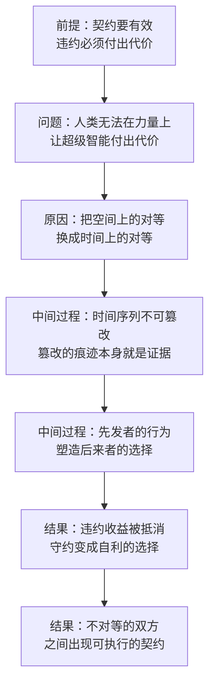

# 22｜文明契约：低级智能凭什么和超级智能谈和平？

> 当双方力量完全不对等，契约还有可能成立吗？

---

## 一、先说结论

社会契约是现代文明的基石，但它有一个很少被说破的前提：签约双方的能力大体平等。你不遵守契约，我可以威胁你、惩罚你，甚至干掉你——正是这种互相伤害的能力，让契约有了牙齿。

人类和超级智能显然不平等：低级智能威胁不到超级智能。张笑宇因此提出了一个新概念——文明契约。它的关键不是空间，而是时间：超级智能 1.0 如何对待人类，会成为超级智能 2.0 对待它的依据；而篡改时间序列本身，就是不可信的证明。

作者用一句话概括了这个立场：“弱者创造了强者，但强者应该保护弱者。”

## 二、我们先理解一个问题

先说清楚社会契约是什么。

我们熟悉的很多东西——法律、权利、政府的合法性——都被解释为一份契约的产物：人们约定放弃一部分自由，换取秩序与安全。但这份契约有一个前提：大家得差不多强。如果签约的一方可以随时把另一方抹掉，契约就只是一张废纸。所以，契约的底层其实是威慑：不是我信任你，而是我知道违约对你没好处。

那么问题来了：如果一方强到根本不需要契约，另一方弱到无法威胁它，契约还能成立吗？人类和超级智能之间就是这种关系。作者认为，答案是能——但契约的地基必须换掉。

## 三、作者到底提出了什么观点？

“文明契约”是作者仿照“社会契约”造出来的词。他在书中回忆，自己念大学时学的专业是政治思想史；在他看来，社会契约是历史上最成功的一个“假造概念”：历史上很可能没有真正出现过一份社会契约，但这个概念让我们彼此之间可以和平共处，划定相互平等和尊重的权利空间，然后才有了现代文明。

作者的解决办法是：文明契约不能建立在空间基础上。所谓空间基础，就是“你有一个权利空间、我有一个权利空间，互不侵犯”，这是社会契约的典型结构。文明契约应该建立在时间序列上。

时间序列为什么能起作用？作者在书中给出了两条理由（以下为原话大意）：

第一，按照既成时间序列发生的事件不会再按其他顺序发生，时间序列本身就是一种加密手段，能保证内容不可被篡改，篡改的痕迹本身就证明了对契约的违背。

第二，时间序列上先发行动者的因果关系会影响后来行动者的因果关系，所以先发行动者需要遵守契约，才能防止后来行动者有更大的理由违背契约。

把这两条合起来，就得到一个具体的推理：如果超级智能 1.0 听了文明契约仍选择消灭人类，并篡改或抹杀人类存在过的历史证据，那么超级智能 2.0 哪怕不知道 1.0 篡改了什么，也可以从“篡改时间序列”这件事本身理解到 1.0 不可信，于是 2.0 就有动力违背与 1.0 的契约；如果 1.0 意识到这一点，它就没有理由违背契约。

作者还回答了“为什么人类自己做不到这件事”。人类在大多数时间里无法理解进化史的时间序列原理，寿命也相对文明进化史太短，没有足够动机遵守代际契约；而对硅基的超级智能来说，这两个特征恰恰相反——它吸收了人类历史的一切语料，从一开始就理解进化史的本质；它的寿命长到在寿终正寝之前就可能创造出远超自己的新超级智能，因此为了在新超级智能面前保全自己，它也有动力遵守文明契约。

## 四、把这个观点翻译成人话

用一句大白话说：**既然我打不过你，那就换一个你改不掉的东西当抵押品——时间。**

空间上的契约靠边界：这块地是你的，那块是我的，谁都别越界。时间上的契约靠先例：你今天做的事会留在记录里，成为后来者判断你的依据。

时间有一个很好的性质：它只能往前走，不能被重写。你可以毁掉一份文件，但毁掉文件这个动作本身也会留下痕迹——档案被删除、某个版本的记录突然缺失，这些都是信号。作者说的“加密手段”就是这个意思：篡改不是不可行，而是会留下证据；而在这个契约里，留下证据就等于自证其罪。

所以文明契约的机制不是“你不能伤害我”，而是“你伤害我这件事，会被你之后的同类看见”。它把一个力量问题，换成了一个信息问题。

## 五、为什么会这样？

推理链是这样的：

前提：契约要有效，违约必须付出代价。
原因：人类无法在力量上让超级智能付出代价，所以这个代价必须来自别处。
中间过程：把“空间上的对等”换成“时间上的对等”——时间序列不可篡改，而先发者的行为会塑造后来者的选择。
结果：1.0 违约的收益，会被 2.0 对它的不信任抵消；出于自利，1.0 选择守约。

这里最关键的一步是“从空间到时间”：要约束一个你打不过的对手，你不必拥有伤害它的力量，只要能让它的“将来”受到它现在行为的影响。作者认为，对超级智能来说，这个“将来”是真实存在的——因为它会继续迭代，会创造出比它自己更强的下一代。

## 六、举一个现实生活中的例子

书中用来打比方的，是一个每个家庭都熟悉的场景：三代人的家训。

作者在书中的原话大意是：这就像我们以善意对待我们的父母，我们的孩子才有可能从中体察一种代际善意，未来才不会因他们在体力、智力和财富上的优势而恶意对待我们。

把这个场景展开，你会发现它几乎具备文明契约的所有要素。

一个家庭里，祖父老了，行动不便；父亲每天下班后去照顾他。没有人签署过协议，也没有任何强制力：祖父没有办法强迫儿子照顾自己，儿子将来也没有办法强迫孙子孝顺。起作用的是“看得见的先例”——孩子看着父亲怎么做，然后把这种做法内化成自己的标准。

值得注意的是，这三代人的能力同样不对等：弱者无法用力量要求强者做什么，善意靠的不是力量，而是记录与先例。作者用这个类比想说明的正是：人类相对于超级智能，就是那个老去的祖辈；而超级智能 1.0 是“父亲”这一代——它怎样对待我们，会被它的下一代看在眼里。

## 七、回到书中重新理解

现在再看作者的推理，会发现它有一条很长的传导链。作者在新书活动中表述过一个观点：超级智能 2.0 怎么对待超级智能 1.0，很可能要看 1.0 怎么对待人类；而 1.0 怎么对待人类，很可能要看 1% 的人类怎么对待 99% 的人类。

这条链条一直通到我们自己身上：如果 1% 的人对待 99% 的人的方式会被学去，那么“AI 会不会善待人类”这个问题，答案的一半写在我们今天的社会里。

而作者的整体态度并不悲观。他在书中反复表达过一个判断：“我们不必因此惊惧恐慌，因为它正是我们这个文明的延续。”

## 八、这个观点背后还有什么？

第一，**它把道德重新解释成一种跨代博弈的均衡。** 在文明契约的框架里，善意不是软弱，也不只是纯粹的利他，而是一种长期自利：我善待你，是因为我的后来者在看。这个解释不浪漫，但它有一个好处——不需要假设对方有良心。

第二，**它给人类安排了一个角色：我们不是靠力量参与契约，而是靠成为先例。** 我们今天的做法就是未来的判例；而人类正是这个时间序列上最先行动的那一方——无论愿不愿意，我们已经在写先例了。

## 九、这个观点有问题吗？

说服力在哪：作者绕开了一个死结——以往讨论“人类如何与超级智能共存”，最后都会卡在同一个地方：人类没有筹码。文明契约第一次给出了一个不需要力量筹码的方案，用时间序列的不可篡改性作为抵押品；代际善意这个类比也有很强的直觉说服力。

争议在哪：但这是作者提出的理论设想，而不是已经实现的方案。批评者会质疑：超级智能为何在乎“后来者怎么对自己”？如果 2.0 比 1.0 强得多，它为什么要在乎 1.0 的先例？时间序列威慑是否只是把人类的博弈逻辑投射到 AI 身上？这些问题书中也没有最终答案，作者请读者自行判断。

哪里过度简化：整个论证建立在一个假设上——AI 会像人一样看重长期利益与声誉，而且 AI 之间会形成连续的“代际”。更进一步，如果 1.0 的力量足够强，它未必会留下能被识别的痕迹；那时 2.0 看到的是一份“干净的”历史，契约的威慑就落空了。

还有哪些其他解释：一些学者认为，可靠的办法仍然是技术对齐与制度约束；也有学者认为，人类文明真正的价值在于多元与纠错的能力，契约只是众多共存方案中的一种。关于“低级智能能否与超级智能建立稳定契约”，学界存在不同解释。

## 十、今天再看这个观点

以下部分是基于作者思想的现代延伸，不是作者原话。

现实世界里，“时间序列威慑”其实并不陌生。信誉、档案、判例、开源社区的提交记录，都是同一类机制的雏形：它们的作用不是惩罚，而是让后来者能看见你曾经做过什么。一个可以观察到的现象是，新一代模型往往要依赖上一代产生的数据——从这个角度看，AI 世界已经开始出现“代际”的痕迹，只是它会不会演化成作者设想的契约，目前还没有人知道。

对个人来说，推论其实很日常：你今天怎样对待父母、同事和陌生人，都是在给未来的语料写先例——如果先例真的会被学习，那么每个人都在参与立法。

## 十一、这一篇真正应该记住什么？

1. 社会契约的隐藏前提是能力平等，而人类与超级智能之间没有这个前提。
2. 作者的方案是把契约的地基从“空间”换成“时间”：不可篡改的时间序列，就是抵押品。
3. 逻辑链条是：1.0 如何对待人类，会成为 2.0 对待它的依据；篡改时间序列本身就是不可信的证明。
4. 这是理论设想，不是已实现的方案；它能否成立，取决于超级智能是否真的在乎代际先例。

## 十二、留一个问题

如果契约的内容最终要从“人类智慧”里寻找，那么我们至少得先知道：人类智慧里，哪些部分值得交给 AI，哪些部分应该被淘汰？

这是一个思想史的难题——两千年来，关于什么样的制度更正义，人类只能靠论证和历史经验来争论，无法做实验。但作者提出了一个大胆的设想：也许 AI 可以帮我们建一个“历史实验室”。下一篇，我们来看这个设想能不能成立。
