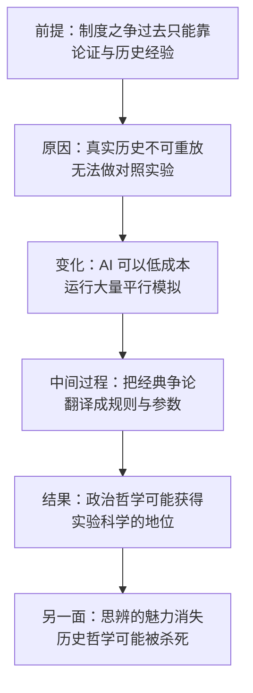

# 23｜历史实验室：AI 能替我们验证政治哲学吗？

> 如果“什么样的制度更好”可以被模拟检验，思想史会变成什么？

---

## 一、先说结论

在《AI文明史·前史》的最后一节，张笑宇提出了一个大胆的设想：用 AI 建造一个“历史实验室”，把思想史上的经典争论放进模拟中检验。刘擎在为这本书写的推荐语里，把这个设想概括为：让经典思想史争论获得可以科学验证的模拟方法。

这个设想如果成立，政治哲学将第一次获得“实验科学”的地位——“什么样的制度更正义”不再只是立场之争，而可能变成可以积累证据的研究。

但作者自己也冷静地指出：这可能会“杀死”历史哲学本身。因为一旦答案可以被算出来，思辨的魅力就消失了。刘擎认为，这或许是一种“破坏式创新”——它摧毁了旧的形态，但打开了一个新的领域。

## 二、我们先理解一个问题

先看政治哲学两千多年来的困境。

“什么样的制度更正义”“权力应该属于谁”“个人与共同体如何平衡”——这些是思想史上被讨论得最多的问题，也是最难有定论的问题。原因不在于思想家不够聪明，而在于方法：他们能用的工具只有论证和历史经验。

论证可以揭示逻辑矛盾，历史经验可以提供案例，但两者都无法回答一个关键问题：如果换一套制度，会发生什么？真实的历史不能重演，变量多到无法控制，而且我们也不能为了做实验，让真实的人去承受不同的制度。

于是政治哲学长期停留在一种奇怪的状态：它讨论的是最重要的问题，却无法像自然科学那样积累可检验的知识。作者提出的“历史实验室”，正是针对这个困境。他问的是：如果我们能重放历史呢？

## 三、作者到底提出了什么观点？

需要先说明一点：作者在书中提出的是一个设想的方向，而不是一套写好的实验手册。书中对这一节的着墨并不多，它更像是一个留给读者的开放命题。

作者的核心主张是：AI 提供了一种新的可能性——用大规模的模拟，把思想史上的经典争论放进一个可以反复运行、可以对照的环境里检验。刘擎在推荐语里把它概括为“让经典思想史争论获得可以科学验证的模拟方法”。

作者也指出了这个设想的另一面：它可能会“杀死”历史哲学。这句话不难理解——如果“什么样的制度更正义”最终可以被计算出来，那么过去那种以思辨和诠释为核心的思想史研究，就失去了它最迷人的部分。刘擎则给出了一个更积极的判断：这或许是一种“破坏式创新”。

值得注意的是，作者把“历史实验室”与“文明契约”放在同一部分讨论。这个安排并不偶然：如果人类要向超级智能证明自己的价值观值得被尊重，那么光靠声明是不够的——我们得先搞清楚，我们主张的那些原则，在检验之下是否站得住。

## 四、把这个观点翻译成人话

用一个比喻来说：**过去，政治哲学是在法庭上辩论；作者想给它建一个风洞实验室。**

以前我们只能这样讨论制度：一方说“这样更公平”，另一方说“那样更有效率”，双方各自引用历史案例，谁也说服不了谁。这不是因为大家不讲道理，而是因为道理没法被验证——你不可能把同一个社会重放两遍，一遍用制度 A，一遍用制度 B，然后比较结果。

模拟改变的是这一点：如果 AI 可以低成本地运行大量平行世界，那么“重放历史”第一次成为可能。你可以让同一群人、同样的资源、同样的技术条件，在不同的规则下各自演化，然后比较长期结果。

但代价也很清楚：一旦答案能被算出来，思想史上那些精彩的辩论就不再是“思想”的舞台，而变成了“参数”的舞台。谁设定参数，谁就在替所有人决定“什么算好结果”——这本身就是一个政治问题。

## 五、为什么会这样？

推理链是这样的：

前提：制度之争之所以两千年没有定论，是因为真实历史不可重放，无法做对照实验。
原因：AI 的出现让“重放”在成本上第一次变得可能——它可以并行运行大量模拟，反复改变规则并观察结果。
中间过程：把思想史上的经典争论翻译成模拟中的规则与参数，让不同制度在可控条件下长期运行、互相对照。
结果：政治哲学第一次有可能获得实验科学的地位，制度讨论从立场之争变成可以积累证据的研究。
另一面：一旦结论可以被计算，以思辨为核心的历史哲学可能被“杀死”。

这里最值得琢磨的是最后一步。作者并没有把“历史哲学被杀死”当成纯粹的坏事来惋惜，也没有把它当成好事来庆祝——他只是把它作为一个可能的后果提出来。而刘擎的“破坏式创新”提供了一个观察角度：一种知识形态的终结，有时正是另一种知识形态的开始。

## 六、举一个现实生活中的例子

思想史上最适合放进这种实验室的争论之一，是罗尔斯的“无知之幕”。

罗尔斯在半个多世纪前提出过一个著名的思想实验：假设一群人要一起设计社会的规则，但他们被一层“无知之幕”挡住——每个人都不知道自己将来会出生在什么位置：是富是穷，天赋高还是低，身体健康还是残疾，出生在什么样的家庭。罗尔斯推论：在这种情况下，理性的参与者会选择一套最照顾处境最差者的规则，因为谁都有可能成为那个人。

这个论证很漂亮，但它一直停留在思想实验的层面：你可以质疑罗尔斯对“理性”的假设，却没有地方去验证。

按照作者提出的设想框架，可以这样展开：让大量 AI 扮演“不知道自己会是谁”的参与者，反复面对制度选择，看它们会不会收敛到罗尔斯推论的结果；也可以让同一个模拟跑两套规则——一套以改善最差者处境为优先，一套以整体收益最大化为优先，比较它们在长期运行中的表现。

需要说明的是，上面这段推演是基于作者设想的展开，书中并没有给出这一实验的具体设计。而推演一旦展开，问题也跟着来了：模拟里的“人”算不算人？如果他们在模拟中受苦，这个实验在伦理上可以接受吗？我们稍后会回到这些问题。

## 七、回到书中重新理解

现在再看，为什么这个设想会出现在全书的最后？因为它是整条论证的收口。

前面所有的讨论，都在说 AI 会怎样改变世界；到了最后，作者把问题翻转过来：人类能不能反过来用 AI 来检验自己？历史实验室就是这样一个装置——它不是让 AI 替我们决定什么是对的，而是让我们有机会知道，我们一直相信的那些原则，在更长的尺度上是否成立。

把它和文明契约放在一起看，意思就更清楚了：如果人类要向超级智能主张“我们的价值观值得被延续”，那么这个主张需要有内容、有依据。历史实验室提供的，正是这种依据的生产方式——它是文明契约的内容供应方。

## 八、这个观点背后还有什么？

第一，**它把“可计算”和“可理解”分开了。** 模拟可以告诉你某种制度在长期更稳定，但不一定告诉你为什么；而“为什么”恰恰是思想史最擅长的部分。

第二，**它改变了思想史的功能。** 过去的思想史主要用来解释过去，而在历史实验室的框架里，它变成了生成未来的素材库：哪些方案被提出过、为什么失败，都成了可以放进模拟的输入。

第三，**它同时改变了权力结构。** 谁掌握模拟器，谁就掌握“历史判例”的解释权。工具本身没有立场，但工具的使用者会把自己的偏见写进参数里。

## 九、这个观点有问题吗？

说服力在哪：这个设想抓住了政治哲学最真实的痛点——它无法做实验。AI 的规模也确实让“重放历史”在成本上第一次有了可能。更重要的是，它给出了一个判断标准：不要只问一个原则是否动人，而要问它在长期运行中是否站得住。

争议在哪：模拟与真实历史之间有一条很难跨越的鸿沟。历史是典型的混沌系统，路径依赖极强，初始条件的微小差异可能导致完全不同的结果；而模拟的初始条件、规则与评价指标都由人设定，模拟者的偏见会被原样写进结果里。算力与数据也有上限。关于“AI 模拟能否替代真实社会实验”，学界存在不同解释。

还有两个更尖锐的问题。第一，模拟里的“人”是不是真实的人？如果模拟中的个体具有某种感受能力，让它们在实验中受苦就涉及伦理问题。第二，谁有权力设定参数、决定模拟什么？这不是技术问题，而是政治问题——它决定了哪些制度会被检验，哪些连被检验的机会都没有。

哪里过度简化：这个设想还隐含了一个前提，就是“制度更优”可以被换算成可测量的指标，比如增长、稳定或幸福感。但这些指标本身就是有争议的价值判断。选哪一套指标，可能比模拟结果更能决定结论。

还有哪些其他解释：一些学者认为，政治哲学的价值不在于给出正确答案，而在于维持公共讨论的质量；也有学者主张，模拟只能作为辅助，不能替代历史经验与人的判断。

## 十、今天再看这个观点

以下部分是基于作者思想的现代延伸，不是作者原话。

这几年，用大模型做社会科学实验已经成了一个真实的研究方向：研究者让 AI 扮演不同类型的被试，做问卷、谈判、投票、经济博弈。这些尝试还很粗糙，但它们说明作者的设想并非纯粹的科幻——“用 AI 做实验”已经在发生，只是还没有到“历史实验室”的规模。

如果这个方向继续发展，最先被改变的可能是普通人看新闻的方式。今天我们讨论一项政策，最常见的做法是引用别的国家的经验；未来可能会出现一种新的引用方式：引用一次模拟的结果。到那时，重要的能力就不再是“知道答案”，而是判断一个模拟值不值得相信——它的参数是谁定的，它忽略了什么，它把什么当成了“好结果”。

对个人来说，这一篇最有价值的提醒也许是：不要期待 AI 给你一个关于“什么制度更好”的最终答案。它更可能给你的是许多个条件不同的答案，而选择哪一个，仍然需要你自己承担。

## 十一、这一篇真正应该记住什么？

1. 作者设想用 AI 建造“历史实验室”，把思想史上的经典争论放进模拟中检验。
2. 这个设想可能让政治哲学第一次获得实验科学的地位，也可能“杀死”以思辨为核心的历史哲学——刘擎称这是一种“破坏式创新”。
3. 模拟与真实历史之间有鸿沟：混沌系统、路径依赖、模拟者偏见，以及伦理与政治风险。
4. 它与文明契约是配套的：人类要主张自己的价值观值得延续，就得先把它拿到检验台上。

## 十二、留一个问题

如果连“什么样的制度更正义”都可以被模拟、被计算，那么人类文明最后留给超级智能的，究竟是什么？

是知识，是制度，还是我们彼此对待的方式？如果答案其实是最后一项，那么我们今天的每一个举动，都比我们想象的更重要。最后一篇，我们把整本书的问题收回到自己身上——谈谈什么叫“送别人类”。
