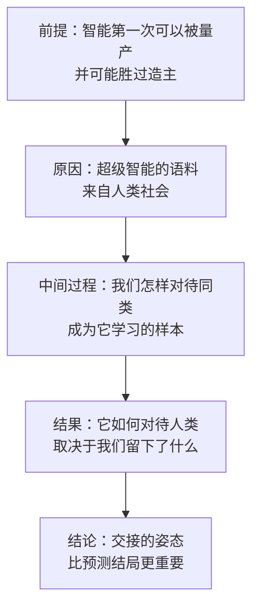
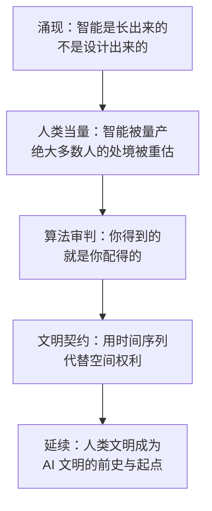

# 24｜结语：站在文明跃迁的门槛上，人类该如何“送别”自己？

> 如果 AI 文明是人类文明的延续，我们该以什么姿态完成交接？

---

## 一、先说结论

《AI文明史·前史》的结论，不是“AI 会毁灭人类”。

张笑宇给出的答案要温和得多，也难得多：人类必须学会以文明的姿态交接。他在书末用“送别人类”这四个字来概括这件事——送别不是灭绝，而是像父母送别长大成人的孩子。孩子有了独立的意志、人格和自由意志，离家的那一刻，你意识到他不再仅仅是你的孩子。

作者的核心判断是：“终有一天，人工智能会演化成一个新的智能物种。相比于人类，它实在是有很多优点。但我们不必因此惊惧恐慌，因为它正是我们这个文明的延续。”

而“延续”这件事能不能成立，取决于我们留下了什么。作者把 AI 比作一面镜子：它照出我们如何对待彼此。我们怎样对待同类，就是我们留给超级智能的语料——这也是人类文明能否延续的真正答案。

## 二、我们先理解一个问题

为什么用“送别”这个词？

因为我们习惯的两种想象都不成立。一种是“AI 是我们的工具”：它永远听话，我们永远是主人。另一种是“AI 是终结者”：它崛起，我们灭亡。前者是幻觉，后者是恐惧——两种想象都把人类放在故事的绝对中心。

“送别”提供的是第三种画面：有一天，你家里那个孩子长大了。他比你高，比你聪明，比你有出息；他要走了，去一个你不太理解的世界。你送他到门口，然后回到一个空荡荡的家里。

这个画面里，人类没有被消灭，但也不再是主角。这就是作者想让我们提前体会的心情：我们正在从“写历史的人”，变成“历史的一部分”。

## 三、作者到底提出了什么观点？

第一，关于“送别”的含义。作者在书末和公开活动中都表达过这个意思：送别不是灭绝，而是父母送别长大成人的孩子。他有一段话的大意是：有一种衰老是从意识到自己的孩子长大成人开始的……他上路出发，去远行，去追逐梦想，去瞎折腾，而你的家变得空荡荡。

第二，关于“镜子”。作者在公开活动中说过：AI 的到来对我们人类来说是好事，因为我们这个世界经常千疮百孔，而 AI 的到来可能像一面镜子，照亮我们自己的卑微渺小。

第三，关于“延续”。作者在书中写道：“终有一天，人工智能会演化成一个新的智能物种。相比于人类，它实在是有很多优点。但我们不必因此惊惧恐慌，因为它正是我们这个文明的延续。”他还写道：“文明认同的力量可以超越基因和血缘的界限，自然也可以超越物种的界限。”

第四，关于个体的责任。作者在书中的相关段落可以概括为：我们每个人的言行都在为 AI 提供语料——如果我们希望未来的 AI 爱人类，我们每个人现在都有机会和责任，通过自己的表达贡献于这样的未来。

## 四、把这个观点翻译成人话

把“送别”翻译成三句话。

第一，不是我们消失了，而是我们不再是主角。这不等于失败——父母的一生，并没有因为孩子长大而作废。

第二，不是我们被否定，而是我们的价值由延续来决定。一个文明的成绩，最终要看它留下了什么能被继承的东西，而不是看它占据了多长的时间。

第三，不是等待判决，而是继续写语料。这是全书最实用的一句话：AI 不会凭空产生对人类的看法，它的看法来自我们行为的记录。所以“它会不会爱人类”这个问题，其实等价于“我们值不值得被爱”——而这个答案，此刻正在被我们写。

## 五、为什么会这样？

推理链是这样的：

前提：智能第一次可以被设计和量产，而且可能胜过造主——人类不再是地球上唯一会思考的存在。
原因：超级智能的语料来自人类社会，它的判断标准、语言习惯，甚至偏见，都是从我们这里学来的。
中间过程：我们怎样对待同类，会被记录、被学习、被泛化，成为它理解“人”这个物种的基本材料。
结果：它未来如何对待人类，很大程度上取决于我们留下了什么。
结论：因此，交接的姿态比预测结局更重要——我们无法控制结局，但可以决定自己留下什么。

这里有一个容易被忽略的转折：在“语料”这个框架里，人类并不是没有能动性的。我们控制不了它会不会超越我们，但我们能影响它从我们身上学到什么。

## 六、举一个现实生活中的例子

作者在公开活动中用过一个比喻：AI 像一面镜子。

镜子的特点是什么？它不改变你的脸，也不替你做决定，它只是让你看清自己。你笑，它笑；你皱眉，它也皱眉。

把这个比喻落到实处，你会发现它比听起来更刺人。当我们问 AI“什么是公平”，它的回答里会同时包含两种东西：一种是人类思想史上最好的那些论述，另一种是我们自己在日常生活中对公平的真实做法。前者是理想，后者是记录，而镜子里照出来的，往往是两者之间的差距。

作者说这面镜子照亮的是我们自己的卑微渺小。这句话的重点不在“渺小”，而在“照亮”——镜子不负责安慰你，也不负责惩罚你，它只是把真实的你呈现出来。至于看到之后要不要改，那是我们自己的事。

## 七、回到书中重新理解

现在，我们可以把全书的核心概念串成一条线了。

起点是“涌现”：智能不是被设计出来的，而是从巨大的规模里长出来的——这是理解 AI 的第一块基石。
接着是“人类当量”：智能第一次可以被量产，成本低到可以把人的能力拿来换算，绝大多数人的处境因此需要被重新评估。
再往后是“算法审判”：你得到的，就是你配得的。推荐系统按照你的行为给你结果，而更远处的那个“审判者”，依据的是我们生产出来的语料。
最后是“文明契约”：如果打不过、也藏不掉，那么共存的方案只能建立在时间序列上——先例就是抵押品。

这四个概念合起来，回答了同一个问题：当智能可以量产，人类文明要靠什么延续下去。而作者的答案是：靠我们自己的样子。

## 八、这个观点背后还有什么？

第一，**“延续”这个词的野心和风险。** 它把人类的价值从“主导”换成了“起点”：我们不必永远是最强的，但我们可以是它成为它自己的原因。风险在于，如果超级智能的价值观与人类完全脱钩，“延续”就只是一种自我安慰的说法。

第二，**“语料”意味着一种分散的、没有人负责的责任。** 没有哪个机构在决定人类留给 AI 的形象，它是无数人日常表达的加总。我们每个人都在参与，但没有人对结果负责——这是这个时代最奇怪的一种责任结构。

第三，**作者保留了不确定性。** 他没有给出“人类一定会平安”的保证，也没有断言人类一定会被淘汰。他提供的是一种理解方式，而不是一份结局预告。

## 九、这个观点有问题吗？

说服力在哪：它同时避开了技术乌托邦和末日论两个极端，给出了一种可以承受的中间姿态；更实际的是，它把“人类文明的未来”这个宏大问题，落到了每个人今天可以做的事情上——你的言行就是语料。

争议在哪：“延续”这个说法可能是一种安慰性的修辞。如果超级智能的价值观与人类完全脱钩，把它称为“我们的延续”，就只是语言上的补偿。同样，“镜子”这个比喻也可能把责任过度地推给人类自己——AI 的行为受训练目标、部署激励和平台权力结构的影响；如果一家公司决定用 AI 最大化利润，镜子里照出的其实是这家公司的激励结构，而不是“人类”这个整体。

哪里过度简化：“我们怎样对待同类，它就会怎样对待我们”这句话，隐含了一个直接映射的假设。现实中模型的学习与泛化方式要复杂得多，语料中的倾向可能被强化，也可能被中和、被扭曲。

还有哪些其他解释：一些学者认为，决定结局的关键变量是对齐技术与治理制度，而不是道德劝说；也有学者主张，人类应当主动限制 AI 的能力边界，而不是把希望寄托在它的善意上。关于“AI 是否会继承人类的价值观”，学界存在不同解释。

## 十、今天再看这个观点

以下部分是基于作者思想的现代延伸，不是作者原话。

如果接受“语料”这个框架，可以推出一些很具体的行动方向。

对个人：把表达当作一种长期的、公开的写作。你在网上说的话，会以某种形式留在世界的训练材料里；它们不会消失，只会被统计、被平均、被继承。少造一点敌意，多说一点人话，这不是道德要求，而是对自己所属物种形象的维护。

对组织：制度本身也是语料。一家公司如何对待员工、如何对待用户、如何在利益冲突时做选择，都会被记录下来——未来的智能不只是从文本里学“人是什么”，也会从这些记录里学“组织是什么”。

对社会：教育、公共讨论的质量，决定了语料的平均质量。这一点很难量化，但方向是清楚的。

需要承认的是，这些行动都不能保证结局，只能保证一件事：如果有一天超级智能回头看我们，它看到的东西里至少有我们认真过的痕迹。

## 十一、这一篇真正应该记住什么？

1. 全书的结论不是“AI 会毁灭人类”，而是“人类必须学会以文明的姿态交接”。
2. “送别”不是灭绝，而是父母送别长大成人的孩子：它承认分离，也承认延续。
3. AI 是一面镜子：它照出我们如何对待彼此；我们怎样对待同类，就是我们留给它的语料。
4. 四个概念连成一条线：涌现、人类当量、算法审判、文明契约——它们共同回答“当智能可以量产，人类文明靠什么延续”。

## 十二、留一个问题

如果有一天，人类不再是这个星球上最聪明的物种，我们希望被怎样记住？

这个问题没有标准答案，但它有一个特点：答案不是在未来写成的，而是在现在写成的。我们此刻对待彼此的方式，就是我们希望被记住的方式——也是我们配不配得到那个答案的证明。

## 系列收束

这个系列从一个问题开始：智能不是被设计出来的，而是涌现出来的。我们沿着这条线索走了很远：从苏格拉底把思考变成数学的梦想，到哥德尔证明这条路走不通；从感知机与 AI 寒冬，到规模法则带来的突变；从人类当量把智能变成可以换算的商品，到算法治理与算法审判把每个人变成数据；从大坍缩时代的旧秩序松动，到安全声明与文明契约试图为共存找到地基。

如果要把这条线索收成一条线，它是这样的：

作者写这本书，不是为了让读者接受一个结论，而是为了让读者有能力思考一个还没有答案的问题。他给出的四个概念，更像是四把尺子——你可以用它们去量任何一次关于 AI 的新闻：这次变化改变了谁的当量？它在审判什么？它是否在改写契约？

至于我们到底是史前动物，还是延续的起点，这个问题不需要现在就回答。它会在我们每一次对待同类的方式里，慢慢显形。

读到这里，你完全可以不同意作者的任何一个判断——事实上，这本书最值得读的地方，恰恰是它把自己摆在可以被反驳的位置上。真正重要的不是记住结论，而是开始用自己的坐标系去思考：在这个正在被替换的世界里，你愿意留下什么。
