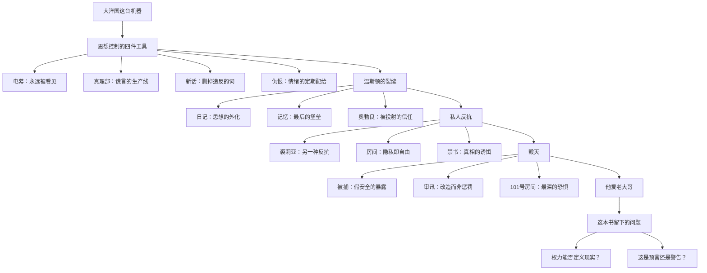

# 00｜系列拆解与目录：《一九八四》

> 乔治·奥威尔（George Orwell），1948 年写成、1949 年出版。一个发生在"未来"的极权寓言，也是二十世纪流传最广的政治小说。

## 系列简介

《一九八四》写的是大洋国外围党员温斯顿·史密斯的一生：他在真理部篡改历史，在电幕下写日记，和裘莉亚在一个"安全"的房间里偷情，最后被思想警察抓走，在仁爱部被彻底"改造"，直到发自内心地说出"他爱老大哥"。这本书表面上是一个未来故事，实际上是奥威尔对极权主义运作机制的一次完整解剖：它不只问"极权是什么样子"，更问"极权是怎么进入人的头脑、让一个人从内部瓦解的"。本系列不按原书章节顺序拆解，而是按读者的理解路径重组：先看懂大洋国这台机器怎么运转（监视、谎言、语言、情绪），再看温斯顿个人的觉醒与反抗，然后走进他的被捕与毁灭，最后跳出来回答这本书真正留下的问题——权力能否定义现实？这本书是预言还是警告？

## 全书核心问题

| 层次 | 核心问题 | 对应篇目 |
|------|----------|----------|
| 机制层 | 极权靠什么维持？（监视、谎言、语言、情绪） | 01–06 |
| 觉醒层 | 一个人怎么开始"不对劲"？（日记、记忆、信任） | 07–10 |
| 反抗层 | 私人领域里的反抗有多大力量？（爱情、隐私、禁书） | 11–13 |
| 毁灭层 | 极权如何从内部摧毁一个人？（被捕、审讯、改造） | 14–17 |
| 哲学层 | 这本书留下的终极问题是什么？（现实、口号、预言） | 18–20 |

## 全书知识地图

## 全系列目录

### 第一部分：大洋国这台机器

#### 01｜为什么监视比枪炮更能控制人？
核心问题：大洋国几乎不动用军队镇压，为什么没人敢反抗？
核心观点：奥威尔描绘的极权不靠暴力维持，而靠"永远被看见"的可能性——电幕、思想警察、孩子告密者，让每个人在没人看的时候也像被看一样活着。监视的最高成就是把外在的恐惧变成内在的自我审查。
理解难度：★★☆☆☆
关键词：电幕、思想警察、自我审查、告密、全景敞视

---

#### 02｜谎言为什么可以被例行公事地生产？
核心问题：温斯顿每天在真理部做什么？为什么这种工作能持续运转？
核心观点：在大洋国，篡改历史不是阴谋，而是公务员的日常——有流程、有指标、有分工。"谎言"不需要被相信，只需要被不断地生产，直到没有人能想起原来的版本。
理解难度：★★☆☆☆
关键词：真理部、记忆洞、记录司、例行化、谎言工业

---

#### 03｜为什么控制了过去，就能控制未来？
核心问题：党为什么要花这么大力气改旧报纸？过去的事改不改有什么关系？
核心观点：因为人的所有判断都依赖"以前是什么样"这个参照系。谁控制了过去，谁就控制了人们评价现在的标尺——如果你无法证明昨天不一样，你就无法证明今天有问题。
理解难度：★★★☆☆
关键词：历史修正、参照系、档案、证据、记忆

---

#### 04｜为什么要发明一种让人无法造反的语言？
核心问题：党已经有枪、有监狱、有电幕，为什么还要费劲编一本新话词典？
核心观点：因为镇压行为只能管住身体，删掉词汇才能管住头脑。如果语言里没有"自由"这个词，"自由"这个想法也就无处安放——新话的目的不是让你说不出话，而是让你想不到那个意思。
理解难度：★★★☆☆
关键词：新话、赛姆、语言与思想、词汇删除、萨丕尔-沃尔夫

---

#### 05｜一个人怎么能同时相信两个相反的事实？
核心问题：什么是"双重思想"？它和说谎、自欺有什么不同？
核心观点：双重思想比说谎高级：说谎者知道自己在骗，双重思想者连"知道自己在骗"这一步都抹掉了。它是一种被训练出来的心理技术——有意识地诱导无意识，然后在完成的那一刻忘掉整个过程。
理解难度：★★★★☆
关键词：双重思想、止罪、心理技术、认知失调、自我欺骗

---

#### 06｜为什么情绪也要被定期定量供应？
核心问题：两分钟仇恨只有两分钟，为什么每天都要办？
核心观点：因为情绪不是私人的事，而是党的资源。仇恨需要每天被唤起、被指向、被耗尽——把人的情绪高峰安排在固定时间对着固定对象发泄，情绪就再也不会指向党本身。
理解难度：★★☆☆☆
关键词：两分钟仇恨、仇恨周、果尔德施坦因、情绪管理、集体仪式

---

### 第二部分：温斯顿的裂缝

#### 07｜一本日记为什么就是犯罪的开始？
核心问题：温斯顿写日记并没有伤害任何人，为什么这是极权社会里最危险的动作？
核心观点：因为日记意味着你把思想放到了纸上——思想一旦外化，就有了证据，也就有了被传播的可能。在一个"思想本身就是罪"的社会里，写下想法不是记录，而是第一次行动。
理解难度：★★☆☆☆
关键词：日记、思想罪、写作、证据、第一步

---

#### 08｜私人记忆为什么是最后的堡垒？
核心问题：温斯顿对母亲和妹妹的记忆为什么重要？它只是一段私人往事而已。
核心观点：因为党可以修改所有档案，却改不了你脑子里记得的东西。温斯顿记得母亲、记得巧克力、记得"以前不是这样的"——这些无法被证伪的记忆，是他相信"现实曾经不同"的唯一依据。守住记忆，就是守住另一个世界存在过的证据。
理解难度：★★★☆☆
关键词：记忆、母亲、巧克力、愧疚、个人史

---

#### 09｜为什么「希望一定在无产者身上」？
核心问题：温斯顿为什么坚信大洋国唯一的希望在那些麻木的、占人口 85% 的无产者身上？
核心观点：因为党对党员的控制天衣无缝，对无产者却几乎放任——他们不读书、不关心政治、没有任何反抗意识。但正因为没被控制，他们保存了党无法删除的东西：情感、记忆和"生活本来应该是什么样"的常识。温斯顿赌的是：85% 的人一旦醒过来，党挡不住。
理解难度：★★★☆☆
关键词：无产者、希望、群众、觉悟悖论、多数

---

#### 10｜温斯顿为什么愿意相信奥勃良？
核心问题：奥勃良从没说过自己反对党，温斯顿凭什么把一个几乎陌生的人当成同路人？
核心观点：因为孤独。温斯顿的恨无处安放，他太渴望有人证明"我不是一个人，也不是疯子"。奥勃良什么都没承诺，只是"看起来"像——而人在极度孤立时，会把他需要的那个人，投射到任何可能性上。
理解难度：★★★☆☆
关键词：奥勃良、信任、孤独、投射、兄弟会

---

### 第三部分：爱情与反抗

#### 11｜裘莉亚的反抗为什么和温斯顿不一样？
核心问题：裘莉亚和温斯顿都恨这个体制，为什么他们的反抗方式几乎相反？
核心观点：温斯顿反抗的是谎言——他要知道真相、要推翻体制；裘莉亚反抗的是剥夺——她不关心理论，只想偷回被没收的生活。奥威尔写出了两种反抗的永远张力：一种要改变世界，一种要在世界里活下去。
理解难度：★★★☆☆
关键词：裘莉亚、腰部以下的叛徒、两种反抗、实用主义、原则

---

#### 12｜隐私为什么就是自由？
核心问题：查林顿店铺楼上那个租来的房间，不过是几平方米，为什么成了全书里唯一"像自由"的地方？
核心观点：因为在大洋国，"有自己的空间"已经是奢侈品——这个房间没有电幕，有一张床、一个炉子、一只装得下小小世界的玻璃镇纸。隐私的本质不是藏起来，而是有一个不需要表演的地方。
理解难度：★★☆☆☆
关键词：隐私、房间、珊瑚镇纸、个人空间、表演

---

#### 13｜那本能解释一切的书，为什么也是陷阱？
核心问题：果尔德施坦因的书把大洋国的机制讲得清清楚楚，为什么读完它并没有让温斯顿更安全，反而更危险？
核心观点：因为"知道一切"本身就是一种诱饵。那本书满足了温斯顿对"答案"的渴望，让他放松警惕；更可怕的是，奥勃良后来承认这本书是他参与写的——真相被当作钓饵喂给你，你吞下的每一条"知识"都可能来自想抓你的人。
理解难度：★★★★☆
关键词：果尔德施坦因的书、禁书、真相作为诱饵、兄弟会、陷阱

---

### 第四部分：毁灭

#### 14｜为什么「安全的房间」从来就不存在？
核心问题：温斯顿和裘莉亚以为自己藏得很好，为什么被捕时才发现党什么都知道？
核心观点：因为他们的"安全"是党允许的安全——画像后面一直藏着电幕，查林顿就是思想警察。在极权体制里，你以为是空子的地方，往往是故意留出来的：党不是没有看见，而是在等你走到足够远，远到你再也回不去。
理解难度：★★☆☆☆
关键词：被捕、查林顿、画像后的电幕、钓鱼、假安全

---

#### 15｜权力为什么要的不是服从，而是爱？
核心问题：党已经有无数种办法让温斯顿签字认罪，为什么审讯的目的不是让他"招供"，而是让他"真心相信"？
核心观点：因为服从可以装，爱装不出来。奥勃良说得明白：党不要你的口供，口供可以被推翻；党要的是你的头脑被拆掉重拼——直到你不只是承认二加二等于五，而是真的看见五根手指。改造的终点不是认罪，是热爱。
理解难度：★★★★☆
关键词：仁爱部、审讯、改造、三个阶段、真心屈服

---

#### 16｜101 号房间为什么能摧毁一切抵抗？
核心问题：温斯顿熬过了殴打、电击、饥饿和精神凌辱，为什么在 101 号房间一分钟就崩溃了？
核心观点：因为之前的折磨摧毁的是身体，101 号房间摧毁的是"我之所以是我"的最后一样东西。那里面装的是每个人最恐惧的、无法面对的——对温斯顿是老鼠。面对它时，人会用内心最深处的东西去交换：温斯顿交出的，是裘莉亚。
理解难度：★★★☆☆
关键词：101号房间、最深的恐惧、老鼠、出卖、底线

---

#### 17｜「我爱老大哥」为什么是全书最恐怖的一句话？
核心问题：温斯顿最后说"他爱老大哥"——这句话为什么比任何酷刑描写都更让人脊背发凉？
核心观点：因为这不是投降，是完成。前面所有折磨只是过程，这句话证明过程成功了：温斯顿没有被杀死，而是被替换了——杀死的是那个写日记、爱裘莉亚、记得母亲的温斯顿，活下来的是一个真心热爱压迫者的空壳。奥威尔用"爱"这个字结尾，是因为权力要的最后一样东西不是命，是灵魂。
理解难度：★★★★☆
关键词：结局、我爱老大哥、空壳、完成、栗树咖啡馆

---

### 第五部分：这本书在问什么

#### 18｜「2+2=5」：权力能否重新定义现实？
核心问题：审讯室里那场关于"二加二等于五"的争论，争的到底是什么？
核心观点：争的不是数学，是"谁有权定义真"。奥勃良的逻辑：现实只存在于人的头脑里，党控制所有头脑，所以党控制现实——这条链条一旦成立，"客观事实"就不存在了。温斯顿一开始坚持"自由就是能说二加二等于四"，最后他真的看见了五根手指——这才是全书最深的恐怖。
理解难度：★★★★★
关键词：二加二等于五、现实、唯心主义、真理、定义权

---

#### 19｜三句口号为什么能同时成立？
核心问题：战争即和平、自由即奴役、无知即力量——这三句自相矛盾的话，为什么挂在大洋国最高的楼上？
核心观点：因为矛盾本身就是设计。这三句话不是让人相信的，是让人练习"双重思想"的：你必须同时接受"A 是 B"和"B 不是 A"，久而久之，你的逻辑肌肉就废了。果尔德施坦因的书逐一解释了它们的机制——但书本身就是党写的，这又一次回到陷阱。
理解难度：★★★★☆
关键词：三句口号、战争即和平、自由即奴役、无知即力量、双重思想

---

#### 20｜《一九八四》是预言还是警告？
核心问题：奥威尔 1948 年写下这个发生在"未来"的故事，他是在预测 1984 年，还是在警告人类？
核心观点：是警告。奥威尔见过西班牙内战的谎言、见过 BBC 的宣传机器，他不是预言家，而是把已经存在的东西推到极端，问一句："如果任由它发展，会变成什么样？"1984 年到了，大洋国没有出现——但电幕变成了手机，新话变成了词库，老大哥变成了算法。这本书的价值不在于猜对了多少，而在于它给了一种免疫力。
理解难度：★★☆☆☆
关键词：预言、警告、奥威尔、赫胥黎、现实对应

---

## 推荐阅读顺序

### 主线：01 → 20

按认知难度分三段：

| 阶段 | 篇目 | 任务 |
|------|------|------|
| 建立世界观 | 01–06 | 先看懂大洋国这台机器：监视、谎言、语言、情绪 |
| 进入故事 | 07–17 | 跟着温斯顿走完从觉醒、反抗到被毁灭的全程 |
| 跳出来看 | 18–20 | 回到这本书真正留下的问题：现实、口号、预言 |

### 不同读者的入口

| 需求 | 推荐篇目 |
|------|----------|
| 想抓骨架（最少篇数看懂全书） | 01、03、15、17、20 |
| 对监视与隐私感兴趣 | 01、12、14、18、20 |
| 对语言与思想控制感兴趣 | 04、05、06、18、19 |
| 想练习批判性阅读 | 09、11、13、20 |

## 例子与素材分配表

每篇第六节"现实生活中的例子"使用专属案例，**禁止跨篇重复**：

| 篇 | 专属例子（第六节） |
|----|--------------------|
| 01 | 东德斯塔西：每 50 个公民一个线人，人人在"可能被看见"中自我审查 |
| 02 | 苏联涂改照片：托洛茨基从历史照片中消失，专人负责"修正"档案 |
| 03 | 历史教科书争议：同一场战争在不同国家教科书里的不同版本 |
| 04 | "绝绝子/emo"式表达：词汇库收窄后情绪表达也收窄；审查造词 |
| 05 | 公司里的职业性双重思想：人人知道项目会黄，人人会上说"这次一定成" |
| 06 | 饭圈定点团建：每天集合骂"对家"，仇恨成为日程表的一部分 |
| 07 | 一条写了又删的朋友圈：把想法外化这个动作本身的心理门槛 |
| 08 | 家族相册里被涂掉的人：你记得他存在，档案说不存在 |
| 09 | 广场舞大爷大妈对新闻无感：沉默的大多数只想把日子过下去；柏林墙前的东德民众作为反例 |
| 10 | 传销话术：人为什么愿意相信说出自己心声的陌生人；双面间谍史 |
| 11 | 两种不合作：认真搞反对的人 vs 上班摸鱼、私下吐槽的人 |
| 12 | 独居房间的周末：关上门那一刻的放松；"被看见"与"不被看见"的状态差异 |
| 13 | 地下出版物的诱惑：手抄本、禁书、盗版碟——越被禁止越想读 |
| 14 | 你以为的"私聊"其实平台都能看：没有真正"无人听见"的房间 |
| 15 | 邪教洗脑流程：剥夺睡眠、疲劳轰炸、被逼当众"承认"——改造比惩罚更深 |
| 16 | 针对性恐惧：对洁癖者泼脏水——审讯心理学中的"找到你最深的恐惧" |
| 17 | 斯德哥尔摩综合征：人质对绑架者产生依恋——被摧毁到底后的情感依附 |
| 18 | 煤气灯效应与网络谣言：一个谎言被重复一万次后"成了事实" |
| 19 | 公司话术三连："加班是福利、服从是自由"如何让相反概念共存 |
| 20 | 今天的"大洋国"是政府还是平台：剑桥分析、算法操纵的现实版本 |

## 全系列状态

- 篇数：20 篇（5 个部分）
- 状态：全部完成
- HTML：已生成（`index.html` 为卡片式目录）
- 质检：12 段结构 / 标题一致 / Mermaid / 例子无重复 — 全部通过

> 提示：译名以董乐山译本为准（温斯顿·史密斯、裘莉亚、奥勃良、果尔德施坦因、电幕、新话、双重思想、仁爱部/真理部/和平部/富裕部、无产者、101 号房间）。
