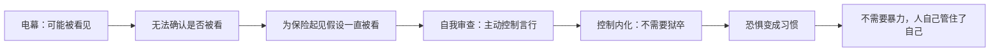

# 01｜为什么监视比枪炮更能控制人？

> 大洋国几乎不动用军队镇压，为什么没人敢反抗？

---

## 一、先说结论

**《一九八四》最核心的洞见是：极权最有效的武器不是暴力，而是"你可能正在被看见"这件事本身。**

电幕、思想警察、被训练成告密者的孩子——这些东西不需要真的抓住你，只需要让你**永远不确定自己有没有被看**。当一个人无法确认自己是否被监视时，他会做出一个最省力的选择：**假设自己一直被看着**。从那一刻起，他不需要狱卒了——他自己就是自己的狱卒。

## 二、我们先理解一个问题

我们通常以为，控制人靠的是"不让做"：不许说、不许动、不许走。但如果你仔细想想就会发现，这种控制成本极高——你得在每个角落放一个人，盯着每一个人。

奥威尔在书里给出了一种便宜得多的办法：**让你觉得自己随时可能被盯着**。电幕挂在墙上，你不知道它后面有没有人，但你知道它"可以"有人。思想警察是否存在、此刻是否在看你，你无法确认——**正是这种"无法确认"，让监视覆盖了每一秒**。

## 三、作者到底提出了什么观点？

奥威尔在书中描绘的监视系统有三层：

- **电幕（telescreen）**：装在每个党员家里的双向屏幕，既能广播也能接收——你不知道它此刻在放还是在看。
- **思想警察（Thought Police）**：一支传说中无处不在的秘密力量，没人见过他们，但人人都相信他们存在。
- **内化的告密网**：孩子被教育成小密探（帕森斯的女儿举报自己父亲睡梦中说了反动话），同事、邻居、爱人都可能是线人。

这三层加在一起，构成了一种不需要"真的看见你"的控制。奥威尔借温斯顿的日常展示：他写日记时下意识把本子往电幕照不到的角落挪；他和裘莉亚说话时压低声音；他习惯性地控制自己的表情——**不是因为有人抓他，而是因为他"可能"被抓**。

## 四、把这个观点翻译成人话

打个比方：这就像你在一个到处都是摄像头的房间里——**你不知道哪些摄像头是开的**。最稳妥的做法是什么？是假设它们全开着，于是一直表现得"正确"。

奥威尔的高明之处在于：他写的不是"摄像头多"，而是"**你无法验证摄像头是不是开着**"。真正的监狱看守不住所有人，但"可能被看守"的感觉可以——因为它把看守的成本转嫁给了被看守者自己。

## 五、为什么会这样？

这个机制后来被福柯命名为"全景敞视"（panopticon）：**一个让所有囚犯以为自己随时被看的设计，比一万个狱卒都管用**。奥威尔在 1948 年就写出了这个原理——而且更进一步：在大洋国，连"被看"都不需要是真的，只需要"可能是真的"。

## 六、举一个现实生活中的例子

**东德斯塔西（Stasi）档案**是历史上最接近这个设想的真实案例。这个冷战时期东德的秘密警察机构，拥有超过 17 万正式线人和数量更庞大的"非正式合作者"——平均每 50 个公民中就有一个在向它提供信息。

它的可怕不在于抓了多少人，而在于**没人知道身边谁是线人**。夫妻、同事、朋友、神父、医生——档案后来公布时，人们发现自己的密友、配偶、老师都曾在监视自己。结果是：在东德，**你不需要真的被监视，只需要知道"任何人都可能是"，就会主动把嘴闭上**。这正是奥威尔写的机制：监视的最大效果不是发现违规，而是让"不敢违规"变成日常习惯。

## 七、回到书中重新理解

有了这个背景再看温斯顿，你会发现一个细节：**他从头到尾都没被"抓住"过**，直到最后那一刻。之前所有的自我审查——写日记要躲、和裘莉亚说话要低声、连表情都要管——都是他在"可能被看"的恐惧下主动做的。

书中最冷的一句是温斯顿对自己说的：**"思想罪不会带来死亡，思想罪本身就是死亡。"**——因为从你产生那个念头、并且开始隐藏它的那一刻起，你就已经把自己交给了这个系统：你在替它看管你自己。

## 八、这个观点背后还有什么？

奥威尔的描写还藏着一个更深的观察：**监视改变的不只是行为，是人格**。当你必须长期表演"一个忠诚党员"时，表演会慢慢变成你的一部分——温斯顿发现自己有时分不清"我在装"和"我真的是这样"。

书中还有一个对照：**党对无产者反而不怎么监视**。85% 的人口住在没有电幕的贫民区，党说"无产者和动物是自由的"。这不是仁慈，是计算——党只在乎控制"可能威胁它的人"，而工人的威胁被认为为零。监视是精准的，不是普遍的：它瞄准的是"有可能想的人"。

## 九、这个观点有问题吗？

有，主要在两点：

- **过度简化**：真实的极权从来不止靠监视——暴力、宣传、利益分配都在起作用。奥威尔为了把"监视"这个机制写透，把其他手段压缩到了背景里。现实中的斯塔西同时用监禁、失踪、连坐，不只是"让你觉得被看"。
- **高估了"内化"的完整性**：奥威尔暗示监视能彻底改变人，但历史上即使最严密的监控社会，地下反抗、黑色幽默、私下的真话依然存在——东德人就在厨房里说真话。监视能管住公开行为，但很难完全消灭私下的"另一个世界"——这正是温斯顿和裘莉亚后来找到的缝隙（第十二篇会谈）。

## 十、今天再看这个观点

> 以下部分是基于书中思想的现代延伸，不是奥威尔的原话。

今天"电幕"换了一种形态：它不是挂在墙上盯着你，而是装在你口袋里——你的手机知道你去哪、说什么、搜什么、和谁联系。和奥威尔想象不同的是：**今天的监视大部分是商业的**（平台要你的数据去卖广告），不是政治的。

但机制没变：**人们依然会因为"可能被看见"而自我审查**——发之前删掉、输入了又退格、在群聊里说言不由衷的话。奥威尔的洞识依然成立：真正管用的监视，不需要真的在看你，只需要让你**习惯假设它在看**。

## 十一、这一篇真正应该记住什么？

记住一件事：**极权最便宜的控制方式，是让被控制者承担看守的成本**。

- 电幕不需要一直开，只需要"可能开"
- 思想警察不需要真的无处不在，只需要"可能无处不在"
- 当你无法确认是否被看时，你会假设一直被看——然后从那一刻起，你成了自己的狱卒

这也是为什么大洋国不需要军队上街：**最好的控制是让人自己管住自己**。

## 十二、留一个问题

如果你生活在一个"你永远不知道是否被看见"的世界里——你会在什么时候开始，连"想"都自我审查？

下一篇换一个角度：监视管住的是"行为"，但大洋国还有一台机器专门管"过去"——温斯顿每天上班做的那件奇怪的事。
