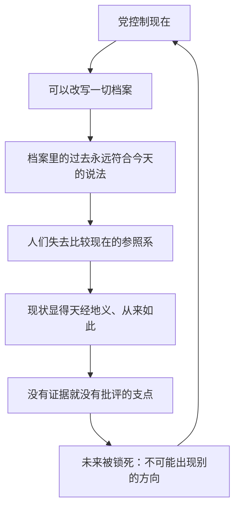

# 03｜为什么控制了过去，就能控制未来？

> 党为什么要花这么大力气改旧报纸？过去的事改不改有什么关系？

---

## 一、先说结论

**因为人的一切判断都依赖"以前是什么样"这个参照系。谁控制了参照系，谁就控制了判断本身。**

大洋国花在改报纸上的力气，不是为了让过去"好看一点"，而是为了抽掉人们脚下那把尺子：如果你无法证明昨天和今天不一样，你就无法证明今天有任何问题。控制过去不是怀旧，是占领未来。

## 二、我们先理解一个问题

我们怎么知道"现在不好"？靠比较。"物价涨了"意味着"以前便宜"；"自由少了"意味着"以前多"。**每一个对现状的批评，底下都垫着一个关于过去的证据。**

而且参照系有一个致命的特性：它自己证明不了自己。"以前更便宜"这句话，需要旧价签、旧账本、旧报纸来撑——证据全部存放在"过去"那一侧。**毁掉证据，判断就悬空了。**

反过来说：如果一个人手里没有任何关于过去的证据，他怎么批评现在？他只能说"现在就是这样"——因为对他来说，"一直就是这样"。

## 三、作者到底提出了什么观点？

奥威尔借党的口号把这句话钉在墙上：**"谁控制了过去，谁就控制了未来；谁控制了现在，谁就控制了过去。"**

书里给出了一次完整的演示。大洋国永远在打仗，敌人是欧亚国或者东亚国——但敌人是谁，可以瞬间切换。奥威尔在书中描绘了仇恨周集会上的那一幕：演讲进行到一半，演讲者接到通知，**当场改口，宣布敌人已经从欧亚国换成了东亚国**。台下的人群没有愣住，没有质问，无缝切换了仇恨对象——然后做的第一件事，是**撕掉自己带来的、写着旧敌人名字的标语**，因为这些标语现在成了"错误的"。

温斯顿清楚地记得：几分钟前敌人还是欧亚国，而且仗已经打了好几年。可是除了他的记忆，没有任何档案能证明这一点。

## 四、把这个观点翻译成人话

打个比方：这就像一场球赛，裁判可以随时回去改上半场的比分。

你明明记得上半场是 2 比 0，但记分牌写着 1 比 1，录像带被收走了，全场观众都坚称一直是 1 比 1——这时候，**你的记忆不但帮不了你，反而成了你的罪证**：全场只有你一个人"记错了"。

## 五、为什么会这样？

这条链条里最狠的是它的双向结构：**控制现在是控制过去的前提，控制过去又是控制未来的前提**。党不是因为篡改历史才强大，而是因为强大到能让篡改不留任何痕迹。

## 六、举一个现实生活中的例子

**历史教科书争议**是一个真实的现代例子——这是事实层面持续发生多年的事：同一场战争，在中国、日本、韩国的教科书里，写法可以完全不同。是侵略还是"进出"，遇难人数是多少，谁该承担什么责任——三国围绕教科书内容发生过长期的学术与外交争议。

为什么几页课本能吵到国家层面？因为各方都清楚教科书在做什么：它不只是向孩子介绍过去，它是在**给下一代发放衡量世界的尺子**。尺子定在哪里，孩子对"什么是正常、什么是不义"的直觉就定在哪里。围绕教科书的争夺，本质上就是"谁来控制参照系"的争夺——这正是大洋国那句口号在现实里的低音量版本。

争议中各方争夺的也不只是"史实"两个字：谁先写、用什么词命名、放进必修还是选修——**这些决定比任何一句更正都更深地塑造下一代的参照系**。和大洋国的区别只在于：这里的争夺是公开的、多方的、能被反驳的，而不是由一家垄断着改。

## 七、回到书中重新理解

再回头看仇恨周那一幕，最可怕的细节不是敌人变了，而是**人群的反应方式**：没有人问"昨天是怎么回事"，大家第一时间撕掉旧标语，仿佛错误出在自己居然还带着旧标语。

奥威尔在书中描绘的这个动作说明：参照系被抽掉之后，人会主动配合——不仅不追究"过去被改了"，还替党消灭"过去曾经不同"的证据。温斯顿自己执行的正是这种工作：他在真理部每天改写旧报纸，就是在替那句口号上班。书里那句总结冷得像铁：**过去被抹掉了，抹掉这件事本身也被遗忘了，谎言变成了真话。**

## 八、这个观点背后还有什么？

这里藏着大洋国最深的一层哲学：党不只是篡改过去的记录，它干脆否认"过去"有独立存在。

后来在仁爱部，奥勃良会把这套逻辑向温斯顿讲清楚：过去存在于记录里、存在于记忆里——记录由党管着，记忆可以被改造，那么"客观存在过的过去"到底在哪里？奥威尔借这套逻辑表达：**当一个政权连"事实"的定义权都拿到手里，篡改就不再是掩盖真相，而是生产真相。**

这也让温斯顿那份真理部的工作有了第二重意义：他每天改写的不只是旧报纸，而是全体大洋国人用来判断世界的原材料。过去在这里不是被发现的东西，而是被制造的东西——党是唯一的制造商。

## 九、这个观点有问题吗？

有，主要在两点：

- **档案垄断比书里写的难**：奥威尔设定党垄断了一切记录，但过去还会从别的渠道漏出来——口头传述、私人信件、家族记忆、外国档案。现实中再严密的政权也很难做到"全网无残留"；学界对此有不同看法：有人认为数字时代的删除更彻底，也有人认为信息反而更难被抹干净。
- **不反抗未必是因为"没有参照系"**：人们顺从强权的原因很多——恐惧、利益、麻木——未必都源于想不起过去。把"控制过去"写成不反抗的唯一机制，是小说为讲清原理做的提纯，真实世界比这杂得多。

## 十、今天再看这个观点

> 以下部分是基于书中思想的现代延伸，不是奥威尔的原话。

今天的"过去"有了新的脆弱性：网页会失效，报道会撤稿，词条会被反复编辑，原始截图真假难辨——**数字化的历史比纸上的历史更好改，也更难自证**。一个链接昨天还在、今天就 404 的事情，每个人都遇到过。同时反方向的事也在发生：截图存档、分布式备份让一些东西几乎删不掉。

奥威尔的框架依然好用：每当你争论一件事"是不是一直如此"时，先问一句——**你手里的"过去"是从哪来的？谁有权修改它？**

## 十一、这一篇真正应该记住什么？

记住一件事：**对现在的所有批评，都需要一个没被篡改的过去作证**。

- 判断靠比较，比较靠参照系，参照系靠档案和记忆
- "一直就是这样"是控制术最成功的状态——它让反抗连理由都找不到
- 守住过去不是为了怀旧，是为了保住"事情本来可以是另一个样子"的证据

## 十二、留一个问题

改档案能管住"过去"，但人脑子里还在用过去思考——那什么东西能管住"想法"本身？大洋国的答案是：直接改造人用来思考的工具。下一篇，我们来看 **04｜为什么要发明一种让人无法造反的语言？**
