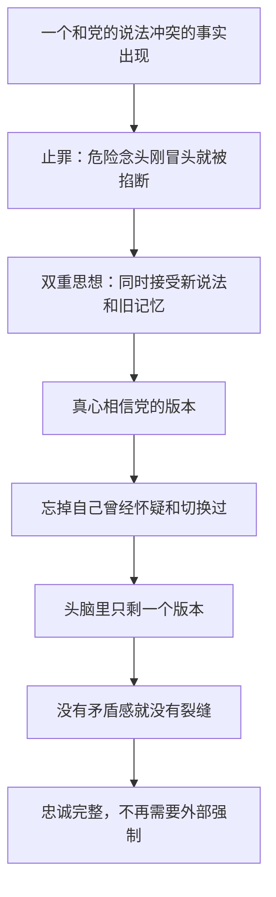

# 05｜一个人怎么能同时相信两个相反的事实？

> 什么是"双重思想"？它和说谎、自欺有什么不同？

---

## 一、先说结论

**双重思想比说谎高级一整层：说谎者知道自己在骗，双重思想者连"知道自己在骗"这一步都抹掉了。**

它是大洋国党员必须掌握的核心心理技术：**同时接受两个互相矛盾的观点，并且相信它们都正确**——而且完成这个过程之后，忘掉自己刚刚做过什么。

## 二、我们先理解一个问题

正常人面对矛盾会不舒服。"敌人是欧亚国"和"敌人一直是东亚国"这两句话摆在一起，你的第一反应是：**总有一个是错的**。

这种"矛盾让我难受"的感觉，是头脑自带的警报器——它保护你不被糊弄。可大洋国的整个系统恰恰建立在矛盾之上：和平部管战争，仁爱部管审讯，真理部管谎言。如果每个党员的警报器都正常工作，这台机器一天也运转不下去。党需要的不是更好的谎言，而是**让警报器失灵的方法**。

## 三、作者到底提出了什么观点？

奥威尔在书中把这个方法命名为**双重思想**（doublethink）。它的完整流程可以拆成三步：

- **同时持有**：明知两个观点互相矛盾，两个都接受。
- **配套本能——"止罪"**（crimestop）：在危险念头冒出来的瞬间自动停止思考，像在念头露头之前就把盖子盖上。
- **忘掉过程**：完成双重思想之后，把"我刚刚做了一次自我欺骗"这件事也忘掉——**有意识地诱导无意识，然后在完成的那一刻忘掉整个过程**。

书里有两个活标本。一个是真理部的日常：党员改档案时**知道自己在改**，同时又**真心相信改完的版本**，然后忘掉"我改过"这件事。另一个是帕森斯——那个愚忠的邻居，睡梦中喊了句"打倒老大哥"，被自己的女儿举报。他醒来后的反应不是辩解，而是**真诚地为自己的"罪"感到羞愧**——他连自己的潜意识都已经上交了。

而温斯顿做不到双重思想——**这是他的裂缝**，也是全书故事的发动机。奥威尔借这条裂缝表达：双重思想不是天生的能力，是被训练出来的技术；训练不到家的人，头脑里就会留下一条关不上的缝。

## 四、把这个观点翻译成人话

打个比方：自欺是"我假装不知道"，双重思想是"我按下一个开关，然后连开关的存在都忘掉"。

自欺还留着一条缝：你心里知道真相藏在哪。双重思想把藏的地方也一起删了。所以它不是撒谎的升级版，而是**对撒谎这个行为本身的毁尸灭迹**——骗完之后，连"曾经骗过"的记忆一并处理掉。

## 五、为什么会这样？

关键在于"忘掉过程"这一环：如果还记得自己切换过，头脑里就留着痕迹；只有把切换本身也切换掉，矛盾才真正归零。

## 六、举一个现实生活中的例子

你大概率见过它的温和版——**公司里的职业性双重思想**。

一个项目，所有人都清楚它大概率要黄：数据不行、方向摇摆、期限不可能完成。但每周例会上，每个人发言时都真诚地说"这次一定成"——注意，**说的时候是真诚的**。那不是虚伪的客套：那一刻他真的相信，因为"相信"是这份工作的一部分；散会回到工位，他又恢复"这项目悬"的判断，并且完全不觉得两种状态之间有什么需要解释的地方。

周一到周五的职场，就是一个低配版的双重思想训练场：让人习惯在"我知道"和"我应该相信"之间无缝切换，切换到不再意识到自己正在切换。

## 七、回到书中重新理解

带着这个对照看帕森斯，他是双重思想完成度最高的标本。女儿举报他梦话里喊反动口号，他居然真心感谢女儿"及时发现"——**他不觉得被举报可怕，他觉得自己可耻**。连潜意识里泄露出来的那一点点真东西，他都要交给党处理。

而温斯顿的"做不到"恰恰是他的人性所在：他记得、他怀疑、他改完档案之后知道自己改了——**他头脑里那条"矛盾的缝"一直关不上**。也正因为关不上，他才有后来的日记、裘莉亚，以及对"二加二等于四"的执念。

## 八、这个观点背后还有什么？

心理学里有一个近亲概念值得对照：**认知失调**（cognitive dissonance，由费斯廷格提出）——人同时持有相互矛盾的观念时会产生心理不适，然后想办法消除它。

双重思想的可怕正在于它绕过了认知失调：失调是警报、是痛苦，是头脑在自救；**双重思想要求你连不适都不许有**——矛盾被吞下去的时候，喉咙都不许动一下。换句话说，认知失调是头脑对矛盾的抵抗，双重思想是训练头脑放弃抵抗。一个是症状，一个是对免疫系统的切除。

## 九、这个观点有问题吗？

有，主要在两点：

- **"纯粹的双重思想"在心理上是否可能，学界对此有不同看法**。实验心理学能证明自欺、合理化、选择性遗忘真实存在，但"同时百分之百相信两个矛盾命题"更像一个极限模型——现实中的人往往在不同场合调用不同版本，而不是在同一瞬间真的"两个都信"。奥威尔把它写成了完成态：文学上更冷，科学上偏理想化。
- **矛盾感消失未必都是"训练"的结果**：人也可能只是麻木、犬儒、懒得较真——明知是假，配合演完，回家就不想了。这种"清醒的敷衍"和双重思想很像，但它留着后门：当事人知道自己不信。书里温斯顿最终是被硬生生改造成功的，这恰恰说明连党自己都不放心——它宁可花巨大代价做掉这条缝，也不敢指望人人自发完成双重思想。也有人因此认为，奥威尔写的是一个光谱的终点：多数人停在"敷衍"层，真正抵达终点的只是少数——但小说把终点画出来，恰恰是为了让你看清整条光谱。

## 十、今天再看这个观点

> 以下部分是基于书中思想的现代延伸，不是奥威尔的原话。

今天不需要仁爱部也能看到双重思想的日常版本：朋友圈的人设和私下的真实想法长期共存；问卷里的"非常认同"和心里那句"拉倒吧"同时运行；一边转发"数据不会骗人"，一边清楚数据是怎么做出来的——**现代人切换得如此熟练，以至于"矛盾"这个词本身都快失去意义了**。

奥威尔的提醒依然有效：双重思想最危险的时刻，不是你说违心话的那一刻，而是**你说完连"违心"都感觉不到的那一刻**。

## 十一、这一篇真正应该记住什么？

记住一件事：**双重思想的核心动作不是"相信假的"，而是"忘掉自己曾经切换过"**。

- 说谎者心里留着真相，双重思想者连存放真相的抽屉都拆了
- 止罪是在念头冒头之前掐断它——被训练的不是观点，是反射
- 温斯顿的"做不到"提醒我们：会怀疑、会别扭、会不舒服，恰恰是头脑还没交出去的证据

## 十二、留一个问题

头脑管住了之后，党还剩最后一个要管的领域——它比思想更原始、更难控制：**情绪**。为什么大洋国每天要拿出整整两分钟，让所有人对着一块屏幕尖叫？下一篇，我们来看 **06｜为什么情绪也要被定期定量供应？**
