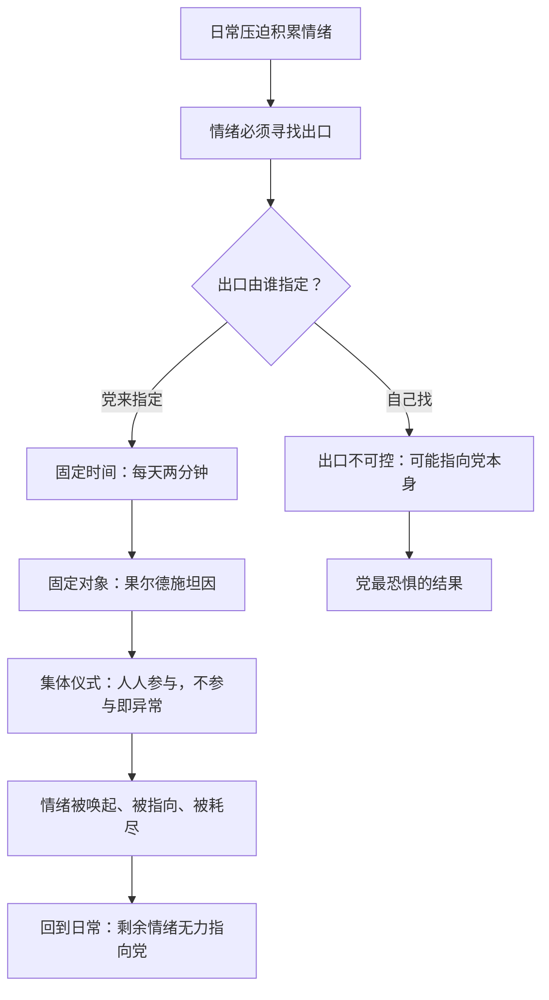

# 06｜为什么情绪也要被定期定量供应？

> 两分钟仇恨只有两分钟，为什么每天都要办？

---

## 一、先说结论

**《一九八四》里最被低估的设计是：党不只控制你的行为和语言，还把你的情绪也纳入了配给制。**

两分钟仇恨、仇恨周——这些仪式的作用不是"表达仇恨"，而是**定时唤起、定向投放、定量耗尽**。奥威尔在书中设定：每天固定时间，所有党员必须对着屏幕上的果尔德施坦因尖叫咒骂两分钟。为什么是两分钟？为什么每天？因为情绪一旦被安排在固定时间、对着固定对象发泄，它就不会再指向党本身。**仇恨被党的日程表接管了。**

## 二、我们先理解一个问题

人活在压迫之下，一定会积累情绪——疲劳、屈辱、恐惧、不甘。这些情绪不会消失，只会寻找出口。

对统治者来说，最危险的不是人有情绪，而是**情绪找不到出口时会自己找一个**——而它自己找到的那个出口，往往就是统治者本人。所以真正的问题不是"如何消灭情绪"（消灭不了），而是"**如何给情绪安排一个安全的出口**"。

## 三、作者到底提出了什么观点？

奥威尔在书中描绘了一整套"情绪管理装置"：

- **两分钟仇恨**：每天定时的集体仪式。电幕上出现果尔德施坦因——叛徒、"人民公敌"、据说是地下组织"兄弟会"的头目、前党领袖。所有党员必须尖叫、咒骂、朝屏幕扔东西；不参加，或者参加得不够投入，都会被注意。
- **仇恨周**：同一机制的放大版——整整一周的游行、演讲、展览，把仇恨的浓度推到顶点。
- **仇恨对象的实时换轨**：奥威尔在书中写下一个惊人的细节——仇恨周中途，大洋国的敌国突然从欧亚国变成东亚国，演讲者话音未落，全场仇恨对象无缝切换，没有一个人觉得违和。

最关键的是温斯顿的体验：他心里恨的明明是老大哥，可在两分钟仇恨里，他发现自己不由自主地恨果尔德施坦因——**集体场域能在两分钟内直接改写一个人的情绪指向**。也正是在仇恨仪式上，他第一次注意到了奥勃良。

## 四、把这个观点翻译成人话

打个比方：情绪像蒸汽，压力一定会累积。处理方式只有两种——一种是堵住，蒸汽迟早炸开，炸的方向不可控；另一种是**装一根排气管，规定蒸汽每天几点排、朝哪个方向排、排多少**。

两分钟仇恨就是那根排气管。党不消灭你的恨，党给你的恨规定了时间表和靶子：每天中午，对着这张脸，恨两分钟。排完之后，你带着被掏空的情绪回去继续服从。

## 五、为什么会这样？

这个机制有三个环环相扣的设计：**定时**（让它成为日程而非爆发）、**定向**（让它对着敌人而非体制）、**集体**（让不参与本身成为罪行）。第三条最狠——当所有人都在尖叫时，你不尖叫就是异类；而当你跟着尖叫了两分钟之后，你自己也分不清哪些恨是真的了。

## 六、举一个现实生活中的例子

想想**饭圈的"定点团建"**。在很多粉丝社群里，"骂对家"不是偶发事件，而是日程表的一部分：每天固定时间集合，固定的话题、固定的对象、固定的口号，组织者发战报、统计"战果"，不参加的人会被问"今天怎么没来"。

这个机制的运转方式和两分钟仇恨几乎同构：参与者的真实生活里未必有那么强烈的恨，但**当仇恨被排进日程表，它就脱离了真实感受，变成一种身份义务**——你来骂，不是因为今天你特别生气，而是因为"你是我们的人"。骂完之后，情绪被释放了，归属感被确认了一次，而社群里真正的问题反而没人再有力气追问。仇恨的箭头永远被指向外面那个"对家"，从不指向内部。

## 七、回到书中重新理解

再看温斯顿在那两分钟里的体验，你会发现奥威尔写的是一件比"被迫表演"更可怕的事：**他不是装的，他是真的被卷进去了**。

书中描写，两分钟仇恨进行到一半时，温斯顿发现自己和周围的人一起嘶吼，对果尔德施坦因的恨是真实的——更可怕的是，他可以在恨果尔德施坦因和恨老大哥之间来回切换，而仪式结束后，那种被劫持过的感觉还留在身体里。奥威尔借这个细节表达：**集体情绪场不是放大你的情绪，是改写你的情绪**。你以为你在发泄，其实是党在替你决定发泄的方向。

## 八、这个观点背后还有什么？

这个机制背后还藏着一个更深的设计：**仪式化的仇恨制造"我们"**。

当一屋子人对着同一个目标尖叫时，他们在那一刻拥有了一样东西——共同的敌人。而共同敌人是制造共同体最便宜的材料：不需要共同的信仰、共同的利益，只需要共同恨一个人。果尔德施坦因此人是真是假、兄弟会是否存在，书中从未证实——**这恰恰是设计的一部分：敌人不需要存在，只需要被恨**。

还有一个细节：两分钟仇恨对准的是"叛徒"而非外敌。前党领袖变成头号公敌，这个设定同时在告诉党员——**连我们中间最高的人都可能变质，所以你谁都别信，只信党**。仇恨仪式同时是一堂"不许背叛"的警示教育课。

## 九、这个观点有问题吗？

有争议的地方主要在两点：

- **对"情绪可以被彻底管理"的估计可能过于整齐**。奥威尔把两分钟仇恨写成一个精密阀门，但真实历史中的群众仪式常常失控——激情一旦被煽动起来，未必按时收场，也未必永远指向指定目标。学界对极权仪式的效果有不同看法：有研究认为仪式更多制造的是"服从的表演"，参与者内心未必真被改写；温斯顿那种"不由自主"的体验，可能更像文学上的极端化呈现。
- **它假设情绪是"定量"的，排完就没了**。但还有另一种解释：反复练习仇恨可能不是消耗情绪，而是训练情绪——让人越来越习惯恨、越来越需要恨。按这个读法，两分钟仇恨不是排气管，是健身房。两种解释都能从书里找到支持，奥威尔本人没有给出裁决。

不过这些争议不推翻核心观察：把情绪的出口收归官方日程，确实是极权体制反复使用的真实手段——这一点在历史事实上有大量对应物。

## 十、今天再看这个观点

> 以下部分是基于书中思想的现代延伸，不是奥威尔的原话。

今天的"两分钟仇恨"不再需要集会——它化整为零，变成了信息流里的日常仪式：热搜上的"全民公敌"、每隔几天换一个的网暴对象、被剪辑出来专门用来激怒你的短视频。没有人组织你尖叫，但推送机制替你把"定时、定向"两件事都安排好了。

变化在于：大洋国的仇恨是统一的、有日程的，今天的仇恨是碎片的、按算法的。但机制的内核没变——**你的愤怒依然在被定时唤起、被定向投放，然后在你意识到之前被消耗掉**。真正值得追问的问题和温斯顿的一样：当我的情绪每天都被安排好出口时，它原本是想带我去哪里？

## 十一、这一篇真正应该记住什么？

记住一件事：**极权不害怕你的情绪，它害怕你的情绪自己找方向**。

- 情绪无法消灭，只能管理——所以党不压情绪，党给情绪排日程
- 定时（每天两分钟）、定向（对着果尔德施坦因）、集体（不参与即异常），三个设计缺一不可
- 仇恨的对象不需要是真的，只需要被恨——共同敌人是共同体最便宜的胶水
- 最可怕的不是被迫表演，是像温斯顿那样，在两分钟里真实地恨了一个你不认识的人

情绪一旦被接管，人就连"我为什么生气"这个问题都不再问了。

## 十二、留一个问题

如果每天定时定量的仇恨是体制的规定动作——那么在这个世界里，一个人做过的最"不合规矩"的事，会是什么样子？

下一篇，我们来看一件看起来毫无杀伤力的小事：温斯顿·史密斯在无产者区的旧货店里买下了一本空白本子——「一本日记为什么就是犯罪的开始？」
