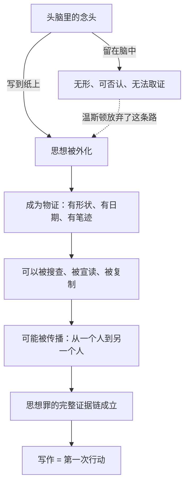

# 07｜一本日记为什么就是犯罪的开始？

> 温斯顿写日记并没有伤害任何人，为什么这是极权社会里最危险的动作？

---

## 一、先说结论

**温斯顿买下的那本日记，是全书中成本最低、后果最重的一件东西。**

它什么都没做——没有伤害任何人，没有组织任何人，甚至没打算让任何人读到。但在一个"思想本身就是罪"的社会里，把思想写到纸上，等于把只存在于你头脑里的东西搬进了现实世界：**它从此有了形状、有了证据、有了被传播的可能**。奥威尔借温斯顿的动作告诉我们：写日记不是记录想法，而是第一次行动——从写下第一个字起，他就跨过了那条回不去的线。

## 二、我们先理解一个问题

先想清楚一件事：在大洋国，"想"和"做"之间的界限到底画在哪里？

正常情况下，想法是安全的——它在你的脑子里，别人看不见，你可以否认、可以反悔、可以假装它从未发生。思想警察再厉害，面对一个从没说出口、从没写下来、从没表现在脸上的念头，也没有证据可抓。

所以大洋国真正的安全线是：**只要思想还锁在你的脑子里，你就还勉强是自由的**。温斯顿的问题在于，他亲手把这条线拆了。

## 三、作者到底提出了什么观点？

奥威尔在书中安排了几个层层递进的细节：

- **买本子本身已违规**：温斯顿在无产者区查林顿的旧货店买下那本空白日记本——党员不该光顾那种地方，这个行为本身就已经出格。
- **没有法律，但一切皆是罪**：奥威尔在书中设定，大洋国其实"已经没有法律了"——没有成文法典，没有明文规定"不许写日记"。但正因为没有法律，任何不合规矩的事都意味着同一种下场：被蒸发。模糊的规则比明确的禁令更可怕，因为你永远不知道自己踩没踩线。
- **手在抖**：温斯顿写下"打倒老大哥"时，笔迹凌乱、手指发抖——他自己知道这一笔意味着什么。
- **写给不存在的人**：他在日记里向未来或过去致意——他在给一批永远不会收到信的读者写信。
- **"他已经是死者"**：奥威尔借温斯顿之口表达了这个判断——从写下第一个字起，他就是死人了，剩下的只是时间问题。

## 四、把这个观点翻译成人话

打个比方：你脑子里有个念头，像一封从未寄出的信——它存在，但世界上没有任何痕迹证明它存在。写日记，就是把这封信寄出去了：哪怕塞进抽屉最深处，它也已经**离开了你身体的保护**，变成一件独立存在于世界上的物证。

在"思想即罪"的世界里，这等于什么？等于你亲手为自己的死刑制作了物证、签了名、标注了日期。

## 五、为什么会这样？

日记之所以是"犯罪的开始"，关键在于它完成了三个跨越：**从无形到有形**（可被取证）、**从可否认到不可否认**（笔迹不会说谎）、**从私有到潜在公共**（纸上的东西原则上可以被任何人读到）。第三步最致命——温斯顿自己也意识到，他写日记时已经在想象一个读者，哪怕那个读者是几十年后的陌生人。**日记是思想的第一次公开。**

## 六、举一个现实生活中的例子

想想那种**写了又删的朋友圈**的经历：深夜情绪上来，打了一大段话，检查两遍，手指悬在"发送"键上，最后还是逐字删掉。

删掉之前那一刻你体验到的东西，就是温斯顿体验到的门槛：一段只存在于草稿里的文字，和一段发出去的文字，是完全不同的两种存在。草稿里的抱怨是"想法"，发出去的抱怨是"言论"——前者可以随时否认，后者会被截图、被转发、被三年后的某个人翻出来。**发布键隔开的不是"写"和"不写"，而是"想法"和"行动"**。我们大多数人每天都在这个门槛前自动退回，这不是怯懦，而是一种极其精确的风险直觉：一旦外化，东西就不再只属于你了。温斯顿做的，是明知道这个门槛，还是迈了过去——而且他的"朋友圈"里，没有"三天可见"这个选项。

## 七、回到书中重新理解

有了这个背景再看那个著名的场景：温斯顿把日记藏在抽屉里，用一粒白色尘土做记号，看有没有人动过它。

这个细节的残酷在于：**他明知藏不住**。抽屉、尘土、小心翼翼——全是徒劳的仪式，思想警察真来了，这些都毫无意义。那他为什么还写？奥威尔借这个动作给出了答案：写作对温斯顿来说不是通信，是**确认自己还存在**。在一个人人都必须表演的世界里，日记本是他唯一不表演的地方——哪怕下一秒它就会被搜走，写下"打倒老大哥"的那几秒钟里，世界上确实存在过一个真实的温斯顿·史密斯。藏不住也要写，因为"写"本身就是他仅剩的自由。

## 八、这个观点背后还有什么？

日记这个设定还牵出书里一个更深的主题：**没有法律的社会，比有严刑峻法的社会更可怕**。

大洋国没有成文法这件事，奥威尔在书中特意点明——这反直觉，但极准确：法律至少告诉你红线在哪儿，而"没有法律、一切皆可蒸发"意味着**红线在你心里，由你的恐惧画出来**。于是每个人都按最保守的标准自我审查——党甚至不需要禁止写日记，恐惧会自动算出"写日记等于死"。

另外注意日记的收件人：未来或过去的人。温斯顿写日记，本质上是在和时间做交易——他现在不能说，但也许未来有人能懂。这给日记添了一层性质：**它是对"现在不是全部"的一次投票**。一本日记同时是物证、遗嘱和漂流瓶。

## 九、这个观点有问题吗？

有几点值得平衡地看待：

- **"外化即行动"的链条在书内逻辑上成立，但它依赖一个前提：思想确实是罪**。奥威尔把这个前提推到极端之后，日记的危险性才如此触目。在现实中，写作的危险程度取决于环境——同样的日记在自由社会只是一件文具。
- **书可能夸大了"第一步"的决定性**。写日记被呈现为不可回头的分水岭，但也有另一种解释：温斯顿的毁灭并不是从日记开始的必然滑坡，而是无数次小选择叠加的结果——甚至可以说党早已盯上他，日记只是迟早会被翻出来的物证之一。按这种读法，日记更像症状而非病因。
- **还有一层反面的观察**：私下书写在真实的极权环境下既是最危险的、也是最难被定罪的抵抗形式之一——只要不被发现，它就什么都不是。奥威尔让温斯顿注定被发现，是文学的选择，不是逻辑的唯一解。

## 十、今天再看这个观点

> 以下部分是基于书中思想的现代延伸，不是奥威尔的原话。

今天几乎人人都有"日记本"——聊天记录、备忘录、搜索历史、草稿箱。区别在于：温斯顿的日记至少是纸，烧了就没了；而今天的"写下"天然是数字的，可复制、可检索、可恢复，删除从来不是真正的删除。

更重要的是：今天"外化"思想甚至不需要你主动写——你的浏览记录、停留时长、购物车，都在替你写日记。**温斯顿至少还经历了"要不要写"的挣扎，而我们连挣扎的环节都省了**：思想的外化已经自动化、默认化。这本该让人更不安——但大多数人感觉不到，因为没有人告诉他们这是罪。大洋国用恐惧守住这条线，而今天，这条线根本没人画。

## 十一、这一篇真正应该记住什么？

记住一件事：**在"思想即罪"的世界里，把思想放到纸上，就是你做过的第一件"实事"**。

- 脑子里的念头可否认，纸上的字不能——外化让思想有了证据
- 日记意味着想象中的读者——它从写下第一个字起就是"潜在公共"的
- 大洋国没有法律：红线由恐惧画出，这比禁令更有效
- 温斯顿明知藏不住还写——因为写作是他确认"我还存在"的方式

日记不是反抗的开始，是"我不再假装"的开始。

## 十二、留一个问题

写下想法是把思想外化到纸上——可如果有一种东西既无法外化、也无法被任何档案证伪，只存在于你的脑子里，党还碰得到它吗？

下一篇，我们来看温斯顿反复做的那个关于母亲的梦——「私人记忆为什么是最后的堡垒？」
