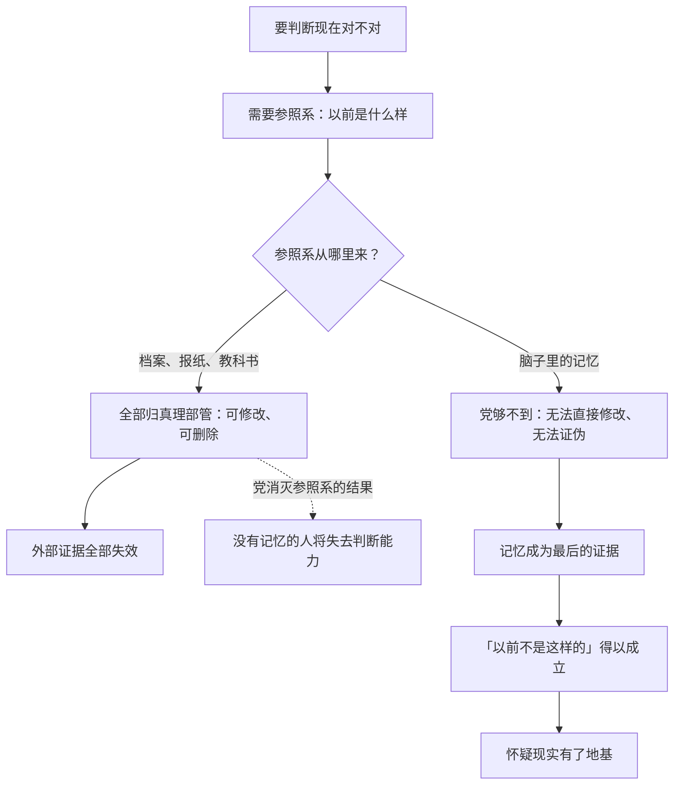

# 08｜私人记忆为什么是最后的堡垒？

> 温斯顿对母亲和妹妹的记忆为什么重要？它只是一段私人往事而已。

---

## 一、先说结论

**党可以烧掉每一张报纸、改写每一份档案，但它进不了你的脑子——至少在仁爱部之前进不了。**

温斯顿记得母亲、记得那块巧克力、记得小时候的伦敦"不是这样的"。这些记忆琐碎、模糊、拿不出证据，但正因如此，它们是**唯一无法被证伪的东西**：档案归党管，回忆却在党够不到的地方。守住记忆，就是守住"另一个世界曾经存在过"的最后证据。

## 二、我们先理解一个问题

在大洋国，判断"现在对不对"需要一个参照系：以前是什么样？

问题在于，所有关于"以前"的记录都归真理部管——报纸、照片、统计数字、教科书，随时可以改。这意味着：你脑子里哪怕觉得"现在不对"，也拿不出任何外部证据证明"以前更好"。你的怀疑会变成一句空话。

所以真正的问题是：**当外部世界没有一寸证据属于你时，你凭什么相信自己的怀疑是对的？**温斯顿的答案是：凭记忆。

## 三、作者到底提出了什么观点？

奥威尔在书中反复写到温斯顿的记忆，它们不是怀旧，而是证据：

- **母亲和巧克力**：温斯顿反复梦见饥荒年代，家里分巧克力配给，饥饿的他抢走了妹妹那份逃走，回来时母亲和妹妹已经不见了。这段记忆带着几十年的愧疚，怎么也散不掉。
- **"以前不是这样的"**：他模糊记得小时候的伦敦——记得它曾经不是现在这个样子。这份模糊的记忆，是他怀疑官方叙事的地基。
- **母亲的死有一个私人版本**：他相信母亲是为了保护他而死的——这个私人叙事和官方历史完全冲突，但它活在他的记忆里，党改不动。
- **"黄金乡"**：他反复梦见一片想象中的旧世界风景——后来裘莉亚真的出现在那样的风景里。梦里的旧世界，是他记忆寄托的另一种形态。

奥威尔借这些记忆表达：党能控制关于过去的一切记录，但控制不了一段你反复做的梦。

## 四、把这个观点翻译成人话

打个比方：世界是一个法庭，党控制了所有卷宗——证人、证物、判决书，全是它写的。你想上诉，没有任何书面材料支持你。

但你手里还有一样东西：**你亲眼见过案发那天**。你的证言没有物证配合，法庭可以不认——可你自己知道那不是假的。只要这段记忆还在，"判决书写的就是全部真相"这句话就始终有一个漏洞。温斯顿的记忆，就是那个漏洞。

## 五、为什么会这样？

记忆的不可替代性来自两个属性：**它绕开档案系统**（不需要物证配合就能在个人心里成立），**它无法被外部证伪**（没人能"证明"你不记得）。它的缺点同样明显：无法向别人证明。所以它只能成为一个人的堡垒，成不了一群人的旗帜。

## 六、举一个现实生活中的例子

想想**家族相册里那个被涂掉的人**。很多家庭都有类似的故事：某张合影里有个人被钢笔涂黑，或被剪掉半边——因为种种原因（政治、决裂、家丑），他被从相纸上抹掉了。

档案层面上，这个人不存在了：合影里没有他，户口本里可能也没有他，讲家史时没人提他。但家里总有一个人记得——记得他坐在桌子的哪个位置、记得他的声音、记得他为什么消失。涂改相纸的人抹掉的是"记录"，抹不掉的是"记得"。**只要还有一个人记得，被涂掉的人就没有真正消失**。这就是温斯顿处境的日常版本：官方叙事可以删改一切外在痕迹，唯独删改不了一个活人脑子里的画面——这也是为什么记忆让极权如鲠在喉。

## 七、回到书中重新理解

再看巧克力那段记忆，它的沉重不只在"记得"，更在于"**记得自己的罪**"。

温斯顿当年抢走妹妹那份巧克力逃走，回来时母亲和妹妹已被带走——他用几十年的时间咀嚼这段记忆，咀嚼里面的愧疚。注意这段记忆的特别之处：它一点也不光荣，甚至让他痛苦。但他死死守着它，因为这段记忆承载着一个党无法提供的东西——**一个有爱、有背叛、有代价的私人世界**。在官方叙事里，人只是零件；在温斯顿的记忆里，母亲是会为孩子牺牲的人，自己是会犯错的儿子。这份有重量的、具体的、疼痛的过去，本身就是对"党说你从来就是这样"的反驳。

## 八、这个观点背后还有什么？

记忆作为"堡垒"，背后还有个更深的含义：**它是个人的，也就是孤独的**。

温斯顿的记忆没法拿出来说服别人——他没法跑到酒馆里对人说"我记得以前不一样，所以你们也该怀疑"。记忆只能成为一个人的底气，不能成为一群人的武器。这是它作为堡垒的天花板：守得住自己，救不了别人。

还要提前说一句：这个堡垒并非固若金汤。奥威尔在书中设定，党最后连记忆也要管——仁爱部的审讯会证明，记忆看似藏在脑子里、实则也脆弱得可以被拆毁。但那是后话；在被捕之前，记忆确实是温斯顿身上党唯一没有攻破的地方。

## 九、这个观点有问题吗？

有几点值得平衡地看待：

- **"记忆不可篡改"是个有前提的说法**。温斯顿的记忆能当堡垒，是因为党暂时进不去——但记忆本身并不诚实。心理学大量研究表明，人的记忆会被重构、被暗示、被情绪染色。奥威尔把记忆写成"最后的可靠证据"，是文学上的必要设定，现实中的记忆远没有这么坚固。
- **记忆无法证伪，也无法证实**。它能让温斯顿自己相信"以前不一样"，但同样可能让他错把愿望当回忆——他"相信"母亲为保护他而死，这个叙事本身就可能是愧疚编织出来的。学界对创伤记忆的真实性一直有争论，记忆作为证据的可信度，远比小说呈现的更可疑。
- **另一种解释**：温斯顿抓住的可能不是"真实"，而是"疼痛"——他需要的不是准确的历史，而是一个能让自己区别于机器的伤口。按这种读法，记忆的价值不在真实性，而在它证明"我曾活过"。

## 十、今天再看这个观点

> 以下部分是基于书中思想的现代延伸，不是奥威尔的原话。

今天的"记忆"反而比温斯顿的时代更不安全：你以为你记住了，但你依赖的"记住"大多外包给了云端、相册、聊天记录——而这些，恰恰是最容易被删改、被下架、被覆盖的东西。温斯顿至少还能靠自己脑子里的画面作证；我们的"记忆"越来越依赖可被修改的外部存储。

更有意思的是：今天甚至不需要有人来删你——你的记忆会被**不断刷新的信息流**稀释、覆盖、重构。没有人涂改你的相册，但每天涌进来的新画面会让你逐渐记不清原来的画面。大洋国靠真理部费尽力气做的事，今天靠"刷新"两个字就在自动发生。

## 十一、这一篇真正应该记住什么？

记住一件事：**当一切外部证据都属于别人时，你脑子里的画面就是你唯一的领土**。

- 党改得动档案，改不动你记得的东西——这是记忆不可替代的原因
- 温斯顿守住的不是光荣的过去，是有爱、有愧疚、有重量的私人世界
- 记忆的局限：能守住一个人，说服不了第二个人——它是堡垒，不是旗帜
- 这堡垒并非牢不可破——党在仁爱部会对记忆下手，但那是后话

守住记忆，就是守住"另一个世界存在过"的证据。

## 十二、留一个问题

温斯顿把希望押在记忆上，可记忆只是他一个人的——如果改变这一切的希望不靠记忆，那要靠谁？

下一篇，我们来看温斯顿反复念叨的另一句话：占人口百分之八十五的那群人——「为什么『希望一定在无产者身上』？」
