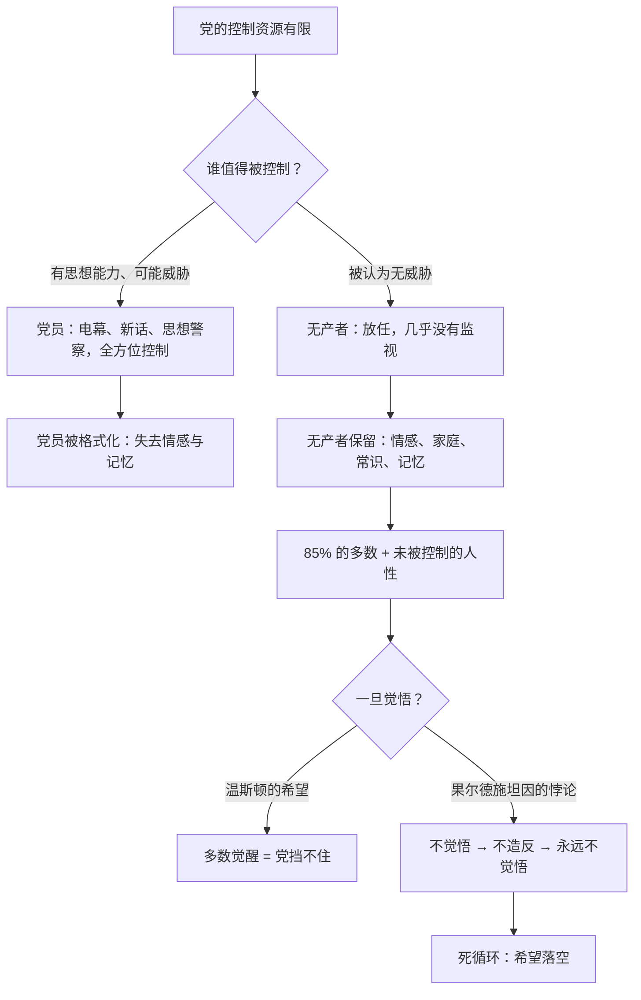

# 09｜为什么「希望一定在无产者身上」？

> 温斯顿为什么坚信大洋国唯一的希望在那些麻木的、占人口 85% 的无产者身上？

---

## 一、先说结论

**温斯顿的希望逻辑是反直觉的：他不寄望于"有觉悟的少数人"，而寄望于"麻木的绝大多数"。**

大洋国 85% 的人口是无产者——不读书、不问政治、连造反的念头都没有，党的口径是"无产者和动物是自由的"。但温斯顿偏偏相信：正因为党对他们几乎放任，他们身上保留着党无法删除的东西——情感、记忆和"生活本来应该是什么样"的常识。**如果有希望，希望在无产者身上——因为他们一旦醒过来，85% 的力量谁也挡不住。**

## 二、我们先理解一个问题

先看一个奇怪的事实：大洋国对党员的监视密不透风，对无产者却几乎不管——他们住的街区没有电幕，他们喝酒、赌彩票、吵架、过自己的小日子。

党为什么不管？因为党算过账：**控制是要成本的，而无产者被认为没有威胁**——他们没受过教育，看不懂理论，连"现在是不是比过去好"都懒得想。党把全部精力用来控制"可能想的人"，至于不想的人，随他们去。

那么问题来了：被放任的 85%，究竟是"安全的乌合之众"，还是"沉睡的多数"？温斯顿赌的是后者。

## 三、作者到底提出了什么观点？

奥威尔在书中给温斯顿安排了一套完整的论证，但它布满裂缝：

- **数字本身**：85% 的人口——温斯顿的逻辑很朴素，党不可能盯住这么多人，只要他们意识到自己的力量，就能把党掀翻。
- **酒馆里的失望**：他真去无产者的酒馆问过。他拉住一个老人问："革命前是不是比现在好？"老人只记得鸡毛蒜皮——争论啤酒该按品脱还是按升卖、记得礼帽、记得谁欠谁的钱——答非所问。温斯顿发现：老人活着，但"以前"在他脑子里已经死了。
- **果尔德施坦因的悖论**：果尔德施坦因的书里写下一个死循环——"无产者不觉悟，就永远不会造反；不造反，就永远不会觉悟。"希望和绝望锁死在同一个句子里。
- **唱歌的女人**：可温斯顿依然坚信。最动人的一幕是：他听见一个无产者女人在院子里晾衣服时唱歌——唱的是党流水线上生产的流行曲，却被她唱得像自己的歌。那一刻他突然感动：**他们还活着，他们会生孩子、会爱人、会为一块巧克力难过——人性还在他们身上，而不在党员身上。**

## 四、把这个观点翻译成人话

打个比方：一栋大楼里，保安死死盯着经理室的几个白领——门禁、打卡、摄像头一应俱全。至于楼底下占八成的保洁、搬运工、小商贩，保安懒得管，觉得他们"不成事"。

温斯顿的判断是：保安算错了一笔账——**被盯死的白领反而是最安全的，因为他们的每一根神经都被编进了系统；而那些没人管的大多数，才是真正自由的**：他们的脑子没被格式化，他们还记得日子本来该怎么过。如果哪天他们突然发现自己人多，这栋楼就拦不住了。

## 五、为什么会这样？

温斯顿的赌注建立在一个事实上：**党再强大，也无法把 85% 的人都装上电幕**。控制的成本决定了控制必须精准——而精准就意味着有盲区，盲区里保存着完整的人性。但悖论同样锋利：盲区里的人若永远不知道自己有力量，盲区就永远只是盲区。

## 六、举一个现实生活中的例子

想想**广场舞的大爷大妈**。他们不刷热搜、不关心宏大叙事、对新闻无感——他们的世界是菜价、孙子、舞步、谁家的狗又拉了。**这就是"沉默的大多数"的日常形态：不是被说服了，而是根本没进入那个话题**。从管理者的视角看，这是最安全的人群——他们只想把日子过下去。

但历史也给出过反例——**1989 年柏林墙前的东德民众**。这是事实：几十年来他们同样是"麻木的大多数"，排队、上班、过日子，不问政治。可在那个秋天，几十万人突然走上莱比锡和柏林的街头——没有领袖，没有纲领，只是"日子过不下去了"积累到了某个临界点。柏林墙不是被军队推倒的，是被那些"从不关心政治的人"用脚走出来的。温斯顿赌的就是这种时刻的存在：多数一旦醒，挡是挡不住的——问题是，东德等来了那个时刻，大洋国没有。

## 七、回到书中重新理解

再看酒馆那一幕，它是温斯顿希望理论的**第一次崩塌**。

老人不记得"革命前更好还是更差"——他记得的是啤酒的价格、帽子、琐事。温斯顿意识到一件可怕的事：党甚至不需要给无产者洗脑，只需要**让过去从他们的记忆里慢慢蒸发**。老人活着、记得细节、情感健全——但他的记忆里没有"对比"，没有对比就没有怀疑，没有怀疑就没有反抗。无产者保存了人性，却丢掉了历史；而丢掉历史的人，永远不知道自己丢了什么。

所以那句"希望在无产者身上"，读起来更像一句祷告，而不是分析。

## 八、这个观点背后还有什么？

温斯顿的信念背后藏着一个更深的赌注：**人性比政治更难删除**。

党可以删掉档案、删掉词汇、删掉历史，但删不掉一个女人晾衣服时唱歌的那种东西——对温斯顿来说，那歌声证明"人还活着"，证明党没有赢到底。党员们反而是空心的：像帕森斯那样的党员，连孩子举报自己都觉得"孩子警惕性高，真骄傲"。奥威尔借这种对比表达一个残酷的判断：**被体制格式化得越彻底的人越没救，反而是被遗忘的人保存着火种**。

但也要看见这个信念的结构：温斯顿不是在信任无产者，而是在**需要**无产者——他自己已经绝望，必须找一个还"活着"的群体来安放希望。这份信念里有多少是分析、有多少是自救，书里留得很模糊。

## 九、这个观点有问题吗？

学界对此一直有争论：

- **是清醒判断还是民粹浪漫？**有批评者认为，奥威尔对无产者的描写带着一种知识分子的浪漫化——"纯朴的人民保留人性"是个讨人喜欢的叙事，但未必是事实。麻木不等于纯洁，被放任也不等于有抵抗力：历史上被放任的底层民众，完全可能同时被低俗娱乐和琐碎生存消耗掉，既无人性光辉，也无反抗潜能。
- **书本身就否定了这个希望**：故事的结局说明一切——温斯顿被抓走、被改造、最后爱上老大哥，无产者从头到尾没有醒过。奥威尔用情节给出的答案是：**死循环是真的**，没有外部介入，85% 的麻木不会自动变成觉醒。
- **另一种解释**：也有人认为奥威尔写的不是预言而是条件——"如果"无产者醒，党挡不住；而这个"如果"恰恰是最难的。所以这句话不该读成判断，该读成一道没解出的题：谁来唤醒他们？温斯顿答不上来，书也没答。

## 十、今天再看这个观点

> 以下部分是基于书中思想的现代延伸，不是奥威尔的原话。

今天"沉默的大多数"的处境比大洋国更复杂：他们不是被放任，而是被**算法接管**——短视频、娱乐、消费填满了所有缝隙，注意力被切碎到没有时间问"日子是不是本来该更好"。这比放任更有效：大洋国的无产者至少还有院子里的歌声，今天的"无产者"被算法喂得比谁都忙。

温斯顿的悖论也有了新版本：不是"不觉悟就不造反"，而是"**刷不过来就不想想，不想想就永远刷不过来**"——注意力被彻底碎片化的人，连"觉悟"需要的那点空白时间都没有了。而柏林墙式的时刻今天还能不能发生，没人能断言——这恰恰是温斯顿那句祷告在今天听起来最让人不安的地方。

## 十一、这一篇真正应该记住什么？

记住一件事：**温斯顿赌的不是"多数有理"，是"多数还完整"**。

- 党对党员的控制越精密，无产者反而保留得越多——情感、家庭、记忆
- 85% 的数字意味着：一旦觉醒，党挡不住——问题全在"一旦"
- 果尔德施坦因的死循环：不觉悟、不造反、永远不觉悟——书里没有任何人解开它
- 温斯顿的信念与其说是判断，不如说是绝望中的祷告

而那个悖论还悬在那里：谁来让多数醒过来？

## 十二、留一个问题

如果希望不在无产者身上——那温斯顿把命都押上去的那个"同路人"，他又凭什么相信？

下一篇，我们来看一个几乎陌生的、什么都没承诺过的人：奥勃良——「温斯顿为什么愿意相信奥勃良？」
