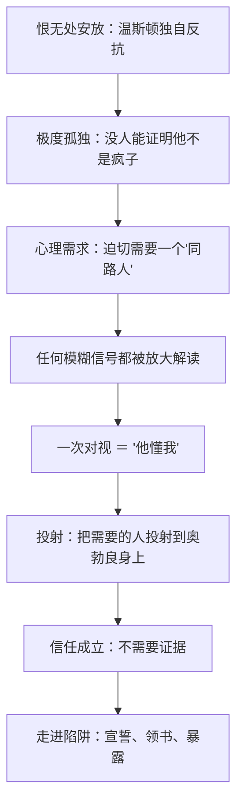

# 10｜温斯顿为什么愿意相信奥勃良？

> 奥勃良从没说过自己反对党，温斯顿凭什么把一个几乎陌生的人当成同路人？

---

## 一、先说结论

**温斯顿相信奥勃良，不是因为有证据，而是因为他需要。** 他手里关于奥勃良的"证据"从头到尾为零：没有一句话、没有一个行动、没有任何人担保。他只有过一次对视、一种"这个人不一样"的气质、一个"他懂我"的感觉。

奥威尔写的不是一次判断失误，而是一种心理机制：**人在极度孤立时，会把他需要的那个人，投射到任何"看起来像"的可能性上。** 极权最狠的一招不是监视，是孤立——孤立的人会主动寻找出口，而党只需要在出口处放一个"看起来像同路人"的人。

## 二、我们先理解一个问题

我们平时怎么判断一个人可不可信？看证据：他说过什么、做过什么、谁为他担保。但温斯顿手里什么都没有。奥勃良从没说过一句反党的话——恰恰相反，他是核心党员，地位比温斯顿高得多，理论上是最不可能反叛的那种人。

那温斯顿凭什么信他？凭的只是一次走廊里的对视、一个"举止与众不同"的印象。**这个问题真正想问的是：当证据为零时，人靠什么下决心信任？**

## 三、作者到底提出了什么观点？

奥威尔在书中描绘的这条信任链，每一步都没有证据：

- **几次偶遇**：温斯顿在真理部见过奥勃良几次，印象是"举止与众不同"——一个壮实、粗鲁却又带着某种文雅的核心党员。
- **一次对视**：两人在走廊对视了一秒，奥勃良的眼神让温斯顿坚信"我们的思想通过眼睛相遇了"——书里写明，这纯粹是温斯顿自己的解读。
- **一个借口**：奥勃良以送新话词典第十版为理由，约温斯顿去他家——这个借口完全可以只是公事公办。而在他家，温斯顿第一次见到有人能**关掉电幕**。
- **一场宣誓**：温斯顿和裘莉亚向奥勃良宣誓加入兄弟会——愿意杀人、纵火、背叛一切，唯独拒绝承诺"两人分开"（这个伏笔会在 101 号房间兑现）。
- **一本书**：奥勃良给了温斯顿果尔德施坦因的书。
- **结局**：奥勃良是思想警察一边的人，亲自审讯温斯顿，还告诉他那本书是自己参与写的。

奥威尔借这条线表达：**人信任一个人，常常不是因为他证明了什么，而是因为你太需要他是那个人。**

## 四、把这个观点翻译成人话

打个比方：你在异国他乡迷路，语言不通，身无分文，这时有个人对你微笑了一下——你会瞬间觉得"他是好人，他会帮我"。他不是证明了什么，是**你需要他是好人**。

温斯顿对奥勃良的信任就是这种"溺水者抓住的东西"：他抓住的不是奥勃良，是自己的需要。他的恨无处安放、无人可诉、无人可证实他不是疯子——这时候任何一个"可能是"的人，都会被他亲手塑造成"一定是"。

## 五、为什么会这样？

心理学上这是"投射"和"确认偏误"的组合：**先有强烈的需要，再为这个需要寻找证据**——找到的每一点模糊信息都会被解释成支持。最可怕的是，温斯顿隐约知道这一点：他"知道"奥勃良站在他这边，但这个"知道"毫无依据。奥威尔让他**清醒地走进陷阱**——他有一半知道这可能是假的，但孤独的重量压过了怀疑。

## 六、举一个现实生活中的例子

**传销话术**走的就是这条路。传销组织怎么让一个人相信一个陌生人？他们不先卖产品，先"懂你"——花时间听你说委屈、说怀才不遇、说对现状的不满，然后告诉你："你不是失败者，你只是没遇到对的平台和懂你的人。"人在被理解的那一刻，警惕性会塌掉一半——因为"被懂"的感觉太稀缺了。加入传销的人事后常说一句和温斯顿几乎一样的话："我当时就是觉得，终于有人懂我了。"

**情报史上的双面间谍**也是同一原理。策反一名特工，行内做法从不直接问"你愿不愿意叛变"，而是先成为对方孤独生活里"唯一理解他的人"。著名的金·菲尔比——剑桥五人组——是真实历史：他作为苏联安插在英国情报机构高层的双面间谍几十年没被识破，正因为上级和同僚"愿意相信"他是自己人。**信任一旦建立在情感需要上，证据就进不来了。**

## 七、回到书中重新理解

重新看那次对视：奥勃良什么都没说，甚至可能什么都没想——**是温斯顿一个人完成了整场"心灵相通"。** 再看那场宣誓：温斯顿和裘莉亚对着一个几乎陌生的人承诺愿意杀人、愿意往孩子脸上泼硫酸，唯独不愿承诺分开。注意这场戏的权力关系：**奥勃良一个字没承诺，全是对方在承诺。真正的钓者从不许诺，只收誓言。**

还有送书这个细节：果尔德施坦因的书，后来奥勃良承认是他参与写的——连"反抗者的圣经"都是党生产的。温斯顿以为自己在接收同路人的信物，实际是在签收钓饵。

## 八、这个观点背后还有什么？

更冷的一层：**党制造孤独是故意的。** 大洋国系统性地拆毁一切横向关系——夫妻为党而结合、孩子被训练成告密者、朋友之间不敢深交——目的是让每个人的情感没有去处。而没有去处的东西最终会流向哪里？流向党指定的任何出口。孤独不是这个体制的副产品，是它的产品。

另一层：温斯顿信奥勃良，还因为他**崇拜权力**。奥勃良是核心党员，是可以关掉电幕的人——温斯顿内心深处对"那种人"有本能的仰慕，他自己都惊异于这一点。投射里掺着对权力的向往，这让这个陷阱更脏，也更真实。

## 九、这个观点有问题吗？

有说服力的地方：孤独导致判断失误，是心理学反复验证的事实——现实中的骗局、策反、邪教招募，确实都从"被理解"下手。

有争议和过度简化的地方：

- 奥威尔把温斯顿写得"清醒地被骗"——他隐隐怀疑却选择相信。现实中的受害者往往没有这么自觉。这种写法戏剧效果强，但可能高估了人在被欺骗时的自我觉察。
- 另一种解释：温斯顿未必全是投射。核心党员的身份、关掉电幕的特权、拿得出的词典和禁书，都是"半证据"。学界有看法认为温斯顿的判断部分是理性的——他不是乱信，是在赌，赌输了而已。把一切归于"孤独投射"，会忽略他推理的那部分。
- 还有一层不确定：那次对视里，奥勃良是否故意释放过信号？如果他有意下钩，这就不是纯粹的投射，而是一场精心设计的钓鱼，温斯顿"主动信任"的成色就要打折——对此学界有不同看法，书里没有给答案。

## 十、今天再看这个观点

> 以下部分是基于书中思想的现代延伸，不是奥威尔的原话。

今天的"奥勃良"不坐在真理部，坐在你的推荐流里。杀猪盘、精准诈骗、信息茧房，原理相同：**先让你感到"终于有人懂我"。** 过去的骗子要自己猜你的孤独，今天你的搜索记录、深夜浏览、点赞轨迹，已经替你写好了"我需要什么"的档案——投射可以被工程化了。

防骗的最好问题也因此换了：不是"他可不可信"，而是"**我是不是太需要他可信了**"。

## 十一、这一篇真正应该记住什么？

记住一件事：**人信任一个人，往往不是因为他证明了什么，而是因为你需要他是那个人。**

- 温斯顿手里关于奥勃良的证据为零，只有一次对视
- 孤独越重，投射越强——恨无处安放的人，会把"同路人"安放到任何可能性上
- 真正的钓者从不许诺，只收誓言
- 大洋国制造孤独是故意的：情感没有去处的人，最好钓

## 十二、留一个问题

温斯顿需要一个同路人，所以凭空造出了一个奥勃良。可他身边其实真的有一个同伴——裘莉亚。问题是：这个真实存在的同伴，恨的是同一个体制，反抗的方式为什么和他几乎完全相反？

下一篇，我们来看「11｜裘莉亚的反抗为什么和温斯顿不一样」。
