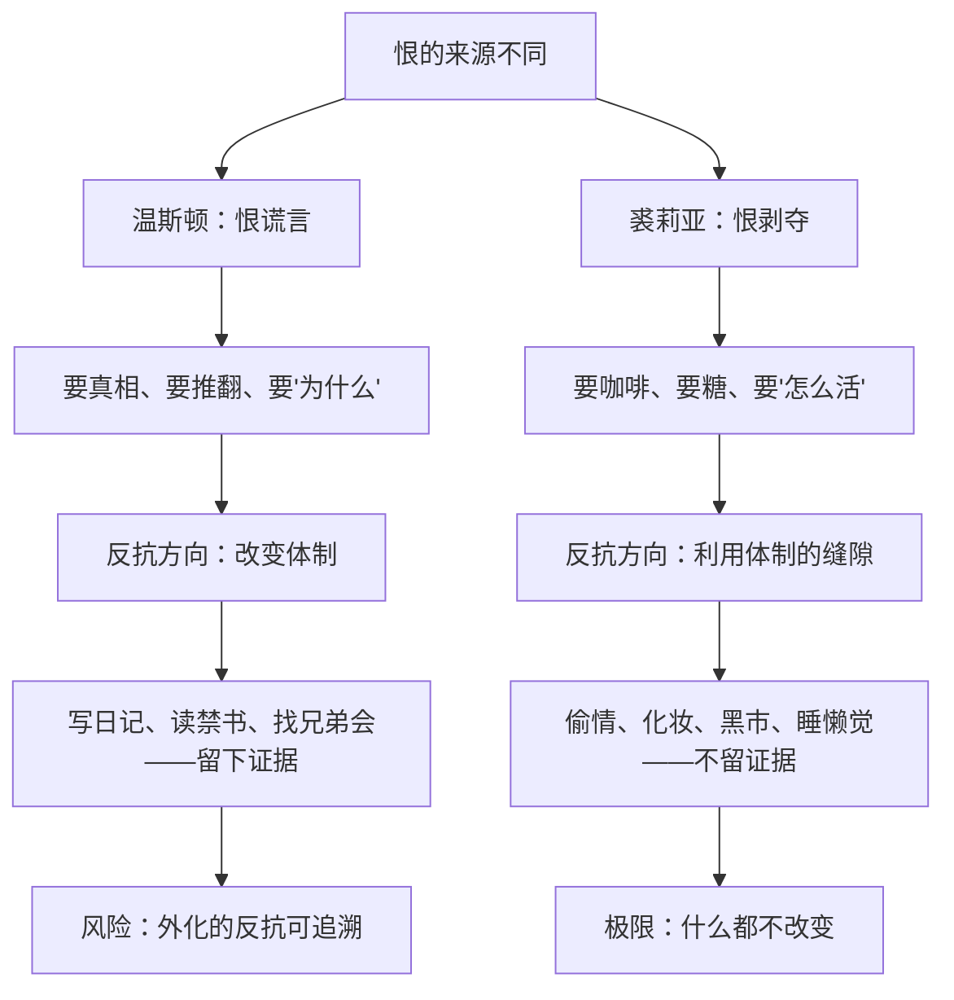

# 11｜裘莉亚的反抗为什么和温斯顿不一样？

> 裘莉亚和温斯顿都恨这个体制，为什么他们的反抗方式几乎相反？

---

## 一、先说结论

**温斯顿反抗的是谎言，裘莉亚反抗的是剥夺。** 温斯顿要知道真相、要搞清"为什么"、要推翻体制；裘莉亚不关心理论，她只想偷回被没收的生活——真咖啡、真糖、丝袜、化妆、睡懒觉、做爱。

奥威尔借这两个人写出了反抗的永恒张力：**一种要改变世界，一种要在世界里活下去。** 两条路偶尔同行，本质上不是一回事——而他不判哪一种更高贵。

## 二、我们先理解一个问题

我们通常默认：恨同一个东西的人就是同路人。但"恨的对象"可以不一样。

温斯顿恨的是"党撒谎"——这是认知层面的恨，他要的是真相与解释；裘莉亚恨的是"党不让我活"——这是生存层面的恨，她要的是具体的、感官的、此刻就能摸到的生活。一个要推翻，一个要取用。**目标偶尔重合，方向几乎相反。**

## 三、作者到底提出了什么观点？

奥威尔在书中设定的裘莉亚，几乎每一步都和温斯顿相反：

- **公开身份是完美伪装**：她是少年反性同盟的积极分子——戴红腰带、喊口号、参加会议，比谁都像模范青年。
- **工作在体制的麻醉车间**：她在小说司修理色情文学写作机——那个部门专门给无产者生产廉价色情读物，她白天给体制生产麻醉剂，晚上偷体制的东西。
- **自称"腰部以下的叛徒"**：她不恨党的理论（她根本不读），只恨党不许人好好活。
- **反抗清单全是感官的**：偷情、喝真咖啡、吃真糖、穿丝袜、化妆——在房间里做"女人"而不是"党员"。
- **理论对她无用**：温斯顿给她读果尔德施坦因的书，她睡着了。
- **她更懂体制的缝隙**：哪里能搞到真货、怎么避开巡逻、约会路线怎么定——全是她安排的。

奥威尔借这对照表达：**反抗至少有两种完全不同的形态——原则的反抗和生存的反抗。**

## 四、把这个观点翻译成人话

打个比方：一栋楼着火了，楼里有两种"反抗者"。一种人冲出去找消防栓、查谁纵的火、要求改建筑规范——这是温斯顿；另一种人研究怎么在着火的楼里找到还凉快的房间，继续把日子过下去——这是裘莉亚。

前者嫌后者苟且，后者嫌前者不切实际。但你不能说哪一种不算反抗——**他们只是对"反抗什么"这个问题的答案不同。**

## 五、为什么会这样？

为什么裘莉亚的路径更"安全"？因为她的反抗**不可证明**：偷情不留档案、化妆只是外表、她从不写一个字。温斯顿的反抗是外化的——日记、书、组织，每一步都留下痕迹。

还有代际原因：裘莉亚在革命后长大，没见过"以前"，所以她不追求恢复什么，也不信党能被打倒——她只是不接受"活着就得受苦"。温斯顿记得过去，所以他要"解释"；裘莉亚没有过去，所以她只要"现在"。

## 六、举一个现实生活中的例子

现实里到处能看到这两种不合作。在任何让人不满的体制——公司、学校、更大的共同体——里都有两种人：**认真搞反对的人**：写公开信、组织讨论、研究制度该怎么改，通常最早被处理；和**"摸鱼的人"**：上班刷剧、私下吐槽、翻墙追剧、钻空子给自己捞回一点真正的生活，往往活得最久。

哪一种更"危险"？这正是奥威尔留下的真问题。温斯顿式反抗声势大、目标明确、可清除；裘莉亚式反抗无声无息、无法根除——你抓不到一个"只是想好好活"的人的把柄。但反过来，摸鱼从不威胁体制本身，它不留下任何改变。书里两人最后都进了仁爱部——体制的态度是"两种都要掐死"；而历史给出的答案可能不一样。

## 七、回到书中重新理解

再看两人的互相看不上：温斯顿嫌裘莉亚"只关心腰部以下"，裘莉亚嫌温斯顿"想那些没用的"。但书里有个关键细节：**温斯顿真正"活过来"，不是因为读了果尔德施坦因的书，而是因为裘莉亚。** 是她的丝袜、咖啡和那张床，让他第一次觉得活着值得——理论的反抗给了他"为什么"，生存的反抗给了他"为了它"。

还有对兄弟会的态度：温斯顿想加入组织性的反抗，裘莉亚对兄弟会是否存在都无所谓——她只问"这跟我们俩有什么关系"。这个分歧是伏笔：到最后，他们都守不住对方，只是守不住的方式不同。

## 八、这个观点背后还有什么？

更深一层：**裘莉亚式反抗可能是党"允许"的。** 大洋国给无产者生产色情读物（裘莉亚的日常工作）、放任无产者喝酒唱歌——党深知"给一点私人出口的体制，比一点出口都不给的体制更稳"。裘莉亚以为自己在偷体制的东西，某种意义上她在消费体制故意漏出来的东西。这让她的反抗带上悲剧色彩：**缝隙可能是被留下的。**

另一层反讽：温斯顿式反抗也有它的虚妄——他追求抽象的正义，而正是这个抽象追求把他直接送进了奥勃良的网。**务实的人死于不够谨慎，理想的人死于太需要一个组织。**

## 九、这个观点有问题吗？

有说服力的地方：奥威尔把两种反抗写得都不浪漫——这在政治小说里罕见。他不让你选边，只让你看到两条路各自的代价。

有争议和过度简化的地方：

- 学界对裘莉亚的评价分歧很大。一种读法认为她是全书最真实的反抗者：她不表演崇高，反而最难被体制定义，女性主义批评里甚至有人把她读成"日常抵抗"的先驱。另一种读法认为奥威尔把她写得太扁——"不读书的性感女人"是男性作家的刻板想象，她的生存反抗本质上是对政治的放弃。
- 现实中两种反抗并不对立：很多"认真反对的人"也摸鱼，很多"摸鱼的人"被推到墙角也会变成前者。奥威尔为了对照，把两人写得过于纯粹。
- 还有一种更严厉的解读：裘莉亚也许不算另一种反抗，而是"没有反抗"——她从未想过推翻任何东西。在这个读法下，两人不是"两种反抗"的对照，而是"反抗与逃逸"的对照。哪种读法成立，取决于你怎么定义反抗——学界对此有不同看法。

## 十、今天再看这个观点

> 以下部分是基于书中思想的现代延伸，不是奥威尔的原话。

今天两种反抗的分工更明显了：公共领域的反对成本越来越高（留痕、可追溯），于是越来越多的人选择"裘莉亚模式"——不谈主义、只过好小日子、把私人生活经营成堡垒。

但值得追问的是：**当"过好自己的生活"成为唯一的反抗形式，它究竟是抵抗还是投降？** 奥威尔没给答案，他只是让两种人一起走进了仁爱部——这本身像一种回答：在绝对权力面前，两种反抗都不够用，但也都是人性能拿出的全部。

## 十一、这一篇真正应该记住什么？

记住一件事：**恨同一个体制的人，恨的可能不是同一样东西。**

- 温斯顿反抗谎言：要真相、要解释、要推翻
- 裘莉亚反抗剥夺：要咖啡、要糖、要把日子偷回来
- 前者的危险是"外化"——留证据、信组织；后者的极限是"什么都不改变"
- 奥威尔不判哪种反抗更高贵，只展示两者都不够

## 十二、留一个问题

裘莉亚和温斯顿找到了一处可以实践各自反抗的地方——查林顿店铺楼上那个租来的小房间。几平方米而已，为什么成了全书里唯一"像自由"的地方？

下一篇，我们来看「12｜隐私为什么就是自由」。
