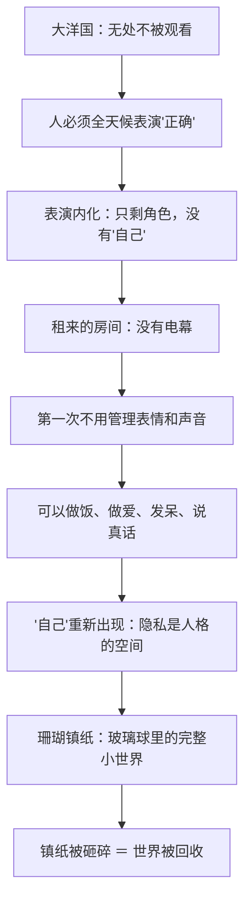

# 12｜隐私为什么就是自由？

> 查林顿店铺楼上那个租来的房间，不过几平方米，为什么成了全书里唯一"像自由"的地方？

---

## 一、先说结论

**因为在大洋国，"有自己的空间"已经是奢侈品。** 那个房间没有电幕，有一张真正的床、一只煤炉、一件装得下小小世界的珊瑚镇纸。

隐私的本质不是"藏起来"，而是**有一个不需要表演的地方**——你在那里面不用管理表情、控制声调、扮演党员。自由的最小单位，不是选票或宣言，是**一扇你能关上的门**。

## 二、我们先理解一个问题

我们平时谈自由，想到的是大词：言论自由、迁徙自由、选择自由。但温斯顿和裘莉亚在那个房间里做的事小得可怜：做爱、煮东西、聊天、睡懒觉、看窗外的女人晾衣服。

这些事为什么值得冒死？因为大洋国收走的不是"大自由"——大部分人根本不知道大自由存在过——它收走的是"**可以不做自己的角色**"的地方。问题于是变成：最小的自由到底是什么？

## 三、作者到底提出了什么观点？

奥威尔在书中设定的这个房间，每个细节都在回答这个问题：

- **位置**：查林顿旧货店楼上，在无产者区——党员不该来的地方，所以"相对没人管"。
- **没有电幕**：这是它在大洋国几乎不可能存在的属性。温斯顿知道租下"不被看"的空间是重罪，还是租了。
- **旧物**：桃花心木的床、煤炉、墙上的旧版画——全是"上一个世界"的残片。
- **珊瑚镇纸**：玻璃半球里嵌着一朵珊瑚，温斯顿把它看成"装着他们小小世界的玻璃球"——房间就是镇纸的内部。
- **窗外的歌声**：一个无产者女人每天唱同一支歌晾衣服——她成了"另一个世界仍在运转"的背景音。
- **结局**：被捕时，士兵把镇纸摔碎——玻璃球里的世界先破，人后破。

奥威尔借这个房间表达：**自由不是宏大的政治状态，是"有一个地方你不被观看"的最小事实。**

## 四、把这个观点翻译成人话

打个比方：你有没有过这种体验——在合租房、办公室、饭局里待了一整天，回到自己房间关上门那一刻，肩膀塌下来，脸松下来，整个人"卸了妆"？

那个塌下来的瞬间，就是隐私。**隐私不是"我有秘密"，是"我此刻不用表演"。** 温斯顿的房间，就是他人生里第一扇能关上的门。

## 五、为什么会这样？

为什么"不被观看"如此根本？因为**人的"自我"只在不表演时才存在**。表演需要观众——哪怕是想象中的；自我的恢复需要观众缺席。人必须在"社会我"之外保留一个"私下我"，否则人格会被角色整个吞掉——这正是党想要的：大洋国理想的党员没有私下我，因为没有一个地方可以做它。

所以隐私不是自由的"一项"，是其他一切自由的地基：**没有私下空间，就没有私下想法；没有私下想法，就没有"不同意"的可能。** 温斯顿的日记，也只能写在电幕照不到的死角里。

## 六、举一个现实生活中的例子

**独居房间的周末。** 每个独居过的人都知道那种感觉：周五晚上关上门，世界被留在门外——可以不洗脸、躺一整天、大声放歌、什么都不做也没人评判。那种放松不是因为"干了什么"，恰恰是因为"不用干给谁看"。

反面对照更明显：合租房里竖着耳朵听室友动静的时刻、住父母家压低声音打电话的时刻、开放办公室里连伸懒腰都要注意姿态的时刻——"被看见"的状态下，身体永远是半紧绷的。**人对自己的所有权，相当大一部分存放在"没人看我"的时间里。** 删掉所有隐私，等于删掉所有"不在岗"的时间——大洋国正是这么做的。

## 七、回到书中重新理解

再看房间里发生的事，全是"无目的"的事：煮可可、闲聊、睡懒觉、温斯顿说要给裘莉亚买真正的连衣裙、两人幻想革命前的日子。没有一件是"有用"的——这正是重点。在大洋国，连睡觉都不安全（帕森斯因为梦话被女儿举报）；在那个房间里，他们第一次可以无目的——**而无目的是"角色"的反面，是"人"的部分。**

镇纸的意象再清楚不过：温斯顿明知它是无用的奢侈品还买下它，因为它"装着另一个时代"。被捕时士兵把它摔碎——先碎的是玻璃球，后碎的是房间里的人。奥威尔用一件小摆设的死，预告两个人的死。

## 八、这个观点背后还有什么？

更深一层：这个房间的"自由"是**租来的、短暂的**。温斯顿自始至终知道它不可能是永久的——他甚至默认被抓只是时间问题。这让隐私在书里有了双重性质：它既是抵抗的阵地，也是一笔预支人生的贷款。他们不是相信自己能逃掉，而是觉得"这几个月值得用命换"——**在极权下，隐私的定价就是命。**

还有一层对照：窗外唱歌的无产者女人。她不需要租房间——她本来就没有电幕。党眼里她"自由得像动物"，但恰恰是这种"不被当人看"的放任，让她保存了房间里两个人拼命偷的东西：普通的、不被观看的生活。隐私对谁都是必需品——只是对党员是违禁品，对无产者是"不配被剥夺"的东西。

## 九、这个观点有问题吗？

有说服力的地方：把自由落到"一扇能关上的门"这个最小单位，是奥威尔极精准的直觉——现代隐私权理论（"独处权"）走的正是这条路。

有争议和过度简化的地方：

- 隐私是自由的必要条件，但不是充分条件。房间里的人并没有因此改变任何处境——他们的"自由"是借来的、封闭的、对门外世界零影响。把它等同自由本身，可能把"逃避"浪漫化了。学界有看法认为这个房间恰恰证明了私人抵抗的极限：它能保存两个人，保存不了任何东西给后来的人。
- 另一种解释：房间的意义也许不在"隐私"而在"关系"——是两个人的爱让那个空间成了世界，而不是门锁。这个读法下，真正被砸碎的不是隐私，是联结。
- 还有一层反讽：这个"隐私堡垒"从头到尾是陷阱——画像后有电幕，查林顿是思想警察。他们以为的"不被看"，恰恰是"被看得最仔细"。这让"隐私即自由"在书里自我瓦解：**假隐私比没隐私更危险。**

## 十、今天再看这个观点

> 以下部分是基于书中思想的现代延伸，不是奥威尔的原话。

今天"房间"的概念正在消失——物理上你仍有自己的屋子，但"无电幕的空间"越来越少：智能音箱在听、手机在定位、推荐算法记录着你独处时的每一次点击。现代人的悖论是：**门还关得上，"不被观看"已经关不上了。**

反过来，这也解释了当代人对隐私的复杂态度：一边用隐私换便利，一边为"不被看见的片刻"付溢价——飞行模式、数字排毒、独处经济。奥威尔的命题在今天要加个注脚：**隐私的价值，要在失去它之后才完全显现**——就像温斯顿在那个房间里才知道什么叫"活过"。

## 十一、这一篇真正应该记住什么？

记住一件事：**隐私的本质不是藏匿，是"不需要表演"。**

- 自由的最小单位是一扇你能关上的门——大洋国收走的正是这个
- 表演制造角色，不被观看才制造"自己"
- 珊瑚镇纸是那个小小世界的全部领土，它碎的时候，人也就碎了
- 检验一个社会自由度的最简方法：里面的人还有没有"不在岗"的地方

## 十二、留一个问题

那个房间里还发生过一件事：温斯顿读了一本书——一本据说能解释大洋国一切秘密的禁书。奇怪的是，读完它之后，温斯顿并没有更安全，反而离陷阱更近了一步。

下一篇，我们来看「13｜那本能解释一切的书，为什么也是陷阱」。
