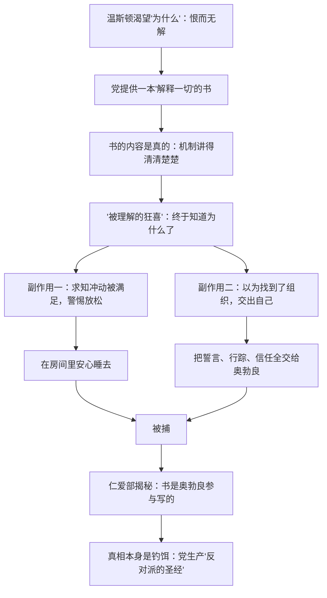

# 13｜那本能解释一切的书，为什么也是陷阱？

> 果尔德施坦因的书把大洋国的机制讲得清清楚楚，为什么读完它并没有让温斯顿更安全，反而更危险？

---

## 一、先说结论

**因为"知道一切"本身就是一种诱饵。** 那本书满足了温斯顿对"答案"的渴望，让他在最关键的时刻放松了警惕；而更恐怖的是，奥勃良后来承认这本书是他参与写的——**真相被当作钓饵喂给你，你吞下的每一条"知识"都可能来自想抓你的人。**

大洋国最深的控制不是禁止你求知，而是亲自生产你求得的知。

## 二、我们先理解一个问题

我们通常默认："知道得越多越安全"——禁书之所以是禁书，因为权力怕你读到它。顺着这个逻辑，读禁书当然是反抗，当然让人更清醒、更难被愚弄。

但温斯顿的经历反过来了：他读完那本书，没有采取任何更有效的行动，反而在房间里更安心地睡了一觉——然后被抓。**这本书究竟是武器还是诱饵？如果是诱饵，"真相"本身是怎么变成陷阱的？**

## 三、作者到底提出了什么观点？

奥威尔在书中设定的这本书叫《寡头政治集体主义的理论与实践》，署名爱麦虞埃尔·果尔德施坦因——传说中兄弟会的领袖、党的头号叛徒、两分钟仇恨里的固定靶子。

书的内容几乎把大洋国讲透了：

- **三句口号的机制**：战争即和平、自由即奴役、无知即力量各自如何运转；
- **永久战争的经济逻辑**：战争用来消耗剩余产品，防止生活水平提高，从而维持等级社会；
- **思想控制的原理**：党如何通过控制人的头脑来维系统治。

温斯顿读它时感到狂喜——"他终于知道为什么了"。但请注意几个细节：裘莉亚读了一半睡着了；温斯顿自己没读完就被捕；最重要的是，在仁爱部，奥勃良告诉他："这本书是我参与写的。里面的描述都是真实的——作为说明。至于兄弟会是否存在，你永远不会知道。"

奥威尔借这个设定表达的观点冷得吓人：**党不只控制谎言，还控制真相的供应**——它自己写"反对派的圣经"，因为一本由它生产的"真相"能保证：所有认真想知道为什么的人，会主动走进它画好的圈。

## 四、把这个观点翻译成人话

打个比方：一座监狱发现囚犯总想挖地道越狱，怎么办？最省事的办法不是填掉所有地道，而是**官方修一条"秘密地道"**——还故意让"叛徒狱警"把地图卖给你。所有想逃的人都会走这条地道，而狱方只需站在地道口等人。

果尔德施坦因的书就是那条官方地道：**内容是真的，方向是党定的。**

## 五、为什么会这样？

为什么"解释一切"的书反而危险？三层机制：

1. **满足消解行动**：读书前，温斯顿的恨是焦灼的、要找出口的；读书后，恨还在，但"不知道该怎么办"变成了"知道为什么却不知道该怎么办"——答案满足了提问的冲动，却没有给出任何行动方案。这本书教你怎么输，不教你怎么赢——因为它本来就没打算让你赢。
2. **信任链传染**：书是真的 → 给书的人可信 → 奥勃良可信 → 兄弟会存在。每一步推理都是错的，但每一步都因为"书的内容是真的"而被加固。**用真货钓鱼，是最难识破的钓法。**
3. **筛选功能**：这本书最毒的作用是它是个筛子——只有"会认真追问为什么"的人才会去领它、读它、为它冒险。党不需要费力找思想犯：**思想犯会自己来领这本书。**

## 六、举一个现实生活中的例子

**地下出版物的诱惑。** 历史上凡是有禁书的地方，禁书就有光环：苏联时代的萨米兹达特（自行打字传抄的地下出版物）——《日瓦戈医生》、索尔仁尼琴的手抄本在人们手里连夜传阅，每抄一遍都像参加了一次反抗。这是真实的历史事实。别的地方也有同样的逻辑：手抄本、禁书、盗版碟——越被禁止越想读。

这里面有温斯顿式的陷阱成分：**禁忌制造的光环会让人高估内容**。很多禁书解禁后，读者发现"不过如此"——驱动人的常常不是求知，而是"被允许知道"本身。更微妙的一层：历史上确实存在政权容忍甚至暗中流通某些"禁书"的做法，因为可控的反对派读物是最好的情报来源——谁在传、谁在抄、谁在讨论，一目了然。**当禁书流通得异常顺畅时，该问一句：谁在给这条地道供灯？**

## 七、回到书中重新理解

重看温斯顿读书那场戏，每个细节都在埋伏笔：他在"安全"的房间里读——房间本身是陷阱，书是陷阱里的诱饵；他读得浑身战栗，觉得"书里写的我都隐约知道，但它替我说清楚了"——这正是诱饵的工作原理：**它不说你不知道的，它把你模糊的怀疑装订成权威文本，让你对"给你这本书的人"产生知遇之恩。**

他没读完就睡着了，醒来被捕——奥威尔连"读完"的机会都不给他，因为这书的功能在递到手里的那一刻就完成了。

仁爱部那场对话是全书最冷的段落之一：奥勃良平静地说"我写的"，还说内容是真实的——"作为说明"。注意这个措辞：**真实，但只是说明。** 党不在乎你知道机制，因为你拿机制毫无办法；党在乎的是用一本"真实的书"，把所有想搞懂的人引到同一个门口。至于兄弟会是否存在——"你永远不会知道。"连"反对派是否存在"这个前提，都是党留给你的悬念。

## 八、这个观点背后还有什么？

更深一层：这本书的存在说明大洋国的控制进入了"元层级"——**不只控制信息，还控制"对控制的解释"**。党深知一个道理：你无法禁止聪明人思考，但你可以给他准备好"思考的成果"。当反抗者的理论都是压迫者写的，反抗就永远跑在压迫者画好的跑道上。

还有一层：果尔德施坦因本人可能也是同一机制的产物——两分钟仇恨需要一个叛徒，禁书需要一个作者，钓鱼需要一个传说。仇恨的对象、反抗的圣经、兄弟会的领袖，可能是同一家工厂的三条产品线。**党不只垄断权力，它垄断"反对权力"的全部符号。**

## 九、这个观点有问题吗？

有说服力的地方："党自己生产反对派读物"是全书最黑暗的想象之一，却并非纯虚构——历史上真实存在过"伪反对派"操作。比如苏联的"信任行动"是事实：二十世纪二十年代，契卡虚构了一个地下反苏组织，把海外流亡者和国内异见者一批批钓回来。奥威尔的想象有真实原型。

有争议和过度简化的地方：

- **低估了真相的实际作用**：现实中"知道机制"确实能转化为力量——萨米兹达特、档案的揭露与出版，都真实动摇过体制的合法性。奥威尔为了把绝望写到底，设定了一个"连知识都无法改变"的世界，这可能把知识的力量压得太低。
- **另一种解释**：也可以说陷阱不在书本身而在"获取渠道"——危险的不是读它，是"从奥勃良手里领它"这个动作。在这个读法下，温斯顿死于信任链而非求知欲，"真相是诱饵"就退化为"渠道是诱饵"，命题会温和得多。
- **双刃的可能**：奥勃良说"里面的描述都是真实的"——若内容真到那个程度，这本书客观上仍在传播真知识。党用它钓鱼，鱼也可能真的学到水文的真相——只是书里没写怎么上岸。至于果尔德施坦因是否真实存在、兄弟会是真是假，学界有不同看法，奥威尔故意不给答案。

## 十、今天再看这个观点

> 以下部分是基于书中思想的现代延伸，不是奥威尔的原话。

今天"果尔德施坦因的书"有了新形态：揭秘账号、爆料频道、"体制内流出的真相"。当一份"他们不想让你知道的内幕"传播得异常顺畅、刚好喂中你的全部怀疑时，温斯顿的教训就值得想起：**先问"这份真相是谁递给我的、为什么递给我"，再决定要不要吞。**

信息时代的钓饵比一九四八年高级得多：不需要一本书，算法可以给你个人定制一本"只解释你的愤怒的书"——你读到的每一句"真相"都精准命中你已有的怀疑。越觉得"终于有人说清楚了"，越该检查说这话的人站在哪。

## 十一、这一篇真正应该记住什么？

记住一件事：**真相被当作钓饵喂给你时，它每一条都可以是真的——毒不在内容里，在"谁给你的、想让你做什么"里。**

- 那本书讲的是真机制，但它是党写的——真实不等于站在你这边
- "知道一切"的满足感会消解行动的冲动
- 禁书是筛子：认真追问"为什么"的人，会自己走到筛子上
- 最高明的控制不是禁止真相，是垄断真相的供应渠道

## 十二、留一个问题

书是陷阱，递书的人是陷阱——那么他们读书的那个房间呢？那个"没有电幕"的安全屋，温斯顿和裘莉亚一直以为是自己找到了体制的缝隙。被捕那一刻他们才发现：缝隙是有人替他们留的。

下一篇，我们来看「14｜为什么「安全的房间」从来就不存在」。
