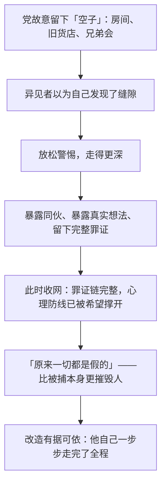

# 14｜为什么「安全的房间」从来就不存在？

> 温斯顿和裘莉亚以为自己藏得很好，为什么被捕时才发现党什么都知道？

---

## 一、先说结论

**他们的「安全」从来不是自己找到的，是党允许的安全。**

画像后面一直藏着一台电幕——从他们第一次走进那个房间起，它就在那里；慈祥的旧货店老板查林顿，其实是个三十多岁的思想警察；连他们以为是自己发现的每一步——旧货店、房间、「兄弟会」、果尔德施坦因的书——都是被人铺好的路。在极权体制里，你以为是空子的地方，往往是故意留出来的：**党不是没有看见，而是在等你走到足够远，远到你再也回不去。**

## 二、我们先理解一个问题

读《一九八四》前半部时，很多读者会和温斯顿一样松一口气：原来大洋国也有死角。查林顿店铺楼上有个房间，没有电幕，有一张真正的床，窗外有鸟鸣，楼下还有个会唱老歌的无产者女人。在一个连表情都要管理的世界里，这个房间好得几乎不真实。

现在回头看，问题恰恰在这里：**它好得不真实。**一个连日记本都要被追究的社会，怎么会恰好漏掉一间临街的房子？一个党员去买日记本的小店，老板为什么「恰好」还记得被禁的老歌、「恰好」楼上有空房、「恰好」愿意出租？温斯顿不是没起过疑心——但他太想要这个房间了，于是把疑心按了下去。

## 三、作者到底提出了什么观点？

奥威尔在书中描绘的被捕场面，把这个谜一次性揭开：

- 士兵破窗破门而入，墙上的画像滑落——后面是一台电幕。**它一直在那里**，听完了这个房间里说过的每一句话。
- 两人说过「我们是死者」，电幕里一个冷冰冰的声音回应：「你们是死者。」
- 查林顿走进来，模样完全变了：腰背挺直，皱纹仿佛被抹平，看上去只有三十多岁——他不是和善的旧货店老板，是思想警察。
- 那只被温斯顿当成「小小世界」的珊瑚镇纸，被砸得粉碎。

更可怕的是事后的揭示：奥勃良在仁爱部告诉温斯顿，旧货店、那个房间、「兄弟会」、甚至那本果尔德施坦因的书——全都是安排好的。**奥威尔借这个反转表达的是：在极权体制里，最危险的陷阱不是墙，是门——那扇你以为是缝隙、其实是别人故意留着的门。**

## 四、把这个观点翻译成人话

打个比方：你以为你发现了一个没有摄像头的包间，可以在里面说真心话。其实那个包间是整个商场里摄像头最密集的地方——只是装得隐蔽。老板热情地给你留位子、告诉你「这里绝对安全」，因为他是拿商场工资的。

这就是钓鱼的逻辑：**抓你现行，不如等你自投罗网。**让你以为安全，你就会自己走过来、自己说真话、自己把最隐秘的念头摊开。党放长线不是疏忽，是方法——温斯顿后来想明白了：让他暴露得足够彻底，改造起来才「有据可依」。

## 五、为什么会这样？

为什么党要这么麻烦？直接在他写日记那天抓人不行吗？奥威尔给出的逻辑是这样的：

关键在最后一步。如果温斯顿在写日记时就被抓，他只是一个「还没做什么」的嫌疑人，心里还留着「我本来能反抗」的念想。而当他走完全程——恋爱、租房、投靠「兄弟会」、读完那本书——再被告知「这一切都是我们的安排」，他被摧毁的不只是自由，还有**判断力本身**：原来我看人的眼光、我的希望、我的爱情，全是别人剧本里的台词。这种崩溃，比手铐深得多。

## 六、举一个现实生活中的例子

想想你以为的「私聊」。

你在聊天软件里和朋友说悄悄话，对话框干干净净，右上角写着「私聊」。但信息经过的是平台的服务器：平台可以存储内容、可以被依法调取记录、你的输入习惯本身也在被分析。「仅彼此可见」的动态、「阅后即焚」的会话、上了锁的备忘录——这些「无人听见的房间」，钥匙都在别人手里。

这和查林顿的房间是同构的：**空间的私密感是界面给你的，而界面是别人做的。**我不是说平台就是思想警察——商业公司和极权机构的目的完全不同——而是说那个心理结构一样：你以为没人的地方能不能说真话，取决于「没人」这件事是你亲自验证过的，还是对方告诉你的。温斯顿的悲剧在于，「这里没有电幕」是查林顿告诉他的。

## 七、回到书中重新理解

有了「假安全」这个概念再重读前半部，很多细节会变味。

查林顿「恰好」记得那首关于栗树咖啡馆的老歌——那首歌后来成了他们被捕时的注脚。房间「恰好」没有电幕——因为电幕藏在画像后面，比摆在明面上听得更全。温斯顿每次去都要绕路、换装、提心吊胆——现在看，那一路的惊险感恰恰是设计的一部分：**让人付出代价得到的「安全」，才显得像自己挣来的，才会被珍惜、被反复使用。**

最冷的一笔在裘莉亚身上。她比温斯顿「专业」得多——会侦查路线、会选时间、从小就在体制的缝隙里讨生活。她代表的那种「在缝隙里活下去」的智慧，在这台机器面前同样无效，**因为缝隙是机器留的**。奥威尔用两人的双双落网说明：在极权里，谨慎不能救命——你谨慎的标准，本身就是被喂给你的。

## 八、这个观点背后还有什么？

第一，党要的不只是「抓到你」，而是**让你知道自己从未逃出去过**。直接抓人制造的是烈士，钓鱼制造的是幻灭者——温斯顿被捕时最痛的不是恐惧，是发现自己过去几个月的「自由人生」是一场被围观的表演。

第二，这种手法在真实情报史上存在过。作为历史事实：沙俄的暗探局曾长期豢养双重间谍，最著名的是阿泽夫——他一边担任社会革命党战斗组织的领导人、策划暗杀，一边向警方出卖同僚；苏联早期的「托拉斯行动」中，情报机构虚构了一个地下反苏组织，把境外的反对派一步步引进陷阱。书中那种「国家允许存在的地下组织」，在真实世界有过原型。

第三，还有一个更暗的推论：**「兄弟会」本身可能就是党的产品。**奥勃良后来暗示果尔德施坦因的书是他参与写的——那么那本让异见者引为知音的「禁书」，也许就是党写给潜在反抗者的钓饵。真相也能当诱饵，这是更深一层的恐怖。

## 九、这个观点有问题吗？

有说服力的地方在于：它准确刻画了钓鱼式控制的心理结构——**人对「自己发现的秘密」最不设防**——而真实情报史确实提供了近似案例，不是纯想象。

但也有可以质疑的地方：

- **可能过度简化。**现实中的政权资源有限、官僚体系充满漏洞，真实监控从来做不到「每一寸都在剧本里」。奥威尔为了戏剧效果，把党写成了全知的——这让小说有力，但作为现实模型会高估极权的能力。
- **存在另一种解释：奥勃良在撒谎。**审讯室里那句「全是我们安排的」未必是事实——审讯者有动机夸大自己的全能，让囚犯彻底绝望。温斯顿无从核实，读者也无从核实。也许党只是监视了旧货店等有人上钩，「每一步都安排好」可能是事后的叙事。
- **学界对此有不同看法**：有人把这段读作对苏联内务部钓鱼手法的影射，也有人认为奥威尔主要在写「孤独的反抗者注定被骗」，重点不在技术而在心理。

## 十、今天再看这个观点

> 以下部分是基于书中思想的现代延伸，不是奥威尔的原话。

今天的「查林顿的房间」不再是一间屋子，而是一种**私密感本身**：加密软件的锁形图标、「对方看不到」的提示、匿名社区的昵称。这些界面承诺的安全，和查林顿那句「这里没有电幕」一样，是你无法亲自验证的——你只能选择信或不信。

这不是说所有承诺都是骗局，而是说：**判断一个空间安不安全，不该看它的承诺，该看谁掌握钥匙、谁能随时改变规则。**温斯顿输给了他对「例外」的渴望——他太想相信世界有一个角落属于自己。这种渴望今天依然存在：每个觉得「反正没人会看我这个小人物」的人，都在重复他的推理。

## 十一、这一篇真正应该记住什么？

记住三件事：

- 在全景监视的体制里，**你以为是空子的地方，首先要怀疑是故意留的**——真正的死角不会那么方便地等你发现。
- 党放长线不是疏忽，是方法：**让你走得足够远，暴露得足够彻底，改造才「有据可依」，幻灭才足够彻底。**
- 「安全」的成色不看感觉，看来源：**是你验证过的，还是别人告诉你的。**查林顿的微笑、私聊的锁形图标，属于同一种东西——界面。

## 十二、留一个问题

被捕只是开始。温斯顿被带进仁爱部时，身体已经输了——但党并不满足于此：它不要他的口供，不要他签字画押然后枪毙，它要的是一样奇怪得多的东西。

下一篇，我们来看：**15｜权力为什么要的不是服从，而是爱？**
