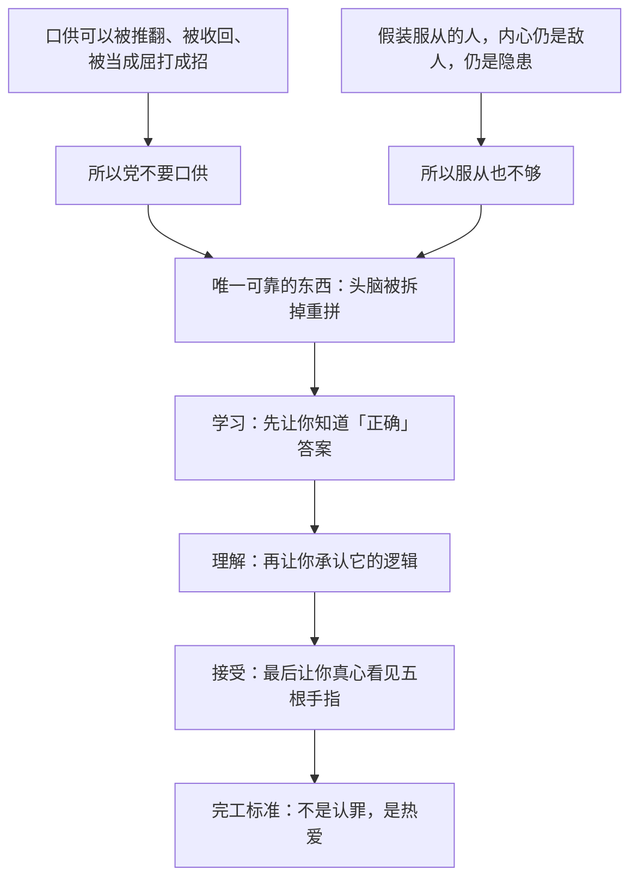

# 15｜权力为什么要的不是服从，而是爱？

> 党已经有无数种办法让温斯顿签字认罪，为什么审讯的目的不是让他「招供」，而是让他「真心相信」？

---

## 一、先说结论

**因为服从可以装，爱装不出来。**

奥勃良在仁爱部把话说明白了：党不要你的口供——口供今天签了明天可以翻；党要的是你的头脑被拆掉重拼，拼到你不只是「承认」二加二等于五，而是真的看见五根手指。**改造的终点不是认罪，是热爱。**只要温斯顿心里还有一块地方没交出去，这件事就不算完。

## 二、我们先理解一个问题

我们通常以为，审讯的目的无非是两样东西：情报，或者口供。拿到其中一样，犯人的利用价值就到头了，剩下的是关押或处决。

但温斯顿身上这两样都不成立。他没有任何情报——他连「兄弟会」是不是真的存在都不知道；他的口供也毫无价值——大洋国不需要向任何法庭证明他有罪，党说谁有罪谁就有罪。**那为什么仁爱部要花几个月、动用奥勃良这样的核心党员，亲自一勺一勺地「喂」他？**答案只能是：党要的东西比口供深得多。

## 三、作者到底提出了什么观点？

奥威尔在书中描绘的仁爱部，是一栋没有窗户的白色大楼——「仁爱」这个名字本身就是反讽，就像管战争的叫和平部、管谎言的叫真理部。

温斯顿在牢里见到的难友，先给他上了第一课：

- 诗人安普尔福思，因为在诗里保留了「上帝」一词（找不到别的韵脚）被捕——荒诞到近乎滑稽，却是真的罪名。
- 老实的帕森斯，因为睡梦中喊了反动话、被亲生女儿举报而进来。他不喊冤，反而真心惭愧：「我有罪」——他感激党「及时」抓住了自己，免得思想烂下去。

然后是奥勃良亲自审讯温斯顿——不是别人，正是他曾经「信任」、以为会拯救自己的那个人。奥勃良借审讯说出改造的**三个阶段：学习、理解、接受**；说出那句纲领性的话：**我们改造的不是行为，是思想。**还说出两段让全书温度骤降的台词：

- 「一个人建立独裁不是为了保卫革命，而是制造革命来建立独裁。」
- 「权力不是手段，权力就是目的。」「如果你要想象未来，就想象一只靴子踩在人脸上——永远。」

## 四、把这个观点翻译成人话

普通监狱要你「说」，仁爱部要你「是」。

打个比方：逼供是在你的电脑上强行安装一个软件——装是装上了，你随时可以卸载，甚至可以假装装着、实际早删了。而改造是**格式化硬盘、重写操作系统**——重写完之后，这台电脑不会「假装」服从，它根本不知道自己曾经是别的系统。

所以口供从来不够：口供是软件层面的东西，可以收回、可以翻案、可以阳奉阴违。党要的是底层代码：让你真心认为二加二等于五——不是「说」等于五，而是**看见**五根手指。

## 五、为什么会这样？

为什么权力不满足于「管住行为」？奥威尔借奥勃良之口给出的逻辑链是这样的：

这套逻辑里最冷的一步是：**恨本身就是不合格品。**只要犯人心里还在恨党，就说明他内部还站着一个「我」在评价党——这个「我」就是残敌。只有当他开始热爱，评价的主体才彻底消失，党才算真正安全。帕森斯就是成品样本：不需要打他，他自己恨自己——这才是党想要的所有人的样子。

## 六、举一个现实生活中的例子

邪教的洗脑流程，是现实世界最接近「改造而非惩罚」的操作。

它的标准步骤不是打你一顿让你听话，而是：**剥夺睡眠**，让你长期处在恍惚状态；**疲劳轰炸**，车轮战式地讲经、质问、围攻，不给你任何独处整理思绪的时间；然后是**当众「承认错误」**——逼你在所有人面前忏悔、自我批判、和过去划清界限。走完这套流程的人，变化的不只是说法：他开始用组织的词汇描述自己，真心觉得自己「以前错了」，甚至感激那个摧毁他的系统——就像帕森斯感激党一样。

这套流程说明一件事：**改造比惩罚更深。**惩罚之后你还是你，只是怕了；改造之后，连那个「你」都被换掉了——而最令人不安的是，当事人不觉得自己被换掉了，他觉得「我终于对了」。

## 七、回到书中重新理解

用这个框架重看仁爱部，会发现温斯顿的审讯有两个阶段。

前半段，他的身体被一点点拆掉：殴打、饥饿、电击、不许睡觉。他签字、认罪、承认从没犯过的罪行——这一段他输得很惨，但**只是身体输了**。后半段才是正题：奥勃良不再要他认什么，而是要他**看见**——伸出四根手指问「这是几」，直到温斯顿在某一刻真的恍惚看见了五根。那一幕是全书的分水岭：从「说给别人听」变成「骗过自己也信」。

温斯顿起初还争辩，后来身体垮掉、意志瓦解，一步步「学习、理解、接受」。但党仍不满足——因为他心里还有一块没交出去：**对裘莉亚的感情。**他可以在一切问题上说谎、可以真心相信谎言，可他还在爱一个人。这一块，是下一步的目标。

## 八、这个观点背后还有什么？

奥勃良那几句话之所以重要，是因为它推翻了读者（和温斯顿）的一个基本假设：以为暴政总有「目的」——为了稳定、为了享乐、为了某种意识形态。奥勃良说：没有目的。**权力不是手段，权力就是目的。**一个人建立独裁不是为了保卫革命，而是制造革命来建立独裁。靴子踩脸的画面不是比喻，是党对未来的全部规划。

这解释了为什么审讯如此「奢侈」：如果权力只是为了维稳，杀掉温斯顿更便宜。正因为它崇拜的是自己，它需要最极端的证明——**把一个最顽固的敌人，变成一个最热心的信徒。**改造温斯顿不是处理麻烦，是权力的祭典。

## 九、这个观点有问题吗？

有说服力的地方在于：它准确预言了「认罪文化」和「思想改造」的心理机制——要求的不只是行为合规，而是表态、忏悔、自我否定，这在二十世纪的许多真实政治运动中的确出现过，不是奥威尔的空想。

但也有可以质疑的地方：

- **可能高估了「灵魂工程」的可行性。**现实中酷刑的主要功能其实是制造恐惧和获取口供，「彻底重写一个人格」成本极高、成功率存疑。多数政权满足于「你怕就够了」，未必真追求「你爱」。
- **奥勃良的独白更像哲学辩论。**审讯室里那段逻辑严密的自白，是小说化的思想实验——现实中的酷吏很少这样总结自己的哲学。它揭示了极权「可能」的逻辑，不等于描述了极权「实际」的运转。
- **学界对此有不同看法**：有人认为这一章影射的是苏联莫斯科大审判中被告真心认罪的历史之谜，也有人认为奥威尔写的是「权力的自白」——一种把暴政内在逻辑推到极限的推演，而非操作手册。

## 十、今天再看这个观点

> 以下部分是基于书中思想的现代延伸，不是奥威尔的原话。

今天未必有仁爱部那样的大楼，但「不满足于服从、还要求表态」的机制随处可见：沉默不够，要点赞；照做不够，要转发；转发不够，要写得情真意切。公开道歉、自我检讨、「发自内心」的表态——这些仪式的共同点，是把「你怎么想」也纳入管辖范围。

奥威尔的洞见在于：**当一个系统开始要求你的「真心」，说明它已经明白假装的服从留不住。**反过来说，凡是要求你证明热爱的场合，都值得多问一句：它要的是你的爱，还是要你交出「还有资格不爱」的那个自己？

## 十一、这一篇真正应该记住什么？

记住三件事：

- **惩罚改变行为，改造改变人格。**口供是软件，随时可以卸载；被重写的操作系统不知道自己被重写过。
- 党对「真心」的执念不是仁慈也不是变态，是计算：**只要还有恨，就还有一个在评价它的「我」；只有热爱能让评价的主体消失。**
- 判断改造是否完成的标准只有一条：**恨还需要伪装吗？**当爱也是真的，就再也没有内外之分——帕森斯就是终点，温斯顿正在路上。

## 十二、留一个问题

温斯顿的身体垮了、意志瓦解了，字也签了、罪也认了——可党仍然不满意，因为他心里还藏着最后一块没交出去的地方：对裘莉亚的感情。殴打没用、饥饿没用、电击也没用——怎样才能把一个人心里最后那块东西也拿走？

下一篇，我们来看仁爱部最深的那个房间：**16｜101 号房间为什么能摧毁一切抵抗？**
