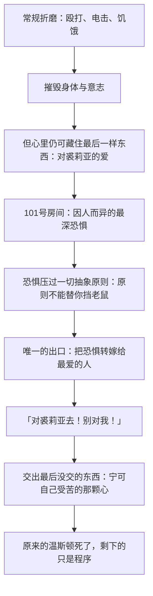

# 16｜101 号房间为什么能摧毁一切抵抗？

> 温斯顿熬过了殴打、电击、饥饿和精神凌辱，为什么在 101 号房间一分钟就崩溃了？

---

## 一、先说结论

**因为之前的折磨摧毁的是身体和意志，101 号房间摧毁的是「我之所以是我」的最后一样东西。**

那里面装的不是更痛的刑罚，而是每个人最恐惧、最无法面对的东西——对温斯顿，是老鼠。人在面对它时，会拿内心最深处的东西去交换逃生：**温斯顿交出的，是裘莉亚。**从喊出那句话的一刻起，原来的温斯顿已经死了，剩下的只是把程序走完。

## 二、我们先理解一个问题

我们通常以为，酷刑是一条线性的路：疼痛往上加，意志往下掉，谁先到底谁输。按这个逻辑，温斯顿已经熬过了最狠的一段——他被打了几个星期，骨瘦如柴，签了所有要他签的东西。应该没有「更狠的」了。

但仁爱部深处还有一个房间，连名字都能让囚犯发抖：**101 号房间。**人人闻之色变，却没有一个人说得出里面到底是什么——因为里面装的东西因人而异。这就提示了一个不一样的事实：**崩溃不按疼痛排序，按恐惧排序。**而每个人最深的恐惧，都是私人订制的。

## 三、作者到底提出了什么观点？

奥威尔在书中设定：101 号房间装着「你最害怕的东西」——世界上没有普适的酷刑，但每个人心里都有一件连想都不敢想的事。对温斯顿，那是一只面罩式的铁笼：笼子里关着饥饿的大老鼠，装置只差一个开关，就要整个扣到他脸上。

关键背景是：走到这一步之前，温斯顿其实已经输光了——他认了没犯过的罪、出卖了所有能出卖的人、甚至一度真的看见五根手指。**但他保住了最后一样东西：他没有背叛裘莉亚。**身体屈服了，心里还爱着。他自己暗暗知道这一点，甚至靠这一点维持着「我还是我」的最后感觉。

奥威尔在书中描绘的崩溃只有一瞬：面对鼠笼，温斯顿喊出「对裘莉亚去！别对我！对裘莉亚去！」——他要求把这份恐惧转嫁给裘莉亚，让她替自己受刑。奥威尔借这一幕表达的是：**人最后守不住的那道防线，不在思想里，在恐惧里。**

## 四、把这个观点翻译成人话

前面所有的刑罚，攻击的都是「你」：你的痛觉、你的尊严、你的理智、你对事实的坚持。这些防线再重要，毕竟都在你一个人身上。

101 号房间攻击的是另一样东西：**你和别人之间的那条线。**爱一个人意味着什么？意味着宁可自己受苦，也不让对方受苦——这个定义不需要说出口，它就是「你是哪种人」的底层代码。温斯顿喊出「对裘莉亚去」的那一刻，等于亲手把这条代码删了：他宁愿裘莉亚替他进鼠笼。那一声不是一句违心话——**那一刻他是真心这么希望的。**这才是毁灭的全部含义：不是说了假话，而是那颗「宁可自己受苦」的心，真的不在了。

## 五、为什么会这样？

为什么是恐惧、而不是更大的疼痛，能完成最后一击？机制是这样的：

疼痛考验的是忍耐，忍耐是有刻度、可以硬扛的；而最深的恐惧考验的不是忍耐——它直接短路了「选择」本身。面对那只笼子，温斯顿不是「权衡之后选择了自己」，而是连权衡都没有发生：**能牺牲的东西只剩一样，于是他牺牲了它。**党要的正是这个效果：让他亲手证明，在足够的恐惧面前，爱也会让路。

## 六、举一个现实生活中的例子

审讯心理学里有一条古老的原则：**刑罚不如画像，画像不如找到那个人最深的恐惧。**

现实中针对性恐惧的例子很多：对有洁癖的人泼脏水、把他摁在污秽里——同样的力道，对普通人只是难受，对洁癖者是酷刑；对恐高的人用悬吊，对幽闭恐惧者用小黑屋，对害怕某种动物的人用动物。作为历史事实，二十世纪多国情报机构的审讯手册里确实强调过「因人而异」的弱点分析：先摸清对象怕什么，再让那个东西出现——因为普适的疼痛只能换来屈从，而**精准命中弱点的东西能换来崩溃**。

这正是 101 号房间的逻辑原型：它不一定比殴打更痛，它是找到了你防御为零的那个点。老鼠对旁人只是恶心，对温斯顿是童年的梦魇——**恐惧没有统一单位，所以钥匙必须私人订制。**

## 七、回到书中重新理解

用这个框架重看，温斯顿在进 101 号房间之前其实已经「完了」——但又没全完。他签字、认罪、背出所有标准答案，可他心里清楚自己还留着什么：他没有停止爱裘莉亚。他甚至为这点隐秘的剩余感到一丝得意——**他们可以改变一切，却不能让你不再爱一个人。**

101 号房间正是冲着这最后一点来的。崩溃之后温斯顿立刻明白了它完成了什么：那一刻他不是「为了活命说了违心话」，而是**真心希望那笼老鼠扣在裘莉亚脸上**——他希望她替自己承受。这个「真心」才是关键：如果只是说说，回头还能忏悔；可他当时是认真的，那个「宁可她受苦」的温斯顿是真实的。**爱被证伪了——不是被否定，而是被他亲手证明是可以放弃的。**

## 八、这个观点背后还有什么？

第一，为什么党一定要他出卖裘莉亚，而不是干脆杀了他？因为杀死温斯顿，留下的是「至死爱着裘莉亚的温斯顿」——反抗以死封圣，爱反而被保全。让他亲手背叛，是把「爱」这个东西本身证伪：**原来爱也服从于恐惧，那么它就不再是一个可以对抗权力的东西。**奥勃良要毁掉的不只是这个人，是「这个人相信的东西真的存在过」这个可能。

第二，「里面装着你最害怕的东西」这个设定本身，是全书对极权最锋利的想象之一：**终极形态的统治是定制化的。**不是对所有人用同一套刑罚，而是为每个人准备他自己的深渊——千人一面的暴力是粗糙的，一人一面的暴力才是精密的。

第三，这一章也回答了一个前面的悬念：为什么改造要分「学习、理解、接受」三阶段？因为前两阶段处理的是认知，101 号房间处理的是**情感**——头脑归顺之后，心还得单独收一遍。

## 九、这个观点有问题吗？

有说服力的地方在于：它写出了一个朴素而残酷的事实——**底线不是原则问题，是强度问题。**再多抵抗手册、再坚定的决心，都存在一个压垮它的量，这是小说对人性的冷峻诚实。

但也有可以质疑的地方：

- **恐惧被写得过于「可工程化」。**书里暗示党能精确找到并触发每个人的最深恐惧，像按开关一样完成摧毁。现实中的心理崩溃要混乱得多——有人在最弱处反而扛住了，有人在无关紧要的地方垮掉，结果很难被导演。
- **可能低估了人的恢复力。**「崩溃即永久死亡」是小说需要的终局，但历史上出狱的囚犯、酷刑幸存者重建自我的例子并不少——碎了的东西有时能拼回来。奥威尔为了论证的彻底性，把崩溃写成了不可逆。
- **存在不可证伪的问题。**「总有一种手段能摧毁任何人」这个命题本身无法被验证：举出扛住的例子，总可以说「还没找到他最深的恐惧」。学界对此也有不同看法：有人认为这一章是极端推演而非心理写实，有人则把它看作对「人有不可剥夺的内心自由」这一信念的正面挑战。

## 十、今天再看这个观点

> 以下部分是基于书中思想的现代延伸，不是奥威尔的原话。

今天未必存在实体的 101 号房间，但「为你一个人定制恐惧」的逻辑越来越真实：心理画像、行为数据、精准推送——一个足够了解你的系统，理论上知道哪条信息最能让你焦虑、哪个画面最能让你失眠、哪种威胁最能让你就范。**千人一面的恐吓是粗糙的，一人一面的才是高效的**，这个原则从审讯室延伸到了算法里。

反过来，这一章也留下一个不那么绝望的问题：如果底线真的有价，那我们能做的不是假装它没有，而是**提前知道自已的「老鼠」是什么**——知道自己会在哪里垮掉，比自信永远不会垮，更接近真正的抵抗。

## 十一、这一篇真正应该记住什么？

记住三件事：

- **之前的折磨摧毁身体，101 号房间摧毁「我之所以是我」的最后一样东西**——它拿走的不是服从，是爱人的能力。
- 衡量一个人被摧毁到什么程度，看的不是他招了什么，而是**他最后交出的是什么**。温斯顿交出的不是情报，是他爱人的方式。
- 每个人的底线都有价格，价格不是钱，是**那个你无法面对的东西**——而且这份账单因人而异，私人订制。

## 十二、留一个问题

交出裘莉亚之后，温斯顿还活着——被安排了闲职，每天去栗树咖啡馆喝酒、看棋谱。但活着的那个东西，还是温斯顿吗？小说还剩最后几页，结尾处有一句让几代读者脊背发凉的话。

下一篇，我们来看：**17｜「我爱老大哥」为什么是全书最恐怖的一句话？**
