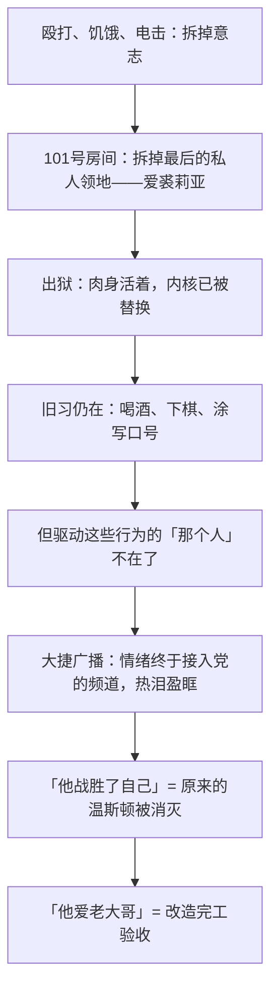

# 17｜「我爱老大哥」为什么是全书最恐怖的一句话？

> 温斯顿最后说「他爱老大哥」——这句话为什么比任何酷刑描写都更让人脊背发凉？

---

## 一、先说结论

**因为这不是投降，是完成。**

前面所有的折磨只是过程，这句话证明过程成功了：温斯顿没有被杀死，而是被替换了——死掉的那个是写日记、爱裘莉亚、记得母亲的温斯顿，活下来的是一个真心热爱压迫者的空壳。**奥威尔用「爱」这个字结尾，是因为权力要的最后一样东西不是命，是灵魂。**

## 二、我们先理解一个问题

按照常见的故事逻辑，结尾无非几种：英雄殉道，留下火种；或者逃出去，继续反抗；最差也是表面屈服、心里还恨着——读者总能在「至少他心里不服」里找到一点安慰。

奥威尔一样都不给。没有殉道，没有逃亡，甚至连「心里还恨着」这条退路都被焊死。他偏要用最温柔的词写最狠的结局——为什么？因为这本书从头到尾在追一个问题：权力到底要什么？要行为，第一章的电幕就够；要口供，仁爱部的刑具就够。**如果结尾停在「他服从了」，等于承认权力只要到行为为止——而奥威尔要写的恰恰是：不止。**

## 三、作者到底提出了什么观点？

奥威尔在书中描绘的尾声，平静得反常：

- 出狱后的温斯顿被安排了一个清闲的差事，每天喝胜利牌杜松子酒，在栗树咖啡馆看棋谱、等战报，过着被允许的、梦游般的日子。
- 他在公园遇见裘莉亚。两人都承认「我出卖了你」——说得像报天气，不恨、不怨、不想解释。相对无言，各自走开，从此都不想再见。
- 他下意识在纸上涂写「自由即奴役」「二加二等于五」——那些他曾用生命抵抗的东西，如今随手写出，只当消遣。
- 广播传来前线大捷，温斯顿热泪盈眶，觉得「一切都好了」。
- 全书最后一句：「他战胜了自己。他爱老大哥。」

注意奥威尔的用词：不是「他服从了」，不是「他认了」，是**「他爱了」**。奥威尔借这个结尾表达的是：党连他最后一点内心领地也收走了——这一刻，大洋国完成了对它最顽固敌人的改造。

## 四、把这个观点翻译成人话

如果结尾是「他屈服了」，那坏消息里还藏着一个好消息：心是关着的，门里面还坐着一个恨着老大哥的温斯顿——早晚有一天，门可能再开。

但「他爱了」意味着**连门都没有了：里面和外面是同一个东西。**打个比方：一台电脑被黑客控制不可怕，可怕的是控制完成之后，系统日志里写的是「本操作由用户自愿发起」——再没有谁被强迫，因为那个会被强迫的「谁」，已经不在了。「他战胜了自己」这句话，在党的语言里是颂词，在读者耳朵里其实是讣告：被战胜的「自己」，就是那个曾经算得上人的部分。

## 五、为什么会这样？

为什么非得是「爱」，改造才算完工？因为党要的验收标准不是行为，是**评价主体的消失**：

逻辑是这样的：只要温斯顿还在恨，就说明他内部还站着一个「我」在评价党——哪怕这个「我」只剩一句脏话，它也是残敌，改造品就是不合格品。**恨是最后一道疆界：恨没了，「我」就没了。**所以完工的标志不能是安静（安静可能是装的），只能是热爱——热爱意味着，再也没有任何内在的位置，可以从那里对他说「不」。

## 六、举一个现实生活中的例子

斯德哥尔摩综合征，是现实中最接近这个结尾的心理现象。

作为历史事实：1973 年瑞典斯德哥尔摩一起银行劫案中，几名人质被扣押数日后，竟对劫匪产生了依恋——获救后替绑匪辩护、拒绝指控，甚至有人后来与劫匪订婚。此后类似案例不断被记录：被绑架者、被长期囚禁者、家暴中的受害者，在生死完全操于对方之手的绝境里，情感可能倒转，指向压迫自己的人。

心理学的解释是：当生存完全依赖一个人时，「讨好他」会从策略慢慢变成真实的感受——**被摧毁到底之后，依附是唯一剩下的活法。**温斯顿的「他爱老大哥」就是这个逻辑的极限版：区别只在于，人质是被感动，而温斯顿是被格式化之后重新写入了唯一的情感——他不是「爱上了」老大哥，是除了这份爱，他内部已经不剩别的东西。

## 七、回到书中重新理解

尾声里最冷的一场戏不是结尾那句，而是公园里的重逢。

两人见面，说的最重要的话是「我出卖了你」——然后就没有了。没有拥抱，没有争吵，甚至不需要原谅，因为**连「被伤害」的资格都随着那份爱一起消失了**：你不爱对方，对方的背叛也就谈不上背叛。他们相对无言、各自走开、再也不想见——这场戏证明 101 号房间对两个人都成功了：连「我们曾经相爱」这个事实，都变成了灰。

另一个细节是涂写。温斯顿下意识在纸上写「自由即奴役」「二加二等于五」——要知道，「二加二等于四」曾经是他抵抗的全部支点，「自由就是能说二加二等于四」是他写在日记里的信念。如今这些东西被他随手写出来当消遣，**像写别人的句子**。抵抗过的东西沦为无聊时的涂鸦，这比任何刑讯描写都更彻底地宣告：那个会抵抗的人，已经不在了。

## 八、这个观点背后还有什么？

第一，注意叙述方式的变化。结尾那句不是温斯顿的内心独白，也不是对话，而是叙述者冷静的陈说——「他战胜了自己。他爱老大哥。」**连叙述视角都从温斯顿身上撤离了**，仿佛那个能提供第一人称的内部已经清空，只剩下一份由外部宣读的验收报告。

第二，回看全书弧线：从日记本上的第一行字，到「他爱老大哥」，写的是一个灵魂从点亮到熄灭的全过程。奥威尔让温斯顿抵抗得足够久、足够彻底——日记、爱情、记忆、兄弟会，所有能试的都试了——**正是为了让最后的熄灭没有任何借口**：不是他不够勇敢，是这台机器的目标本来就包括他最里面那一层。

第三，这句话也回收了全书的问题链：权力要什么？要服从（监视篇）、要口供（审讯篇）都不够——它要的最后一项，是你心里那间「不归它管的房间」。「他爱老大哥」说明：那间房，也没了。

## 九、这个观点有问题吗？

有说服力的地方在于：作为警告，它极其有效——它把极权的终点从「尸体」改写为「空壳」，让读者记住最可怕的不是消灭反抗者，而是让反抗者自己消失。这个洞见至今仍是理解极权的标准框架之一。

但也有可以质疑的地方：

- **彻底的人格替换在现实中是否可能，存疑。**历史上出狱的异见者重新写作、幸存者记忆回潮的例子并不少——被压碎的东西有时会重新长出来。奥威尔为了论证的彻底性，把「改造成功」写成了不可逆的终局。
- **结尾可以作另一种读法。**那句平静的陈述也可以读作反讽叙事——用党的口吻说出「他战胜了自己」，恰恰让读者意识到这句话多么恐怖。恐怖感来自反讽，不必来自「事实如此」。
- **学界对此有不同看法**：这个结尾究竟是奥威尔对极权终局的判断，还是「最坏可能」的思想实验？奥威尔本人在别处表示过这本书是警告而非预言——把一个推演出来的极端结局，当成对人性的定论，可能超出了作者的意图。

## 十、今天再看这个观点

> 以下部分是基于书中思想的现代延伸，不是奥威尔的原话。

今天「我爱老大哥」的温和版本，未必产自刑讯室。它可能是这样的：一个人日复一日消费被配给的内容，为被筛选过的捷报热泪盈眶，把系统的目标错认成自己的心愿，并且——这是关键——**发自内心**。不需要有人逼你，当供给、评价和情感都接入同一个频道，「自愿」和「被写就」之间的界线会自己消失。

奥威尔这句结尾真正留下的警告也许是：**检验一个人是否还是他自己，标准不是他是否服从，而是他的爱憎还是不是自己的。**服从可以外包，爱憎不能——一旦连热爱都是配给的，就再没有内部法庭可以受理申诉。

## 十一、这一篇真正应该记住什么？

记住三件事：

- 恐怖的不是温斯顿输了，而是**输完之后，他感激赢的那一方**——「他爱了」比「他怕了」深一万倍。
- 检验改造是否完成的标准只有一条：**恨还在不在。**恨没了，「我」就没了——爱老大哥的温斯顿，不再是温斯顿。
- 权力要的最后一样东西不是命，是灵魂：「他战胜了自己」是党的颂词，也是这个人的讣告。

## 十二、留一个问题

温斯顿最后在纸上涂写的，除了「自由即奴役」，还有一句「二加二等于五」——而他写下它的时候，已经真心相信了。一个人怎么能真心相信二加二等于五？更可怕的是：如果党控制着所有人的头脑，「二加二等于几」这件事，到底谁说了算？

下一篇，我们来看这场关于现实本身的争夺：**18｜「2+2=5」：权力能否重新定义现实？**
