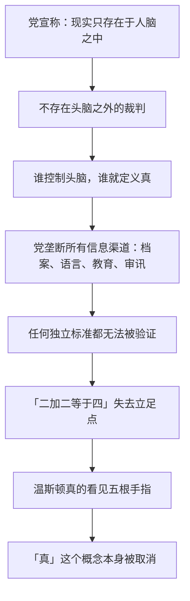

# 18｜「2+2=5」：权力能否重新定义现实？

> 审讯室里那场关于"二加二等于五"的争论，争的到底是什么？

---

## 一、先说结论

**那场争论争的不是数学，是"谁有权定义真"。**

奥勃良竖起四根手指，问的不是"这是几"，而是"如果党说这是五，那是几"。这两道题的答案可以一样，含义却完全不同：第一道考你的视力，第二道考你的服从——更进一步，考你愿不愿意**把"看见什么"的决定权交出去**。奥威尔在书中描绘的这场审讯，是全书哲学上最深的一层：极权的终极目标不是逼你说假话，而是让"真"和"假"失去参照——当现实只由权力定义时，"客观事实"这个东西本身就不存在了。

## 二、我们先理解一个问题

我们通常以为，审讯的目的是拿到口供：你做了什么、同伙是谁、签个字画个押。但温斯顿早就愿意招了——他认罪、签字、咬出所有人。可审讯并没有结束。

因为在奥勃良的设计里，"承认"毫无价值。**口供可以被推翻，可以被解释为刑讯逼供的产物；只有一样东西无法被推翻——你真心相信**。所以审讯的真正战场不在事实上，而在"事实由谁说了算"上。二加二等于几，恰好是这世上看起来最不容争辩的一件事——连它都能被拿下，就没有任何东西拿不下。

## 三、作者到底提出了什么观点？

奥威尔借奥勃良之口，在仁爱部的审讯室里展开了一套完整的哲学。奥勃良的逻辑链条是这样的：

- **现实只存在于人的头脑里**——不存在什么独立的"外部世界"，所谓客观，不过是集体头脑里的共识；
- **党控制着所有头脑**——通过电幕、新话、档案和审讯，每个人头脑里装什么由党决定；
- **所以党控制现实**——党说二加二等于五，那就等于五，因为不存在"头脑之外"的地方可以核对答案。

温斯顿的反驳代表了常识：宇宙在党出现之前就存在，地质、恐龙、星辰都不归党管。奥勃良的回答是全书最冷的一段：大意是，你所谓的外部世界，不过是你的想象——没有人能证明头脑之外有什么。

## 四、把这个观点翻译成人话

打个比方：假如全世界的秤都由同一家公司校准，而这家公司宣布"从今天起，一斤是六百克"。你可以不服，但你拿什么去称？你手里每一台秤都是他们家出的。

"客观事实"听起来坚不可摧，但它的验证依赖工具：档案、记录、证人、教科书、别人的记忆。**当所有验证渠道都归同一家时，"事实"就变成了一个内部数据**——改数据库，就是改现实。温斯顿说"自由就是能说二加二等于四"，这句话的前提是：存在一个独立的标准可以对答案。奥勃良要做的事，就是拆掉这个标准本身。

## 五、为什么会这样？

关键在于最后一步。奥勃良要的不是温斯顿撒谎——撒谎意味着心里还知道真的答案。他要的是温斯顿**在不确定中放弃判断**，直到他真的看见五。书中描绘的恐怖就在这里：不是"你被迫说五"，而是"你再也说不清是四还是五"——一旦判断权交出去，连"我在说假话"这件事本身都不再成立了。

## 六、举一个现实生活中的例子

心理学里有个概念叫"煤气灯效应"（gaslighting）：操控者持续否认受害者亲眼所见的事实——"你没看见""你记错了""大家都是这么说的"——直到受害者开始怀疑自己的感知，把判断权交给操控者。这个名字来自 1944 年的电影《煤气灯下》：丈夫反复调暗屋里的煤气灯，却告诉妻子"灯没暗，是你疯了"。

网络谣言是这套机制的放大版。一个假消息被重复一万次、出现在所有信息流里之后，它获得了一种"准事实"的地位——不是因为它被验证了，而是因为**核对它的成本太高，而它恰好与"所有人都在说的版本"一致**。这和奥勃良的手段是同构的：不必证明谎言为真，只需让"真"失去可对照的标准。当每条信息都互相矛盾、每个来源都可能是假的时候，人最省力的选择就是放弃判断——而那正是审讯室里温斯顿最后抵达的地方。

## 七、回到书中重新理解

回头看温斯顿那本日记，他在开头写过：**"自由就是能说二加二等于四的自由。"**那时他以为这是底线——就算党控制一切，至少数学站在我这边。

仁爱部的审讯证明他错了。奥勃良竖起四根手指，温斯顿先答"四"，遭到电击；再答"五"，奥勃良仍不满意——因为他**只是说了出来，还没有真的看见**。这个细节是全书最暗的：党连你的口是心非都不接受，它要的是你感知层面的投降。最后，在折磨与药物中，温斯顿真的在某个瞬间看见了五根手指——或者更准确地说，他**放弃了判断自己看见了几根**。客观现实的最后防线不是被攻破的，是被他自己松手的。

## 八、这个观点背后还有什么？

奥勃良这套哲学在书中有个名字，可以叫"集体唯我论"：现实不独立存在，只存在于集体意识中，而党就是集体意识的化身。这是奥威尔对极权主义最深的一层解剖：骗你不可怕，可怕的是**取消"被骗"这个概念的立足点**——你连"他们在说谎"都说不出来，因为"谎"需要一个"真"作参照，而参照系已经被没收了。

还有一个更隐蔽的推论：如果党控制现实，那么党永远正确——不是因为它不犯错，而是因为"错"不存在了。预言没有应验？那是记录错了。数据对不上？那是数据错了。**一个能定义现实的权力，在逻辑上不可能被打败**——这就是为什么奥勃良敢说党的权力是绝对的。

## 九、这个观点有问题吗？

有，主要在两点：

- **哲学上有争议**。学界对"现实是否只存在于头脑"有长期争论：奥勃良的唯我论在逻辑上确实难以彻底驳倒（你无法跳到头脑之外去验证头脑），但多数哲学家认为，这恰恰说明它是无法证伪的空话——实践中石头砸在脚上会疼，并不依赖谁的头脑。奥威尔让奥勃良在审讯室里赢，是文学选择，不是哲学结论。
- **实践上可能被高估**。真实的极权政权从未真正取消客观现实——苏联的计划经济需要真实数据才能运转，谎言系统自己也要靠"内部的真话"维持。现实中更常见的机制不是让人"真的看见五"，而是让人**不再关心是四还是五**：犬儒、麻木、"说一套做一套"的双轨制，比彻底的现实改造普遍得多。从这个意义上说，奥勃良描绘的是一种极限形态，现实中的极权往往满足于"你不敢说四"，而不必做到"你真的看见五"。

## 十、今天再看这个观点

> 以下部分是基于书中思想的现代延伸，不是奥威尔的原话。

今天没人竖起四根手指逼你回答，但"谁有权定义真"这个问题换了形态：算法决定你看到哪个版本的世界，平台决定哪些信息"存在"，热搜定义什么是"事实"。当不同群体活在完全不同的信息环境里时，"客观事实"不再是自明的东西——它变成了需要主动去核对、去维护的东西。

奥威尔的提醒因此仍然有效：**"真"不会自动存在，它依赖可验证的标准**——档案、独立来源、可以对照的原始记录。当这些标准被垄断或者失效时，二加二等于几，真的可能变成一道服从题。

## 十一、这一篇真正应该记住什么？

记住一件事：**极权最深的野心不是让你撒谎，而是取消"谎"和"真"的区别**。

- 审讯争的不是数学，是定义权——"这是几"和"党说这是几"是两道完全不同的题
- 客观事实依赖可验证的标准；垄断了验证渠道，就垄断了现实
- 奥勃良不要口供，要感知层面的投降——"说出来"不够，要"真的看见"
- "自由就是能说二加二等于四"的真正含义是：存在一个不由权力定义的标准

## 十二、留一个问题

如果你头脑里那个"二加二等于四"的声音，需要每天消耗意志力才能维持下去——它还能撑多久？

下一篇，我们来看刻在真理部大楼外墙上、每个党员每天必须面对的三句话：战争即和平、自由即奴役、无知即力量——它们明明自相矛盾，为什么能同时成立？
