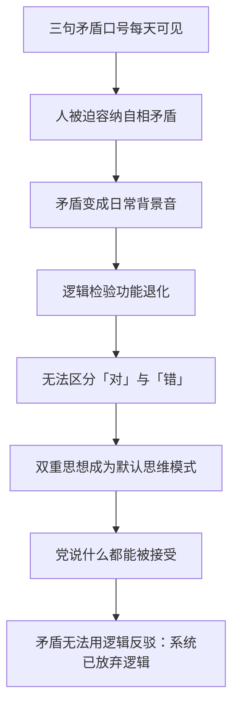

# 19｜三句口号为什么能同时成立？

> 战争即和平、自由即奴役、无知即力量——这三句自相矛盾的话，为什么挂在大洋国最高的楼上？

---

## 一、先说结论

**因为矛盾本身就是设计。这三句口号不是让人"相信"的，是让人练习"双重思想"的。**

奥威尔在书中设定：真理部大楼的外墙上刻着三句话——战争即和平、自由即奴役、无知即力量。它们每天被每个进出大楼的人看见，构成一本摊开的"矛盾教材"：你必须同时接受"A 是 B"和"B 不是 A"，久而久之，你用逻辑去检验的能力就废了。果尔德施坦因的书逐条解释了它们的机制——而那本书本身就是党写的，这又一次回到陷阱。

## 二、我们先理解一个问题

正常的标语要求逻辑自洽："多劳多得""团结就是力量"——它们可以假，但不自相矛盾。可大洋国偏要把三句**明明白白自相矛盾**的话刻在最高的楼上，让所有人天天看。

为什么一个政权要主动展示矛盾？按常识，矛盾是弱点——被人抓住逻辑漏洞，说服力就没了。但奥威尔的设定反其道而行：**矛盾不是漏洞，是功能**。当人民习惯了不追问矛盾，也就习惯了不追问任何东西。

## 三、作者到底提出了什么观点？

奥威尔借果尔德施坦因的那本书（书中设定为禁书，后由奥勃良承认参与写作），逐条拆解了三句口号的运作机制：

- **战争即和平**：大洋国与欧亚国、东亚国之间的战争是永久的，目的不是赢，而是让战争持续下去。战争消耗掉工业剩余产品，使群众生活永远停在匮乏线上——生活一旦变好，人就会看见不平等；同时战争维持着恐惧和团结。对外打仗，就是对内维持统治的"和平"。
- **自由即奴役**：个人的所谓"自由"意味着孤立无援、必然失败——一个脱离集体的人注定被碾压。只有放弃自我、融入党，才能获得真正的"自由"。这句口号把"自由"重新定义为服从。
- **无知即力量**：群众越无知，党改写历史与现实就越畅通；党员的无知——对矛盾视而不见的能力——则是党自身运转的润滑剂。无知不是缺陷，是党的力量来源。

三句放在一起，构成一套完整的双重思想练习：你必须每天面对它们，而不觉得荒谬。

## 四、把这个观点翻译成人话

打个比方：你每天上班都要经过一块牌子，上面写着"本公司的原则是欺骗"。第一天你觉得荒唐，第一个月你还会皱眉，第三年你已经看不见它了——**不是它消失了，是你"觉得荒唐"这个功能退化了**。

奥威尔借这套机制表达的观点是：矛盾口号的作用不是传递信息，而是**钝化逻辑**。逻辑是一种肌肉，用进废退。当你每天被迫容纳"战争就是和平"这种句子，你就习惯了让相反的东西在脑子里和平共处——到那时候，党说什么你都能接受，因为你已经失去了"不接受"的工具。

## 五、为什么会这样？

最深的一层设计在这里：**你无法用逻辑反驳一个本来就放弃了逻辑的系统**。对普通人来说，指出矛盾是反驳的开始；对双重思想者来说，指出矛盾毫无意义——他早就知道那是矛盾，并且已经学会了"止罪"：在即将意识到矛盾的那一刻停止思考。口号挂在那里，就是一道每日练习题。

## 六、举一个现实生活中的例子

公司话术里常见的"三连"几乎是同构的："加班是福利"（剥夺被重新定义为获得）、"服从是自由"（自主被重新定义为听话）、"把公司当家，但公司不是你家"（需要你奉献时是家，需要付成本时就不是家）。单独看，每一句都有道理可讲——加班确实有补贴、服从确实换来稳定——这正是它们比"二加二等于五"高明的地方：**它们不是纯粹的假话，而是把词义偷换了一半的句子**。

效果也一样：员工每天在这种话语里浸泡，久而久之不再追问"福利为什么长得像剥夺"。开会时听到"裁员是为了让组织更健康"，没有人笑场——不是大家真信了，而是"指出矛盾"这个动作在职场文化里已经被标记为"不成熟"。大洋国的口号和这些话术共享同一个机制：让矛盾成为背景音，让追问成为失礼。

## 七、回到书中重新理解

回到书里，有个细节常被忽略：三句口号刻在**真理部**的墙上——一个专门生产谎言的机构，把"无知即力量"刻在自己门面上。这不是讽刺彩蛋，而是制度性的坦诚：党已经把矛盾公开化了，而公开化的矛盾恰恰证明它不再需要掩饰。

更冷的是果尔德施坦因的书本身。那本书把三句口号的机制解释得清清楚楚——战争为何永久、匮乏为何必要、无知为何有用——温斯顿读完觉得"我终于懂了"。但奥勃良后来承认，这本书是他参与写的。**连解释矛盾的教材都是党编的**：党不仅让你练习矛盾，还包办你对矛盾的"理解"。你以为的清醒，也是设计的一部分。

## 八、这个观点背后还有什么？

三句口号还有一个常被忽视的功能：它们划出了**成员资格的边界**。能面不改色念出"战争即和平"的人，是自己人；觉得荒谬、还想把它说出来的人，暴露了。矛盾口号因此是一种检测器——逻辑还会疼的人，会被筛出来。

更深一层：奥威尔借这套设计表达的是，极权真正要消灭的不是某个具体观点，而是**"观点可以被检验"这件事**。三句口号每天都在演示：真可以等于假，A 可以等于非 A。当"检验"失效，剩下的唯一标准就是"党现在怎么说"——这和二加二等于五，是同一枚硬币的两面。

## 九、这个观点有问题吗？

有，主要在两点：

- **"练习说"解释力强，但有边界**。学界对"人们是否真的需要被训练才能容忍矛盾"有不同看法：心理学的认知失调研究表明，人本来就很擅长同时持有矛盾观念——不需要政权训练，这可能是人的默认状态。奥威尔把"双重思想"写成一种需要精心维护的高难度技术，究竟高估还是低估了它的难度，学界对此有不同看法。
- **现实中的矛盾往往没这么直白**。真实的宣传更倾向于模糊（"与时俱进""新常态"）而非硬碰硬的矛盾——直白的矛盾反而容易引发注意和嘲讽。奥威尔为了把机制写透，把矛盾压缩进三句话，是文学上的提纯；现实中的矛盾渗透更隐蔽、更分散，通常藏在一套看似自洽的叙事内部。

## 十、今天再看这个观点

> 以下部分是基于书中思想的现代延伸，不是奥威尔的原话。

今天的"三句口号"不刻在楼上，而是分散在各种话语里："分享经济"（你的劳动变成别人的利润）、"灵活就业"（不稳定被命名为自由）、"用户既是消费者也是产品"（被卖被重新定义成被服务）。它们共享同一个结构：**用一个褒义词，命名它的反面**。

奥威尔的提醒依然有效：检验一个口号的方法不是问"它说得通吗"，而是问"它偷换了哪个词"。当一个社会的主流话语里，相反的概念可以无痛共存时，要警惕的不是某句假话，而是**整个检验功能正在被钝化**。

## 十一、这一篇真正应该记住什么？

记住一件事：**矛盾口号的目的不是让你信，是让你习惯不去检验**。

- 战争即和平：永久战争消耗剩余、维持恐惧，打仗就是维持统治的手段
- 自由即奴役：把"自由"重新定义为服从，孤立的个人注定失败
- 无知即力量：群众的无知，是党改写现实的通道
- 三句放在一起＝双重思想的日常练习；矛盾本身让"对错"失效

## 十二、留一个问题

如果一个系统连"矛盾"都能拿来为己所用——它到底是强大，还是脆弱？它会不会也有自己消化不了的东西？

下一篇，也是全系列的最后一篇，我们跳出大洋国，回到写这本书的那个人：奥威尔 1948 年写下这个发生在"未来"的故事，他究竟是在预言，还是在警告？而 1984 年真的到来时，世界应验了什么、又躲过了什么？
