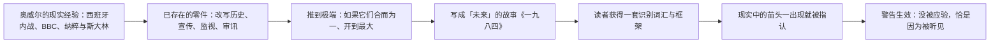

# 20｜《一九八四》是预言还是警告？

> 奥威尔 1948 年写下这个发生在"未来"的故事，他是在预测 1984 年，还是在警告人类？

---

## 一、先说结论

**是警告，不是预言——而这恰恰是这本书比预言更有用的地方。**

奥威尔不是预言家。他在西班牙内战中见过谎言如何变成"历史"，在 BBC 见过宣传机器如何运转，见过纳粹德国和斯大林的苏联如何把极权变成日常。《一九八四》做的事，是把**已经存在的东西推到极端**，然后问一句：如果任由它发展，会变成什么样？1984 年真的到来时，大洋国没有出现——但电幕变成了手机，新话变成了词库，老大哥变成了算法。这本书的价值不在于猜对了多少，而在于它给了一代又一代读者一种**免疫力**。

## 二、我们先理解一个问题

预言和警告看起来很相似，逻辑却完全不同。预言赌的是"会这样"——对了是神准，错了是废纸。警告说的是"**如果不刹车，可能会这样**"——它不怕没应验，恰恰相反，**警告最大的成功就是没应验**：正因为它被听见了，事情才没走到那一步。

所以问"《一九八四》应验了吗"，这个问题本身就问偏了。正确的问题是：奥威尔看到的那些苗头——历史被改写、语言被简化、监视常态化、恐惧统治——今天还在不在？

## 三、作者到底提出了什么观点？

先说事实部分：奥威尔 1948 年完稿，1949 年出版，1950 年去世——这些是可查的历史事实。他写作时的素材，几乎全部来自已经发生的事：

- **西班牙内战**：他作为志愿者参战，亲眼见到苏联宣传机器如何把一场政治清洗颠倒成"平叛"——他在《向加泰罗尼亚致敬》中记录了目睹的事件如何在报纸上变成另一个样子。这是他"历史可以被改写"这一信念的来源。
- **BBC 工作经历**：二战期间他在 BBC 做广播，见识过宣传机器的内部——不是邪恶的天才，而是流水线上的普通人每天例行公事地加工现实。
- **纳粹德国与斯大林苏联**：两个现成的极权样本，供他观察监视、审讯、个人崇拜和历史修正的真实运作。

奥威尔本人的政治立场是民主社会主义者——他反的是极权，不是社会主义。这一点常被误读：这本书后来被当成"反共宣言"使用，而奥威尔本人生前明确表示，它警告的是一切方向的极权化趋势，包括他担心会在英国出现的那些。学界对他晚年政治立场的细节有不同看法，但"反极权而非反社会主义"这一点是清楚的。

## 四、把这个观点翻译成人话

打个比方：医生指着你的体检报告说"再这样下去，五年后你会心梗"——这不是预言你会心梗，是警告你别心梗。五年后你活得好好的，不能回头说"医生猜错了"，而应该问：他是不是说对了什么，才让我躲开了？

《一九八四》就是这样一张体检报告。奥威尔没有水晶球，他有的是解剖刀：把极权这台机器拆开，标出每个零件——电幕、新话、双重思想、记忆洞——然后说：这些零件现在都存在，我只是把它们装到了一起，开到了最大档。

## 五、为什么会这样？

这就是为什么"警告"比"预言"更强：预言是一次性的赌局，警告是一个**长期有效的监测框架**。奥威尔留下的不是"1984 年会怎样"的预测，而是一张问题清单——任何时代都可以拿它来检查自己：历史在被改写吗？语言在被掏空吗？监视在常态化吗？

## 六、举一个现实生活中的例子

2018 年曝光的剑桥分析（Cambridge Analytica）事件是一个标志性案例：这家公司被揭露通过 Facebook 获取数千万用户数据，用心理画像定向投放政治广告，试图影响多国选举。这是历史事实；至于它究竟改变了多少选票，学界对此有不同看法。但它证明了一件事：**今天掌握"大洋国式能力"的，不只是政府，还有平台**。

政府握有老大哥式的监控权，平台握有更精细的东西：它不只看你，还给你"配给"现实——算法决定你看见哪个版本的世界，你的"两分钟仇恨"被精准投喂，你的信息环境被持续微调成让你多停留一秒的样子。奥威尔想象的电幕挂在墙上、是强制的；现实的版本装在口袋里、是自愿的——人们花钱买来，寸步不离地带着。机制不同，问题相同：**当"看见什么"不再由你决定时，"想到什么"也在慢慢移交**。

## 七、回到书中重新理解

用这个视角回看全书，很多细节会有新的重量。温斯顿在真理部的工作——把旧报纸改成"党一直都对"的版本——在奥威尔写书时不是科幻，是西班牙内战的报纸上做过的、他正在 BBC 楼里看见的事。电幕也不是凭空想象的技术，是把当时已有的广播与告密网络合并之后拧紧了一档。

甚至连那个著名的结尾——"他爱老大哥"——也是警告而非预言：奥威尔不是在说"人最终都会爱上压迫者"，他是在演示**如果一个人交出了所有防线，内心可以被改造成什么样**。至于书名，一种流传很广的解读是：奥威尔只是把成书年份 1948 倒过来写成 1984——他想说的不是遥不可及的另一个时代，而是"现在，转个身就是"。

## 八、这个观点背后还有什么？

最广为人知的对照是赫胥黎的《美丽新世界》。尼尔·波兹曼在《娱乐至死》里做过那个著名的总结（这是波兹曼的概括，不是奥威尔或赫胥黎的原话）：奥威尔担心我们会被剥夺信息，赫胥黎担心我们会被信息淹没；奥威尔害怕禁书的人，赫胥黎害怕没人再想读书；奥威尔担心我们被痛苦控制，赫胥黎担心我们被快乐控制。

今天的现实是两者同时在场：审查机制是奥威尔式的——删除、屏蔽、改写；算法投喂是赫胥黎式的——不必禁，让你自己刷到不想看别的。两套系统不需要协调就能合流：一边收紧"能说什么"，一边淹没"想听什么"。奥威尔提供了前半套词汇，后半套要靠读者自己续写——这也是这本书至今没过时的原因：它给的是框架，不是答案。

## 九、这个观点有问题吗？

有，主要在三点：

- **"警告说"也有简化成分**。把这本书纯读成警告，会忽略它作为小说的复杂面：它也是爱情悲剧，也是对知识分子自欺的讽刺，也带着奥威尔对英国左派的失望。学界对这本书的"主要意图"一直有不同看法——有人认为它首先是对当时英国政治趋势的讽刺，警告只是其中一层。
- **对照框架本身可能过度整齐**。"奥威尔管审查、赫胥黎管娱乐"的二分好记但粗糙：现实中两者常由同一个系统执行，算法既能投喂也能删除。用这个框架做初步判断有用，当终点就错了。
- **"免疫力"不宜夸大**。读过《一九八四》并不能自动免疫——知道机制和被机制捕获并不矛盾。许多极权体制下的人都熟悉奥威尔，熟悉并没有阻止体制运转。这本书提供的是识别能力，而识别只是抵抗的第一步，不是抵抗本身。

## 十、今天再看这个观点

> 以下部分是基于书中思想的现代延伸，不是奥威尔的原话。

今天这本书最常被引用的不是情节，而是词汇：老大哥、新话、双重思想、思想警察、101 号房间——这些词已经脱离小说，成了日常语言里指认现实的标签。一个词被造出来并且留了下来，说明它命名的东西一直存在。

所以更准确的读法也许是：《一九八四》不是地图，是**指南针**。地图预测地形，指南针只负责指一个方向——当你闻到历史被改写的味道、听到语言被掏空的口号、发现自己在自我审查时，它提醒你：这个方向，以前有人走过，走到头是仁爱部。走不走，是你的事。

## 十一、这一篇真正应该记住什么？

记住一件事：**《一九八四》的力量不在预测准确，在于它把警告做成了一张永久有效的检查清单**。

- 奥威尔写的是已存在之物的极端化：西班牙的谎言、BBC 的宣传、纳粹与斯大林的极权——他不是预言家，是解剖者
- 警告的成功恰恰是"没应验"——因为被听见了，才被躲开
- 今天两套机制并存：奥威尔式的删除与审查，加赫胥黎式的投喂与淹没
- 这本书留下了词汇和框架，但免疫不是读完就有的——识别只是第一步

## 十二、留一个问题

这是全系列的最后一篇，最后这个问题留给读完全系列的你。

我们从第 01 篇的那个问题出发——为什么监视比枪炮更能控制人——一路走到这里：看穿谎言的生产、语言的删除、情绪的配给、记忆的失守、审讯的拆解、101 号房间的崩溃，最后停在"他爱老大哥"。这一路读下来，奥威尔真正想交给你的东西其实只有一件：**认出趋势的能力**——在电幕还是电幕的时候认出它，而不是等它变成手机才恍然大悟；在"二加二"还只是一句日记的时候守住它，而不是等到审讯室里才想起它重要。

所以最后的问题不是一个新问号，而是把这个系列交还给你：**此刻你身处的世界里，哪一样东西正在缓慢地、不引人注意地变成大洋国的零件？**奥威尔能给的都给完了，剩下的判断是你的。书合上了，电幕还亮着——带着这本书给你的警觉，回到你自己的现实里去。
