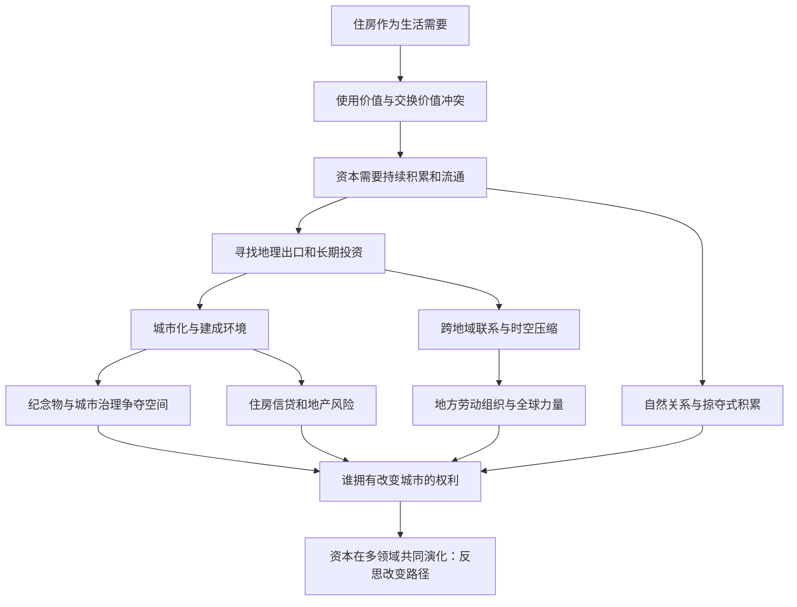

# 《世界的逻辑》深度解读系列

## 系列简介

大卫·哈维的《世界的逻辑》（英文原名《The Ways of the World》）是一部跨越数十年的论文选集，不是一部从第一章连续推演到最后一章的单线著作。它追问：住房为何一面是生活所需、一面又成为投资品？城市、基础设施和地理差异为何总伴随资本积累？经济危机为什么不仅发生在金融市场，也发生在我们居住的空间？哈维从马克思主义地理学出发，试图把日常城市经验与资本的生产、流通、危机和政治抗争联系起来。本系列不按十一章机械复述，而把核心问题重组成十二个循序渐进的单元：先辨认生活与市场价值的冲突，再理解资本如何创造空间，最后讨论治理、生态、掠夺与改变世界的可能。读者不必先掌握《资本论》，也无需同意作者的全部判断，重要的是学会区分解释力与证据边界。

> 资料范围：本系列依据中译本公开目录、英文版出版方介绍，以及各章对应英文论文或章节原文核对重组问题；未取得可直接下载的完整英文原书 PDF（Archive.org 条目受限借阅），因此核对以各篇原始发表文本、重印文本和出版方预览为准。具体情景凡标为“假设案例”或“现代延伸”者，均非书中事实；章节对应与核对边界见各篇第七节及 `_source-check-report.md`。

## 全书核心问题

| 层次 | 核心追问 | 对应线索 |
|---|---|---|
| 入口：生活 | 一套房为何既是住处又是金融资产？ | 使用价值、交换价值、城市贫困 |
| 机制：流通 | 资本为何必须不停流动、寻找投资出口？ | 积累、剩余、空间配置 |
| 空间：城市 | 修路建楼如何吸纳资本，又留下新矛盾？ | 城市化、固定资本、危机 |
| 权力：治理 | 谁决定城市的象征和投资方向？ | 圣心堂、城市企业主义 |
| 尺度：全球 | 速度、生态、工人组织与掠夺有何联系？ | 时空压缩、自然、地方与全球 |
| 判断：出路 | 危机过后，世界能否被有意识地改造？ | 金融危机的城市根源、资本演化 |

## 全书知识地图

## 全系列目录

### 第一部分：从住房走向资本流通

#### 01｜一套房为什么既是家，又是资产？
核心问题：住房的居住需要为何会与房产的投资价格发生冲突？
核心观点：哈维借使用价值和交换价值的张力，解释仅靠市场价格衡量住房可能遮蔽居住权利；两种价值不能简单互相替代。
理解难度：★★☆☆☆
关键词：住房、使用价值、交换价值、城市公正

---

#### 02｜资本为什么不能停下来？
核心问题：企业赚到钱后，为什么还要不断投入生产和寻找新市场？
核心观点：资本积累不是保险箱里钱越存越多，而是价值持续经过生产、出售和再投入；利润实现与再投资都有阻碍。
理解难度：★★★☆☆
关键词：资本循环、利润实现、再投资、积累

---

#### 03｜资本为什么总要寻找新的地方？
核心问题：当一个地方投资机会收窄时，资本为什么会改变地理布局？
核心观点：交通、地区市场与基础设施能暂时打开积累空间；所谓空间修复并非永久消除过剩，而可能转移矛盾。
理解难度：★★★★☆
关键词：空间修复、地理转移、基础设施、不平衡发展

---

### 第二部分：城市如何被建造和讲述

#### 04｜修路盖楼为什么能缓解危机，也可能制造危机？
核心问题：建造城市何以同时是投资出口与风险来源？
核心观点：长期固定在建成环境中的资本可吸收剩余，却受融资、需求和期限错配约束，危机可能在繁荣景象下积聚。
理解难度：★★★★☆
关键词：城市化、建成环境、固定资本、期限

---

#### 05｜一座纪念碑怎样改变城市的历史叙事？
核心问题：为什么理解巴黎圣心堂，不能只看建筑样式？
核心观点：哈维把纪念建筑放回巴黎公社后复杂的政治与宗教冲突，提醒我们空间的意义是在历史权力关系中被塑造的。
理解难度：★★★★☆
关键词：圣心堂、巴黎公社、象征政治、历史叙事

---

#### 06｜世界变快以后，距离真的消失了吗？
核心问题：交通通信加速为何会改变人的时间感与文化经验？
核心观点：哈维以时空压缩说明资本主义的速度竞争改变了组织生产和感受世界的方式，却不等于地理差异消失。
理解难度：★★★★☆
关键词：时空压缩、速度、后现代、地理差异

---

### 第三部分：谁治理城市，谁承担代价

#### 07｜城市为什么越来越像在招商的企业？
核心问题：城市政府为何从提供公共服务转向竞争投资和项目？
核心观点：哈维讨论从管理主义到企业主义的转向：公共权力与私人资本合作争夺增长，但收益与风险分配需要另行检验。
理解难度：★★★★☆
关键词：企业主义、城市治理、招商、公共风险

---

#### 08｜自然为什么不是城市之外的背景板？
核心问题：城市发展与生态变化，为什么不能被当成彼此无关的两件事？
核心观点：哈维的辩证视角强调社会与自然互相改造；承认自然规律，也要追问哪些社会制度决定资源如何使用、污染由谁承受。
理解难度：★★★★☆
关键词：环境辩证法、资源、生态代价、社会关系

---

#### 09｜一次地方行动怎样触及全球问题？
核心问题：本地工人的具体诉求怎样与跨地域的资本力量对话？
核心观点：哈维用“战斗性的特殊主义”讨论从特定地点的抗争走向普遍政治目标的可能及困难；团结不能抹平具体差异。
理解难度：★★★★★
关键词：地方抗争、全球尺度、团结、特殊主义

---

### 第四部分：危机、占有与可能的出路

#### 10｜为什么资本扩张不只靠生产，还靠“拿走”？
核心问题：私有化、圈占和剥夺为什么也是理解资本扩张的线索？
核心观点：哈维以“掠夺式积累”强调既有公共资源和财产权的重组可能为资本开辟新收益，但不同案例的合法性和效果必须分别核实。
理解难度：★★★★★
关键词：掠夺式积累、私有化、公共资源、产权

---

#### 11｜金融危机为什么有城市根源？
核心问题：为什么房贷、土地开发与城市投资会牵动整个金融体系？
核心观点：城市化吸纳剩余资本也依赖信用扩张；房地产价格、债务链条与金融体系耦合时，局部波动可能放大成系统性冲击。
理解难度：★★★★☆
关键词：住房信贷、城市化、债务、系统风险

---

#### 12｜如果资本会演化，我们怎样改变世界？
核心问题：技术、制度、观念与生活方式相互牵连时，改变为何不能只靠一项政策？
核心观点：哈维把资本主义视作多个活动领域相互作用的历史过程；理解它的矛盾，是提出可检验、可协商的改变方案的起点。
理解难度：★★★★★
关键词：资本演化、活动领域、制度变迁、集体行动

---

## 推荐阅读顺序

**主线：01 → 02 → 03 → 04 → 05 → 06 → 07 → 08 → 09 → 10 → 11 → 12。**

- 第一程（01—03）：从住房生活到资本流通，再看到资本寻找新的地理出口。
- 第二程（04—06）：理解城市投资、纪念物政治和速度变化怎样制造不同的空间经验。
- 第三程（07—09）：辨认城市治理、环境关系与劳动组织的政治尺度。
- 第四程（10—12）：追问占有、金融危机和跨领域的社会改变。

想抓骨架：01、02、04、11、12。关心城市治理：05、07、08。练习批判阅读：03、09、10、12，尤其看各篇第九节对概念适用范围的辨析。

## 书目与核对线索

- [中译本《世界的逻辑》书目与十一章目录](https://www.dedao.cn/ebook/detail?id=Jjrvne28LQ2OjoRqkgdnmJX6NADGlWxMkg3x1KvbBz97eaMP4VZrpEYy5VB6adNX)。
- [英文版出版方介绍](https://profilebooks.com/work/the-ways-of-the-world/)及[图书馆英文目录](https://librarycatalog.ecu.edu/catalog/4393416)。
- [哈维回顾巴尔的摩住房研究与使用价值、交换价值的文章](https://davidharvey.org/2021/12/reflections-on-an-academic-life/)。

## 全系列状态

本系列规划十二篇，正文已完成。若要逐篇重写或加深，可指定篇号；回复「开始写」可从首篇重新讲起。
