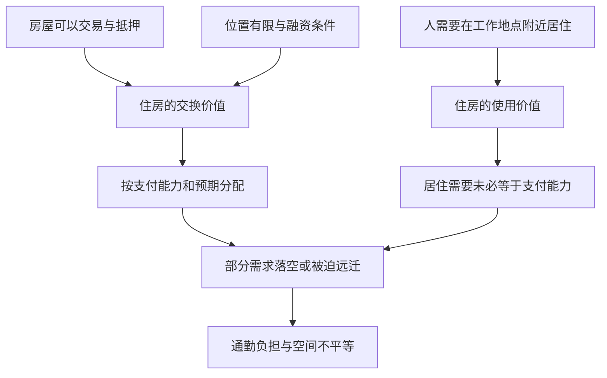

# 01｜一套房为什么既是家，又是资产？

> 一套房同时供人居住、供人买卖；这两个用途为什么会发生冲突？

---

## 一、先说结论

一套房有两种不能互相替代的价值。它能遮风挡雨、让人安定生活，这叫**使用价值**；它能出售、抵押或出租，在市场上有价格，这叫**交换价值**。大卫·哈维借马克思的这组概念，讨论住房为什么可能在交易活跃、价格上涨的同时，仍然无法满足一些人的居住需要。问题不在于交易本身一定错误，而在于我们拿价格当成住房问题的唯一答案时，会看不见谁能安稳地住下来。

## 二、我们先理解一个问题

设想一条街上新建了一批公寓。开发商顺利售罄，统计上住房供应增加，投资者也觉得这是成功项目。但附近工作的清洁工和餐馆员工付不起房租，只好在很远的地方居住，每天长时间通勤。这个故事只是教学用的假设案例，不对应书中的某一座城市。

那么，项目究竟解决了谁的住房问题？如果只看销售额，我们会说供给形成了；如果看实际居住的人，则答案可能不同。更难的一层是：房屋不是随时可以搬走的普通商品，它被固定在地点上，而工作机会、学校和社会关系也都在附近。人们争的并非四面墙，而是城市生活的一部分。

## 三、作者到底提出了什么观点？

哈维早期研究巴尔的摩住房与贫困问题时，尝试把地理空间、社会公正和马克思主义政治经济学连在一起。在他后来对自身研究历程的回顾中，他明确说，住房市场中使用价值与交换价值的紧张关系，是理解住房供给困境的一把钥匙。这不是说每个房东都故意制造不公，而是说市场依价格与支付能力配置住房，居住需要却未必与支付能力同向变化。

**需要最迫切的人，不一定出得起最高价。**反过来，出价最高的人，未必最需要在那里住。这是一个分配机制的判断，而不是关于某个具体买家的道德判决。本书第一章讨论城市危机的起源，英文原篇还涉及贫民区形成以及地理学理论怎样面对不公；住房只是进入这套问题意识最直观的入口。

## 四、把这个观点翻译成人话

想象一把伞。下雨时它首先是让人不被淋湿的东西；在店里，它又是一个可标价、能出售的商品。通常两件事不冲突：生产更多伞，便能让更多人买到。但房子不同：土地位置不能复制；靠近工作的住房即使多盖一些，也可能因为新交通、投资预期或信贷便利而继续涨价。房子的价格上升，不等于一个急需住房的人更容易住进去。

这里还要避免另一个极端：不能说住房有使用价值就可以不考虑建造成本。如果没人承担土地、材料、劳动和维护费用，房屋也不会凭空出现。哈维的概念提醒我们问的是：**当建造与分配主要依靠交换价值时，哪些居住需要会被漏掉？**这个问题比“房价涨就是坏”或“房子卖出去就是好”都更具体。

## 五、为什么会这样？

关键在于住房市场里有三条并不完全一致的线：居住需求、有效购买力和对未来价格的判断。

箭头不是不可逆的自然定律。某地建造充足的可负担住房、改善交通或提供租赁保障，结果就可能不同。但如果优先追求单位土地的最高收益，开发更可能面向支付能力强的需求。这种选择可以在账面上非常合理，放到整座城市的生活图景里却未必合理。空间上的差别于是既是市场选择的结果，也会进一步影响谁能获得好工作与公共服务。

## 六、举一个现实生活中的例子

再看一个更具体的**假设场景**：一位在医院上夜班的护工，每晚十一点下班。医院旁边的新楼盘大部分作为高价公寓出租，她负担不起，只能租在两次换乘以外的老小区。房子的买方获得了稳定租金，楼盘实现了销售；护工却必须在深夜等待公共交通，第二天还要照顾孩子。

如果有人只问“这个楼盘有没有卖出去”，答案是有；只问“护工有没有住处”，答案也是有。但换成“她能否以可承受的成本安全地靠近工作地点居住”，答案就不一定。使用价值包含地点、可达性和生活时间，不只是房间面积。这里的护工并不代表所有劳动者，场景也不能证明所有高房价都由同一原因造成；它只是帮助我们看见两种价值如何被不同人感受到。

## 七、回到书中重新理解

《世界的逻辑》中文目录把第一章列为“城市危机的起源”。如果只把城市危机理解成某一次暴乱、一次房价跳涨，就很难抓住哈维的问题。他关注的是：特定制度下，土地与住房作为可以交易的资产，怎样与追求安全居所的人发生持续摩擦。英文版第一篇原题还点出贫民区形成问题，因此不能把整章缩成一句“住房有两种价值”。

哈维并不是孤立地讨论一个商品。第一章英文原文明确把住房市场中的使用价值、交换价值、稀缺维持与贫民区形成放在同一组问题里；他后来持续追问资金流入建成环境、国家怎样管理城市、危机如何在房地产和金融之间传递。对这些后续论题来说，住房是极好的起点：它把抽象的资本循环放到普通人每天都要回去的地方。这里是依原文和哈维公开回顾作出的概念性解读，不是逐句复述。

## 八、这个观点背后还有什么？

住房的矛盾还包含一层常被忽视的时间差。一位租客关心的是下个月能否续租，一位业主可能关心十年后的房产价格，贷款机构关心按时偿债，地方政府关心开发带来的税收与就业。所有人看着同一栋楼，时间跨度和风险承受能力却不同。投资收益可以在今天被计算；失去邻里联系、增加的通勤时间则不一定进入交易价格。

这也解释为什么“增加供给”重要却不是完整回答：需要问增加了什么类型、处于什么地点、谁负担成本、租期是否稳定。同样，保护居住权利也不等于冻结一切建设。在供给、价格、信贷和公共服务之间找制度安排，远比把问题归罪于某一个群体困难。这一段是依概念所作的分析延伸，不是把具体政策主张冒充哈维在本章的原话。

## 九、这个观点有问题吗？

有说服力的地方在于，它能解释一个常见悖论：房屋交易兴旺与居住困难可能同时存在。它迫使我们把“谁得到什么”放进评价，而不只看总额。然而，**两种价值的张力本身不能证明某座城市的房租上涨究竟由什么驱动**。人口流入、供地约束、建造成本、利率、收入差距与住房政策都可能重要。若把一切都归结为资本逐利，就会过度简化。

另一种解释会强调供给弹性：在允许充分建设的地区，价格压力可能较易缓和；还有人会强调公共住房和租赁制度的差别。关于哪种解释在特定城市占主导，需要实证数据，不应仅从理论概念直接推出答案。哈维提供的是判断问题的视角，不能替代城市之间的比较调查。

## 十、今天再看这个观点

**以下部分是把哈维的概念用于当下的现代延伸，不是作者原话。**一些城市出现短租平台、机构持有租赁住房和住房金融产品。此时一间房可能同时被计算为“过夜体验”“租金现金流”和“家庭居所”。不同用途争夺同一空间，会让政策辩论更复杂。不能仅凭平台存在就断言它必然推高房租，而应观察本地租赁供给、游客需求和监管安排。

对普通读者，这个概念有一个可操作的用法：每当听到某项住房政策“让市场更活跃”，先多问一句：谁能因此更稳定、更便利地居住？反过来，当有人说“只要限制交易就能解决住房问题”，也要问：建造、维护和分配由谁承担？两边都问，才不会让一个指标吞没真实生活。

## 十一、这一篇真正应该记住什么？

1. 住房的使用价值指它怎样满足居住生活；交换价值指它在市场中可以怎样买卖、抵押和获利。两者相关，但并不自动一致。
2. 房屋位置固定、需求与支付能力分离时，交易成功并不能单独证明所有人的居住需要得到满足；要具体看谁被排除、付出什么代价。
3. 哈维的框架提供追问城市公正的起点；解释一座城市的房价和租金，还须结合供地、人口、收入、信贷与政策的实际证据。

## 十二、留一个问题

如果住房不能只按“卖得出去”判断是否成功，我们还需要追问：建房、贷款、出租、再投资的资金为何总要不断往前走？一套房背后的资本循环，是从哪里开始转动的？
