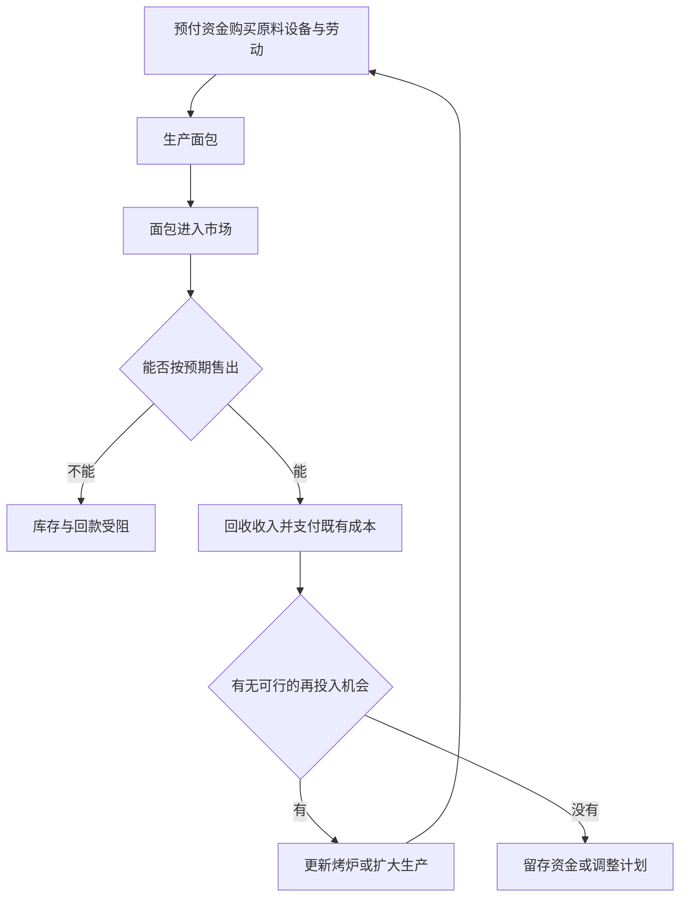

# 02｜资本为什么不能停下来？

> 企业赚到钱后，为什么还要不断投入生产和寻找新市场？

---

## 一、先说结论

在哈维讨论的资本积累逻辑里，资本不是一箱静止的钞票，而是**投入生产、卖出产品、取得收入，再寻找投入机会**的运动。企业账上有盈利，不等于已经找到下一轮能够盈利的生产；生产出了东西，也不等于一定卖得掉。所谓“不能停”，不是老板每天都必须开新店的命令，而是说一套以持续获得利润为目标的体系，需要反复跨过出售与再投入两道门槛。一旦钱、商品或生产能力卡在其中一处，增长就会受到阻碍。

## 二、我们先理解一个问题

设想一家社区烘焙坊，清晨面包出炉，傍晚基本售罄。柜台里收回的钱先得支付面粉、房租、工资和电费；余下的部分才可能用于新烤炉或新门店。老板若想扩大营业，必须相信下一批面包也有人买，并且新增收入足以覆盖投入。销售顺利的今天，并不会自动给出明天的订单。

这恰好提出一个反直觉问题：既然已经赚到钱，为什么不把钱锁进柜子，从此安稳经营？对一家满足于现状的店来说，暂时不扩张完全可能；但如果设备折旧、竞争者改进、原料涨价或者资金提供者要求回报，原有经营规模也未必能保持原有利润。我们需要理解的不是每一家店的心理，而是利润如何在整个经济体系里变成继续生产的压力。

## 三、作者到底提出了什么观点？

哈维借马克思的资本积累与流通分析，强调价值必须经过多个环节，不能把资本主义理解为“先有钱，后来钱更多”的简单算术。预付资金购入劳动和生产资料，生产出商品，商品须实现销售，回款再按不同用途分配；只有其中某些资金重新进入生产和流通，扩大积累才可能继续。**卖出与再投入是两个不同的问题**：卖不出，预期利润无法实现；卖得出，也可能找不到足够有利的下一笔投资。

这是对资本运动的理论解释，不是断言所有企业都会增长，也不是声称只要产品有用便一定有人付款。购买力、定价和销售渠道影响商品能否转成货币；成本、预期收益、借贷条件则影响货币会不会再成为生产性投入。把每一步拆开看，才知道为什么盈利记录与下一轮增长之间会出现断口。

## 四、把这个观点翻译成人话

想象烘焙坊的一张收支表：买原料和支付劳动，是把钱变成生产条件；面包做好只是取得待售的商品；顾客付款，才把商品变成收入。收入里有一部分必须补上已经用掉的原料、设备损耗和日常开支，不能把全部流水当作利润。扣除这些费用之后的结余，也不必全用于扩店，老板可能还债、留作应急或者分配给出资人。只有真正用于追加烤炉、增加生产或开辟销售渠道的那部分，才与扩大再生产直接相关。

这样就能理解“不能停”的准确含义：它讲的是资本作为增值过程的条件，而不是说任何库存货币都会立刻失效。存款可以是某家店的安全垫；但从整体看，若很多企业都愿意存钱，却没有相应的消费和可行投资项目，原来期待通过出售取得的收益就可能落空。钱留在账上可以等待，却不能凭等待自动变成已实现的新增价值。

## 五、为什么会这样？

资本循环至少有两处容易被省略的转弯：产品要找到付得起钱的买家，回款还要找到能够承担成本与风险的用途。把这两处接起来，才看得见积累为何既依赖生产，也依赖市场和预期。

图里“能否售出”不是一句空话。若老板提高产量，却发现邻近顾客数量没有变化，第二批面包可能不得不打折；若价格不足以覆盖新增成本，就算全部卖完，扩张也未必成功。同理，即便每天售罄，新烤炉若使单位产量增加，却没有稳定的额外订单，新增设备会闲置。竞争压力可以促使加快周转、改善品质，但也会让经营者更难在不确定需求下做决定。利润实现与再投资受阻，不一定同一天出现，却都能让循环放慢。

## 六、举一个现实生活中的例子

继续使用这家社区烘焙坊作为**教学假设**，不把它当作书中实际个案。假设一家店每天卖出两百个面包，回款足以补足原料、工资、租金并留下结余。老板计划订购一台新烤炉，同时考虑在街道另一端扩店。订炉要先支付定金，扩店要预付装修和新店租金；两笔钱今天支出，可能要经过很多个月的销售才能收回。

假如邻近居民愿意购买更多，烤炉提高效率，新店也有稳定客源，赚来的钱经再投入推动了扩大经营。但若新店只是把老店顾客分走，合计销量不变，账面上“多了一家店”并不等于资本成功增值。老板还可能选择暂缓扩张，让结余积累起来，观察需求。这一选择对于一家企业完全合理；哈维的框架帮助我们看到，当类似的投资迟疑在许多企业同时发生时，社会上并不会因为存在一笔闲钱就自然产生足够的盈利机会。

## 七、回到书中重新理解

中译本公开目录把第二章列为“资本积累与流通 马克思理论的重建”，第三章列为“资本积累与城市化进程”。从这样的章节线索回看，哈维并非只研究商店结账的瞬间：他关心的是价值怎样在生产、出售与再投入之间运动，哪里会受阻，以及资本为何转向不同用途。本篇把其中“资本循环不能被静态存钱取代”作为单独的入口，不把整章缩写成烘焙坊经营指南。

英文第二章原文明确把积累放在生产、分配、消费与再投资等相互关联的环节中，并讨论实现危机与过度积累。以上依据的是[中译本公开目录](https://www.dedao.cn/ebook/detail?id=Jjrvne28LQ2OjoRqkgdnmJX6NADGlWxMkg3x1KvbBz97eaMP4VZrpEYy5VB6adNX)与已核对的英文原文；烘焙坊仅用于把抽象机制讲清楚，不是书中个案。

## 八、这个观点背后还有什么？

一个隐含条件是时间：材料和工资可能先付，面包随后生产，顾客最后付款。回款若来得太晚，即使最终有利润，店也可能先缺现金；扩店若先签长租约，则未来销售必须持续一段时间才能补回成本。这里要分清现金紧张和长期无利可图：前者有时可通过借贷缓冲，后者不会因为借到钱而消失。信用可以把尚未收到的未来收入提前变成今天的购买力，同时把未来能否卖出的不确定性带到现在。

另一层条件是需求并非老板单方面决定。居民收入、替代产品、作息和偏好变化都会改变购买量。哈维式的问题意识提醒我们：从“技术上可以做更多面包”跳到“必然能实现更多利润”，中间少了买家和支付能力；从“有结余可用”跳到“值得购置更多设备”，中间少了可比较的预期回报。这里的时间与需求分析是由循环概念推出的解释，不等于书中列有这家店的账目。

## 九、这个观点有问题吗？

它有说服力，因为它区分了常被混作一团的产出、销售、利润和再投入，能解释为什么货架上的商品丰富、企业账户里有钱时，投资仍可能停滞。争议在于，怎样判断停滞主要来自利润率下降、需求不足还是暂时的信心变化？仅凭“资本需要循环”这一概念，无法给出一座城市或一个行业的答案。

如果把每次企业关门或每次库存增加都解释为资本体系的同一危机，就过度简化了。管理失误、原料价格波动、竞争对手更受欢迎，乃至季节性销售变化，都可能是另一种解释。还有人会强调技术创新和有效需求会创造新的投资机会，而非只看阻碍。这些解释并非取消哈维的机制，而是提醒我们核对具体销售、成本、信贷与时间数据，不能用概念代替调查。

## 十、今天再看这个观点

**以下部分是将哈维的资本循环概念用于当代经营判断的现代延伸，不是作者原话。**今天一家小店可能用预订系统先观察销量，再决定烘焙多少、是否购买设备。预订缩短了从生产到售出的不确定时间，却没有保证顾客会持续复购，更不能单凭访问量推算净利润。另一些经营者使用按期付款购买机器，看似更容易迈出扩张一步，实际上必须用未来收入覆盖每期支出。

遇到“这家店很火，应该马上扩张”的说法，不妨依次问：是真实回款还是仅有询单？扣掉替换原料和维持经营的费用还剩多少？新增烤炉能带来新增销量，还是只使已有订单更快完成？扩张需要多久才能收回投入？这四个问题把热闹的营业场景重新还原为资本循环，既不否认努力经营的价值，也不把一时的卖得好当作无条件的增长承诺。

## 十一、这一篇真正应该记住什么？

1. 资本积累说的是价值经由生产、出售和再投入持续运动，不是保险箱里现金不断增加；营业收入也不能直接等同于可用于扩张的利润。
2. 生产完成不等于利润实现：商品需要卖给有支付能力的买家；销售成功也不等于下一轮投入必然合算，设备、需求和融资仍有约束。
3. 某家企业可以选择暂停或缩小规模。“不能停”解释的是逐利竞争体系的持续运动压力，不应被当成对每个经营者行为的绝对预测。

## 十二、留一个问题

如果烘焙坊已经卖出面包，订购新烤炉却仍担心附近顾客不够，接下来它可能把目光投向更远的市场。可是，换一个销售地点真的就能让投资机会重新出现吗？**资本为什么总要寻找新的地方？**
