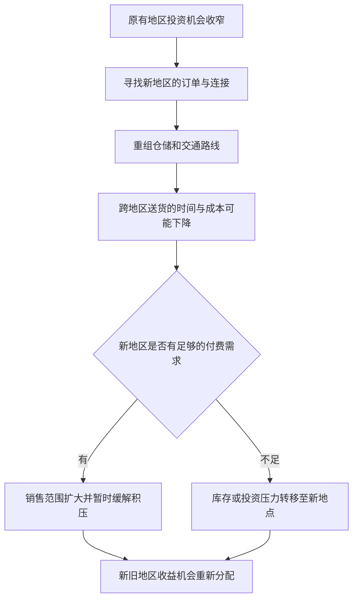

# 03｜资本为什么总要寻找新的地方？

> 当一个地方投资机会收窄时，资本为什么会改变地理布局？

---

## 一、先说结论

哈维讨论的**空间修复**，不是把经济问题一次修好，而是资本在原有地点增长受限时，通过转向其他地区的生产、销售和交通联系，争取新的积累机会。新的地方可能有买家、原料或更便利的运输，也可能需要先修设施才能发挥作用。地理转移能让一些投资暂时获得出口，但不会自动抹平过剩：投入若超过实际需求，压力可能转到新地点，也可能留下地区之间发展不均的后果。

## 二、我们先理解一个问题

想象一家家具厂，原来的厂房照常生产，周边订单却不再增长。厂主盘点发现：已有机器仍能做出更多家具，但本地商店卖不下；另一片地区可能有需求，只是送货耗时，破损和库存成本也高。问题于是变成：是再添一台机器，还是先重组仓储与运输，把已经生产出来的东西送到能够购买的人那里？

这不是简单的“搬走就便宜”。改变地理布局会涉及距离、交通节点、土地租金、熟悉路线的工人和既有供应关系。某个地方市场变窄，资本寻找新的地方，可能是扩大销售范围，也可能是改变生产和流通的组合；并不意味着旧厂房必然关闭。究竟在哪一处设厂、在哪里存货和怎样送货，都会改变原本被当成“自然条件”的投资机会。

## 三、作者到底提出了什么观点？

哈维的地理学视角把资本积累放进真实空间，而非画在没有距离的纸上。生产可能集中在一个地点，买家在另一个地点，二者之间需要通行条件、仓储设施和时间。一个地区难以继续吸收投资时，向外寻找市场和重新组织交通等条件，可能暂时疏解资本缺乏出口的压力。空间修复在这里应理解为一种**暂时性的地理安排**，而不是已经证明危机消失。

这一判断还包含“不平衡发展”：新交通会让某些地点更方便接入交易，也可能使另一些地点相对边缘化。注意这是哈维用来解释资本与地理关系的理论视角，不是关于某一处物流园区已经导致了某种结果的事实报道。我们要检验的具体问题是：新的布局是否真的产生了更多可持续的销售和收益，而不是仅仅把没有卖出的商品挪了一个仓库。

## 四、把这个观点翻译成人话

如果原来一辆车把家具送到本地店铺需要一小时，新的订单要求跨过几个城区，司机来回、装卸和损耗的成本可能吃掉利润。把暂存点放在邻近物流园、接上交通干线，可能降低每笔远途订单的时间与费用。这样一来，原本“太远而不划算”的市场变得可以服务，已经做好的家具也更可能及时出售。这就是地理条件改变收益计算，而不是土地自己生出了需求。

但便宜的运输并不等于人人都想买新家具；邻近物流园如果同时吸引多家厂商，竞争也会变强。更重要的是，旧地点原有的供货关系和就业仍然存在，新的布局会重排人与货物的活动范围。因此“向外找地方”不只是一张地图上的箭头，还需要有人承担建仓、接驳、维护、协调的成本。把这一步讲清，才能区分真正扩大的交易与仅仅改变库存位置。

## 五、为什么会这样？

一条地理转移链条大致如下。它从原地点增长受限出发，经由设施和运输条件变化，最后回到“是否有足够有效需求”的检验；图中的分岔表示结果不是必然的。

为什么图里必须写“可能”？因为仓库租金、交通拥堵、退货率和销售价格也会变化。新路程缩短并不一定意味着总成本下降，物流设施建成也不保证业务量足以分摊费用。对于厂方，地点可以成为暂时的解决方案；对于地区，投资流入既可能改善连接，也可能使旧区域的企业、工人或商铺面对新的落差。所谓不平衡，不是简单地说一个地方富另一个地方穷，而是不同地方获得通行条件、订单与风险的机会并不相同。

## 六、举一个现实生活中的例子

以下是**明确假设的教学情境**，并非对某家真实家具厂或哈维书中事件的叙述。一家家具厂保留老厂房，把成品暂存和分拣延伸到邻近的物流园，并从园区接入交通干线。原先只接本城订单，现在尝试承接周边地区的订单。假定订单真实存在，干线运输稳定，家具周转速度加快，则销售半径扩大，原来闲置的生产能力有可能被使用起来。

再改变一个条件：周边地区购买量低于预计。厂房依旧可以生产，物流园的仓库却要按月付租金，运输车辆也不能在没有货的时候产生收入。厂方可能发现，地理范围扩了，库存只是由厂房移到园区。这个例子并非反对跨地区经营，而是说明判断空间修复是否成功，必须比较新增实际销量、物流及仓储成本、投资回收期，也要问旧地点与新地点各承担了什么风险。

## 七、回到书中重新理解

中译本公开目录的第二章题为“资本积累与流通 马克思理论的重建”，第三章题为“资本积累与城市化进程”。由资本流通转向空间组织，是理解哈维为何关心交通、地区市场与城市建设的一条线索。不过，本篇仅讨论“改变地理布局怎样暂时打开积累空间”，不把城市建设的长期融资问题抢到这里解释，也不把书中不同文章当作同一个章节连续推出的定理。

[中译本目录](https://www.dedao.cn/ebook/detail?id=Jjrvne28LQ2OjoRqkgdnmJX6NADGlWxMkg3x1KvbBz97eaMP4VZrpEYy5VB6adNX)提供章节名称；英文版导论把“spatial fix”同第二章的资本积累地理学联系起来。第二章原文讨论地理扩张、外贸、资本输出和世界市场如何为积累开辟空间，也讨论交通通信如何压缩时空。这里的章节对应已由公开原文核对；家具厂情境只承担解释功能，而非历史证据。

## 八、这个观点背后还有什么？

地理扩展有一个容易被忽略的前提：新地方必须能与旧地方发生稳定联系。厂方要知道订单何时来、家具何时到、货损谁负责；道路能用，还要有装卸与仓储能力。换言之，空间不是空白容器，而是由设施、劳动安排、合同和买卖网络共同构成的实际条件。若只画出厂房到物流园的一条直线，就会漏掉把投资机会变成真实交易的许多环节。

还有一种反向作用：为方便流动而投入的仓储场地、装卸设备和线路协调，往往要在具体地点持续使用。资本为了越过距离，需要先在某些地点固定投入。它们成功时，会强化新地点的吸引力；若市场变化，这些投入不一定能轻易撤回。此处是对空间修复的条件性推论，并非断言所有地区发展都会遵循同一顺序。它提示我们从“货能去哪里”继续追问“使货流动的设施由谁建设、要用多久”。

## 九、这个观点有问题吗？

哈维的框架很有解释力：它让我们看到地理差异不是经济活动的背景画，而可能直接改变商品能否出售及投资是否合算。“扩到新地区”同时可能带来新机会和转移旧压力，这比“外迁必好”或“外迁必坏”更有辨别力。

但争议在于，企业改变地点究竟主要为化解原有过剩，还是为了靠近新客户、改善服务速度？若只凭出现新园区就推断一定存在积累危机，是过度简化。另一种解释可能强调交通技术进步、规划制度或客户分布变化，即使没有明显的本地过剩，也足以促成布局调整。需要比较迁移前后的订单、成本、就业与地区收益，才能判断哈维的解释在某个个案里有多重要；新路也可能改善被忽视地区的可达性，不能先验断言它只制造失衡。

## 十、今天再看这个观点

**以下部分是把哈维的空间修复视角用于当代经营决策的现代延伸，不是作者原话。**家具厂如今可以根据线上订单的地区分布安排分拣和配送，先观察哪些地方有实际付费订单，再判断是否需要在物流园增加仓位。数据能帮助判断需求，却不能把未付款的意向自动变成确定交易，也不免除仓储租金、配送损耗和人员安排。

普通读者也可以用一个问题检验“建设物流节点就会带来繁荣”的承诺：设施建成之后，原先运不出去的商品是否真的找到了新买家？如果答案只是货物移动得更快，而生产商和客户的交易没有增加，地理变化可能只改变了风险存放的地方。反过来，如果新增订单与成本改善都能核实，地理重新布局就确实为资本循环争取了时间和空间，只是这种机会能持续多久还要再看。

## 十一、这一篇真正应该记住什么？

1. 空间修复指资本利用新的地区市场、交通与设施寻找暂时的积累出口；“修复”不是危机已被永久解决的保证。
2. 地理转移是否奏效，要看真实订单、运输与仓储成本能否让商品更顺利出售；把库存搬得更远不等于实现利润。
3. 新地点得益与旧地点承压可能并存，但具体的不平衡发展需要数据检验，不能把每一次布局调整都说成同一个原因。

## 十二、留一个问题

家具厂要利用交通干线，离不开有人提前建设并长期维护道路、场地和连接设施。货物流动或许因此变快，但这些固定在土地上的投入要等多久才能回本？**修路盖楼为什么能缓解危机，也可能制造危机？**
