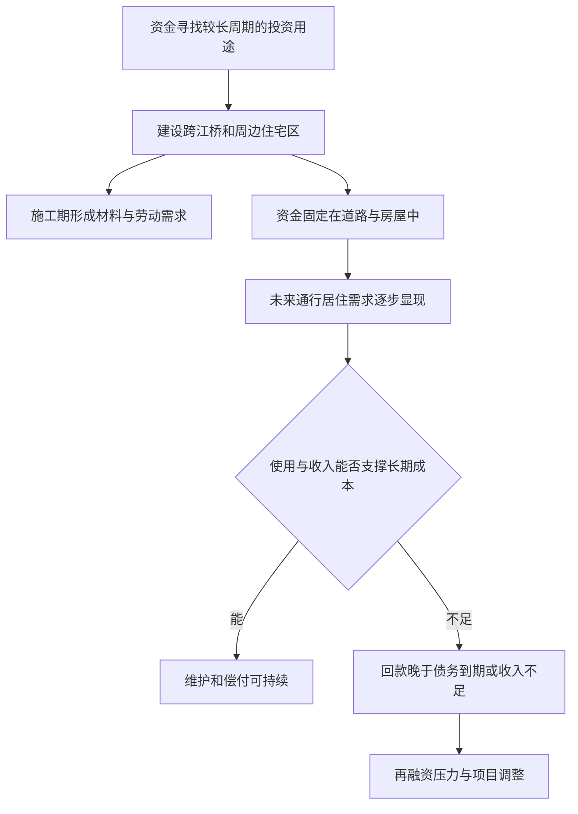

# 04｜修路盖楼为什么能缓解危机，也可能制造危机？

> 建造城市何以同时是投资出口与风险来源？

---

## 一、先说结论

修路盖楼能把暂时缺乏用途的资金和闲置生产能力，投入需要多年建设、使用的城市空间；哈维以**建成环境**理解这种资本长期固定在具体地点的过程。但工程开工带来订单，不等于未来使用者和收入一定足够。建设费用可能要先借，收益却多年之后才到；道路、住宅又难以随需求变化转移。融资期限、实际需求与回收期限若对不上，今天吸收资金的繁荣景象，也可能成为明天的偿付压力。

## 二、我们先理解一个问题

一座城市计划修一座跨江桥，另一侧同时规划住宅区。施工时，材料、设备和工人都得到订单，原来没有找到合适去处的资金也有了投资项目。居民盼望少绕路，开发方盼望住宅有人买或租，出资方希望未来收入能覆盖先付的工程款。眼前的工地非常忙，却不能单凭忙碌判断项目多年以后能否平稳运转。

桥可以降低通行成本，房子可以提供居住空间；这两件事都是实在的用途。问题是，用途存在不等于规模恰当：若未来交通流量不足，桥的维护费仍然要出；若住宅区入住晚于预期，房屋空置期间融资费用也不会暂停。我们要问的不是“建好还是不建好”，而是为什么建造同时具有吸纳资金的能力和制造长期风险的可能。

## 三、作者到底提出了什么观点？

哈维研究资本积累与城市化时，强调资金可以转入道路、建筑等建成环境，让资本以比较持久的形式留在地理空间中。施工期间，这类投资能够带动购买材料、雇用劳动和相关生产；设施完成后，又可能改变以后生产、出行与居住的条件。因此，城市化并不只是经济增长之后留下的建筑外壳，它也可能是资本寻求投资出口的一条路径。

然而“固定”有两层含义：投资变成不能轻易搬动的实物，回报也往往被未来多年使用情况所约束。**吸收当下可投入资金，与实现未来足额回报，发生在不同时间。**这是对哈维城市化分析的概念性归纳，不是说所有公共工程都只为赚钱，也不是声称任何负债建设必然导致危机；公共利益与财务回收需要分别讨论。

## 四、把这个观点翻译成人话

把跨江桥看作一笔必须先付很大成本、之后每天才慢慢产生效益的投资。建设者不能在开工当天就收到未来几十年的全部好处，却要当下采购材料和组织施工；若借钱先建，就需要按约定日期支付利息或本金。桥修好之后即使没达到预期车流，也不能像一批普通货物那样退回供应商。住宅也是如此：楼盖在桥旁边，卖得慢了，不可能把整片楼搬到需求更旺的地方。

这就是“期限”在城市化中的分量。融资的一方关心下一次付款到期日，使用者和居民可能几年后才形成稳定需求，设施本身则要用很久。长期有用和短期能还钱并非同一道题。反过来，也不能因为有还款压力就认定工程没有价值；有些道路的通行便利不会以单一收费项目直接体现。分析要把社会效益、项目现金流和债务偿付拆开，而不是拿其中一个代替另外两个。

## 五、为什么会这样？

下图展示的不是每项工程都会走向危机，而是从投资出口到结果检验的两条路径。决定分岔的关键是：长期投入之后，实际使用、收入或可持续的公共资金能否与到期付款相协调。

如果建筑企业、材料供应商和工人在建设阶段取得收入，这确实能暂时吸收订单不足的压力。但不能把施工收入与项目整体收益混为一谈：花出去的资金已成为别人的收入，原项目却还要面对维护、还款与使用者数量。若回款较晚而付款较早，可以出现“长期看或许有用、短期却付不起”的期限错配；若未来使用量本身过低，则延长还款期限也未必解决投入和需求不匹配的问题。这两种风险需要区别诊断。

## 六、举一个现实生活中的例子

以下是**新建跨江桥与周边住宅区的长期融资假设**，不是书中真实项目。假定某地预计新桥通车后两岸往来增加，桥旁规划住宅区。桥和住宅区分阶段建设：材料款与工资在施工期支付，部分资金靠长期融资支持；桥建成后要持续维护，住宅区则期望若干年内逐步形成稳定入住和销售收入。

第一种可能是交通需求与入住增长大体符合估计，分期建设留出调整余地，实际收入和已确定的公共资金足以覆盖长期成本。开工时的订单与之后的使用条件相互支持。第二种可能是通车带来便利，但周边就业和居住需求增长缓慢，住宅的回款迟于融资约定的偿付节点。施工已完成、房屋也确实存在，可是项目需要重新安排资金、延期建设或承担损失。桥带来的社会便利不能直接当作住宅销售现金，也不能仅凭部分楼空置就否定所有通行收益；必须分别核算。

## 七、回到书中重新理解

中译本公开目录的第三章名为“资本积累与城市化进程”，第十章则是“金融危机的城市根源”。本篇主要借前者的问题意识解释资金为何会进入道路和建筑，后者提示我们不要忽略城市项目中的融资风险；但这里只追问**长周期建造为何兼具出口与风险**，不把后来更复杂的金融链条提前当成本篇结论。哈维的地理视角之所以重要，是因为一笔投资一旦凝固为具体地点的设施，其结果就要受当地未来使用方式约束。

已对照第三章英文原文《The Urban Process under Capitalism》：文中把流入固定资产和消费基金形成的资本称为第二循环，并说明建成环境投资规模大、期限长、在空间上不可移动，还需要信用和国家及金融机构协调。以上是依据原文所作的概念解读，不把虚构的跨江桥说成哈维讨论过的工程。具体城建项目能否回本，必须依其实际合同、需求和财政数据判断。

## 八、这个观点背后还有什么？

时间错配背后其实有三类不能互相替代的估计。第一是建设期预算：桥和住宅区要花多少、是否超支；第二是运营期的实物需求：有多少人通行、多少人入住；第三是资金安排：哪一年需要支付多少、靠何种收入或公共预算覆盖。即便第三项在纸上安排妥当，如果第一项超支或第二项落空，原计划仍会改变。反之，财务紧张也可能来自付款排期不合理，而非设施根本无用。

另一个容易忽视的前提是不可逆性。半成品和建好的桥都占据具体土地，路网、住宅和周边设施彼此配套，不能因为下一年预测变差就按原价拆走出售。阶段性建设、审慎预测和明确维护责任，可以减少把未来押在一次判断上的风险，却不能消除不确定性。这些风险拆分属于根据哈维框架作出的推论，不应冒充作者为某座城市开出的具体规划处方。

## 九、这个观点有问题吗？

支持这一视角的理由很直观：城市建设把眼前的施工订单与未来多年回款联系起来，能解释为什么繁忙工地与长期偿付压力可能同时存在。它也提醒我们，危机风险未必在楼盖好时才突然出现，错误的需求与融资估计可能在开工时就已埋下。

争议在于：如何衡量不以销售收入体现的公共收益？如果只用直接现金流批评一座桥，就可能低估通行便利；如果把一切便利都算作肯定能支付债务的回报，也同样不严谨。把所有超支或空置都归因于资本过剩，是过度简化。另一种解释可能强调人口预测错误、项目管理失当、地理条件变化或建设标准调整；还有的项目即使财务回收慢，公共用途仍然值得以可负担的方式支持。理论给出该查的矛盾，最终判断要靠项目数据与公开的成本收益比较。

## 十、今天再看这个观点

**以下部分是把哈维的建成环境视角用于当代项目评估的现代延伸，不是作者原话。**面对一项新的跨江通道和邻近住宅规划，可以要求分别公布施工与维护预算、不同入住率下的现金流预测、债务到期年份，以及交通使用量未达预期时的调整预案。只展示落成效果图、预计投资总额和当年施工岗位，无法回答未来谁来维护、何时付款的问题。

这种评估也需要防止两个偏见：不能把每一个长期项目都当成危险债务，因为跨越多年才见效并不等于没有价值；也不能把每一座新楼都当成已完成的增长，因为盖好不等于有人使用。更审慎的做法，是把不同情景下的需求和偿付列在一起，承认收益会分布在不同人、不同年份。这样，城市建设才不是只由开工速度定义的成功。

## 十一、这一篇真正应该记住什么？

1. 城市化能把资金转入道路和建筑，在施工期形成需求，并留下可长期使用的建成环境；开工吸纳投资不等于未来一定收回成本。
2. 资本固定在地点上后，实际使用量、建设维护成本和融资偿付时间必须相互匹配；回款太晚与需求不足是两类不同风险。
3. 公共用途不能只按售价衡量，财务压力也不能只靠用途正当来化解；分析应同时看社会收益、现金流和风险承担者。

## 十二、留一个问题

一座桥和一片住宅区建成之后，仍会被不断解释：它们象征发展、方便出行，还是提醒人们某些被忽略的代价？若空间不仅承载资金和生活，还能承载对过去的解释，那么**一座纪念碑怎样改变城市的历史叙事？**
