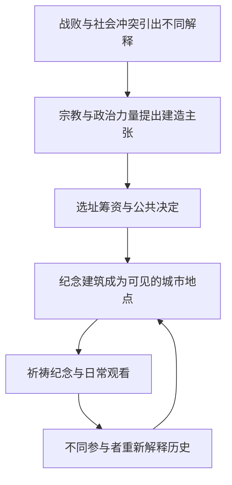

# 05｜一座纪念碑怎样改变城市的历史叙事？

> 为什么理解巴黎圣心堂，不能只看建筑样式？

---

## 一、先说结论

一座纪念建筑不只是立在地上的石头，也是一种让特定解释持续被看见的方式。哈维借巴黎圣心堂讨论：同一地点何以被赋予宗教、国家与革命记忆等不同意义；建筑的选址、筹建和后来的使用，把这些意义带进城市日常。理解它，不能把巴黎公社后复杂的政治与宗教冲突缩成一句起因，也不能只数穹顶和石阶。这里要解释的，是**空间如何参与历史叙事的形成与争夺**。

## 二、我们先理解一个问题

设想在圣心堂附近有一场纪念活动。组织者谈的是祈祷和国家的苦难；另一批到场者希望追忆巴黎公社的参与者；还有人在旁边经过，只把眼前的建筑当成巴黎的地标。这是为了理解不同立场而设的**假设场景**，不是说这些人曾在同一天参与某场可考的活动。三种人站在同一处，谈的却未必是同一段历史。

问题不是谁有资格抬头看这座建筑，而是：某种回忆为什么可以借建筑的高度、位置和仪式获得长期的公共可见性，另一种回忆又为什么需要不断重新提出？如果把空间当成中性的容器，就解释不了同一地标为什么既能聚集信仰，也能引起对公社历史的争论。

## 三、作者到底提出了什么观点？

哈维把城市空间看成历史关系的一部分。就圣心堂而言，他关心的不是替建筑评审风格优劣，而是把它的建造放回战败后的法国、宗教动员、巴黎公社及此后的政治斗争之中，追问不同力量怎样借一处可见的地点安排对过去的讲述。一个纪念物可以把某种叙事固定下来，却无法使别的记忆自动消失。

这不是说石材自己会修改史书。建造提案、公共决策、选址、筹资、宗教使用、后来人怎样解释它，都是人在行动。建筑使行动留下持久的物质痕迹：即便活动结束，它仍在那里，令后来者必须面对它。**象征政治**不是建筑外加的一层宣传，而是哪些故事能够占据公共视野、哪些解释受到挑战的过程。这是对哈维问题意识的概念概括，并非书中原句。

## 四、把这个观点翻译成人话

试着把纪念建筑想成城市里一张被反复展示、又可以被重新注释的图片。建筑提供了显眼的画面，标题却不是永远只有一个版本。信徒会把它读成祈祷与奉献的场所，关注巴黎公社的人可能从选址与建造时期读出胜负关系，游客则可能先看到城市景观。这些读法可以并存，却不意味着它们的公共表达机会相等。

因此，“建筑是什么”与“它象征什么”不能简单画等号。讨论历史叙事，也不意味着否认有人真诚地在这里实践宗教生活。反过来，尊重宗教生活也不要求人们停止询问：为何是此处、为何在那个年代建、哪些记忆被持续强调？复杂性恰恰来自建筑的实际用途与政治寓意交叠。

## 五、为什么会这样？

先有社会冲突和各方对其意义的解释，随后某些解释获得组织与资源，把愿望转成建筑；建筑落成后进入仪式、行走路线和公共讨论；后来者又借它重读历史。这里有回路，而非一个人设计、一座楼建成、全城从此只有一种意见。

图中箭头是分析框架，不是断言每位参与者的动机都一样。尤其要分清先后：不能因为圣心堂后来常被放在公社记忆中讨论，就断定最初的立愿纯粹是为针对公社而出现。反过来，也不能因为立愿早于公社，就断言其后的选址、建造与诠释完全脱离当时的政治环境。时间顺序帮助我们排除过度简化，而不是取消争议。

## 六、举一个现实生活中的例子

回到前面的**假设纪念活动**。如果组织者在圣心堂台阶前谈国家忏悔与希望，现场参加祈祷者可能把它理解为延续宗教承诺；若有人在同一城市空间讲述巴黎公社遭镇压后的记忆，他可能更在意这个显眼地标如何影响公众记得谁、忘记谁；一名只为看风景而来的路人也未必先知道这些背景。

路人的无知不等于政治争论不存在，参加祈祷也不等于认可对公社的每一种评价。不同人还会随着学习与交谈改变看法。这个场景之所以有用，在于它逼我们区分活动的发言者、建造时的行动者和今天的使用者：他们相隔很久，不能被硬塞成一个永远一致的群体。要判断某次真实纪念活动是谁发起、说了什么，仍需要该活动自己的记录；假设不能充当史料。

## 七、回到书中重新理解

[中译本公开目录](https://www.dedao.cn/ebook/detail?id=Jjrvne28LQ2OjoRqkgdnmJX6NADGlWxMkg3x1KvbBz97eaMP4VZrpEYy5VB6adNX)将第四章题为“从巴黎圣心堂的建造看城市历史”。哈维1979年论文《Monument and Myth》全文可公开核对：原文明确把圣心堂放在1870—71年普法战争、宗教动员、巴黎公社及其后政治反动的关系中，而不是把建筑当成孤立艺术品。本篇的假设纪念活动不是书中场景。

关于时间，圣心堂[官方历史页面](https://www.sacre-coeur-montmartre.com/decouvrir/notre-histoire/le-voeu-national/)指出，建造圣心堂的最初立愿出现在一八七〇年普法战争失败背景下，早于一八七一年巴黎公社；一八七三年建造案被宣布具有公共利益性质，一八七五年奠基。与此同时，[巴黎公社记忆路线的介绍](https://parcours.commune1871.org/en/communard-montmartre/basilica-of-the-sacred-heart/)突出蒙马特与公社的关系及后来建造者的政治表述。两类资料的立场和关注点不一样，正适合提醒我们将可核对的先后、当事人说法和后人的判断分开。

## 八、这个观点背后还有什么？

历史叙事不只靠写下什么，也靠让人在哪里相遇。占据城市视线的建筑，能把一些词汇和仪式变成重复出现的生活经验；但显眼不等于说服成功。有人带着不同记忆前来，反而可能让原本希望稳定下来的叙事不断受到质询。公共空间的“固定”与记忆的“流动”由此同时发生。

还要区分时间尺度：最初提出宗教愿望的人，后来决定地点和建造条件的人，今天组织活动的人，各有可能不同的目标。只有把他们拆开，才能避免用后来的冲突反推最早的动机，也避免只引用最早的动机抹掉后来的政治效应。这是从空间分析推得的阅读方法，不是对任何个人内心的事实判断。

## 九、这个观点有问题吗？

哈维视角有力之处，在于它让一座“理所当然”的地标重新变成可以追问的历史选择：谁能够留下长久的印记，谁必须另外争取被记住的机会？但争议也在这里。如果把圣心堂简单说成“专为镇压巴黎公社而造”，会与早于公社的立愿时间相冲突；如果只说它是纯粹宗教建筑，又可能忽略公社之后围绕地点与建造发生的政治解释。

另一种解释更强调宗教虔敬、战争失败后的精神重建或当时的国家政治，而非单一的反公社动机。这些因素未必互相排斥，权重却不能凭今日观感确定。历史学家的分歧可能集中在建造者内部的差异、官方决议的语境和不同时期的社会接受。单凭建筑形象或一次纪念发言，都不足以证明“所有人一直这样想”；需要读档案、比较发言和分清年代。

## 十、今天再看这个观点

**以下部分是把哈维的空间视角用于当下的现代延伸，不是作者原话。**假如今天有人策划一场关于圣心堂的公开纪念活动，可以同时呈现最初的宗教立愿、公社之后的政治争议，以及当代使用者的经验。活动设计不必强迫各方接受同一结论，但应说明资料出处，并容许不同参与者回应彼此。这样做并不是替历史裁判投票，而是让叙事的形成过程可见。

更重要的是，不能拿“大家各有看法”逃避证据：立愿的时间属于可核查的问题，某个人后来如何借建筑表达立场也可查；对这些事实如何赋予意义，才进入解释和争论。学会先核对再评议，才不会在捍卫一种记忆时又抹掉另一种记忆。

## 十一、这一篇真正应该记住什么？

1. 圣心堂不仅是建筑，也是一处持续被使用和解释的城市地点；理解历史叙事，要把选址、建造和后来的活动分别放回时间与权力关系中。
2. 最初立愿早于巴黎公社，不能把整段建造史化约为单一报复目的；也不能因此抹去公社之后的政治语境和围绕地标的记忆争论。
3. 哈维的空间视角有助于问谁的故事得以长期可见；具体人物动机和活动内容仍须凭史料核实，不能由一座建筑直接推出。

## 十二、留一个问题

建筑可以让某段过去长久可见，却不能保证所有人以同样的速度、同样的方式理解它。既然地点会改变我们接触历史的机会，那么当交通与通信不断提速，世界变快以后，距离真的消失了吗？
